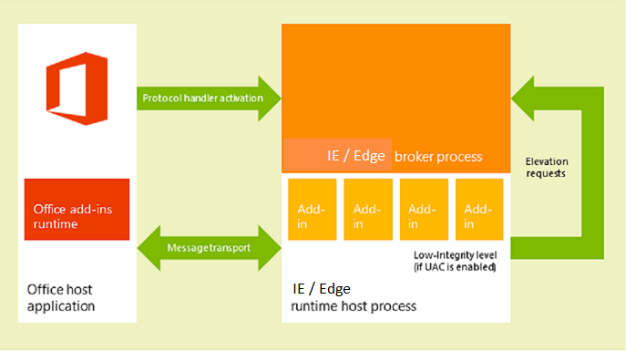
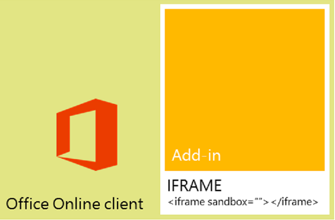

---
title: Privacy and security for Office Add-ins
description: Learn about the privacy and security aspects of the Office Add-ins platform.
ms.date: 07/24/2025
ms.localizationpriority: medium
---

# Privacy and security for Office Add-ins

## Process security

Office Add-ins are secured by an add-in runtime environment, a multiple-tier permissions model, and performance governors. This framework protects the user's experience in the following ways.

- Access to the Office client application's UI frame is managed.

- Only indirect access to the Office client application's UI thread is allowed.

- Modal interactions aren't allowed - for example, calls to JavaScript `alert`, `confirm`, and `prompt` methods aren't allowed because they're modal.

Further, the runtime framework provides the following benefits to ensure that an Office Add-in can't damage the user's environment.

- Isolates the process the add-in runs in.

- Doesn't require .dll or .exe replacement or ActiveX components.

- Makes add-ins easy to install and uninstall.

Also, the use of memory, CPU, and network resources by Office Add-ins is governable to ensure that good performance and reliability are maintained.

> [!NOTE]
> In some scenarios, different features of an add-in run in separate runtimes. For simplicity, this article uses the singular "runtime." For more information, see [Runtimes in Office Add-ins](../testing/runtimes.md).

The following sections briefly describe how the runtime architecture supports running add-ins in Office clients on Windows-based devices, on Mac OS X devices, and in web browsers.

### Clients on Windows and OS X devices

In supported clients for desktop and tablet devices, such as Excel on Windows, and Outlook on Windows (classic) and on Mac, Office Add-ins are supported by integrating an in-process component, the Office Add-ins runtime, which manages the add-in lifecycle and enables interoperability between the add-in and the client application. The add-in webpage itself is hosted out-of-process. On a Windows desktop or tablet device, [the add-in webpage is hosted inside an Internet Explorer or Microsoft Edge control](browsers-used-by-office-web-add-ins.md) which, in turn, is hosted inside an add-in runtime process that provides security and performance isolation.

On Windows desktops, Protected Mode in Internet Explorer must be enabled for the Restricted Site Zone. This is typically enabled by default. If it is disabled, an [error will occur](/office/troubleshoot/office-suite-issues/apps-for-office-not-start) when you try to launch an add-in.



On a macOS desktop, the add-in web page is hosted inside a sandboxed WebKit runtime host process which helps provide similar level of security and performance protection.


The Office Add-ins runtime manages interprocess communication, the translation of JavaScript API calls and events into native ones, as well as UI remoting support to enable the add-in to be rendered inside the document, in a task pane, or adjacent to an email message, meeting request, or appointment.

### Web clients

In supported web clients, Office Add-ins are hosted in an **iframe** that runs using the HTML5 **sandbox** attribute. ActiveX components or navigating the main page of the web client are not allowed. Office Add-ins support is enabled in the web clients by the integration of the JavaScript API for Office. In a similar way to the desktop client applications, the JavaScript API manages the add-in lifecycle and interoperability between the add-in and the web client. This interoperability is implemented by using a special cross-frame post message communication infrastructure. The same JavaScript library (Office.js) that is used on desktop clients is available to interact with the web client. The following figure shows the infrastructure that supports add-ins in Office running in the browser, and the relevant components (the web client, **iframe**, Office Add-ins runtime, and JavaScript API for Office) required to support them.



## Add-in integrity in Microsoft Marketplace

You can make your Office Add-ins available to the public by publishing them to Microsoft Marketplace. Microsoft Marketplace enforces the following measures to maintain the integrity of add-ins.

- Requires the host server of an Office Add-in to always use Secure Sockets Layer (SSL) to communicate.

- Requires a developer to provide proof of identity, a contractual agreement, and a compliant privacy policy to submit add-ins.

- Supports a user-review system for available add-ins to promote a self-policing community.

## Optional connected experiences

End users and IT admins can turn off [optional connected experiences in Office](/deployoffice/privacy/optional-connected-experiences) desktop and mobile clients. For Office Add-ins, the impact of disabling the **Optional connected experiences** setting is that users can no longer access add-ins or the Microsoft 365 and Copilot store through these clients. However, certain Microsoft add-ins that are considered essential or business-critical, and add-ins deployed by an organization's IT admin through [Centralized Deployment](/microsoft-365/admin/manage/centralized-deployment-of-add-ins) will still be available. In Outlook, the availability of add-ins when the **Optional connected experiences** setting is turned off varies depending on the client. For more information, see [Optional connected experiences in Outlook](#optional-connected-experiences-in-outlook).

Note that if an IT admin disables the [use of connected experiences in Office](/deployoffice/privacy/manage-privacy-controls#policy-setting-for-most-connected-experiences), it has the same effect on add-ins as turning off just optional connected experiences.

### Optional connected experiences in Outlook

The following table describes the availability of add-ins on Outlook clients when optional connected experiences is turned off.

|Client|Behavior when optional connected experiences is turned off|
|-----|-----|
|<ul><li>Web browser</li><li>[new Outlook on Windows](https://support.microsoft.com/office/656bb8d9-5a60-49b2-a98b-ba7822bc7627)</li></ul>|Admin-deployed add-ins remain visible and usable. While users can still access the Microsoft 365 and Copilot store and install add-ins, these add-ins can't be used until the **Optional connected experiences** setting is turned on. Additionally, sideloaded add-ins can't be used.|
|<ul><li>Windows (classic)</li></ul>|All add-ins remain visible and usable. However, the Microsoft 365 and Copilot store is inaccessible.|
|<ul><li>Mac</li></ul>|Add-ins don't appear in the ribbon and the Microsoft 365 and Copilot store is inaccessible.|
|<ul><li>Android</li><li>iOS</li></ul>|The **Get Add-ins** dialog shows only admin-deployed add-ins.|

## Addressing end users' privacy concerns

This section describes the protection offered by the Office Add-ins platform from the customer's (end user's) perspective, and provides guidelines for how to support users' expectations and how to securely handle users' personally identifiable information (PII).

### End users' perspective

Office Add-ins are built using web technologies that run in a browser control or **iframe**. Because of this, using add-ins is similar to browsing to web sites on the Internet or intranet. Add-ins can be external to an organization (if you acquire the add-in from Microsoft Marketplace) or internal (if you acquire the add-in from an Exchange Server add-in catalog, SharePoint app catalog, or file share on an organization's network). Add-ins have limited access to the network and most add-ins can read or write to the active document or mail item. The add-in platform applies certain constraints before a user or administrator installs or starts an add-in. But as with any extensibility model, users should be cautious before starting an unknown add-in.

> [!NOTE]
> Users may see a security prompt to trust the domain the first time an add-in is loaded. This will happen if the add-in's domain host is outside of the domain of Exchange on-premise or Office Online Server.

The add-in platform addresses end users' privacy concerns in the following ways.

- Data communicated with the web server that hosts a content, Outlook or task pane add-in as well as communication between the add-in and any web services it uses must be encrypted using the Secure Socket Layer (SSL) protocol.

- Before a user installs an add-in from Microsoft Marketplace, the user can view the privacy policy and requirements of that add-in. In addition, Outlook add-ins that interact with users' mailboxes surface the specific permissions that they require; the user can review the terms of use, requested permissions and privacy policy before installing an Outlook add-in.

- When sharing a document, users also share add-ins that have been inserted in or associated with that document. If a user opens a document that contains an add-in that the user hasn't used before, the Office client application prompts the user to grant permission for the add-in to run in the document. In an organizational environment, the Office client application also prompts the user if the document comes from an external source.

- Add-ins running in the following Office applications are blocked from accessing a user's device capabilities.

  - Office on the web (Excel, Outlook, PowerPoint, and Word) running in Chromium-based browsers, such as Microsoft Edge or Google Chrome

  - [new Outlook on Windows](https://support.microsoft.com/office/656bb8d9-5a60-49b2-a98b-ba7822bc7627)

  A user's device capabilities include their camera, geolocation, and microphone. To learn more, see [View, manage, and install add-ins for Excel, PowerPoint, and Word](https://support.microsoft.com/office/16278816-1948-4028-91e5-76dca5380f8d).

- Users can enable or disable the access to Microsoft Marketplace. For content and task pane add-ins, users manage access to trusted add-ins and catalogs from the **Trust Center** on the host Office client (opened from **File** > **Options** > **Trust Center** > **Trust Center Settings** > **Trusted Add-in Catalogs**).

  In Outlook, access to manage add-ins depends on the user's Outlook client. To learn more, see [Use add-ins in Outlook](https://support.microsoft.com/office/1ee261f9-49bf-4ba6-b3e2-2ba7bcab64c8).

  Administrators can also manage access to Microsoft Marketplace [through the admin center](/microsoft-365/admin/manage/manage-addins-in-the-admin-center).

- The design of the add-in platform provides security and performance for end users in the following ways.

  - An Office Add-in runs in a web browser control that is hosted in an add-in runtime environment separate from the Office client application. This design provides both security and performance isolation from the client application.

  - Running in a web browser control allows the add-in to do almost anything a regular web page running in a browser can do but, at the same time, restricts the add-in to observe the same-origin policy for domain isolation and security zones.

#### End users' perspective in Outlook

The following points address end users' privacy concerns specific to Outlook.

- End user's messages that are protected by Outlook's Information Rights Management (IRM) won't interact with add-ins in the following instances.

  - When the IRM-protected message is accessed from Outlook on mobile devices.

  - When the IRM-protected message contains a sensitivity label with the **Allow programmatic access** custom policy option set to `false`.

  For more information on IRM support in add-ins, see [Mail items protected by IRM](../outlook/outlook-add-ins-overview.md#mail-items-protected-by-irm).

- Granting the **restricted** permission allows the Outlook add-in to have limited access on only the current item. Granting the **read item** permission allows the Outlook add-in to access personal identifiable information, such as sender and recipient names and email addresses, on only the current item. For more information on Outlook add-in permissions, see [Understanding Outlook add-in permissions](../outlook/understanding-outlook-add-in-permissions.md).

- Manifest files of installed Outlook add-ins are secured in the user's email account.

- Outlook on Windows (classic) and on Mac monitor the performance of installed Outlook add-ins, exercise governance control, and make add-ins unavailable when they exceed limits in the following areas.

  - Response time to activate

  - Number of failures to activate or reactivate

  - Memory usage

  - CPU usage

### Developer guidelines to handle PII

The following lists some specific PII protection guidelines for you as a developer of Office Add-ins.

- The [Settings](/javascript/api/office/office.settings) object is intended for persisting add-in settings and state data across sessions for a content or task pane add-in, but don't store passwords and other sensitive PII in the **Settings** object. The data in the **Settings** object isn't visible to end users, but it is stored as part of the document's file format which is readily accessible. You should limit your add-in's use of PII and store any PII required by your add-in on the server hosting your add-in as a user-secured resource.

- Using some applications can reveal PII. Make sure that you securely store data for your users' identity, location, access times, and any other credentials so that data won't become available to other users of the add-in.

- If your add-in is available in Microsoft Marketplace, the requirement for HTTPS protects PII transmitted between your web server and the client computer or device. However, if you re-transmit that data to other servers, make sure you observe the same level of protection.

- If you store users' PII, make sure you reveal that fact, and provide a way for users to inspect and delete it. If you submit your add-in to Microsoft Marketplace, you can outline the data you collect and how it's used in the privacy statement.

## Developers' permission choices and security practices

Follow these general guidelines to support the security model of Office Add-ins, and drill down on more details for each add-in type.

### Request the necessary permissions

The add-in platform provides a permissions model that your add-in uses to declare the level of access to a user's data that it requires for its features. Each permission level corresponds to the subset of the JavaScript API for Office your add-in is allowed to use for its features. For example, the **write document** permission for content and task pane add-ins allows access to the [Document.setSelectedDataAsync](/javascript/api/office/office.document) method that lets an add-in write to the user's document, but doesn't allow access to any of the methods for reading data from the document. This permission level makes sense for add-ins that only need to write to a document, such as an add-in where the user can query for data to insert into their document.

As a best practice, you should request permissions based on the principle of *least privilege*. That is, you should request permission to access only the minimum subset of the API that your add-in requires to function correctly. For example, if your add-in needs only to read data in a user's document for its features, you should request no more than the **read document** permission. (But, keep in mind that requesting insufficient permissions will result in the add-in platform blocking your add-in's use of some APIs and will generate errors at run time.)

You specify permissions in the manifest of your add-in, as shown in the example in this section below, and end users can see the requested permission level of an add-in before they decide to install or activate the add-in for the first time. Additionally, Outlook add-ins that request the **read/write mailbox** permission require explicit administrator privilege to install.

To see an example of how to request permissions in the manifest, open the tab for the type of manifest your add-in uses.

# [Unified manifest for Microsoft 365](#tab/jsonmanifest)

[!include[Unified manifest host application support note](../includes/unified-manifest-support-note.md)]

The following example shows how a task pane add-in specifies the **read document** permission in its manifest. To keep permissions as the focus, other elements in the manifest aren't displayed.

```json
"authorization": {
  "permissions": {
    "resourceSpecific": [
      ...
      {
        "name": "Document.Read.User",
        "type": "Delegated"
      },
    ]
  }
}
```

# [Add-in only manifest](#tab/xmlmanifest)

The following example shows how a task pane add-in specifies the **read document** permission in its manifest. To keep permissions as the focus, other elements in the manifest aren't displayed.

```xml
<?xml version="1.0" encoding="utf-8"?>
<OfficeApp xmlns="http://schemas.microsoft.com/office/appforoffice/1.0"
           xmlns:xsi="http://www.w3.org/2001/XMLSchema-instance" 
           xmlns:ver="http://schemas.microsoft.com/office/appforoffice/1.0"
           xsi:type="TaskPaneApp">

    ... <!-- To keep permissions as the focus, not displaying other elements. -->
    <Permissions>ReadDocument</Permissions>
    ...
</OfficeApp>
```

---

For more information about permissions for task pane and content add-ins, see [Requesting permissions for API use in add-ins](../develop/requesting-permissions-for-api-use-in-content-and-task-pane-add-ins.md).

For more information about permissions for Outlook add-ins, see [Understanding Outlook add-in permissions](../outlook/understanding-outlook-add-in-permissions.md).

### Follow the same-origin policy

Because Office Add-ins are webpages that run in a web browser control, they must follow the same-origin policy enforced by the browser. By default, a webpage in one domain can't make [XmlHttpRequest](https://www.w3.org/TR/XMLHttpRequest/) web service calls to another domain other than the one where it is hosted.

One way to overcome this limitation is to use JSON/P -- provide a proxy for the web service by including a **script** tag with a **src** attribute that points to some script hosted on another domain. You can programmatically create the **script** tags, dynamically creating the URL to which to point the **src** attribute, and passing parameters to the URL via URI query parameters. Web service providers create and host JavaScript code at specific URLs, and return different scripts depending on the URI query parameters. These scripts then execute where they are inserted and work as expected.

The following is an example of JSON/P in the Outlook add-in example.

```js
// Dynamically create an HTML SCRIPT element that obtains the details for the specified video.
function loadVideoDetails(videoIndex) {
    // Dynamically create a new HTML SCRIPT element in the webpage.
    const script = document.createElement("script");
    // Specify the URL to retrieve the indicated video from a feed of a current list of videos,
    // as the value of the src attribute of the SCRIPT element. 
    script.setAttribute("src", "https://gdata.youtube.com/feeds/api/videos/" + 
        videos[videoIndex].Id + "?alt=json-in-script&amp;callback=videoDetailsLoaded");
    // Insert the SCRIPT element at the end of the HEAD section.
    document.getElementsByTagName('head')[0].appendChild(script);
}
```

Exchange and SharePoint provide client-side proxies to enable cross-domain access. In general, same origin policy on an intranet isn't as strict as on the Internet. For more information, see [Same Origin Policy Part 1: No Peeking](/archive/blogs/ieinternals/same-origin-policy-part-1-no-peeking) and [Addressing same-origin policy limitations in Office Add-ins](../develop/addressing-same-origin-policy-limitations.md).

### Prevent malicious cross-site scripting

A bad actor could attack the origin of an add-in by entering malicious script through the document or fields in the add-in. A developer should process user input to avoid executing a malicious user's JavaScript within their domain. The following are some good practices to follow to handle user input from a document or mail message, or via fields in an add-in.

- Instead of the DOM property [innerHTML](https://developer.mozilla.org/docs/Web/API/Element/innerHTML), use the [innerText](https://developer.mozilla.org/docs/Web/API/Node/innerText) and [textContent](https://developer.mozilla.org/docs/DOM/Node.textContent) properties where appropriate. Do the following for Internet Explorer and Firefox cross-browser support.

    ```js
     var text = x.innerText || x.textContent
    ```

    For information about the differences between **innerText** and **textContent**, see [Node.textContent](https://developer.mozilla.org/docs/DOM/Node.textContent). For more information about DOM compatibility across common browsers, see [W3C DOM Compatibility - HTML](https://www.quirksmode.org/dom/w3c_html.html#t07).

- If you must use **innerHTML**, make sure the user's input doesn't contain malicious content before passing it to **innerHTML**. For more information and an example of how to use **innerHTML** safely, see [innerHTML](https://developer.mozilla.org/docs/Web/API/Element/innerHTML) property.

- If you are using jQuery, use the [.text()](https://api.jquery.com/text/) method instead of the [.html()](https://api.jquery.com/html/) method.

- Use the [toStaticHTML](https://developer.mozilla.org/docs/Web/HTML/Reference) method to remove any dynamic HTML elements and attributes in users' input before passing it to **innerHTML**.

- Use the [encodeURIComponent](https://developer.mozilla.org/docs/Web/JavaScript/Reference/Global_Objects/encodeuricomponent) or [encodeURI](https://developer.mozilla.org/docs/Web/JavaScript/Reference/Global_Objects/encodeuri) function to encode text that is intended to be a URL that comes from or contains user input.

- See [Developing secure add-ins](/previous-versions/windows/apps/hh849625(v=win.10)) for more best practices to create more secure web solutions.

### Prevent "clickjacking"

Because Office Add-ins are rendered in an iframe when running in a browser with Office client applications, use the following tips to minimize the risk of [clickjacking](https://en.wikipedia.org/wiki/Clickjacking) -- a technique used by hackers to fool users into revealing confidential information.

First, identify sensitive actions that your add-in can perform. These include any actions that an unauthorized user could use with malicious intent, such as initiating a financial transaction or publishing sensitive data. For example, your add-in might let the user send a payment to a user-defined recipient.

Second, for sensitive actions, your add-in should confirm with the user before it executes the action. This confirmation should detail what effect the action will have. It should also detail how the user can prevent the action, if necessary, whether by choosing a specific button marked "Don't Allow" or by ignoring the confirmation.

Third, to ensure that no threat actor can hide or mask the confirmation, you should display it outside the context of the add-in (that is, not in an HTML dialog box).

The following are some examples of how you could get confirmation.

- Send an email to the user that contains a confirmation link.

- Send a text message to the user that includes a confirmation code that the user can enter in the add-in.

- Open a confirmation dialog in a new browser window to a page that cannot be iframed. This is typically the pattern that is used by login pages. Use the [dialog API](../develop/dialog-api-in-office-add-ins.md) to create a new dialog.

Also, ensure that the address you use for contacting the user couldn't have been provided by a threat actor. For example, for payment confirmations use the address on file for the authorized user's account.

### Request permission to access device capabilities (applies to Office on the web and new Outlook on Windows)

If an add-in requires access to a user's device capabilities, such as their camera, geolocation, or microphone, the developer must configure it to request permission from the user. This applies to the following Office applications.

- Office on the web (Excel, Outlook, PowerPoint, and Word) running in Chromium-based browsers, such as Microsoft Edge or Google Chrome
- [new Outlook on Windows](https://support.microsoft.com/office/656bb8d9-5a60-49b2-a98b-ba7822bc7627)

To request permission, the add-in must implement the [device permission API](/javascript/api/office/office.devicepermission).

For information on how the user is prompted for permission, see [View, manage, and install add-ins for Excel, PowerPoint, and Word](https://support.microsoft.com/office/16278816-1948-4028-91e5-76dca5380f8d).

> [!NOTE]
>
> - Add-ins that run in Office desktop clients or in browsers not based on Chromium automatically show a dialog requesting for a user's permission. The developer doesn't need to implement the device permission API on these platforms.
> - Add-ins that run in Safari are blocked from accessing a user's device capabilities. The device permission API isn't supported in Safari.

### Other security practices

Developers should also take note of the following security practices.

- Developers shouldn't use ActiveX controls in Office Add-ins as ActiveX controls don't support the cross-platform nature of the add-in platform.

- Content and task pane add-ins assume the same SSL settings that the browser uses by default, and allows most content to be delivered only by SSL. Outlook add-ins require all content to be delivered by SSL. Developers must specify in the `<SourceLocation>` element of the add-in manifest a URL that uses HTTPS, to identify the location of the HTML file for the add-in.

  To make sure add-ins aren't delivering content by using HTTP, when testing add-ins, developers should make sure the following settings are selected in **Internet Options** in **Control Panel** and no security warnings appear in their test scenarios.

  - Make sure the security setting, **Display mixed content**, for the **Internet** zone is set to **Prompt**. You can do that by selecting the following in **Internet Options**: on the **Security** tab, select the **Internet** zone, select **Custom level**, scroll to look for **Display mixed content**, and select **Prompt** if it isn't already selected.

  - Make sure **Warn if Changing between Secure and not secure mode** is selected in the **Advanced** tab of the **Internet Options** dialog box.

- To make sure that add-ins don't use excessive CPU core or memory resources and cause any denial of service on a client computer, the add-in platform establishes resource usage limits. As part of testing, developers should verify whether an add-in performs within the resource usage limits.

- Before publishing an add-in, developers should make sure that any personal identifiable information that they expose in their add-in files is secure.

- Developers shouldn't embed keys that they use to access APIs or services from Microsoft and others (such as Bing, Google, or Facebook) directly in the HTML pages of their add-in. Instead, they should create a custom web service or store the keys in some other form of secure web storage that they can then call to pass the key value to their add-in.

- Developers should do the following when submitting an add-in to Microsoft Marketplace.

  - Host the add-in they are submitting on a web server that supports SSL.
  - Produce a statement outlining a compliant privacy policy.
  - Be ready to sign a contractual agreement upon submitting the add-in.

Other than resource usage rules, developers for Outlook add-ins should also make sure their add-ins observe limits for specifying activation rules and using the JavaScript API. For more information, see [Limits for activation and JavaScript API for Outlook add-ins](../outlook/limits-for-activation-and-javascript-api-for-outlook-add-ins.md).

## IT administrators' control

In a corporate setting, IT administrators have ultimate authority over enabling or disabling access to Microsoft Marketplace and any private catalogs.

The management and enforcement of Office settings is done with group policy settings. These are configurable through the [Office Deployment Tool](/deployoffice/overview-office-deployment-tool), in conjunction with the [Office Customization Tool](/deployoffice/admincenter/overview-office-customization-tool).

| Setting name | Description |
|--------------|-------------|
| Allow Unsecure web add-ins and Catalogs | Allows users to run non-secure Office Add-ins, which are Office Add-ins that have webpage or catalog locations that are not SSL-secured (https://) and are not in users' Internet zones. |
| Block Web Add-ins | Allows you to prevent users from running Office Add-ins that use web technologies. |
| Block the Office Store |  Allows you to prevent users from getting or running Office Add-ins that come from [Microsoft Marketplace](https://marketplace.microsoft.com). |

To specify permissions to install and manage Outlook add-ins in an organization that uses Exchange Online, configure administrative and user roles in the Exchange admin center. For more information, see [Specify the administrators and users who can install and manage add-ins for Outlook in Exchange Online](/exchange/clients-and-mobile-in-exchange-online/add-ins-for-outlook/specify-who-can-install-and-manage-add-ins).

## See also

- [Requesting permissions for API use in add-ins](../develop/requesting-permissions-for-api-use-in-content-and-task-pane-add-ins.md)
- [Understanding Outlook add-in permissions](../outlook/understanding-outlook-add-in-permissions.md)
- [Limits for activation and JavaScript API for Outlook add-ins](../outlook/limits-for-activation-and-javascript-api-for-outlook-add-ins.md)
- [Addressing same-origin policy limitations in Office Add-ins](../develop/addressing-same-origin-policy-limitations.md)
- [Same Origin Policy](https://www.w3.org/Security/wiki/Same_Origin_Policy)
- [Same Origin Policy Part 1: No Peeking](/archive/blogs/ieinternals/same-origin-policy-part-1-no-peeking)
- [Same origin policy for JavaScript](https://developer.mozilla.org/docs/Web/Security/Same-origin_policy)
- [IE Protect Mode](/office/troubleshoot/office-suite-issues/apps-for-office-not-start)
- [Privacy controls for Microsoft 365 Apps](/deployoffice/privacy/overview-privacy-controls)
