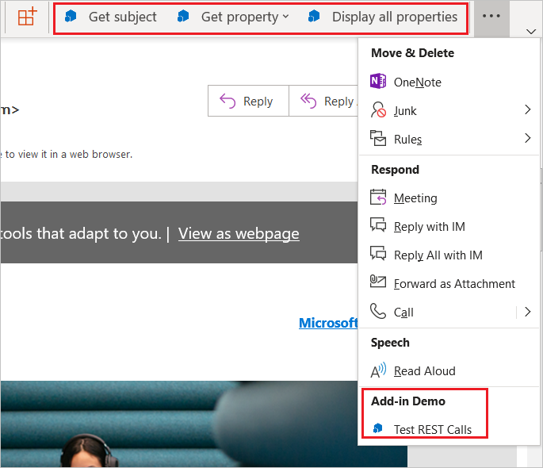
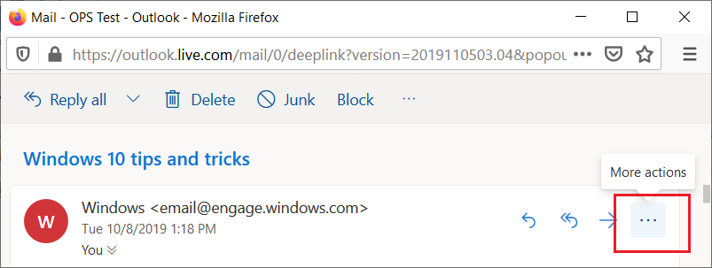
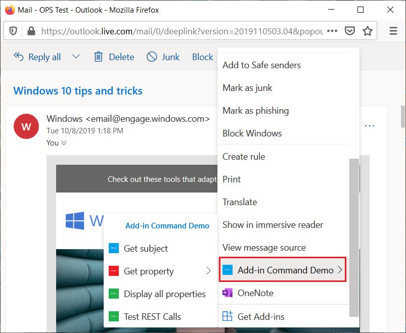

# Add-in commands

Add-in commands are UI elements that extend the Office UI and start actions in your add-in. You can use add-in commands to add a button on the ribbon or an item to a context menu. When users select an add-in command, they initiate actions such as running JavaScript code, or showing a page of the add-in in a task pane. Add-in commands help users find and use your add-in, which can help increase your add-in's adoption and reuse, and improve customer retention.

> [!NOTE]
>
> - SharePoint catalogs do not support add-in commands. You can deploy add-in commands via [Integrated Apps](/microsoft-365/admin/manage/test-and-deploy-microsoft-365-apps) or [AppSource](/office/dev/store/submit-to-appsource-via-partner-center), or use [sideloading](../testing/create-a-network-shared-folder-catalog-for-task-pane-and-content-add-ins.md) to deploy your add-in command for testing.
> - Content add-ins do not currently support add-in commands.

## Types of add-in commands

There are two types of add-in commands, based on the kind of action that the command triggers.

- **Task pane commands**: The button or menu item opens the add-in's [task pane](task-pane-add-ins.md). You add this kind of add-in command with markup in the manifest. The "code behind" the command is provided by Office.
- **Function commands**: The button or menu item runs any arbitrary JavaScript. The code almost always calls APIs in the Office JavaScript Library, but it doesn't have to. This type of add-in typically displays no UI other than the button or menu item itself. Note the following about function commands:
  - The function that is triggered can call the [displayDialogAsync](/javascript/api/office/office.ui?view=common-js&preserve-view=true#office-office-ui-displaydialogasync-member(1)) method to show a dialog, which is a good way to display an error, show progress, or prompt for input from the user. If the add-in is configured to use a [shared runtime](../testing/runtimes.md#shared-runtime), the function can also call the [showAsTaskpane](/javascript/api/office/office.addin#office-office-addin-showastaskpane-member(1)) method.
  - The runtime in which the function command runs is a full [browser-based runtime](../testing/runtimes.md#browser-runtime). It can render HTML and call out to the Internet to send or get data.

## How do add-in commands appear?

An add-in command appears on the ribbon as a button or an item in a drop-down menu. When a user installs an add-in, its commands appear in the UI as a group of buttons. This can either be on the ribbon's default tab or on a custom tab. If you're using the simplified ribbon layout, the add-in name is removed from the app bar. Only the add-in command button on the ribbon remains.

As the ribbon gets more crowded, add-in commands will be displayed in the overflow menu. The add-in commands for an add-in are usually grouped together.

### Excel, PowerPoint, and Word

The default tab depends on the application and context. For Excel, PowerPoint, and Word, the default tab is **Home**.

### Outlook

For Outlook, the default add-in command location is based on the current Outlook mode.

|Scenario | Tab location|
|--|--|
| Reading a message | **Home** tab |
| Composing a message | **Message** tab |
| Creating or viewing an appointment or meeting as the organizer | **Meeting**, **Meeting Occurrence**, **Meeting Series**, or **Appointment** tabs.1 |
| Viewing a meeting as an attendee | **Meeting**, **Meeting Occurrence**, or **Meeting Series** tabs.1 |
| Using a module extension | The extension's custom tab. |

1 If a user selects an item in the calendar but doesn't open the pop-out, the add-in's ribbon group won't be visible in the ribbon.

#### Modern Outlook on the web

In Outlook on the web, the add-in name is displayed in an overflow menu. If the add-in has multiple add-in commands, you can expand the add-in menu to see the group of buttons labeled with the add-in name.

### Drop-down menu

A drop-down menu add-in command defines a static list of items. The menu can be any mix of items that execute a function or that open a task pane. Submenus are not supported.

## Command capabilities

The following command capabilities are currently supported.

### Extension points

- Ribbon tabs - Extend built-in tabs or create a new custom tab. An add-in can have just one custom tab.
- Context menus - Extend selected context menus.

### Control types

- Simple buttons - trigger specific actions.
- Menus - simple menu dropdown with buttons that trigger actions.

### Default Enabled or Disabled Status

You can specify whether the command is enabled or disabled when your add-in launches, and programmatically change the setting.

> [!NOTE]
> This feature is not supported in all Office applications or scenarios. For more information, see [Enable and Disable Add-in Commands](disable-add-in-commands.md).

### Position on the ribbon (preview)

You can specify where a custom tab appears on the Office application's ribbon, such as "just to the right of the Home tab".

> [!NOTE]
> This feature is not supported in all Office applications or scenarios. For more information, see [Position a custom tab on the ribbon](custom-tab-placement.md).

### Integration of built-in Office buttons

You can insert the built-in Office ribbon buttons into your custom command groups and your custom ribbon tab.

> [!NOTE]
> This feature is not supported in all Office applications or scenarios. For more information, see [Integrate built-in Office buttons into custom tabs](built-in-button-integration.md).

### Contextual tabs

You can specify that a tab is only visible on the ribbon in certain contexts, such as when a chart is selected in Excel.

> [!NOTE]
> This feature is not supported in all Office applications or scenarios. For more information, see [Create custom contextual tabs in Office Add-ins](contextual-tabs.md).

## Supported platforms

Add-in commands are currently supported on the following platforms, except for limitations specified in the subsections of [Command capabilities](#command-capabilities) earlier.

- Office on Windows (build 16.0.6769+, connected to a Microsoft 365 subscription)
- Office on Mac (build 15.33+, connected to a Microsoft 365 subscription)
- Office on the web
- Office 2019 or later on Windows or Mac

> [!NOTE]
> For information about support in Outlook, see [Outlook support notes](../develop/create-addin-commands.md#outlook-support-notes).

## Debug

To debug an add-in command, you must run it in Office on the web. For details, see [Debug add-ins in Office on the web](../testing/debug-add-ins-in-office-online.md).

## Best practices

Apply the following best practices when you develop add-in commands.

- Use commands to represent a specific action with a clear and specific outcome for users. Do not combine multiple actions in a single button.
- Provide granular actions that make common tasks within your add-in more efficient to perform. Minimize the number of steps an action takes to complete.
- For the placement of your commands in the Office app ribbon:
  - Place commands on an existing tab (Insert, Review, and so on) if the functionality provided fits there. For example, if your add-in enables users to insert media, add a group to the Insert tab. Note that not all tabs are available across all Office versions. For more information, see [Office Add-ins XML manifest](../develop/add-in-manifests.md).
  - Place commands on the Home tab if the functionality doesn't fit on another tab, and you have fewer than six top-level commands. You can also add commands to the Home tab if your add-in needs to work across Office versions (such as Office on the web or desktop) and a tab is not available in all versions (for example, the Design tab doesn't exist in Office on the web).  
  - Place commands on a custom tab if you have more than six top-level commands.
  - Name your group to match the name of your add-in. If you have multiple groups, name each group based on the functionality that the commands in that group provide.
  - Do not add superfluous buttons to increase the real estate of your add-in.
  - Do not position a custom tab to the left of the Home tab, or give it focus by default when the document opens, unless your add-in is the primary way users will interact with the document. Giving excessive prominence to your add-in inconveniences and annoys users and administrators.
  - If your add-in is the primary way users interact with the document and you have a custom ribbon tab, consider integrating into the tab the buttons for the Office functions that users will frequently need.
  - If the functionality that is provided with a custom tab should only be available in certain contexts, use [custom contextual tabs](contextual-tabs.md). If you use custom contextual tabs, make sure to implement a [fallback experience for when your add-in runs on platforms that don't support custom contextual tabs](contextual-tabs.md#implement-an-alternate-ui-experience-when-custom-contextual-tabs-are-not-supported).

  > [!NOTE]
  > Add-ins that take up too much space might not pass [AppSource validation](/legal/marketplace/certification-policies).

- For all icons, follow the [icon design guidelines](add-in-icons.md).
- Provide a version of your add-in that also works on Office applications that do not support commands. A single add-in manifest can work in both command-aware (with commands) and non-command-aware (as a task pane) applications.

   *Figure 3. Task pane add-in in Office 2013 and the same add-in using add-in commands in Office 2016*

   

## Next steps

The best way to get started using add-in commands is to take a look at the [Office Add-in commands samples](https://github.com/OfficeDev/Office-Add-in-Commands-Samples/) on GitHub.

For more information about specifying add-in commands in an XML manifest, see [Create add-in commands with the XML manifest](../develop/create-addin-commands.md) and the [VersionOverrides](/javascript/api/manifest/versionoverrides) reference content.

For more information about specifying add-in commands in the unified Microsoft 365 manifest, see [Create add-in commands with the unified Microsoft 365 manifest](../develop/create-addin-commands-unified-manifest.md).
