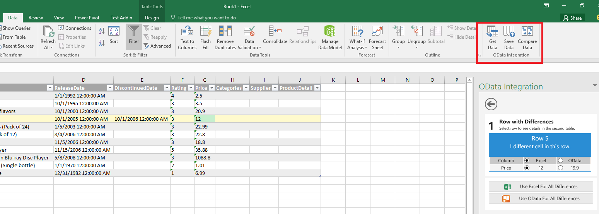
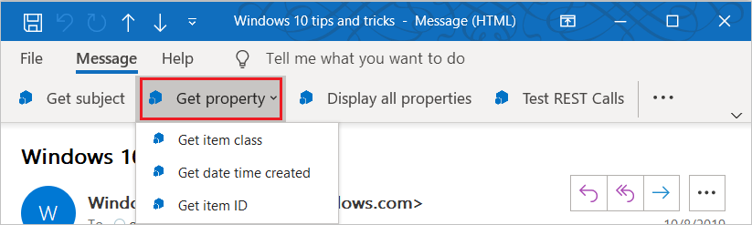

# Add-in commands

Add-in commands are UI elements that extend the Office UI and start actions in your add-in. You can use add-in commands to add a button on the ribbon or an item to a context menu. When users select an add-in command, they initiate actions such as running JavaScript code, or showing a page of the add-in in a task pane. Add-in commands help users find and use your add-in, which can help increase your add-in's adoption and reuse, and improve customer retention.

> [!NOTE]
>
> - SharePoint catalogs don't support add-in commands. You can deploy add-in commands via the [integrated apps portal](/microsoft-365/admin/manage/test-and-deploy-microsoft-365-apps) or [AppSource](/partner-center/marketplace-offers/submit-to-appsource-via-partner-center), or use [sideloading](../testing/test-debug-non-local-server.md) to deploy your add-in command for testing.
> - Content add-ins don't currently support add-in commands.

## Types of add-in commands

There are two types of add-in commands, based on the kind of action that the command triggers.

- **Task pane commands**: The button or menu item opens the add-in's [task pane](task-pane-add-ins.md). You add this kind of add-in command with markup in the manifest. The "code behind" the command is provided by Office.
- **Function commands**: The button or menu item runs any arbitrary JavaScript. The code almost always calls APIs in the Office JavaScript Library, but it doesn't have to. This type of add-in typically displays no UI other than the button or menu item itself. Note the following about function commands:

  - The runtime in which the function command runs is a full [browser-based runtime](../testing/runtimes.md#browser-runtime). It can render HTML and call out to the Internet to send or get data.
  - The runtime closes when either the function completes or 5 minutes have passed, whichever is earlier.
  - The function that is triggered can call the [displayDialogAsync](/javascript/api/office/office.ui?view=common-js&preserve-view=true#office-office-ui-displaydialogasync-member(1)) method to show a dialog. This is a good way to display an error, show progress, or prompt the user for input.

     > [!NOTE]
     > Because of the 5-minute timeout, the dialog should be designed so that users complete their interaction and close it within 5 minutes. Your add-in should use a task pane for longer interactions.

  - If the add-in is configured to use a [shared runtime](../testing/runtimes.md#shared-runtime), the function can also call the [showAsTaskpane](/javascript/api/office/office.addin#office-office-addin-showastaskpane-member(1)) method.

   > [!TIP]
   > Function commands aren't the only way to run arbitrary JavaScript in an add-in. An add-in can also include:
   >
   > - Custom handlers for certain events, such as a user opening an new message pane in Outlook.
   > - Custom [Copilot agents](agent-and-add-in-overview.md) that take actions in response to natural language requests from the add-in's users.

## Location of add-in commands

When a user installs an add-in, the add-in's commands are found on the ribbon, in a built-in Office tab or a custom tab that is specified in the manifest. (You can also put add-in commands on a [custom contextual tab](#contextual-tabs) that your add-in code defines at runtime.) They appear in the UI as a button or an item in a dropdown menu.

As the ribbon or action bar gets more crowded, add-in commands are displayed in the overflow menu. Commands for the same add-in are usually grouped together.

In Office on the web, if you're using the single-line or simplified ribbon layout, the add-in name isn't shown on the ribbon. Only the add-in's command icon is shown.

### Excel, PowerPoint, and Word

The following shows an example of add-in commands in a custom group on the **Data** tab of the Excel ribbon.

### Outlook

For Outlook, when you want an add-in command on a built-in ribbon tab, rather than creating your own, the command will appear on the default tab based on the platform and current Outlook mode. For guidance, see [Use add-ins in Outlook](https://support.microsoft.com/office/1ee261f9-49bf-4ba6-b3e2-2ba7bcab64c8).

### Dropdown menu

A dropdown menu add-in command defines a static list of items. The menu can be any mix of items that execute a function or that open a task pane. Submenus aren't supported.

### Grouped add-in commands on the ribbon

Multiple add-in commands can be grouped together on the ribbon. A group must contain at least one add-in command in the form of a button or a dropdown menu. In Office on Windows and on Mac, the label and icon of a button or dropdown menu are usually shown for add-in commands in a group. However, the icon size and label visibility may vary due to the following factors that constrain space.

- The number of add-in commands in the group.
- The size of the Office client window.

If the client window is maximized and there are more than three controls in a group, the label of each control is shown, but the size of its icon may vary (some are shown as 16 x 16 pixels while others are shown as 32 x 32 pixels).

When there are two or more add-in commands in a group and space becomes limited, the following adjustments are made to how the add-in commands are displayed. These changes are applied to the groups of add-in commands from right to left across the ribbon in the following sequence.

1. Small icons (16 x 16 pixels) and labels are shown for each add-in command in a group.
1. Only small icons are shown.
1. The group is displayed as a dropdown menu instead of showing individual add-in commands on the ribbon. A scroll slider icon also appears on the ribbon, so that you can scroll through the ribbon.

In Office on the web, the icon size and label visibility of controls in groups don't change as the browser window is resized. The scroll slider icon is simply shown on the ribbon.

## Command capabilities

The following command capabilities are currently supported.

### Extension points

- Ribbon tabs - Extend built-in tabs or create a new custom core tab. An add-in can have just one custom core tab. (You can also put add-in commands on a [custom contextual tab](#contextual-tabs).)

  > [!NOTE]
  > For Outlook, custom tabs are only supported in classic Outlook on Windows. In Outlook on the web, on Mac, and in the new Outlook on Windows, you can put custom groups of controls on one of the built-in ribbon tabs instead.
- Context menus - Extend selected context menus.

### Control types

- Simple buttons - trigger specific actions.
- Menus - simple menu dropdown with buttons that trigger actions.

### Default availability state

You can specify whether the command is available when your add-in launches, and programmatically change the setting.

> [!NOTE]
> This feature isn't supported in all Office applications or scenarios. For more information, see [Change the availability of add-in commands](disable-add-in-commands.md).

### Position on the ribbon

You can specify where a custom tab appears on the Office application's ribbon, such as "just to the right of the Home tab".

> [!NOTE]
> This feature isn't supported in all Office applications or scenarios. For more information, see [Position a custom tab on the ribbon](custom-tab-placement.md).

### Integration of built-in Office buttons

You can insert the built-in Office ribbon buttons into your custom command groups and your custom ribbon tab.

> [!NOTE]
> This feature isn't supported in all Office applications or scenarios. For more information, see [Integrate built-in Office buttons into custom tabs](built-in-button-integration.md).

### Contextual tabs

You can specify a custom contextual tab; that is, a tab that is only visible on the ribbon in certain contexts, such as when a chart is selected in Excel.

> [!NOTE]
> This feature isn't supported in all Office applications or scenarios. For more information, see [Create custom contextual tabs in Office Add-ins](contextual-tabs.md).

## Supported platforms

Add-in commands are currently supported on the following platforms, except for limitations specified in the subsections of [Command capabilities](#command-capabilities) earlier.

- Office on the web
- Office on Windows (Version 1604 (Build 6769.2000) or later, connected to a Microsoft 365 subscription)
- Office on Mac (Version 15.33 (17040900) or later, connected to a Microsoft 365 subscription)
- Perpetual Office 2019 or later on Windows or on Mac

> [!NOTE]
> For information about support in Outlook, see [Outlook support notes](../develop/create-addin-commands.md#outlook-support-notes).

## Debug

To debug an add-in command, you must run it in Office on the web. For details, see [Debug add-ins in Office on the web](../testing/debug-add-ins-in-office-online.md).

## Best practices

Apply the following best practices when you develop add-in commands.

- Use commands to represent a specific action with a clear and specific outcome for users. Don't combine multiple actions in a single button.
- Provide granular actions that make common tasks within your add-in more efficient to perform. Minimize the number of steps an action takes to complete.
- For all icons, follow the [icon design guidelines](add-in-icons.md).
- Provide a version of your add-in that works on Office applications or platforms (such as iPad) that don't support commands. A single add-in manifest can be used for these versions.

### Best practices for add-in commands on the ribbon

The following table outlines the recommended limits for objects on an Office app ribbon.

| Object | Recommended limit | Usability rationale |
| ------ | ----------------- | ------------------- |
| Tabs   | Seven visible tabs at a time | Prevents overwhelming users with too many options and helps them remember where commands are located. We recommend using contextual tabs to reduce clutter. |
| Groups per tab | Six groups | Helps users scan and locate commands quickly. |
| Commands per group | Seven commands | Decreases decision fatigue from too many options. |
| Total commands on the ribbon | 70 visible commands | Helps users locate actions efficiently. If your add-in has more than 70 commands, we recommend implementing galleries, dropdown menus, or dialogs for overflow. |

In addition to the recommended object limits, keep the following in mind when configuring add-in commands on the ribbon.

- Place commands on an existing tab, such as the Insert and Review tabs, if the functionality provided fits there. For example, if your add-in enables users to insert media, add a group to the Insert tab. Note that not all tabs are available across all Office versions. For more information, see [Office Add-ins manifest](../develop/add-in-manifests.md).
- Place commands on the Home tab if the functionality doesn't fit on another tab, and you have fewer than six top-level commands. You can also add commands to the Home tab if your add-in needs to work across Office versions (such as Office on the web or desktop) and a tab isn't available in all versions.
- Place commands on a custom tab if you have more than six top-level commands.
- Name your group to match the name of your add-in. If you have multiple groups, name each group based on the functionality that the commands in that group provide.
- Make sure that groups collapse gracefully when the size of the Office app window changes. While the ribbon offers dynamic resizing (see [Grouped add-in commands on the ribbon](#grouped-add-in-commands-on-the-ribbon)), you must also define group combinations for your add-in.
- Don't add unnecessary buttons to increase the real estate of your add-in.
- Don't position a custom tab to the left of the Home tab, or give it focus by default when the document opens, unless your add-in is the primary way users will interact with the document. Giving excessive prominence to your add-in inconveniences and annoys users and administrators.
- If your add-in is the primary way users interact with the document and you have a custom ribbon tab, consider integrating into the tab the buttons for the Office functions that users will frequently need.
- If the functionality provided with a custom tab should only be available in certain contexts, use [custom contextual tabs](contextual-tabs.md). If you use custom contextual tabs, make sure to implement a [fallback experience for when your add-in runs on platforms that don't support custom contextual tabs](contextual-tabs.md#implement-an-alternate-ui-experience-when-custom-contextual-tabs-arent-supported).
- Implement a dialog to provide users with advanced options. This prevents your add-in from overloading the ribbon with rarely used commands. To learn how to implement a dialog, see [Use the Office dialog API in Office Add-ins](../develop/dialog-api-in-office-add-ins.md).

> [!NOTE]
> Add-ins that take up too much space might not pass [AppSource validation](/legal/marketplace/certification-policies).

## Next steps

The best way to get started using add-in commands is to take a look at the [Office Add-in commands samples](https://github.com/OfficeDev/Office-Add-in-Commands-Samples/) on GitHub.

For more information about specifying add-in commands in an add-in only manifest, see [Create add-in commands with the add-in only manifest](../develop/create-addin-commands.md) and the [VersionOverrides](/javascript/api/manifest/versionoverrides) reference content.

For more information about specifying add-in commands in the unified manifest for Microsoft 365, see [Create add-in commands with the unified manifest for Microsoft 365](../develop/create-addin-commands-unified-manifest.md).
