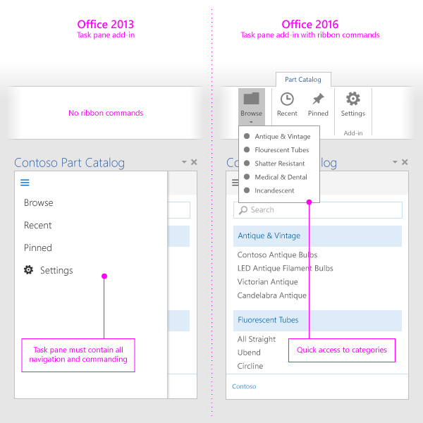

# Best practices for developing Office Add-ins

Effective add-ins offer unique and compelling functionality that extends Office applications in a visually appealing way. To create a great add-in, provide an engaging first-time experience for your users, design a first-class UI experience, and optimize your add-in's performance. Apply the best practices described in this article to create add-ins that help your users complete their tasks quickly and efficiently.

## Provide clear value

- Create add-ins that help users complete tasks quickly and efficiently. Focus on scenarios that make sense for Office applications. For example:
 - Make core authoring tasks faster and easier, with fewer interruptions.
 - Enable new scenarios within Office.
 - Embed complementary services within Office hosts.
 - Improve the Office experience to enhance productivity.
- Make sure that the value of your add-in is clear to users right away by [creating an engaging first run experience](#create-an-engaging-first-run-experience).
- Create an [effective Office Store listing](http://msdn.microsoft.com/library/c66a6e6b-2e96-458f-8f8c-2a499fe942c9%28Office.15%29.aspx). Make the benefits of your add-in clear in your title and description. Don't rely on your brand to communicate what your add-in does.

## Create an engaging first-run experience

- Engage new users with a highly usable and intuitive first experience. Note that users are still deciding whether to use or abandon an add-in after they download it from the store.

 - Make the steps that the user needs to take to engage with your add-in clear. Use videos, placemats, paging panels, or other resources to entice users.

 - Reinforce the value proposition of your add-in on launch, rather than just asking users to sign in.

 - Provide teaching UI to guide users and make your UI personal.

    

  - If your content add-in binds to data in the user's document, include sample data or a template to show users the data format to use.

    

- Offer [free trials](http://msdn.microsoft.com/library/145d9466-3c3d-4294-aa23-82068a8e7ae9.aspx%28Office.15%29.aspx#sectionSection1). If your add-in requires a subscription, make some functionality available without a subscription.

- Make signup simple. Prefill information (email, display name) and skip email verifications.

- Avoid pop ups. If you have to use them, guide the user to enable your pop up.

- Use [single sign-on (SSO) authentication](../outlook/authenticate-a-user-with-an-identity-token.md).

## Use add-in commands

- Provide multiple UI entry points to your add-in by using [add-in commands](../outlook/add-in-commands-for-outlook.md).

 >**Note**  Add-in commands are currently supported in Outlook 2016 and are in preview for Word, Excel and PowerPoint 2016. 

### Add-in command design best practices

- Use commands to represent a specific action with a clear and specific outcome for users. Do not combine multiple actions in a single button.

- Provide granular actions that make common tasks within your add-in more efficient to perform. Minimize the number of steps an action takes to complete.

- Provide meaningful icons and [labels](http://msdn.microsoft.com/library/8cef4fce-e6a1-459b-951f-47ac03ec95a6%28Office.15%29.aspx) for buttons that clearly identify the action the user is taking.

- For all icons:

 - Use PNG format with a transparent background.

 - Include [all eight supported sizes](https://msdn.microsoft.com/EN-US/library/mt267547.aspx#bk_resources). This creates the best experience for all supported resolutions.

  - Match the Office visual style. For example:

    - Keep your shapes simple and avoid multiple colors. Complex graphics are difficult to see at smaller sizes and resolutions.

    - Don't reuse visual metaphors for dissimilar commands. The same icon used for different actions will cause confusion.

    - Make your button labels clear and succinct. Use a combination of visual and textual information to convey meaning.

    - Test your icons in light and dark Office themes and high contrast settings. Note that icons might be difficult to see on dark backgrounds or in high contrast mode.

    - Use consistent icon sizes and positions to help with visual alignment on the ribbon.

    

- For command surface extension points, such as the ribbon:
  - Group related actions under a menu control.
  - Name your group to match the name of your add-in, or the specific functionality that your add-in will provide.
  - Create a custom tab when no existing tab matches functionality your add-in provides. If you need to display more than six commands, use a custom tab for some or all of the commands.

     >**Note**  In Outlook, you can only add groups to the default tab or a custom tab.
  - Support Office hosts that do and do not support add-in commands. A single add-in with a single manifest file can work in both command-aware and non-command-aware hosts.

    
    To design for multiple hosts, in your manifest file, provide the appropriate metadata in:

  - The top section of the manifest, for non-command-aware hosts.

  - The [VersionOverrides](../outlook/manifests/define-add-in-commands.md) section, for command-aware hosts.

>**Note**  Although a single manifest can target both command-aware and non-command-aware hosts, when you target both types of hosts, you essentially create two different versions of your add-in. You can have the same code (HTML/CSS/JS) for both versions.

To ensure that your add-in works well in both types of hosts:
- Modularize your navigation and command components so that you can replace them based to the version of your add-in that is being loaded.
- Order your navigation and command elements consistently.
- Ensure that navigation and command elements can transition across Office host and task pane UI.
- Do not add superfluous buttons to increase the real estate of your add-in.

     **Note**  Add-ins that take up too much space might not pass [Office Store validation](http://msdn.microsoft.com/library/cd90836a-523e-42f5-ab02-5123cdf9fefe%28Office.15%29.aspx).

## Apply UX design principles

- Ensure that the look and feel and functionality of your add-in complements the Office experience. Use the [Office UI toolkit for add-ins and web apps](http://msdn.microsoft.com/library/83ffc2f8-4c5b-4b50-9251-0f3093538944%28Office.15%29.aspx).

- Favor content over chrome. Avoid superfluous UI elements that don't add value to the user experience.

- Keep users in control. Ensure that users understand important decisions, and can easily reverse actions the add-in performs.

- Use branding to inspire trust and orient users. Do not use branding to overwhelm or advertise to users.

- Avoid scrolling. Optimize for 1366 x 768 resolution.

- Do not include unlicensed images.

- Use [clear and simple language](http://msdn.microsoft.com/library/8cef4fce-e6a1-459b-951f-47ac03ec95a6%28Office.15%29.aspx) in your add-in.

- Account for [accessibility](http://msdn.microsoft.com/library/3be1abbb-237a-48ec-8e17-72caa25a3cb2%28Office.15%29.aspx) - make your add-in easy for all users to interact with, and accommodate assistive technologies such as screen readers.

- Design for all platforms and input methods, including mouse/keyboard and [touch](#optimize-for-touch). Ensure that your UI is responsive to different form factors.

### Optimize for touch

- Use the [Context.touchEnabled](../../reference/shared/office.context.touchenabled.md) property to detect whether the host application your add-in runs on is touch enabled.

     >**Note**  This property is not supported in Outlook.
- Ensure that all controls are appropriately sized for touch interaction. For example, buttons have adequate touch targets, and input boxes are large enough for users to enter input.

- Do not rely on non-touch input methods like hover or right-click.

- Ensure that your add-in works in both portrait and landscape modes. Be aware that on touch devices, part of your add-in might be hidden by the soft keyboard.

- Test your add-in on a real device by using [sideloading](../testing/sideload-an-office-add-in-on-ipad-and-mac.md).

 >**Note**  If you're using [Office UI Fabric](https://github.com/OfficeDev/Office-UI-Fabric) for your design elements, many of these elements are taken care of.

## Optimize and monitor add-in performance

- Create the perception of fast UI responses. Your add-in should load in 500 ms or less.

- Ensure that all user interactions respond in under one second.

-  Provide loading indicators for long-running operations.

- Use a CDN to host images, resources, and common libraries. Load as much as you can from one place.

- Follow standard web practices to optimize your web page. In production, use only minified versions of libraries. Only load resources that you need, and optimize how resources are loaded.

- If operations take time to execute, provide feedback to users. Note the thresholds listed in the following table. See also [Resource limits and performance optimization for Office Add-ins](../../docs/develop/resource-limits-and-performance-optimization.md)

|**Interaction class**|**Target**|**Upper bound**|**Human perception**|
|:-----|:-----|:-----|:-----|
|Instant|<=50 ms|100 ms|No noticeable delay.|
|Fast|50-100 ms|200 ms|Minimally noticeable delay. No feedback necessary.|
|Typical|100-300 ms|500 ms|Quick, but too slow to be described as fast. No feedback necessary.|
|Responsive|300-500 ms|1 second|Not fast, but still feels responsive. No feedback necessary.|
|Continuous|>500 ms|5 seconds|Medium wait, no longer feels responsive. Might need feedback.|
|Captive|>500 ms|10 seconds|Long, but not long enough to do something else. Might need feedback.|
|Extended|>500 ms|>10 seconds|Long enough to do something else while waiting. Might need feedback.|
|Long running|>5 ms|>1 minute|Users will certainly do something else.|
- Monitor your service health, and use telemetry to monitor user success.

## Market your add-in

- Publish your add-in to the [Office Store](http://msdn.microsoft.com/library/ff075782-1303-4517-91cc-b3d730e9b9ae%28Office.15%29.aspx) and [promote it](http://msdn.microsoft.com/library/b19e21f8-76f5-44e1-9971-bef79cad4c71%28Office.15%29.aspx) from your website. Create an [effective Office Store listing](http://msdn.microsoft.com/library/c66a6e6b-2e96-458f-8f8c-2a499fe942c9%28Office.15%29.aspx).

- Use succinct and descriptive add-in titles. Include no more than 128 characters.

- Write short, compelling descriptions of your add-in. Answer the question "What problem does this add-in solve?".

- Convey the value proposition of your add-in in your title and description. Don't rely on your brand.

- Create a website to help users find and use your add-in.

