---
title: Monoline style icon guidelines for Office Add-ins
description: Guidelines for using Monoline style icons in Office Add-ins.
ms.date: 11/06/2025
ms.topic: best-practice
ms.localizationpriority: medium
---

# Monoline style icon guidelines for Office Add-ins

The goal of the Monoline style to have consistent, clear, and accessible iconography to communicate action and features with simple visuals, ensure the icons are accessible to all users, and have a style that is consistent with those used elsewhere in Windows.

The following guidelines are for 3rd party developers who want to create icons for features that will be consistent with the icons already present Office products.

## Design principles

- Simple, clean, clear.
- Contain only necessary elements.
- Inspired by Windows icon style.
- Accessible to all users.

### Convey meaning

- Use descriptive elements such as a page to represent a document or an envelope to represent mail.
- Use the same element to represent the same concept. For example, mail is always represented by an envelope, not a stamp.
- Use a core metaphor during concept development.

### Reduction of elements

- Reduce the icon to its core meaning, using only elements that are essential to the metaphor.
- Limit the number of elements in an icon to two, regardless of icon size.

### Consistency

Sizes, arrangement, and color of icons should be consistent.

### Styling

#### Perspective

Monoline icons are forward-facing by default. Certain elements that require perspective and/or rotation, such as a cube, are allowed, but exceptions should be kept to a minimum.

#### Embellishment

Monoline is a clean minimal style. Everything uses flat color, which means there are no gradients, textures, or light sources.

## Designing

### Sizes

We recommend that you produce each icon in all these sizes to support high DPI devices. The absolutely *required* sizes are 16 px, 20 px, and 32 px, as those are the 100% sizes.

**16 px, 20 px, 24 px, 32 px, 40 px, 48 px, 64 px, 80 px, 96 px**

> [!IMPORTANT]
> For an image that is your add-in's representative icon, see [Create effective listings in Microsoft Marketplace and within Office](/partner-center/marketplace-offers/create-effective-office-store-listings#create-an-icon-for-your-add-in) for size and other requirements.

### Layout

The following is an example of icon layout with a modifier.

  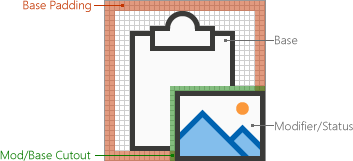

#### Elements

- **Base**: The main concept that the icon represents. This is usually the only visual needed for the icon, but sometimes the main concept can be enhanced with a secondary element, a modifier.

- **Modifier** Any element that overlays the base; that is, a modifier that typically represents an action or a status. It modifies the base element by acting as an addition, alteration, or a descriptor.

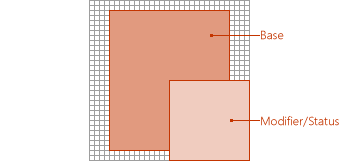

### Construction

#### Element placement

Base elements are placed in the center of the icon within the padding. If it can't be placed perfectly centered, then the base should err to the top right. In the following example, the icon is perfectly centered.

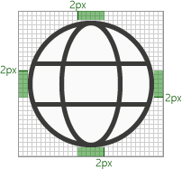

In the following example, the icon is erring to the left.

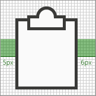

Modifiers are almost always placed in the bottom right corner of the icon canvas. In some rare cases, modifiers are placed in a different corner. For example, if the base element would be unrecognizable with the modifier in the bottom right corner, then consider placing it in the upper left corner.

#### Padding

Each size icon has a specified amount of padding around the icon. The base element stays within the padding, but the modifier should butt up to the edge of the canvas, extending outside of the padding to the edge of the icon border. The following images show the recommended padding to use for each of the icon sizes.

|16px|20px|24px|32px|40px|48px|64px|80px|96px|
|:---|:---|:---|:---|:---|:---|:---|:---|:---|
||||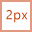|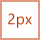|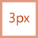|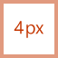|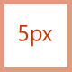|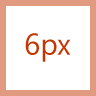|

#### Line weights

Monoline is a style dominated by line and outlined shapes. Depending on what size you are producing the icon should use the following line weights.

|Icon Size:|16px|20px|24px|32px|40px|48px|64px|80px|96px|
|:---|:---|:---|:---|:---|:---|:---|:---|:---|:---|
|**Line Weight:**|1px|1px|1px|1px|2px|2px|2px|2px|3px|
|**Example icon:**||||||||||

#### Cutouts

When an icon element is placed on top of another element, a cutout (of the bottom element) is used to provide space between the two elements, mainly for readability purposes. This usually happens when a modifier is placed on top of a base element, but there are also cases where neither of the elements is a modifier. These cutouts between the two elements is sometimes referred to as a "gap".

The size of the gap should be the same width as the line weight used on that size. If making a 16 px icon, the gap width would be 1px and if it's a 48 px icon then the gap should be 2px. The following example shows a 32 px icon with a gap of 1px between the modifier and the underlying base.

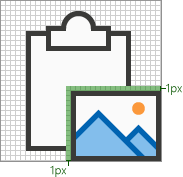

In some cases, the gap can be increase by a 1/2 px if the modifier has a diagonal or curved edge and the standard gap doesn't provide enough separation. This will likely only affect the icons with 1px line weight: 16 px, 20 px, 24 px, and 32 px.

#### Background fills

Most icons in the Monoline icon set require background fills. However, there are cases where the object would not naturally have a fill, so no fill should be applied. The following icons have a white fill.

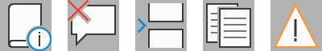

The following icons have no fill. (The gear icon is included to show that the center hole isn't filled.)

##### Best practices for fills

###### Do

- Fill any element that has a defined boundary, and would naturally have a fill.
- Use a separate shape to create the background fill.
- Use **Background Fill** from the [color palette](#color).
- Maintain the pixel separation between overlapping elements.
- Fill between multiple objects.

###### Don't

- Don't fill objects that would not naturally be filled; for example, a paperclip.
- Don't fill brackets.
- Don't fill behind numbers or alpha characters.

### Color

The color palette has been designed for simplicity and accessibility. It contains 4 neutral colors and two variations for blue, green, yellow, red, and purple. Orange is intentionally not included in the Monoline icon color palette. Each color is intended to be used in specific ways as outlined in this section.

#### Palette

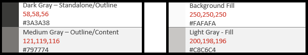

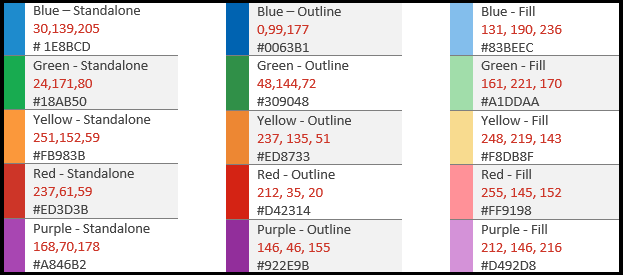

#### How to use color

In the Monoline color palette, all colors have Standalone, Outline, and Fill variations. Generally, elements are constructed with a fill and a border. The colors are applied in one of the following patterns.

- The Standalone color alone for objects that have no fill.
- The border uses the Outline color and the fill uses the Fill color.
- The border uses the Standalone color and the fill uses the Background Fill color.

The following are examples of using color.

The most common situation will be to have an element use Dark Gray Standalone with Background Fill.

When using a colored Fill, it should always be with its corresponding Outline color. For example, Blue Fill should only be used with Blue Outline. But there are two exceptions to this general rule.

- Background Fill can be used with any color Standalone.
- Light Gray Fill can be used with two different Outline colors: Dark Gray or Medium Gray.

#### When to use color

Color should be used to convey the meaning of the icon rather than for embellishment. It should **highlight the action** to the user. When a modifier is added to a base element that has color, the base element is typically turned into Dark Gray and Background Fill so that the modifier can be the element of color, such as the case below with the "X" modifier being added to the picture base in the leftmost icon of the following set.

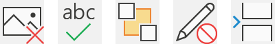

You should limit your icons to **one** additional color, other than the Outline and Fill mentioned above. However, more colors can be used if it's vital for its metaphor, with a limit of two additional colors other than gray. In rare cases, there are exceptions when more colors are needed. The following are good examples of icons that use just one color.

  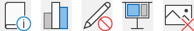

But the following icons use too many colors.

  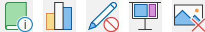

Use **Medium Gray** for interior "content", such as grid lines in an icon of a spreadsheet. Additional interior colors are used when the content needs to show the behavior of the control.

#### Text lines

When text lines are in a "container" (for example, text on a document), use medium gray. Text lines not in a container should be **Dark Gray**.

### Text

Avoid using text characters in icons. Since Office products are used around the world, we want to keep icons as language neutral as possible.

## Production

### Icon file format

The final icons should be saved as .png image files. Use PNG format with a transparent background and have 32-bit depth.

## See also

### Unified manifest reference

- ["extensions.ribbons" array](/microsoft-365/extensibility/schema/extension-ribbons-array)

### Add-in only manifest reference

- [Icon manifest element](/javascript/api/manifest/icon)
- [IconUrl manifest element](/javascript/api/manifest/iconurl)
- [HighResolutionIconUrl manifest element](/javascript/api/manifest/highresolutioniconurl)
- [Create an icon for your add-in](/partner-center/marketplace-offers/create-effective-office-store-listings#create-an-icon-for-your-add-in)
