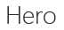

# Typography

Segoe is the standard typeface for Office. Use it in your add-in to align with Office task panes, dialog boxes, and content objects. Office UI Fabric gives you access to Segoe. It provides a full type ramp of Segoe with many variations - across font weight and size - in convenient CSS classes. Not all Office UI Fabric sizes and weights will look great in an Office Add-in. To fit harmoniously or avoid conflicts, consider using a subset of the Fabric type ramp. Here's a list of Fabric's base classes that we recommend for use in Office Add-ins.

|Sample |Class |Size |Weight |Recommended Usage |
|------ |----- |---- |------ |----------------- |
||.ms-font-xxl |28 px | Segoe Light |<ul><li>This class is larger than all other typographic elements in Office. Use it sparingly to avoid unseating visual hierarchy.</li><li>Avoid use on long strings in constrained spaces.</li><li>Provide ample whitespace around text using this class.</li><li>Commonly used for first run messages, hero elements, or other calls to action.</li></ul> |
||.ms-font-xl |21 px |Segoe Light | <ul><li>This class matches the task pane title of Office applications.</li><li>Use it sparingly to avoid a flat typographic hierarchy.</li><li>Commonly used as the top-level element such as dialog box, page, or content titles.</li></ul> |
||.ms-font-l |17 px |Segoe Semilight | <ul><li>This class is the first stop below titles.</li><li>Commonly used as a subtitle, navigation element, or group header.</li><ul> |
||.ms-font-m |14 px |Segoe Regular |<ul><li>Commonly used as body text within add-ins.</li><ul>|
||.ms-font-xs |11 px | Segoe Regular |<ul><li>Commonly used for secondary or tertiary text such as timestamps, by lines, captions, or field labels.</li><ul>|
||.ms-font-mi |10 px |Segoe Semibold |<ul><li>The smallest step in the type ramp should be used rarely. It's available for circumstances where legibility is not required.</li><ul>|

> [!NOTE]
> Text color is not included in these base classes. Use Fabric's "neutral primary" for most text on white backgrounds.
