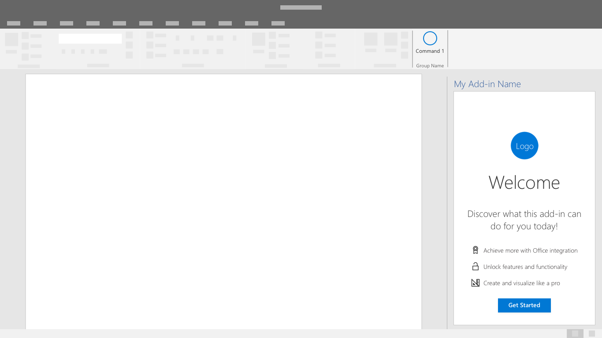
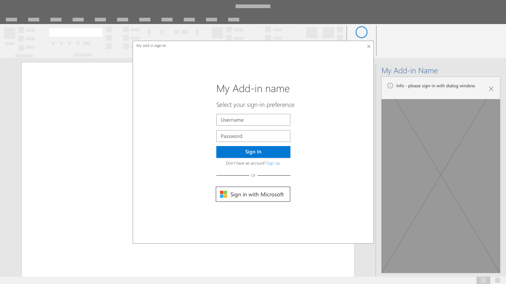
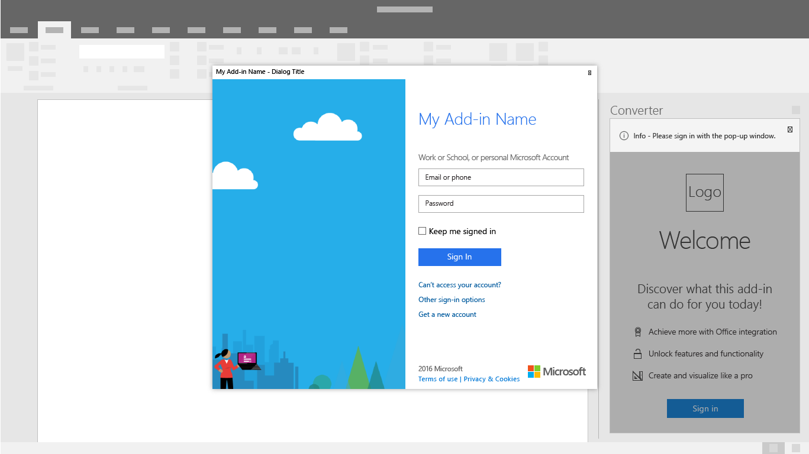
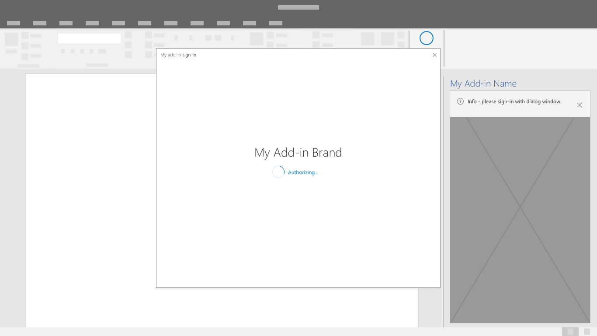
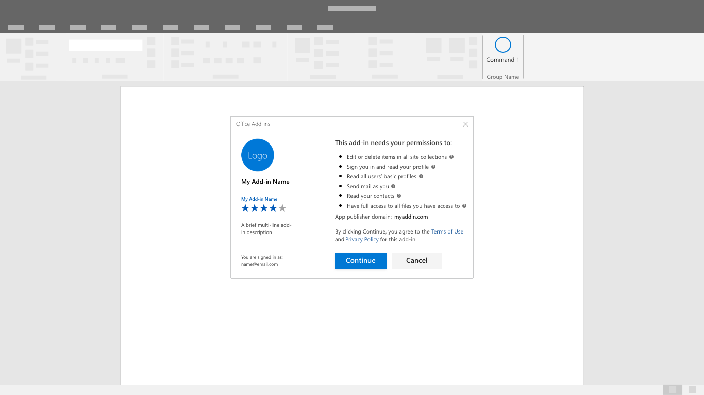

# Authentication patterns

Add-ins may require users to sign-in or sign-up in order to access features and functionality. Input boxes for username and password or buttons that start third party credential flows are common interface controls in authentication experiences. A simple and efficient authentication experience is an important first step to getting users started with your add-in.

## Best practices

|Do|Don't|
|:----|:----|
|Prior to sign-in, describe the value of your add-in or demonstrate functionality without requiring an account.	|Expect users to sign-in without understanding the value and benefits of your add-in.|
|Guide users through authentication flows with a primary, highly visible button on each screen.	|Draw attention to secondary and tertiary tasks with competing buttons and calls to action.|
|Use clear button labels that describe specific tasks like "Sign in" or "Create account".	|Use vague button labels like "Submit" or "Get started" to guide users through authentication flows.|
|Use a dialog to focus users' attention on authentication forms.	|Overcrowd your task pane with a first run experience and authentication forms.|
|Find small efficiencies in the flow like auto-focusing on input boxes.	|Add unnecessary steps to the interaction like requiring users to click into form fields.|
|Provide a way for users to sign-out and reauthenticate.	|Force users to uninstall to switch identities.|

## Authentication flow
Until single sign-on is out of preview, production add-ins should give users a choice to sign-in directly with your service or an identity provider like Microsoft.

1. First Run Placemat - Place your sign-in button as a clear call-to action inside your add-in's first run experience.

2. Identity Provider Choices Dialog - Display a clear list of identity providers including a username and password form if applicable. Your add-in UI may be blocked while the authentication dialog is open.

3. Identity Provider Sign-in - The identity provider will have their own UI. Microsoft Azure Active Directory allows customization of sign-in and access panel pages for consistent look and feel with your service. [Learn More](https://docs.microsoft.com/azure/active-directory/fundamentals/customize-branding).

4. Progress - Indicate progress while settings and UI load.

> [!NOTE] 
> When using Microsoft's Identity service you'll have the opportunity to use a branded sign-in button that is customizable to light and dark themes. Learn more.

## Single Sign-On authentication flow (preview)

> [!NOTE]
> The single sign-on API is currently supported in preview for Word, Excel, Outlook, and PowerPoint. For more information about single sign-on support, see [IdentityAPI requirement sets](https://docs.microsoft.com/office/dev/add-ins/reference/requirement-sets/identity-api-requirement-sets). If you are working with an Outlook add-in, be sure to enable Modern Authentication for the Office 365 tenancy. For information about how to do this, see [Exchange Online: How to enable your tenant for modern authentication](https://social.technet.microsoft.com/wiki/contents/articles/32711.exchange-online-how-to-enable-your-tenant-for-modern-authentication.aspx).

Once single sign-on is generally available for production add-ins, use it for the smoother end-user experience. The user's identity within Office (either a Microsoft Account or an Office 365 identity) is used to sign-in to your add-in. As a result users only sign-in once. This removes friction in the experience making it easier for your customers to get started.

1. As an add-in is being installed, a user will see a consent window similar to the one below:

> [!NOTE]
> The add-in publisher will have control over the logo, strings and permission scopes included in the consent window. The UI is pre-configured by Microsoft.

2. The add-in will load after the user consents. It can extract and display any necessary user customized information.

## See also
- Learn more about [developing SSO Add-ins (preview)](https://docs.microsoft.com/office/dev/add-ins/develop/sso-in-office-add-ins)
