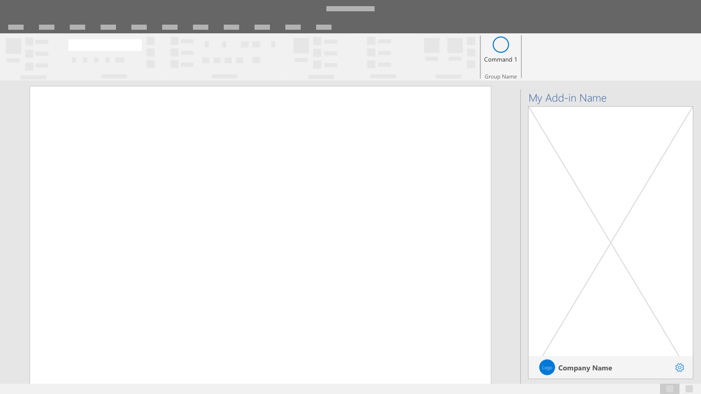

# Branding patterns

Implement recommended design patterns in your add-in to promote brand visibility while maintaining seamless integration with Office applications.

## Best practices

The following table outlines design best practices to enhance your add-in's brand recognition.

|Do |Don't|
|:---- |:----|
| Use familiar UI components with applied branding accents like typography and color. | Don't invent new UI components that contradict established Office UI. |
| Place your add-in branding in a brand bar footer at the bottom of your UI. | Don't repeat your task pane name in an immediately adjacent brand bar at the top of your UI. |
| Use brand elements sparingly. Fit your solution into Office such that is complementary. | Don't insert excessively branded elements into Office UI that distract and confuse customers. |
| Make your solution recognizable and connect your screens together with consistent visual elements. | Don't hide your solution with unrecognizable and inconsistently applied visual elements. |
| Build connection with a parent service or business to ensure that customers know and trust your solution. | Don't make customers learn a new brand concept if there's a useful and understandable relationship that can be leveraged to build trust and value. |

## Design patterns and components

Apply the following patterns and components to allow users to embrace the full utility of your add-in.

### Brand Bar

The brand bar is a space in the footer to include your brand name and logo. It also serves as a link to your brand's website and an optional access location.

### Splash Screen

Use this screen to display your branding while the add-in is loading or transitioning between UI states.

## See also

- [Office Add-in design language](add-in-design-language.md)
- [Color guidelines for Office Add-ins](add-in-color.md)
- [First-run experience patterns](first-run-experience-patterns.md)
- [Accessibility guidelines](accessibility-guidelines.md)
- [Best practices for developing Office Add-ins](../concepts/add-in-development-best-practices.md)