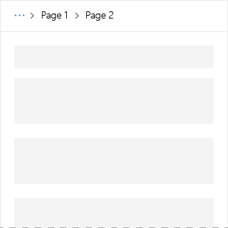

# Breadcrumb component in Office UI Fabric

In Office Add-ins, use breadcrumbs for navigation. They show the current page’s location in a hierarchy, and help users understand where they are in relation to the rest of the hierarchy. Additionally, breadcrumbs provide one-click navigation to higher levels in the hierarchy.
  
#### Example: Breadcrumb in a task pane

## Best practices

|**Do**|**Don't**|
|:------------|:--------------|
|Place breadcrumbs at the top of a layout in an add-in, above a list of items, or above the main content of a layout.   |Don’t use breadcrumbs as the primary way to navigate to other pages.  |

## Implementation

For details, see [Breadcrumb](https://dev.office.com/fabric#/components/breadcrumb) and [Getting started with Fabric React code sample](https://github.com/OfficeDev/Word-Add-in-GettingStartedFabricReact).

## Additional resources

- [UX Design Patterns](https://github.com/OfficeDev/Office-Add-in-UX-Design-Patterns-Code)
- [Office UI Fabric in Office Add-ins](office-ui-fabric.md)
