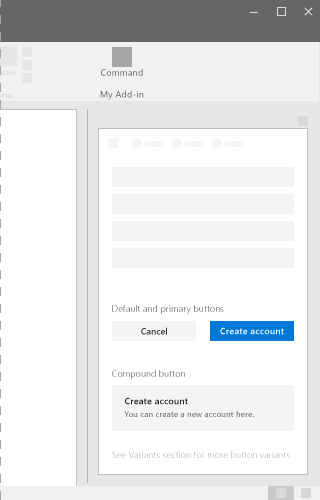
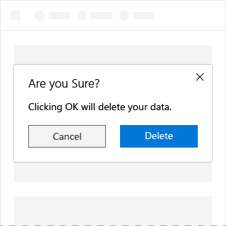
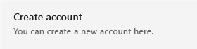

# Button component in Office UI Fabric

Use buttons in your Office Add-in to enable a user to commit a change or complete steps in a task. Make sure that the text of the button communicates the intent of the interaction. Place buttons at the bottom of the UI container of a task pane, dialog box, or content pane.

For example, use buttons for the user to submit a form, to close a dialog box, or to move to the next settings screen to commit changes.
  
**Example: Buttons on a task pane**

## Best Practices

|**Do**|**Don't**|
|:-----|:--------|
|Default buttons should always perform safe operations in add-ins.|Don’t place the default focus on a button that destroys data. Instead, place it on the button that performs the “safe act” and retains the content or cancels the action.|
|||

|**Do**|**Don't**|
|:-----|:--------|
|Use only a single line of text in the label of the button.|Don’t put too much text in a button – try keep text to a minimum.|
|Make sure the label conveys a clear purpose of the button to the user. Use concise, specific, self-explanatory labels, usually a single word.|Don’t use a button to navigate to another place apart from “Back” and “Next” buttons, use a link instead.|
|Expose only one or two buttons to the user at a time. For example, “Accept” and “Cancel”. If you need to expose more actions to the user, consider using checkboxes or radio buttons from which the user can select actions, with a single command button to trigger those actions.|Don’t put anything other than text in a button.|
|“Submit”, “OK”, and “Apply” buttons should always be styled as primary buttons. When “Reset” or “Cancel” buttons appear alongside one of the above, they should be styled as default buttons.| |

## Variants

|**Variation**|**Description**|**Example**|
|:------------|:--------------|:----------|
|**Primary Button**|Inherits theme color at rest state. Use this as the main call to action.||
|**Default Button**|Default button should always perform safe operations and should never delete.||
|**Compound Button**|Used to cause actions that complete a task or cause a transitional task.||

## Implementation

For details, see [Button](https://dev.office.com/fabric#/components/button) on the Office UI Fabric website.

## Additional resources

* [UX Pattern Sample](https://office.visualstudio.com/DefaultCollection/OC/_git/GettingStarted-FabricReact)
* [GitHub Development Resources](https://github.com/OfficeDev/Office-Add-in-UX-Design-Patterns-Code)