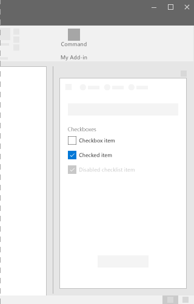
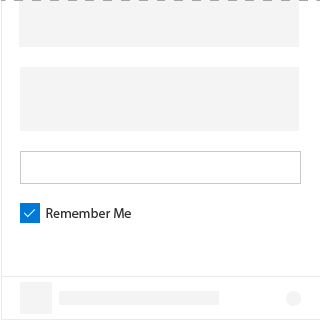
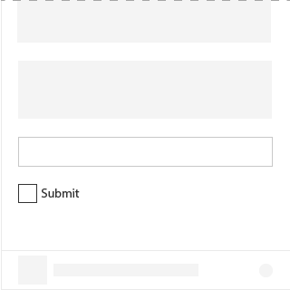
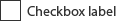

# Checkbox Component in Office UI Fabric

A Checkbox is a UI element that allows users to select or deselect actions items in add-in. It is used to switch between two mutually exclusive options through a single click and to indicate a subordinate setting or preference when paired with another control.

The control has two selection states: unselected and selected.
  
#### Example: Checkbox on a task pane

## Best Practices

|**Do**|**Don't**|
|:------------|:--------------|
|Use Checkbox to indicate a status.|Don’t use Checkbox to show/indicate an action.|
|||

|**Do**|**Don't**|
|:------------|:--------------|
|Use multiple Checkboxes for multi-select scenarios in which a user chooses one or more items from a group of choices that are not mutually exclusive.|Don’t use a Checkbox when the user can choose only one option from the group, use radio buttons instead.|
|Allow users to choose any combination of options when several Checkboxes are grouped together.|Don't put two groups of Checkboxes next to each other. Separate the two groups with labels.|
|Use a single Checkbox for a subordinate setting, such as with a “remember me?” login scenario with a terms of service agreement.|Don’t use checkbox as an on/off, instead use a toggle switch.|

## Variants

|**Variation**|**Description**|**Example**|
|:------------|:--------------|:----------|
|**Uncontrolled checkbox**|Use as the default Checkbox state.||
|**Uncontrolled checkbox with default checked true**|Use when the Checkbox instance is to maintain its own state||
|**Disabled uncontrolled checkbox with default checked true**|Disabled state of the checkbox.||
|**Controlled checkbox**|Use when the checked state is at a higher level and you plan to pass in the correct value based on handling onChange events and re-rendering.||

## Implementation

For details, see [Checkbox](https://dev.office.com/fabric#/components/checkbox) on the Office UI Fabric website.

## Additional Resources
* [UX Pattern Sample](https://office.visualstudio.com/DefaultCollection/OC/_git/GettingStarted-FabricReact)
* [GitHub Development Resources](https://github.com/OfficeDev/Office-Add-in-UX-Design-Patterns-Code)