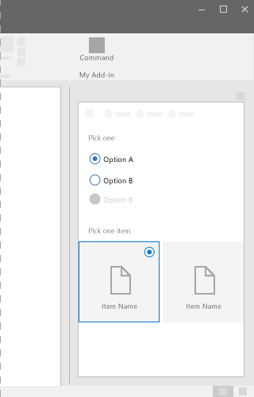
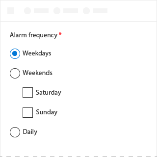
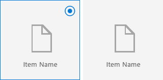

# ChoiceGroup Component in Office UI Fabric

In Add-ins, the ChoiceGroup component present users with two or more mutually exclusive options.

Each option is represented by one ChoiceGroup button; a user can select only one ChoiceGroup in a button group. It is also known as “radio buttons.”
  
#### Example: ChoiceGroup on a task pane

## Best Practices

|**Do**|**Don't**|
|:------------|:--------------|
|Keep all the ChoiceGroup options at the same level.|Don't nest with other ChoiceGroup or CheckBoxes.|
|||

|**Do**|**Don't**|
|:------------|:--------------|
|Use when there are 2-7 options. Make sure there’s enough screen space. Otherwise, use a Checkbox or Dropdown list.|Don’t use ChoiceGroup if there are more than 7 options. Use a Dropdown instead.|
|If none of the options are a valid choice, add another option to reflect this choice, such as "None" or "Does not apply."|Don’t use two ChoiceGroup for a single binary choice.|
|Align radio buttons vertically instead of horizontally, if possible. Horizontal alignment is harder to read and localize.|Don't use when the options are numbers that have fixed steps. Instead, use a slide component.|
|List the options in a logical order, such as most likely to be selected to least, simplest operation to most complex, or least risk to most. Alphabetical ordering is not recommended because it is language dependent and therefore not localizable.| |

## Variants

|**Variation**|**Description**|**Example**|
|:------------|:--------------|:----------|
|**ChoiceGroups**|Use when imagery is not necessary for making a selection.||
|**ChoiceGroups using images**|Use when imagery is necessary for making a selection.||

## Implementation

For details, see [ChoiceGroup](https://dev.office.com/fabric#/components/choicegroup) on the Office UI Fabric website.

## Additional Resources
* [UX Pattern Sample](https://office.visualstudio.com/DefaultCollection/OC/_git/GettingStarted-FabricReact)
* [GitHub Development Resources](https://github.com/OfficeDev/Office-Add-in-UX-Design-Patterns-Code)