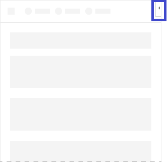

# Content Office Add-ins

Content add-ins are surfaces that can be embedded directly into Excel or PowerPoint documents. Content add-ins give users access to interface controls that run code to modify documents or display data from a data source. Use content add-ins when you want to embed functionality directly into the document.

*Figure 1. Typical layout for content add-ins*


## Best practices

- Include some navigational or commanding element such as the CommandBar or Pivot at the top of your add-in.
- Include a branding element such as the BrandBar at the bottom of your add-in (applies to Excel and PowerPoint add-ins only).

## Variants

Content add-in sizes for Excel and PowerPoint in Office desktop and in a web browser are user specified.

## Personality menu

Personality menus can obstruct navigational and commanding elements located near the top right of the add-in. The following are the current dimensions of the personality menu on Windows and Mac.

For Windows, the personality menu measures 12x32 pixels, as shown.

*Figure 2. Personality menu on Windows*



For Mac, the personality menu measures 26x26 pixels, but floats 8 pixels in from the right and 6 pixels from the top, which increases the occupied space to 34x32 pixels, as shown.

*Figure 3. Personality menu on Mac*


## Implementation

There are minor differences in the manifests between content add-ins and add-ins that use task panes. Open the tab for the type of manifest you're using.

# [Unified manifest for Microsoft 365](#tab/jsonmanifest)

> [!NOTE]
> The unified manifest is available in Excel, PowerPoint, and Word as a developer preview. For Outlook, it's generally available and can be used in production add-ins.

Configure the manifest with the following steps.

1. Add a [`"contentRuntimes"`](/microsoft-365/extensibility/schema/element-extensions#contentruntimes) child array to the extension object in the [`"extensions"`](/microsoft-365/extensibility/schema/root#extensions) array.
1. Remove the [`"runtimes"`](/microsoft-365/extensibility/schema/element-extensions#runtimes) property if it is present. The `"runtimes"` array is for task pane or mail add-ins. These cannot be combined with a content add-in.
1. Add an anonymous content runtime object in the `"contentRuntimes"` array.
1. Set the [`"id"`](/microsoft-365/extensibility/schema/extension-content-runtime-array#id) property of the object to a descriptive name.
1. Set the [`"code.page"`](/microsoft-365/extensibility/schema/extension-runtime-code#page) object to the full URL of the custom content that you want to embed in the document.
1. Optionally, set the [`"requestedWidth"`](/microsoft-365/extensibility/schema/extension-content-runtime-array#requestedwidth) and [`"requestedHeight"`](/microsoft-365/extensibility/schema/extension-content-runtime-array#requestedheight) properties to a size between 32 and 1000 pixels. If these properties aren't used, the Office application determines the size.
1. Optionally, set the [`"disableSnapshot"`](/microsoft-365/extensibility/schema/extension-content-runtime-array#disablesnapshot) property to `true` to prevent Office from saving a snapshot of the content component with the document.

The following is an example of a `"contentRuntimes"` property.

```json
"contentRuntimes": [
    {
        "id": "ContentRuntime",
        "code": {
            "page": "https://localhost:3000/content.html"
        },
        "requestedWidth": 100,
        "requestedHeight": 100,
        "disableSnapshot": true,
    }
]
```

# [Add-in only manifest](#tab/xmlmanifest)

- For the **\<[OfficeApp](/javascript/api/manifest/officeapp)\>** element, set the `xsi:type` attribute to `"ContentApp"`.
- In the **\<[DefaultSettings](/javascript/api/manifest/defaultsettings)\>** element, add the **\<[RequestedHeight](/javascript/api/manifest/requestedheight)\>** and  **\<[RequestedWidth](/javascript/api/manifest/requestedwidth)\>** elements.

---

For a sample that implements a content add-in, see [Excel content add-in: Humongous Insurance](https://github.com/OfficeDev/Office-Add-in-samples/tree/main/Samples/excel-content-add-in) on GitHub.

To create your own content add-in, see the [Excel content add-in quick start](../quickstarts/excel-quickstart-content.md) and [PowerPoint content add-in quick start](../quickstarts/powerpoint-quickstart-content.md).

## Support considerations

- Check to see if your Office Add-in will work on a [specific Office application or platform](/javascript/api/requirement-sets).
- Some content add-ins may require the user to "trust" the add-in to read and write to Excel or PowerPoint. You can declare what [level of permissions](../develop/requesting-permissions-for-api-use-in-content-and-task-pane-add-ins.md) you want your user to have in the add-in's manifest.
- In Office on the web, the **Show as saved image** option isn't supported. Even if the **Show as saved image** option was enabled from a desktop client, the content add-in remains interactive on the web client.

## See also

- [Office client application and platform availability for Office Add-ins](/javascript/api/requirement-sets)
- [Fabric Core in Office Add-ins](fabric-core.md)
- [UX design patterns for Office Add-ins](../design/ux-design-pattern-templates.md)
- [Requesting permissions for API use in add-ins](../develop/requesting-permissions-for-api-use-in-content-and-task-pane-add-ins.md)
