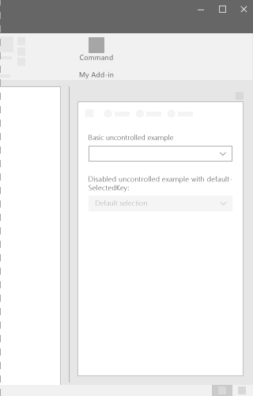
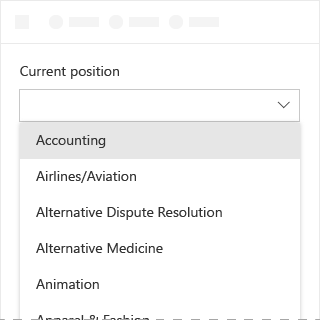
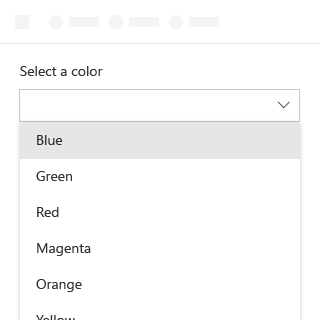
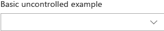
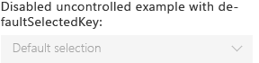
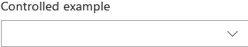

# Dropdown component in Office UI Fabric

A Dropdown is a list of options which is shown by clicking a dropdown button. Use dropdowns to simplify the UI design, and when users should make a choice within the UI. After making a choice, only the selected item is visible and the list of options collapse. To change the selected item, users open the list, and select a new value.
  
#### Example: Dropdown in a task pane

## Best Practices

|**Do**|**Don't**|
|:------------|:--------------|
|Use a Dropdown when the default selected option is more likely to be selected than other options. By contrast, ChoiceGroup or radio buttons show all choices thereby putting equal emphasis on all options.|Don't use dropdowns where all options are equally likely to be selected.|
|||
|Use a Dropdown when there are multiple choices that can be collapsed into one field. Also, use Dropdowns for long lists of items, or when screen space is constrained.|Don’t use Dropdowns if there are fewer than two choices. Instead, use a checkbox.|
|Use shortened statements or words in Dropdowns.| |

## Variants

|**Variation**|**Description**|**Example**|
|:------------|:--------------|:----------|
|**Basic uncontrolled Dropdown**|Use when many options are available for selection.||
|**Disabled uncontrolled Dropdown with defaultSelectedKey**|Disabled state of the Dropdown.||
|**Controlled Dropdown**|Use when the default selected item is influenced by another location in your UI, and the selected item in the DropDown must be maintained.||

## Implementation

For details, see [Dropdown](https://dev.office.com/fabric#/components/dropdown) and [Getting started with Fabric React code sample](https://github.com/OfficeDev/Word-Add-in-GettingStartedFabricReact).

## Additional resources

* [UX design patterns](https://github.com/OfficeDev/Office-Add-in-UX-Design-Patterns-Code)
* [Office UI Fabric in Office Add-ins](office-ui-fabric.md)
