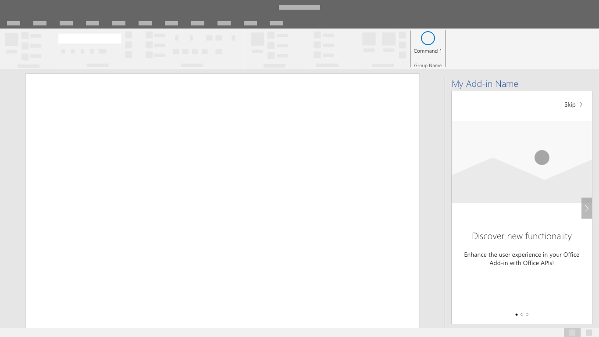
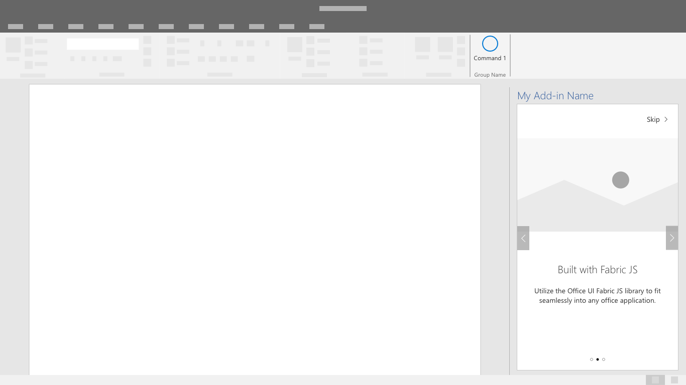
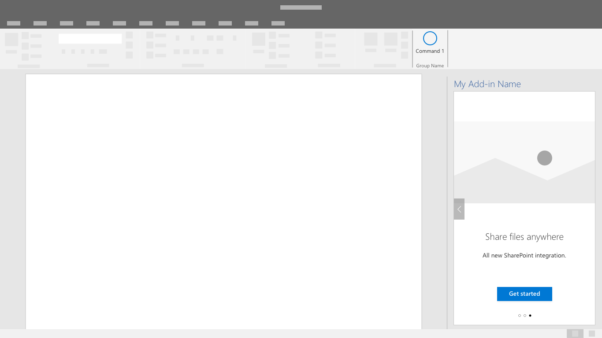
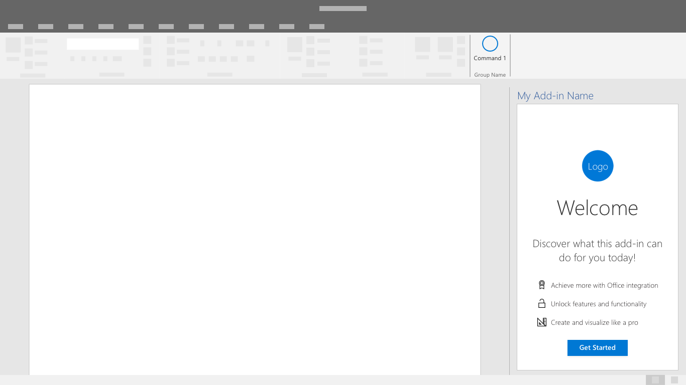
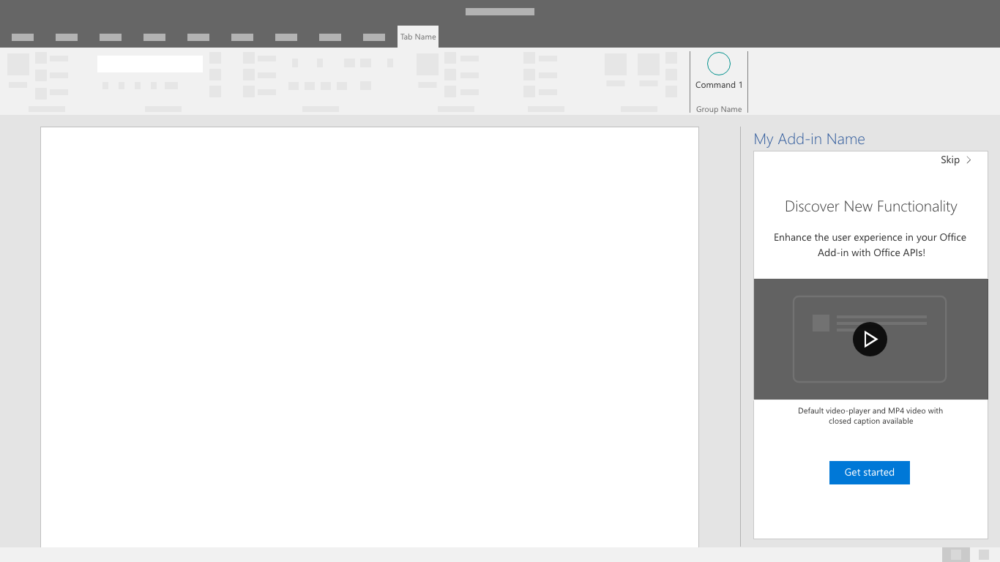
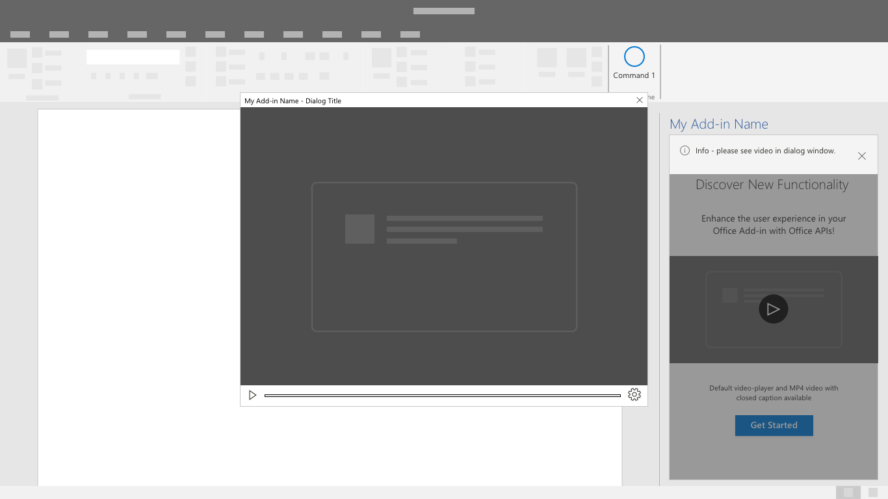

# First-run experience patterns

A First-run Experience (FRE) is a user's introduction to your add-in. An FRE is presented when a user opens an add-in for the first time and provides them with insight into the functions, features, and/or benefits of the add-in. This experience helps shape the user's impression of an add-in and can strongly influence their likelihood to come back to and continue using your add-in..

## Best practices

Follow these best practices when crafting your first-run experience:

|Do|Don't|
|:------|:------|
|Provide a simple and brief introduction to the main actions in the add-in. | Don't include information and call-outs that are not relevant to getting started.
|Give users the opportunity to complete an action that will positively impact their use of the add-in. | Don't expect users to learn everything at once. Focus on the action that provides the most value.
|Create an engaging experience that users will want to complete. | Don't force the users to click through the first-run experience. Give users an option to bypass the first-run experience. |

Consider whether showing users the first-run experience once or periodically is important to your scenario. For example, if your add-in is only utilized periodically, users may become less familiar with your add-in and may benefit from another interaction with the first-run experience.

Apply the following patterns as applicable to create or enhance the first-run experience for your add-in.

## Carousel

The carousel takes users through a series of features or informational pages before they start using the add-in.

*Figure 1: Allow users to advance or skip the beginning pages of the carousel flow.*

*Figure 2: Minimize the number of carousel screens you present to the user to only what is needed to effectively communicate your message*

*Figure 3: Provide a clear call to action to exit the first-run-experience.*

## Value Placemat

The value placement communicates your add-in's value proposition through logo placement, a clearly stated value proposition, feature highlights or summary, and a call-to-action.

*A value placemat with logo, clear value proposition, feature summary, and call to action.*

### Video Placemat

The video placemat shows users a video before they start using your add-in.

*Figure 1: First Run Placemat - The screen contains a still image from the video with a play button and clear call to action button.*

*Figure 2: Video Player - Users are presented with a video within a dialog window.*

