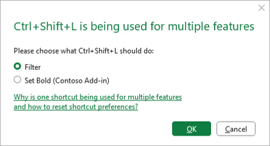

# Add custom keyboard shortcuts to your Office Add-ins

Keyboard shortcuts, also known as key combinations, make it possible for your add-in's users to work more efficiently. Keyboard shortcuts also improve the add-in's accessibility for users with disabilities by providing an alternative to the mouse.

There are three steps to add keyboard shortcuts to an add-in.

1. [Configure the add-in's manifest](#configure-the-manifest).
1. [Create or edit the shortcuts JSON file](#create-or-edit-the-shortcuts-json-file) to define actions and their keyboard shortcuts.
1. [Map custom actions to their functions](#map-custom-actions-to-their-functions) using the [Office.actions.associate](/javascript/api/office/office.actions#office-office-actions-associate-member(1)) API.

## Prerequisites

Keyboard shortcuts are currently only supported in the following platforms and build of **Excel** and **Word**.

- Office on the web

    > [!NOTE]
    > The keyboard shortcut feature is currently being rolled out to Word on the web. If you test the feature in Word on the web at this time, the shortcuts may not work if they're activated from within the add-in's task pane. We recommend to periodically check [Keyboard Shortcuts requirement sets](/javascript/api/requirement-sets/common/keyboard-shortcuts-requirement-sets) to find out when the feature is fully supported.
- Office on Windows
  - **Excel**: Version 2102 (Build 13801.20632) and later
  - **Word**: Version 2408 (Build 17928.20114) and later
- Office on Mac
  - **Excel**: Version 16.55 (21111400) and later
  - **Word**: Version 16.88 (24081116) and later

Additionally, keyboard shortcuts only work on platforms that support the following requirement sets. For information about requirement sets and how to work with them, see [Specify Office applications and API requirements](../develop/specify-office-hosts-and-api-requirements.md).

- [SharedRuntime 1.1](/javascript/api/requirement-sets/common/shared-runtime-requirement-sets)
- [KeyboardShortcuts 1.1](/javascript/api/requirement-sets/common/keyboard-shortcuts-requirement-sets) (required if the add-in provides its users with the option to customize keyboard shortcuts)

> [!TIP]
> To start with a working version of an add-in with keyboard shortcuts already configured, clone and run the [Use keyboard shortcuts for Office Add-in actions](https://github.com/OfficeDev/Office-Add-in-samples/tree/main/Samples/office-keyboard-shortcuts) sample. When you're ready to add keyboard shortcuts to your own add-in, continue with this article.

## Configure the manifest

There are two small changes to make to the manifest. One is to enable the add-in to use a shared runtime and the other is to point to a JSON-formatted file where you defined the keyboard shortcuts.

### Configure the add-in to use a shared runtime

Adding custom keyboard shortcuts requires your add-in to use the [shared runtime](../testing/runtimes.md#shared-runtime). For more information, see [Configure an add-in to use a shared runtime](../develop/configure-your-add-in-to-use-a-shared-runtime.md).

### Link the mapping file to the manifest

Immediately *below* (not inside) the **\<VersionOverrides\>** element in the manifest, add an [ExtendedOverrides](/javascript/api/manifest/extendedoverrides) element. Set the `Url` attribute to the full URL of a JSON file in your project that you'll create in a later step.

```xml
    ...
    </VersionOverrides>  
    <ExtendedOverrides Url="https://contoso.com/addin/shortcuts.json"></ExtendedOverrides>
</OfficeApp>
```

## Create or edit the shortcuts JSON file

Custom keyboard shortcuts are defined in a JSON file. This file describes your keyboard shortcuts and the actions that they'll invoke. The complete schema for the JSON file is at [extended-manifest.schema.json](https://developer.microsoft.com/json-schemas/office-js/extended-manifest.schema.json).

1. In your add-in project, create a JSON file. Be sure the path of the file matches the location you specified for the `Url` attribute of the [ExtendedOverrides](/javascript/api/manifest/extendedoverrides) element.

1. Add the following markup to the file. Note the following about the code.
    - The "actions" array contains objects that define the actions to be invoked. The "actions.id" and "actions.name" properties are required.
    - The "actions.id" property uniquely identifies the action to invoke using a keyboard shortcut.
    - The "actions.name" property must describe the action of a keyboard shortcut. The description you provide appears in the dialog that's shown to a user when there's a shortcut conflict between multiple add-ins or with Microsoft 365. Office appends the name of the add-in in parentheses at the end of the description. For more information on how conflicts with keyboard shortcuts are handled, see [Avoid key combinations in use by other add-ins](#avoid-key-combinations-in-use-by-other-add-ins).
    - The "type" property is optional. Currently, only the "ExecuteFunction" type is supported.
    - The specified actions will be mapped to functions that you create in a later step. In the example, you'll later map "ShowTaskpane" to a function that calls the `Office.addin.showAsTaskpane` method and "HideTaskpane" to a function that calls the `Office.addin.hide` method.
    - The "shortcuts" array contains objects that map key combinations to actions. The "shortcuts.action", "shortcuts.key", and "shortcuts.key.default" properties are required.
    - The value of the "shortcuts.action" property must match the "actions.id" property of the applicable action object.
    - It's possible to customize shortcuts to be platform-specific. In the example, the "shortcuts" object customizes shortcuts for each of the following platforms: "windows", "mac", and "web". You must define a default shortcut key for each shortcut. This is used as a fallback key if a key combination isn't specified for a particular platform.

    > [!TIP]
    > For guidance on how to create custom key combinations, see [Guidelines for custom key combinations](#guidelines-for-custom-key-combinations).

    ```json
    {
        "actions": [
            {
                "id": "ShowTaskpane",
                "type": "ExecuteFunction",
                "name": "Show task pane"
            },
            {
                "id": "HideTaskpane",
                "type": "ExecuteFunction",
                "name": "Hide task pane"
            }
        ],
        "shortcuts": [
            {
                "action": "ShowTaskpane",
                "key": {
                    "default": "Ctrl+Alt+Up",
                    "mac": "Command+Shift+Up",
                    "web": "Ctrl+Alt+1",
                    "windows": "Ctrl+Alt+Up"
                }
            },
            {
                "action": "HideTaskpane",
                "key": {
                    "default": "Ctrl+Alt+Down",
                    "mac": "Command+Shift+Down",
                    "web": "Ctrl+Alt+2",
                    "windows": "Ctrl+Alt+Up"
                }
            }
        ]
    }
    ```

## Map custom actions to their functions

1. In your project, open the JavaScript file loaded by your HTML page in the **\<FunctionFile\>** element.
1. In the JavaScript file, use the [Office.actions.associate](/javascript/api/office/office.actions#office-office-actions-associate-member(1)) API to map each action that you specified in the JSON file to a JavaScript function. Add the following JavaScript to the file. Note the following about the code.

    - The first parameter is one of the actions from the JSON file.
    - The second parameter is the function that runs when a user presses the key combination that's mapped to the action in the JSON file.

    ```javascript
    Office.actions.associate("ShowTaskpane", () => {
        return Office.addin.showAsTaskpane()
            .then(() => {
                return;
            })
            .catch((error) => {
                return error.code;
            });
    });
    ```

    ```javascript
    Office.actions.associate("HideTaskpane", () => {
        return Office.addin.hide()
            .then(() => {
                return;
            })
            .catch((error) => {
                return error.code;
            });
    });
    ```

## Guidelines for custom key combinations

Use the following guidelines to create custom key combinations for your add-ins.

- A keyboard shortcut must include at least one modifier key (<kbd>Alt</kbd>/<kbd>Option</kbd>, <kbd>Ctrl</kbd>/<kbd>Cmd</kbd>, <kbd>Shift</kbd>) and only one other key. These keys must be joined with a `+` character.
- The <kbd>Cmd</kbd> modifier key is supported on the macOS platform.
- On macOS, the <kbd>Alt</kbd> key is mapped to the <kbd>Option</kbd> key. On Windows, the <kbd>Cmd</kbd> key is mapped to the <kbd>Ctrl</kbd> key.
- The <kbd>Shift</kbd> key can't be used as the only modifier key. It must be combined with either <kbd>Alt</kbd>/<kbd>Option</kbd> or <kbd>Ctrl</kbd>/<kbd>Cmd</kbd>.
- Key combinations can include characters "A-Z", "a-z", "0-9", and the punctuation marks "-", "_", and "+". By convention, lowercase letters aren't used in keyboard shortcuts.
- When two characters are linked to the same physical key on a standard keyboard, then they're synonyms in a custom keyboard shortcut. For example, <kbd>Alt</kbd>+<kbd>a</kbd> and <kbd>Alt</kbd>+<kbd>A</kbd> are the same shortcut, as well as <kbd>Ctrl</kbd>+<kbd>-</kbd> and <kbd>Ctrl</kbd>+<kbd>\_</kbd> ("-" and "_" are linked to the same physical key).

> [!NOTE]
> Custom keyboard shortcuts must be pressed simultaneously. KeyTips, also known as sequential key shortcuts (for example, <kbd>Alt</kbd>+<kbd>H</kbd>, <kbd>H</kbd>), aren't supported in Office Add-ins.

### Browser shortcuts that cannot be overridden

When using custom keyboard shortcuts on the web, some keyboard shortcuts that are used by the browser can't be overridden by add-ins. The following list is a work in progress. If you discover other combinations that can't be overridden, please let us know by using the feedback tool at the bottom of this page.

- <kbd>Ctrl</kbd>+<kbd>N</kbd>
- <kbd>Ctrl</kbd>+<kbd>Shift</kbd>+<kbd>N</kbd>
- <kbd>Ctrl</kbd>+<kbd>T</kbd>
- <kbd>Ctrl</kbd>+<kbd>Shift</kbd>+<kbd>T</kbd>
- <kbd>Ctrl</kbd>+<kbd>W</kbd>
- <kbd>Ctrl</kbd>+<kbd>PgUp</kbd>/<kbd>PgDn</kbd>

### Avoid key combinations in use by other add-ins

There are many keyboard shortcuts that are already in use by Microsoft 365. Avoid registering keyboard shortcuts for your add-in that are already in use. However, there may be some instances where it's necessary to override existing keyboard shortcuts or handle conflicts between multiple add-ins that have registered the same keyboard shortcut.

In the case of a conflict, the user will see a dialog box the first time they attempt to use a conflicting keyboard shortcut. Note that the text for the add-in option that's displayed in this dialog comes from the "actions.name" property in the shortcuts JSON file.



The user can select which action the keyboard shortcut will take. After making the selection, the preference is saved for future uses of the same shortcut. The shortcut preferences are saved per user, per platform. If the user wishes to change their preferences, they can invoke the **Reset Office Add-ins shortcut preferences** command from the **Tell me** search box. Invoking the command clears all of the user's add-in shortcut preferences and the user will again be prompted with the conflict dialog box the next time they attempt to use a conflicting shortcut.


For the best user experience, we recommend that you minimize keyboard shortcut conflicts with these good practices.

- Use only keyboard shortcuts with the following pattern: <kbd>Ctrl</kbd>+<kbd>Shift</kbd>+<kbd>Alt</kbd>+*x*, where *x* is some other key.
- Avoid using established keyboard shortcuts in Excel and Word. For a list, see the following:
  - [Keyboard shortcuts in Excel](https://support.microsoft.com/office/1798d9d5-842a-42b8-9c99-9b7213f0040f)
  - [Keyboard shortcuts in Word](https://support.microsoft.com/office/95ef89dd-7142-4b50-afb2-f762f663ceb2)
- When the keyboard focus is inside the add-in UI, <kbd>Ctrl</kbd>+<kbd>Spacebar</kbd> and <kbd>Ctrl</kbd>+<kbd>Shift</kbd>+<kbd>F10</kbd> won't work as these are essential accessibility shortcuts.
- On a Windows or Mac computer, if the **Reset Office Add-ins shortcut preferences** command isn't available on the search menu, the user can manually add the command to the ribbon by customizing the ribbon through the context menu.

## Localize the description of a keyboard shortcut

You may need to localize your custom keyboard shortcuts in the following scenarios.

- Your add-in supports multiple locales.
- Your add-in supports different alphabets, writing systems, or keyboard layouts.

For information about how to localize the keyboard shortcuts JSON, see [Localize extended overrides](../develop/localization.md#localize-extended-overrides).

## Turn on shortcut customization for specific users

> [!NOTE]
> The APIs described in this section require the [KeyboardShortcuts 1.1](/javascript/api/requirement-sets/common/keyboard-shortcuts-requirement-sets) requirement set.

Users of your add-in can reassign the actions of the add-in to alternate keyboard combinations.

Use the [Office.actions.replaceShortcuts](/javascript/api/office/office.actions#office-office-actions-replaceshortcuts-member) method to assign a user's custom keyboard combinations to your add-ins actions. The method takes a parameter of type `{[actionId:string]: string|null}`, where the `actionId`s are a subset of the action IDs that must be defined in the add-in's extended manifest JSON. The values are the user's preferred key combinations. The value can also be `null`, which will remove any customization for that `actionId` and revert to the specified default keyboard combination.

If the user is logged into Microsoft 365, the custom combinations are saved in the user's roaming settings per platform. Customizing shortcuts aren't currently supported for anonymous users.

```javascript
const userCustomShortcuts = {
    ShowTaskpane: "Ctrl+Shift+1",
    HideTaskpane: "Ctrl+Shift+2"
};

Office.actions.replaceShortcuts(userCustomShortcuts)
    .then(() => {
        console.log("Successfully registered shortcut.");
    })
    .catch((error) => {
        if (error.code == "InvalidOperation") {
            console.log("ActionId doesn't exist or shortcut combination is invalid.");
        }
    });
```

To find out what shortcuts are already in use for the user, call the [Office.actions.getShortcuts](/javascript/api/office/office.actions#office-office-actions-getshortcuts-member) method. This method returns an object of type `[actionId:string]:string|null}`, where the values represent the current keyboard combination the user must use to invoke the specified action. The values can come from three different sources.

- If there was a conflict with the shortcut and the user has chosen to use a different action (either native or another add-in) for that keyboard combination, the value returned will be `null` since the shortcut has been overridden and there's no keyboard combination the user can currently use to invoke that add-in action.
- If the shortcut has been customized using the [Office.actions.replaceShortcuts](/javascript/api/office/office.actions#office-office-actions-replaceshortcuts-member) method, the value returned will be the customized keyboard combination.
- If the shortcut hasn't been overridden or customized, it will return the value from the add-in's extended manifest JSON.

The following is an example.

```javascript
Office.actions.getShortcuts()
    .then(function (userShortcuts) {
       for (const action in userShortcuts) {
           let shortcut = userShortcuts[action];
           console.log(action + ": " + shortcut);
       }
    });

```

As described in [Avoid key combinations in use by other add-ins](#avoid-key-combinations-in-use-by-other-add-ins), it's a good practice to avoid conflicts in shortcuts. To discover if one or more key combinations are already in use, pass them as an array of strings to the [Office.actions.areShortcutsInUse](/javascript/api/office/office.actions#office-office-actions-areshortcutsinuse-member) method. The method returns a report containing key combinations that are already in use in the form of an array of objects of type `{shortcut: string, inUse: boolean}`. The `shortcut` property is a key combination, such as "Ctrl+Shift+1". If the combination is already registered to another action, the `inUse` property is set to `true`. For example, `[{shortcut: "Ctrl+Shift+1", inUse: true}, {shortcut: "Ctrl+Shift+2", inUse: false}]`. The following code snippet is an example.

```javascript
const shortcuts = ["Ctrl+Shift+1", "Ctrl+Shift+2"];
Office.actions.areShortcutsInUse(shortcuts)
    .then((inUseArray) => {
        const availableShortcuts = inUseArray.filter((shortcut) => {
            return !shortcut.inUse;
        });
        console.log(availableShortcuts);
        const usedShortcuts = inUseArray.filter((shortcut) => {
            return shortcut.inUse;
        });
        console.log(usedShortcuts);
    });
```

## Implement custom keyboard shortcuts across supported Microsoft 365 apps

You can implement a custom keyboard shortcut to be used across supported Microsoft 365 apps, such as Excel and Word. If the implementation to perform the same task is different on each app, you must use the `Office.actions.associate` method to call a different callback function for each app. The following code is an example.

```javascript
const host = Office.context.host;
if (host === Office.HostType.Excel) {
    Office.actions.associate("ChangeFormat", changeFormatExcel);
} else if (host === Office.HostType.Word) {
    Office.actions.associate("ChangeFormat", changeFormatWord);
}
...
```

## See also

- [Office Add-in sample: Use keyboard shortcuts for Office Add-in actions](https://github.com/OfficeDev/Office-Add-in-samples/tree/main/Samples/office-keyboard-shortcuts)
- [Shared runtime requirement sets](/javascript/api/requirement-sets/common/shared-runtime-requirement-sets)
- [Keyboard shortcuts requirement sets](/javascript/api/requirement-sets/common/keyboard-shortcuts-requirement-sets)
