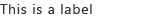

# Label component in Office UI Fabric

Use labels to name or title a component or group of components. When paired with another component or group of components, labels should be in close proximity to the related components or groups. Some components have predefined labels, such as a drop-down or toggle.
  
#### Example: Label in a task pane

## Best practices

|**Do**|**Don't**|
|:------------|:--------------|
|Use sentence casing, for example **First name**.|Don’t use title casing, for example **First Name**.|
|Be short and concise.|Don’t use full sentences or complex punctuation, such as colons or semicolons.|
|When adding a label to components, use a noun or short noun phrase as the label text.| |

## Variants

|**Variation**|**Description**|**Example**|
|:------------|:--------------|:----------|
|**Default label**|Use for standard labels.| |
|**Disabled label**|Use when the related component is disabled.| |
|**Required label**|Use when the related component is required.| |

## Implementation

For details, see [Label](https://dev.office.com/fabric#/components/label) and [Getting started with Fabric React code sample](https://github.com/OfficeDev/Word-Add-in-GettingStartedFabricReact).

## Additional resources

- [UX Design Patterns](https://github.com/OfficeDev/Office-Add-in-UX-Design-Patterns-Code)

- [Office UI Fabric in Office Add-ins](office-ui-fabric.md)
