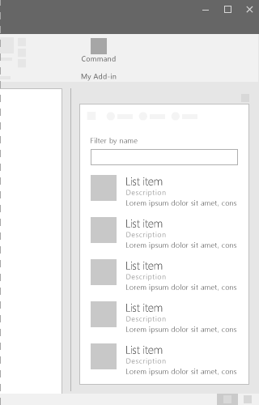

# List component in Office UI Fabric

Lists provide a consistent layout when interacting with large collections of content, even when the content is text-heavy. Lists allows users to easily scan through content. 
  
#### Example: List in a task pane

## Best Practices

|**Do**|**Don't**|
|:------------|:--------------|
|End each list item with a period if all entries are complete sentences, one or more of the list items contain both a fragment and a complete sentence, or if all list items complete the introductory sentence or fragment.| |
|Separate consecutive lists on a page by using headings.| |

## Variants

|**Variation**|**Description**|**Example**|
|:------------|:--------------|:----------|
|**Grid List**|Use when detailed information is needed with each list item.||
|**Variable height item list**|Use when large imagery and text is needed.||

## Implementation

For details, see [List](https://dev.office.com/fabric#/components/list) and [Getting started with Fabric React code sample](https://github.com/OfficeDev/Word-Add-in-GettingStartedFabricReact).

## Additional resources

* [UX design patterns](https://github.com/OfficeDev/Office-Add-in-UX-Design-Patterns-Code)
* [Office UI Fabric in Office Add-ins](office-ui-fabric.md)
