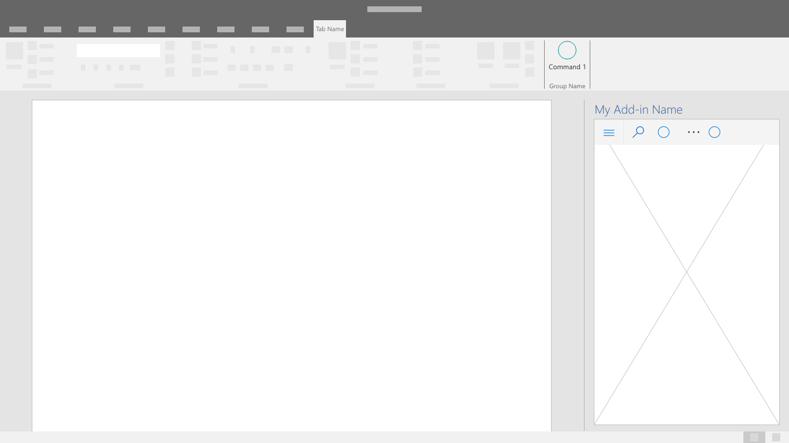
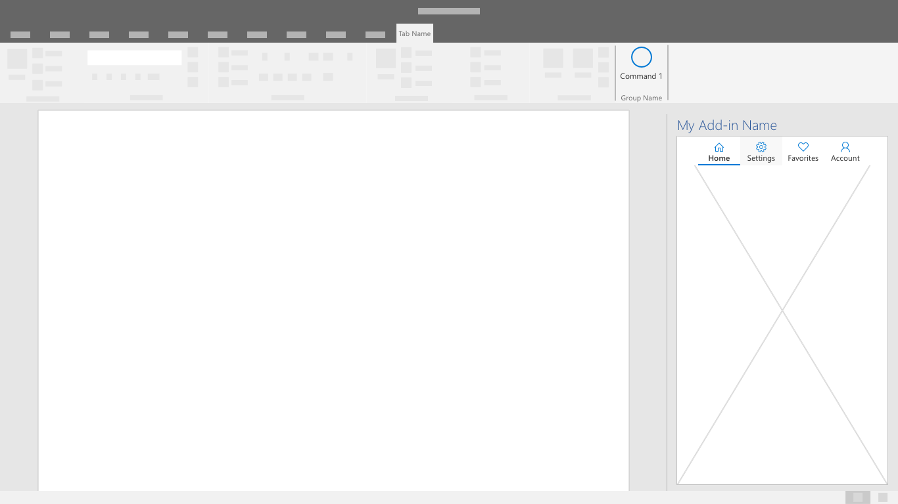
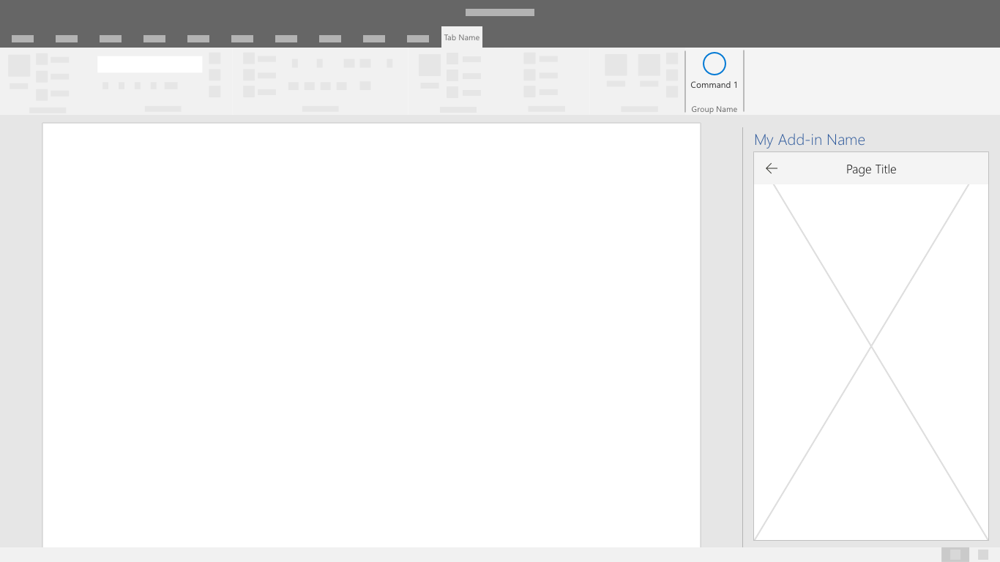

# Navigation patterns

The main features of an add-in are accessed through specific command types and limited screen area. It's important that navigation is intuitive, provides context, and allows the user to move easily throughout the add-in.

## Best practices

| Do    | Don't |
| :---- | :---- |
| Ensure the user has a clearly visible navigation option. | Don't complicate the navigation process by using non-standard UI.
| Utilize the following components as applicable to allow users to navigate through your add-in. | Don't make it difficult for the user to understand their current place or context within the add-in

## Command Bar

The CommandBar is a surface within the task pane that houses commands that operate on the content of the window, panel, or parent region it resides above. Optional features include a hamburger menu access point, search, and side commands.

## Tab Bar

The tab bar shows navigation using buttons with vertically stacked text and icons. Use the tab bar to provide navigation using tabs with short and descriptive titles.

## Back Button

The back button allows users to recover from a drill-down navigational action. This pattern helps ensure users follow an ordered series of steps.

