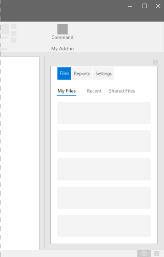
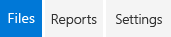

# Pivot Component in Office UI Fabric

In Add-ins, Pivot control, “Tab pattern” are used for quick navigation to frequently accessed, distinct content categories. It allows for navigation between two or more content views and relies on text headers to articulate the different sections of content. Tabs are a visual variant of Pivot that use a combination of icons and text or just icons to articulate section content.
  
#### Example: Pivot on a task pane

## Best Practices

|**Do**|**Don't**|
|:------------|:--------------|
|Be concise on the navigation labels, ideally one or two words rather than a phrase.|Don’t use full sentences or complex punctuation (colons, semicolons, etc.).|
|Allow Pivot headers to persist on-screen.| |
|Limit pivot controls to 3-5 items. Keep it small.| |
|Use Pivot control as navigational element toward the top of the page, rather than mixed with page content.| |
|Use on content-heavy pages that require a significant amount of scrolling to access the various sections.| |

## Variants

|**Variation**|**Description**|**Example**|
|:------------|:--------------|:----------|
|**Basic Example**|Use when as the default pivot option.||
|**Links of Tab Style**|Use when tab style pivot buttons are preferred.||

## Implementation

For details, see [Pivot](https://dev.office.com/fabric#/components/pivot) on the Office UI Fabric website.

## Additional Resources
* [UX Pattern Sample](https://office.visualstudio.com/DefaultCollection/OC/_git/GettingStarted-FabricReact)
* [GitHub Development Resources](https://github.com/OfficeDev/Office-Add-in-UX-Design-Patterns-Code)