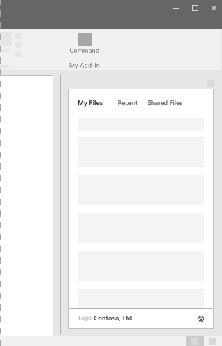

# HTML Canvases – Task Pane
 
Task Panes are interface surfaces typically docked to the right side of the window within Word, PowerPoint, Excel, and Outlook. Task Panes allow users to utilize interface controls that run code to modify documents, emails or display data from a data source for example. Task Pane surfaces should be utilized when embedding functionality directly into the document is not needed or wanted.

**Example: Task pane**

### Best Practices

|**Do**|**Don't**|
|:-----|:--------|
|Include the name of your add-in in the title.|Don't append your company name to the title.|
|Use short descriptive names in the title.|Don't append strings such as “Add-in,” “For Word,” or “for Office” to the title of your add-in.|
|Include some navigational or commanding element such as the CommandBar or Pivot at the top of your add-in.||
|Include a branding element such as the BrandBar at the bottom of your add-in unless your add-in is to be used within Outlook.||

### Variants

> Note: The following dimensions show the various task pane sizes with the Microsoft Office Ribbon open at a 1366x768 resolution. In the case of Excel, additional vertical space is required to accommodate the formula bar.  

**Office 2016 Desktop Task Pane Sizes**

**Office 365 Online Task Pane Sizes**

### Personality Menu

> Note: Personality menus can obstruct navigational and commanding elements located near the top right of the add-in. Listed below are the current dimensions of the personality menu on Windows and Mac.

**Windows:** The personality menu measures 12x32 pixels.

**Mac:** The personality menu measures 26x26 pixels but floats 8 pixels in from the right and 6 pixels from the top increasing the space to 34x32 pixels.

## Implementation

For details, see [Office Add-ins platform overview](https://dev.office.com/docs/add-ins/overview/office-add-ins) on the Microsoft Dev Center website.

## Additional resources

* [UX Pattern Sample](https://office.visualstudio.com/DefaultCollection/OC/_git/GettingStarted-FabricReact)
* [GitHub Development Resources](https://github.com/OfficeDev/Office-Add-in-UX-Design-Patterns-Code)

