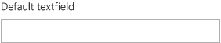
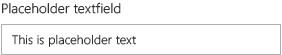

# TextField component in Office UI Fabric

A text field enables users to type text. It's typically used to capture a single line of text but can be configured to capture multiple lines of text. The text displays on the screen in a simple, uniform format.
  
#### Example: TextField in a task pane

## Best practices

|**Do**|**Don't**|
|:------------|:--------------|
|Use text fields to accept data input on a form or page.|Don’t use text fields to render basic copy as part of a body element of a page.|
|Label text fields with helpful names.|Don’t use text fields for date or time entry. Instead, use a date-time picker.|
|Use concise placeholder text to specify what content should be entered.|Don’t use text fields if you can predefine valid input options. Instead, use a drop-down.|
|Provide all appropriate states for the text fields (static, hover, focus, engaged, unavailable, error).||
|Clearly mark required and optional text fields.||
|Whenever possible, format text fields according to the expected data format. For example, when capturing a 10-digit phone number, use three separate fields to store the different parts of the phone number.||

## Variants

|**Variation**|**Description**|**Example**|
|:------------|:--------------|:----------|
|**Default TextField**|Use as the default text field.| |
|**Disabled TextField**|Use when the text field is disabled.| |
|**Required TextField**|Use when the text field input is required.| |
|**TextField with a placeholder**|Use when placeholder text is needed.| |
|**TextField with multiple lines**|Use when many lines of text are needed.| |

## Implementation

For details, see [TextField](https://dev.office.com/fabric#/components/textfield) and [Getting started with Fabric React code sample](https://github.com/OfficeDev/Word-Add-in-GettingStartedFabricReact).

## See also

- [UX Design Patterns](https://github.com/OfficeDev/Office-Add-in-UX-Design-Patterns-Code)
- [Office UI Fabric in Office Add-ins](office-ui-fabric.md)
