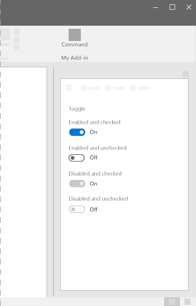
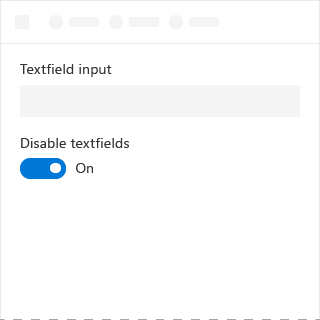
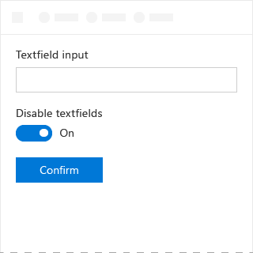
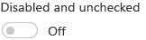

# Toggle component in Office UI Fabric

Toggles represent a physical switch to turn things on or off. Use toggles to present two mutually exclusive options (for example, on or off), where choosing an option results in an immediate action.
  
#### Example: Toggle in a task pane

 

## Best practices

|**Do**|**Don't**|
|:------------|:--------------|
|Use toggles for binary settings when changes are immediately applied.   |Don’t use toggles if users must perform an extra step before changes take effect.   |
|Only replace the **On** and **Off** labels if there are more specific labels to use for a setting. Use short (3-4 character) labels that represent binary opposites.| |

## Variants

|**Variation**|**Description**|**Example**|
|:------------|:--------------|:----------|
|**Enabled and checked**|Use when the toggled state is active.| |
|**Enabled and unchecked**|Use when the toggled state is inactive.| |
|**Disabled and checked**|Use when the active state cannot be changed.| |
|**Disabled and unchecked**|Use when the inactive state cannot be changed.| |

## Implementation

For details, see [Toggle](https://dev.office.com/fabric#/components/toggle) and [Getting started with Fabric React code sample](https://github.com/OfficeDev/Word-Add-in-GettingStartedFabricReact).

## Additional resources

- [UX Design Patterns](https://github.com/OfficeDev/Office-Add-in-UX-Design-Patterns-Code)
- [Office UI Fabric in Office Add-ins](office-ui-fabric.md)
