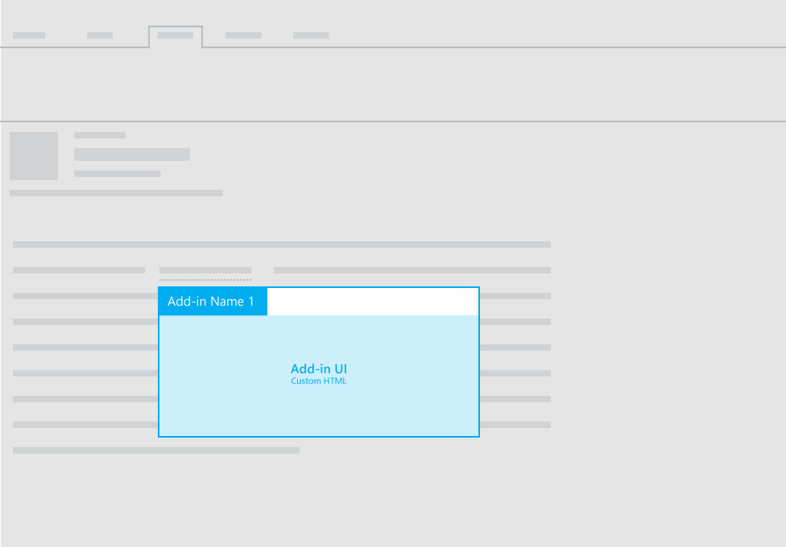

# Layouts for mail add-ins

You can use any of the following layouts for mail add-ins:

- Task pane
- Contextual
- Functions with InfoBar notifications

For guidelines about UI text in your add-ins, see [Office Voice](https://msdn.microsoft.com/en-us/library/office/mt484351.aspx).

## Task pane

For recommendations for task pane layouts for mail add-ins, see [Layout for task pane add-ins](layout-for-task-pane-add-ins.md).

## Contextual add-ins

The following image shows the recommended layout for a [contextual mail add-in](https://docs.microsoft.com/en-us/outlook/add-ins/contextual-outlook-add-ins).

## Functions with InfoBar notifications

In addition to using a task pane or contextual pane to display custom HTML UI in your mail add-in, you can execute functions from commands. When you need to display UI text as a result of a function, you can use InfoBar notifications. For example, you might need to use an InfoBar notification to display error or success messages. 

For more information, see [add-in commands for mail](https://docs.microsoft.com/en-us/outlook/add-ins/add-in-commands-for-outlook). 

## Additional resources

- [Design guidelines for Office Add-ins](../add-in-design.md)
