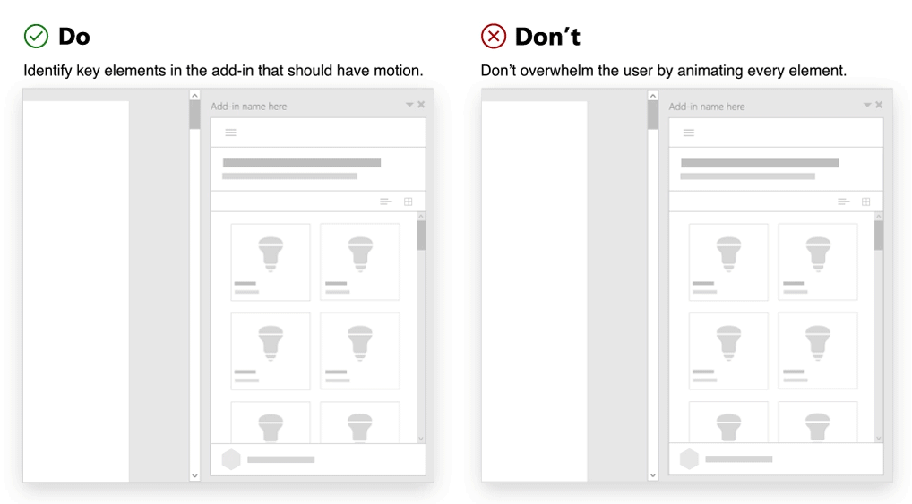
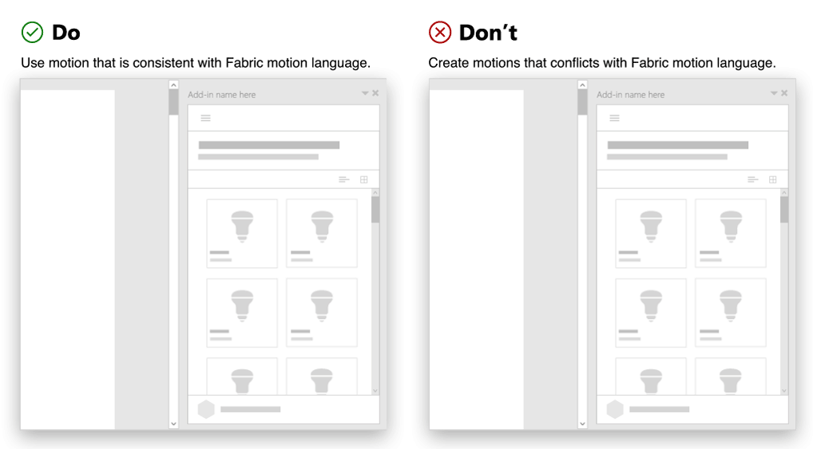
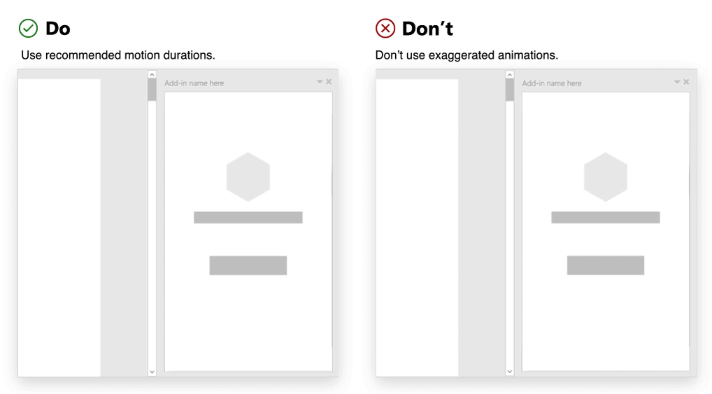

# Using motion in Office Add-ins

When you design an Office Add-in, you can use motion to enhance the user experience. UI elements, controls, and components often have interactive behaviors that require transitions, motion, or animation. Common characteristics of motion across UI elements define the animation aspects of a design language.

Because Office is focused on productivity, the Office animation language supports the goal of helping customers get things done. It strikes a balance between performant response, reliable choreography, and detailed delight. Add-ins embedded in Office sit within this existing animation language. Given this context, it is important to consider the following guidelines when applying motion.

## Create motion with a purpose

Motion should have a purpose that communicates additional value to the user. Consider the tone and purpose of your content when choosing animations. Handle critical messages differently than exploratory navigations.

Standard elements used in an add-in can incorporate motion to help focus the user, show how elements relate to each other, and validate user actions. Choreograph elements to reinforce hierarchy and mental models.

### Best practices

|Do|Don't|
|:-----|:-----|
|Identify key elements in the add-in that should have motion. Commonly animated elements in an add-in are panels, overlays, modals, tool tips, menus, and teaching call outs.| Don't overwhelm the user by animating every element. Avoid applying multiple motions that attempt to lead or focus the user on many elements at once. |
|Use simple, subtle motion that behaves in expected ways. Consider the origin of your triggering element. Use motion to create a link between the action and the resulting UI. | Don't create wait time for a motion. Motion in add-ins should not hinder task completion.|

## Use expected motions

We recommend using [Fluent UI](https://developer.microsoft.com/fluentui#/) to create a visual connection with the Office platform, and we also encourage the use of [Fluent UI Animations](https://developer.microsoft.com/fluentui#/styles/web/motion) to create motions that align with the Fabric motion language.

Use it to fit seamlessly in Office. It will help you create experiences that are more felt than observed. The animation CSS classes provide directionality, enter/exit, and duration specifics that reinforce Office mental models and provide opportunities for customers to learn how to interact with your add-in.

### Best practices

|Do|Don't|
|:-----|:-----|
|Use motion that aligns with behaviors in Fluent UI.| Don't create motions that interfere or conflict with common motion patterns in Office.
|Ensure that there is a consistent application of motion across like elements.| Don't use different motions to animate the same component or object.|
|Create consistency with use of direction in animation. For example, a panel that opens from the right should close to the right.|Don't animate an element using multiple directions.

## Avoid out of character motion for an element

Consider the size of the HTML canvas (task pane, dialog box, or content add-in) when implementing motion. Avoid overloading in constrained spaces. Moving element(s) should be in tune with Office. The character of add-in motion should be performant, reliable, and fluid. Instead of impeding productivity, aim to inform and direct.

### Best practices

|Do|Don't|
|:-----|:-----|
| Use [recommended motion durations](https://developer.microsoft.com/fluentui#/styles/web/motion). | Don't use exaggerated animations. Avoid creating experiences that embellish and distract your customers.
| Follow [recommended easing curves](/windows/uwp/design/motion/timing-and-easing#easing-in-fluent-motion).  |Don't move elements in a jerky or disjointed manner. Avoid anticipations, bounces, rubberband, or other effects that emulate natural world physics.|

## See also

* [Fluent UI animation guidelines](https://developer.microsoft.com/fluentui#/styles/web/motion)
* [Motion for Universal Windows Platform apps](/windows/uwp/design/motion)
