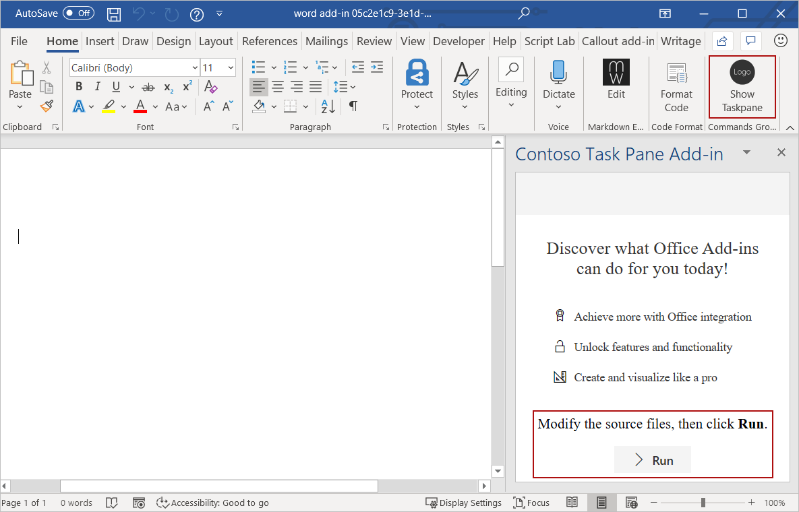
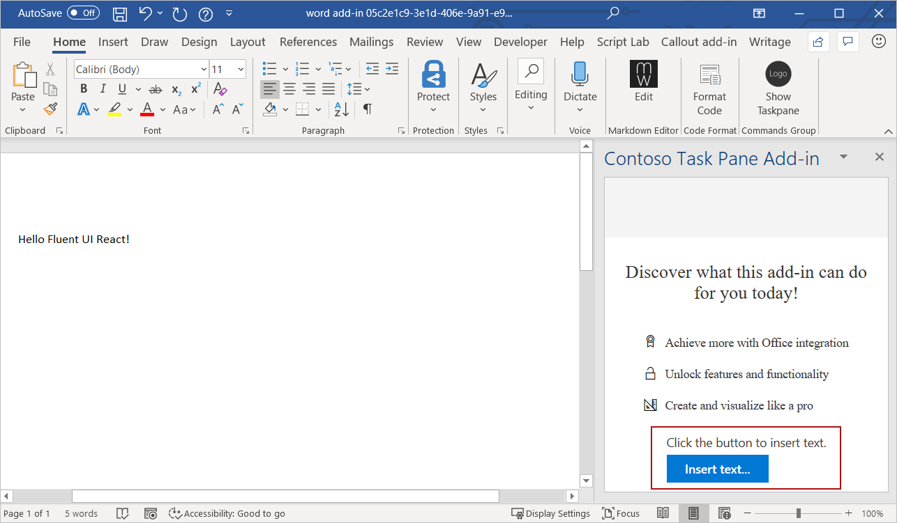

# Use Fluent UI React in Office Add-ins

Fluent UI React is the official open-source JavaScript front-end framework designed to build experiences that fit seamlessly into a broad range of Microsoft products, including Office. It provides robust, up-to-date, accessible React-based components which are highly customizable using CSS-in-JS.

> [!NOTE]
> This article describes the use of Fluent UI React in the context of Office Add-ins. But it is also used in a wide range of Microsoft 365 apps and extensions. For more information, see [Fluent UI React](https://developer.microsoft.com/fluentui#/get-started/web#fluent-ui-react) and the open source repo [Fluent UI Web](https://github.com/microsoft/fluentui).

This article describes how to create an add-in that's built with React and uses Fluent UI React components.

## Create an add-in project

You'll use the Yeoman generator for Office Add-ins to create an add-in project that uses React.

### Install the prerequisites

[!include[Yeoman generator prerequisites](../includes/quickstart-yo-prerequisites.md)]

### Create the project

[!include[Yeoman generator create project guidance](../includes/yo-office-command-guidance.md)]

- **Choose a project type:** `Office Add-in Task Pane project using React framework`
- **Choose a script type:** `TypeScript`
- **What do you want to name your add-in?** `My Office Add-in`
- **Which Office client application would you like to support?** `Word`


After you complete the wizard, the generator creates the project and installs supporting Node components.

[!include[Yeoman generator next steps](../includes/yo-office-next-steps.md)]

### Try it out

1. Navigate to the root folder of the project.

    ```command&nbsp;line
    cd "My Office Add-in"
    ```

2. Complete the following steps to start the local web server and sideload your add-in.

    [!INCLUDE [alert use https](../includes/alert-use-https.md)]

    > [!TIP]
    > If you're testing your add-in on Mac, run the following command before proceeding. When you run this command, the local web server starts.
    >
    > ```command&nbsp;line
    > npm run dev-server
    > ```

    - To test your add-in in Word, run the following command in the root directory of your project. This starts the local web server and opens Word with your add-in loaded.

        ```command&nbsp;line
        npm start
        ```

    - To test your add-in in Word on a browser, run the following command in the root directory of your project. When you run this command, the local web server starts. Replace "{url}" with the URL of a Word document on your OneDrive or a SharePoint library to which you have permissions.

        [!INCLUDE [npm start:web command syntax](../includes/start-web-sideload-instructions.md)]

3. To open the add-in task pane, on the **Home** tab, choose the **Show Taskpane** button. Notice the default text and the **Run** button at the bottom of the task pane. In the remainder of this walkthrough, you'll redefine this text and button by creating a React component that uses UX components from Fluent UI React.

    

## Create a React component that uses Fluent UI React

At this point, you've created a very basic task pane add-in that's built using React. Next, complete the following steps to create a new React component (`ButtonPrimaryExample`) within the add-in project. The component uses the `Label` and `PrimaryButton` components from Fluent UI React.

1. Open the project folder created by the Yeoman generator, and go to **src\taskpane\components**.
2. In that folder, create a new file named **Button.tsx**.
3. In **Button.tsx**, add the following code to define the `ButtonPrimaryExample` component.

```typescript
import * as React from 'react';
import { PrimaryButton, IButtonProps } from '@fluentui/react/lib/Button';
import { Label } from '@fluentui/react/lib/Label';

export class ButtonPrimaryExample extends React.Component<IButtonProps, {}> {
  public constructor(props) {
    super(props);
  }

  insertText = async () => {
    // In the click event, write text to the document.
    await Word.run(async (context) => {
      let body = context.document.body;
      body.insertParagraph('Hello Fluent UI React!', Word.InsertLocation.end);
      await context.sync();
    });
  }

  public render() {
    let { disabled } = this.props;
    return (
      <div className='ms-BasicButtonsExample'>
        <Label>Click the button to insert text.</Label>
        <PrimaryButton
          data-automation-id='test'
          disabled={ disabled }
          text='Insert text...'
          onClick={ this.insertText } />
      </div>
    );
  }
}
```

This code does the following:

- References the React library using `import * as React from 'react';`.
- References the Fluent UI React components (`PrimaryButton`, `IButtonProps`, `Label`) that are used to create `ButtonPrimaryExample`.
- Declares the new `ButtonPrimaryExample` component using `export class ButtonPrimaryExample extends React.Component`.
- Declares the `insertText` function that will handle the button's `onClick` event.
- Defines the UI of the React component in the `render` function. The HTML markup uses the `Label` and `PrimaryButton` components from Fluent UI React and specifies that when the `onClick` event fires, the `insertText` function will run.

## Add the React component to your add-in

Add the `ButtonPrimaryExample` component to your add-in by opening **src\components\App.tsx** and completing the following steps.

1. Add the following import statement to reference `ButtonPrimaryExample` from **Button.tsx**.

    ```typescript
    import {ButtonPrimaryExample} from './Button';
    ```

2. Remove the following import statement.

    ```typescript
    import Progress from './Progress';
    ```

3. Replace the default `render()` function with the following code that uses `ButtonPrimaryExample`.

    ```typescript
    render() {
      return (
        <div className="ms-welcome">
        <Header logo="assets/logo-filled.png" title={this.props.title} message="Welcome" />
        <HeroList message="Discover what this add-in can do for you today!" items={this.state.listItems} >
          <ButtonPrimaryExample />
        </HeroList>
        </div>
      );
    }
    ```

4. Save the changes you've made to **App.tsx**.

## See the result

In Word, the add-in task pane automatically updates when you save changes to **App.tsx**. The default text and button at the bottom of the task pane now shows the UI that's defined by the `ButtonPrimaryExample` component. Choose the **Insert text...** button to insert text into the document.



Congratulations, you've successfully created a task pane add-in using React and Fluent UI React!

## See also

- [Word Add-in GettingStartedFabricReact](https://github.com/OfficeDev/Word-Add-in-GettingStartedFabricReact)
- [Fabric Core in Office Add-ins](fabric-core.md)
- [UX design patterns for Office Add-ins](ux-design-pattern-templates.md)
