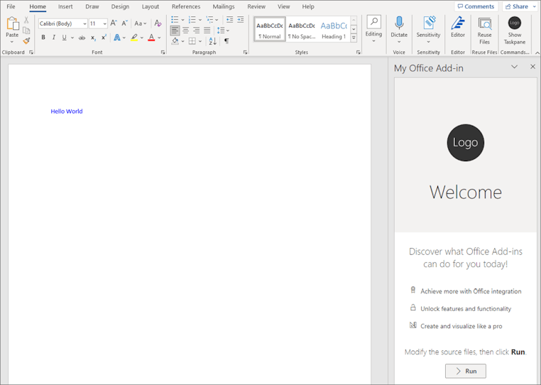

# Use Fluent UI React in Office Add-ins

[Fluent UI React](https://react.fluentui.dev) is the official open-source JavaScript front-end framework designed to build experiences that fit seamlessly into a broad range of Microsoft products, including Microsoft 365 applications. It provides robust, up-to-date, accessible React-based components which are highly customizable using CSS-in-JS.

> [!NOTE]
> This article describes the use of Fluent UI React in the context of Office Add-ins. However, it's also used in a wide range of Microsoft 365 apps and extensions. For more information, see [Fluent UI React](https://react.fluentui.dev) and the [Fluent UI Web](https://github.com/microsoft/fluentui) open source repository.

This article describes how to create an add-in that's built with React and that uses Fluent UI React components.

## Create an add-in project

You'll use the [Yeoman generator for Office Add-ins](../develop/yeoman-generator-overview.md) to create an add-in project that uses React.

### Install the prerequisites

[!INCLUDE [Yeoman generator prerequisites](../includes/quickstart-yo-prerequisites.md)]

### Create the project

[!INCLUDE [Yeoman generator create project guidance](../includes/yo-office-command-guidance.md)]

- **Choose a project type:** `Office Add-in Task Pane project using React framework`
- **Choose a script type:** `TypeScript`
- **What do you want to name your add-in?** `My Office Add-in`
- **Which Office client application would you like to support?** `Word`


After you complete the wizard, the generator creates the project and installs supporting Node components.

[!INCLUDE [Yeoman generator next steps](../includes/yo-office-next-steps.md)]

### Try it out

1. Navigate to the root folder of the project.

    ```command&nbsp;line
    cd "My Office Add-in"
    ```

1. Complete the following steps to start the local web server and sideload your add-in.
    [!INCLUDE [alert use https](../includes/alert-use-https.md)]

    > [!TIP]
    > If you're testing your add-in on Mac, run the following command before proceeding. When you run this command, the local web server starts.
    >
    > ```command&nbsp;line
    > npm run dev-server
    > ```

    - To test your add-in in Word, run the following command in the root directory of your project. This starts the local web server and opens Word with your add-in loaded.

        ```command&nbsp;line
        npm start
        ```

    - To test your add-in in Word on a browser, run the following command in the root directory of your project. When you run this command, the local web server starts. Replace "{url}" with the URL of a Word document on your OneDrive or a SharePoint library to which you have permissions.

        [!INCLUDE [npm start:web command syntax](../includes/start-web-sideload-instructions.md)]

1. To open the add-in task pane, on the **Home** tab, select the **Show Taskpane** button. Notice the default text and the **Run** button at the bottom of the task pane. In the remainder of this walkthrough, you'll redefine this text and button by creating a React component that uses Fluent UI React components.

    

## Install Fluent UI React as a dependency

Before you can create React components, you must first install Fluent UI React as a dependency in your add-in project. To do so, run the following code in the root directory of your add-in project.

```command&nbsp;line
npm install @fluentui/react-components
```

## Set up the style renderer in your project

The styles of Fluent UI React components are defined by a style renderer, which assigns values to CSS variables based on a specified theme. To set up a style renderer in your project that uses Fluent UI React, you must add the [FluentProvider](https://react.fluentui.dev/?path=/docs/components-fluentprovider--default) component and pass it a theme. To learn more about Fluent UI React themes and the `FluentProvider` component, see [Theming](https://react.fluentui.dev/?path=/docs/concepts-developer-theming--page).

Complete the following steps to add the `FluentProvider` component to your add-in project and configure it to apply the Web Light theme.

1. Open your add-in project in a code editor, navigate to **./src/taskpane**, then open the **index.tsx** file.
1. Replace the contents of the file with the following code.

    ```typescript
    import App from "./components/App";
    import { FluentProvider, webLightTheme } from "@fluentui/react-components";
    import * as React from "react";
    import * as ReactDOM from "react-dom";
    
    /* global document, Office, module, require */
    
    let isOfficeInitialized = false;
    
    const title = "Contoso Task Pane Add-in";
    
    const render = (Component) => {
      ReactDOM.render(
        <FluentProvider theme={webLightTheme}>
          <Component title={title} isOfficeInitialized={isOfficeInitialized} />
        </FluentProvider>,
        document.getElementById("container")
      );
    };
    
    /* Render application after Office initializes */
    Office.onReady(() => {
      isOfficeInitialized = true;
      render(App);
    });
    
    if ((module as any).hot) {
      (module as any).hot.accept("./components/App", () => {
        const NextApp = require("./components/App").default;
        render(NextApp);
      });
    }
    ```

1. Save your changes.

## Create a React component that uses Fluent UI React

In this section, you'll create a new React component (`ButtonExample`) within your add-in project. The component uses the [Button](https://react.fluentui.dev/?path=/docs/components-button-button--default) and [Label](https://react.fluentui.dev/?path=/docs/components-label--default) components from Fluent UI React.

The code does the following:

- Uses `import * as React from "react";` to reference the React library.
- References the Fluent UI React components (`Button`, `ButtonProps`, and `Label`) that are used to create the `ButtonExample` component.
- Uses `export class ButtonPrimaryExample extends React.Component` to declare the new `ButtonExample` component.
- Declares the `insertText` function to handle the button's `onClick` event.
- Defines the UI of the React component in the `render` function. The HTML markup uses the `Button` and `Label` components from Fluent UI React and specifies that when the `onClick` event occurs, the `insertText` function will run.

1. Navigate to **.src/taskpane/components**, then create a new file named **Button.tsx**.
1. In **Button.tsx**, add the following code to define the `ButtonExample` component.

    ```typescript
    import * as React from "react";
    import { Button, ButtonProps, Label } from "@fluentui/react-components";

    /* global Word */
    
    export class ButtonExample extends React.Component<ButtonProps, {}> {
      public constructor(props) {
        super(props);
      }
    
      insertText = async () => {
        // Write text to the document when the button is selected.
        await Word.run(async (context) => {
          let body = context.document.body;
          body.insertParagraph("Hello Fluent UI React!", Word.InsertLocation.end);
          await context.sync();
        });
      };
    
      //Defines the Label and Button Fluent React UI components.
      public render() {
        let { disabled } = this.props;
        return (
          <div className="ms-BasicButtonExample">
            <Label weight="semibold">Click the button to insert text.</Label>
            <br />
            <Button appearance="primary" disabled={disabled} size="large" onClick={this.insertText}>
              Insert text
            </Button>
          </div>
        );
      }
    }
    ```

1. Save your changes.

## Add the React component to your add-in

To add the newly created `ButtonExample` component to your add-in, complete the following steps.

1. Navigate to **./src/taskpane/components**, then open **App.tsx**.
1. Add the following import statement to reference the `ButtonExample` component from **Button.tsx**.

    ```typescript
    import { ButtonExample } from './Button';
    ```

1. Remove the following import statements, as they aren't used in this sample.

    ```typescript
    import { DefaultButton } from "@fluentui/react";
    import Progress from './Progress';
    ```

1. Replace the default `render()` function with the following code that uses the `ButtonExample` component.

    ```typescript
    render() {
      return (
        <div className="ms-welcome">
          <Header logo="assets/logo-filled.png" title={this.props.title} message="Welcome" />
          <HeroList message="Discover what this add-in can do for you today!" items={this.state.listItems} >
            <ButtonExample />
          </HeroList>
        </div>
      );
    }
    ```

1. Save your changes.

## See the result

In Word, the add-in task pane automatically updates when you save changes to **App.tsx**. The default text and button at the bottom of the task pane now reflect the UI defined by the `ButtonExample` component. Select the **Insert text** button to insert text into the document.


Congratulations, you've successfully created a task pane add-in using React and Fluent UI React!

## Migrate to Fluent UI React v9

If you have an existing add-in that implements an older version of Fluent UI React, we recommend migrating to Fluent UI v9. For guidance on the migration process, see [Getting started migrating to v9](https://react.fluentui.dev/?path=/docs/concepts-migration-getting-started--page).

## See also

- [Fabric Core in Office Add-ins](fabric-core.md)
- [UX design patterns for Office Add-ins](ux-design-pattern-templates.md)
- [Fluent UI GitHub repository](https://github.com/microsoft/fluentui)
