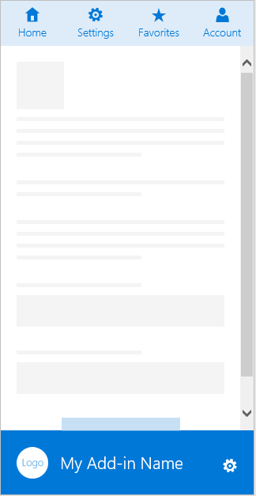
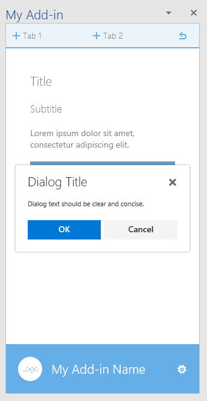
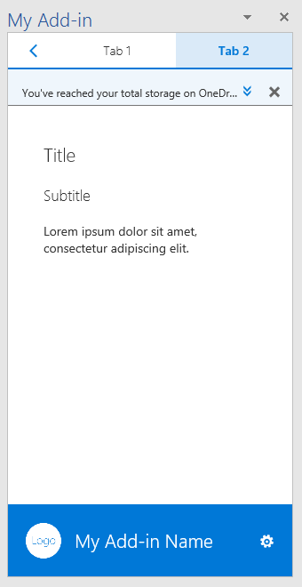
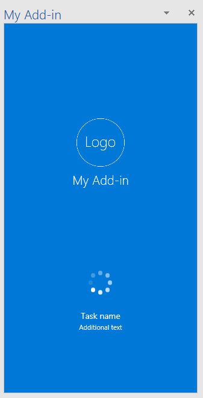
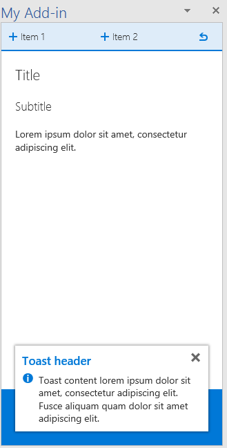
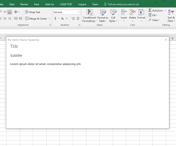
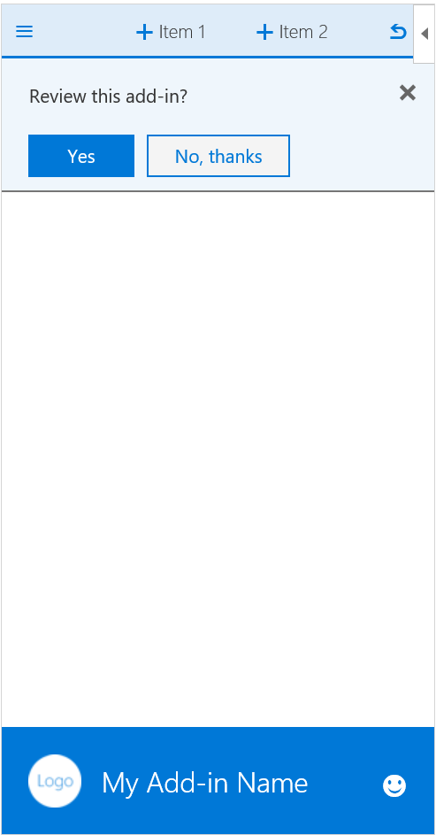
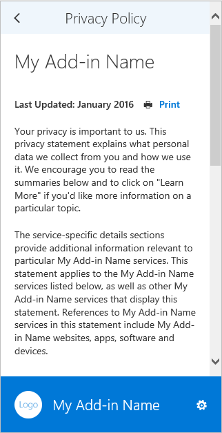

# UX design pattern templates for Office Add-ins

The [UX design patterns for Office Add-ins project](https://github.com/OfficeDev/Office-Add-in-UX-Design-Patterns-Code "UX design patterns for Office Add-ins project") includes HTML, JavaScript, and CSS files that you can use to create the UX for your add-in.   

Use the UX design patterns project to:

* Apply solutions to common customer scenarios.
* Apply design best practices.
* Incorporate [Office UI Fabric](https://dev.office.com/fabric#/get-started) components and styles.
* Build add-ins that visually integrate with the default Office UI.  

## Using the UX design patterns

You can use the [Office Add-ins Design Toolkit](https://aka.ms/addins_toolkit) together with the [Fabric Design Toolkit](https://aka.ms/fabric-toolkit) as a guide when you design your own Office Add-in. You can also add the [source code](https://github.com/OfficeDev/Office-Add-in-UX-Design-Patterns-Code/tree/master/templates) directly to your project.

To use the specifications to build a mock-up of your own add-in UI:

1. Download design assets files and begin designing your own UI:
  * [Office Add-ins Design Toolkit](https://aka.ms/addins_toolkit)
	* [Fabric Design Toolkit](https://aka.ms/fabric-toolkit)

2. Refer to the following articles for guidance:
  * Best practices for [Designing your Office Add-ins](add-in-design.md)
  * [Office UI Fabric Toolkits](https://developer.microsoft.com/en-us/fabric#/resources)

To add the source code:

1. Clone the [UX design patterns for Office Add-ins project repo](https://github.com/OfficeDev/Office-Add-in-UX-Design-Patterns-Code "UX design patterns for Office Add-ins project").
2. Copy the [assets folder](https://github.com/OfficeDev/Office-Add-in-UX-Design-Pattern-Code/tree/master/assets), and the code folder for the individual pattern you choose to your add-in project.  
3. Incorporate the individual pattern into your add-in. For example:
	- Edit the source location or add-in command URL in the manifest.
	- Use the UX design pattern as a template for other pages.
	- Link to or from the UX design pattern.

## Generic page templates

Generic page templates can be applied to any page in your add-in and don't have a special purpose. An example of a special purpose page, would be any of the first-run patterns. The following list describes the generic pages available:

* **Landing page** - A standard add-in page, for example the page a user lands on after a first-run experience or sign-in process.
	* Learn about guidelines for adopting the [Office design language](add-in-design-language.md) in your add-in.
	* [Landing page code](https://github.com/OfficeDev/Office-Add-in-UX-Design-Patterns-Code/tree/master/templates/generic/landing-page)
* **Brand image in brand bar** - The landing page with an image in the footer that represents your brand.
	* [Brand bar specification](https://github.com/OfficeDev/Office-Add-in-UX-Design-Patterns/blob/master/patterns/brand-bar.md)
	* [Brand bar code](https://github.com/OfficeDev/Office-Add-in-UX-Design-Patterns-Code/tree/master/templates/generic/brand-bar)

<table>
 <tr><th>Landing</th><th>Brand Bar</th></tr>
 <tr><td></td>
<td></td></tr>
 </table>

### First-run experience templates

A first-run experience is the experience a user has when they open your add-in for the first time. The following first-run design pattern templates are available:

* **Steps to start** - Provides users with an ordered list of steps to perform to get started using your add-in.
	* [Steps to start specification](https://github.com/OfficeDev/Office-Add-in-UX-Design-Patterns/blob/master/assets/archived-patterns/fre_stepsToStart.pdf) (This UX design pattern has been archived. As we assess its value, see [First-Run Value specification](https://github.com/OfficeDev/Office-Add-in-UX-Design-Patterns/blob/master/patterns/value-placemat.md).)  
	* [Steps to start code](https://github.com/OfficeDev/Office-Add-in-UX-Design-Patterns-Code/tree/master/templates/first-run/instruction-step)
* **Value** - Communicates your add-in's value proposition.
	* [Value specification](https://github.com/OfficeDev/Office-Add-in-UX-Design-Patterns/blob/master/patterns/value-placemat.md)
	* [Value code](https://github.com/OfficeDev/Office-Add-in-UX-Design-Patterns-Code/tree/master/templates/first-run/value-placemat)
* **Video** - Shows users a video before they start using your add-in.
	* [Video specification](https://github.com/OfficeDev/Office-Add-in-UX-Design-Patterns/blob/master/patterns/video-placemat.md)
	* [Video code](https://github.com/OfficeDev/Office-Add-in-UX-Design-Patterns-Code/tree/master/templates/first-run/video-placemat)
* **Walkthrough** - Takes users through a series of features or information before they start using the add-in.
	* [Carousel specification](https://github.com/OfficeDev/Office-Add-in-UX-Design-Patterns/blob/master/patterns/carousel.md) (Note that this UX design pattern has been renamed to "Carousel." Former specifications refered to it as a "Paging Panel." Code assets refer to it as a "First-run Walkthrough."
	* [Walkthrough code](https://github.com/OfficeDev/Office-Add-in-UX-Design-Patterns-Code/tree/master/templates/first-run/walkthrough)

[AppSource](https://docs.microsoft.com/en-us/office/dev/store/use-the-seller-dashboard-to-submit-to-the-office-store) has a system that manages trial versions of an add-in, but if you want to control the UI of the trial experience for your add-in, use the following patterns:

* **Trial** - Shows users how to get started with a trial version of your add-in.
	* [Trial specification](https://github.com/OfficeDev/Office-Add-in-UX-Design-Patterns/blob/master/assets/archived-patterns/fre_trialVersion.pdf) (This UX design pattern has been archived. As we assess its value, refer to this PDF.)
	* [Trial code](https://github.com/OfficeDev/Office-Add-in-UX-Design-Patterns-Code/tree/master/templates/first-run/trial-placemat)
* **Trial feature** - Advises users that the feature they are trying to use is not available in the trial version of the add-in. Alternatively, if your add-in is free but it includes a feature that requires a subscription, consider using this pattern. You might also use this pattern to provide a downgraded experience after a trial has ended.
	* [Trial feature specification](https://github.com/OfficeDev/Office-Add-in-UX-Design-Patterns/blob/master/assets/archived-patterns/fre_trialFeature.pdf) (This UX design pattern has been archived. As we assess its value, refer to this PDF.)
	* [Trial feature code](https://github.com/OfficeDev/Office-Add-in-UX-Design-Patterns-Code/tree/master/templates/first-run/trial-placemat-feature)

> [!IMPORTANT]
> If you decide to manage your own trial, and not use AppSource to manage the trial, make sure to include the **Additional purchase may be required** tag in the testing notes in the seller dashboard.

Consider whether showing users the first-run experience once or many times is important to your scenario. For example, if users use your add-in periodically, they might forget how to use it, and it might be helpful to see the first-run experience more than once.

 <table>
 <tr><th>Steps to Start</th><th>Value</th><th>Video</th></tr>
 <tr>
<td></td>
<td></td>
<td></td></tr>
 </table>

 <table>
 <tr><th>Walkthrough first page</th><th>Trial</th><th>Trial feature</th></tr>
 <tr>
<td></td>
<td></td>
<td></td></tr>
 </table>

## Navigation templates

Users need to navigate between the different pages of your add-in. The following navigation templates show different options you can use to organize pages and commands in your add-in.

* **Back button and Next page** - Shows a task pane with Back and Next page buttons. Use this pattern to ensure users follow an ordered series of steps.
	* [Back Button and Next Page specification](https://github.com/OfficeDev/Office-Add-in-UX-Design-Patterns/blob/master/patterns/back-button.md)
	* [Back Button and Next Page code](https://github.com/OfficeDev/Office-Add-in-UX-Design-Patterns-Code/tree/master/templates/navigation/back-button)
* **Navigation** - Shows a menu, commonly referred to as the hamburger menu, with page menu items in a task pane.
	* [Navigation specification](https://github.com/OfficeDev/Office-Add-in-UX-Design-Patterns/blob/master/patterns/contextual-menu.md)
	* [Navigation code](https://github.com/OfficeDev/Office-Add-in-UX-Design-Patterns-Code/tree/master/templates/navigation/navigation)
* **Navigation with commands** - Shows the hamburger menu with command (or action) buttons in a task pane. Use this pattern when you want to provide navigation and command options together.
	* [Navigation with commands specification](https://github.com/OfficeDev/Office-Add-in-UX-Design-Patterns/blob/master/patterns/command-bar.md)
	* [Navigation with commands code](https://github.com/OfficeDev/Office-Add-in-UX-Design-Patterns-Code/tree/master/templates/navigation/navigation-commands)
* **Pivot** - Shows Pivot navigation inside of a task pane. Use pivot navigation to allow users to navigate between different content.
	* [Pivot specification](https://github.com/OfficeDev/Office-Add-in-UX-Design-Patterns/blob/master/patterns/pivot.md)
	* [Pivot code](https://github.com/OfficeDev/Office-Add-in-UX-Design-Patterns-Code/tree/master/templates/navigation/pivot)
* **Tab bar** - Shows navigation using buttons with vertically stacked text and icons. Use the tab bar to provide navigation using tabs with short and descriptive titles.
	* [Tab bar specification](https://github.com/OfficeDev/Office-Add-in-UX-Design-Patterns/blob/master/patterns/tab-bar.md)
	* [Tab bar code](https://github.com/OfficeDev/Office-Add-in-UX-Design-Patterns-Code/tree/master/templates/navigation/tab-bar)

<table>
<tr><th>Back button</th><th>Navigation</th><th>Navigation with commands</th></tr>
<tr>
	<td>
		
	</td>
	<td>
		
	</td>
	<td>
		
	</td>
</tr>
 </table>

<table>
<tr><th>Pivot</th><th>Tab bar</th></tr>
<tr><td></td>
<td></td>
</tr>
 </table>

## Notification templates

Your add-in can notify users of events, such as errors, or of progress in a variety of ways. The following notification templates are available:

* **Embedded dialog box** - Shows a dialog box inside the task pane that provides information and, optionally, an interactive experience, using buttons or other controls. Consider using one to prompt a user to confirm an action. Use the Embedded dialog pattern when you want to keep the user experience in the task pane.
	* [Embedded dialog box specification](https://github.com/OfficeDev/Office-Add-in-UX-Design-Patterns/blob/master/patterns/embedded-dialog.md)
	* [Embedded dialog box code](https://github.com/OfficeDev/Office-Add-in-UX-Design-Patterns-Code/tree/master/templates/notifications/embedded-dialog)
* **Inline message** - Indicates error, success, or information, and can appear at a specified location in the task pane. For example, if a user enters an incorrectly formatted email address in a text box, an error message appears just below the text box.
	* [Inline message specification](https://github.com/OfficeDev/Office-Add-in-UX-Design-Patterns/blob/master/assets/archived-patterns/notification_inlineMessage.pdf) (This UX design pattern has been archived. As we assess its value, refer to this PDF.)
	* [Inline message code](https://github.com/OfficeDev/Office-Add-in-UX-Design-Patterns-Code/tree/master/templates/notifications/inline-message)
* **Message banner** - Provides information and, optionally, a simple call to action, in a banner that can be collapsed to a single line, expanded to multiple lines, or dismissed. Use message banners to report a service update or a helpful tip when the add-in starts.
	* [Message banner specification](https://github.com/OfficeDev/Office-Add-in-UX-Design-Patterns/blob/master/assets/archived-patterns/message_bar.pdf) (This UX design pattern has been archived. As we assess its value, refer to this PDF.)
	* [Message banner code](https://github.com/OfficeDev/Office-Add-in-UX-Design-Patterns-Code/tree/master/templates/notifications/message-banner)
* **Progress bar** - Indicates the progress of a long-running, synchronous process, such as a configuration task that must complete before the user can take any further action. It is a separate interstitial page that also reinforces the add-in brand. Use a progress bar when the process can send periodic measures of how far along it is back to the add-in.
	* [Progress bar specification](https://github.com/OfficeDev/Office-Add-in-UX-Design-Patterns/blob/master/patterns/progress-indicator.md)
	* [Progress bar code](https://github.com/OfficeDev/Office-Add-in-UX-Design-Patterns-Code/tree/master/templates/notifications/progress-bar)
* **Spinner** - Indicates that a long-running, synchronous process is underway, but provides no indication of how far along it is. It is a separate interstitial page that also reinforces the add-in brand. Use a spinner when the add-in cannot know reliably how far along a process is.
	* [Spinner specification](https://github.com/OfficeDev/Office-Add-in-UX-Design-Patterns/blob/master/patterns/spinner.md)
	* [Spinner code](https://github.com/OfficeDev/Office-Add-in-UX-Design-Patterns-Code/tree/master/templates/notifications/spinner)
* **Toast** - Provides a brief message that fades away after a few seconds. Because the user might not see the message, use toast only for nonessential information. It is a good choice for notifying users of an event in a remote system, such as the receipt of an email.
	* [Toast specification](https://github.com/OfficeDev/Office-Add-in-UX-Design-Patterns/blob/master/patterns/toast.md)
	* [Toast code](https://github.com/OfficeDev/Office-Add-in-UX-Design-Patterns-Code/tree/master/templates/notifications/toast)

 <table>
 <tr><th>Embedded dialog</th><th>Inline message</th><th>Message banner</th></tr>
 <tr><td></td>
<td></td>
<td></td></tr>
 </table>

 <table>
 <tr><th>Progress bar</th><th>Spinner</th><th>Toast</th></tr>
 <tr><td></td>
<td></td>
<td></td></tr>
 </table>

## General component templates

The following are general components that you can use in your add-ins in a variety of scenarios.  

### Client dialog boxes

Client dialog boxes provide another way for users to work with your add-in outside of a task pane. The following dialog box templates are available:

* **Typeramp dialog box** - Shows a dialog box with textual content. Use the typeramp dialog to display elaborative information to users.
	* Learn about designing [dialog boxes in Office Add-ins](dialog-boxes.md). Also follow our guidelines for [Typography in Office Add-ins](add-in-design-language.md#typography).
	* [Typeramp dialog box code](https://github.com/OfficeDev/Office-Add-in-UX-Design-Patterns-Code/tree/master/templates/dialog/typeramp)
* **Alert dialog box** - Shows an alert box with important information, such as errors or notifications, to users. 	
	* [Alert dialog box specification](https://github.com/OfficeDev/Office-Add-in-UX-Design-Patterns/blob/master/assets/archived-patterns/notification_alert.pdf) (This UX design pattern has been archived. As we assess its value, refer to this PDF.)
	* [Alert dialog box code](https://github.com/OfficeDev/Office-Add-in-UX-Design-Patterns-Code/tree/master/templates/dialog/alert)
* **Navigation dialog box** - Shows a dialog box with navigation. Use the navigation dialog box to allow users to navigate between different content.
	* Learn about designing [dialog boxes in Office Add-ins](dialog-boxes.md). Also learn about using Office UI Fabric [Pivot components in Office Add-ins](pivot.md).
	* [Navigation dialog box code](https://github.com/OfficeDev/Office-Add-in-UX-Design-Patterns-Code/tree/master/templates/dialog/navigation)

<table>
 <tr><th>Typeramp dialog</th><th>Alert dialog</th></tr>
<tr>
<td></td>
<td></td>
</tr></tr>
 </table>

 <table>
 <tr><th>Navigation dialog</th></tr>
<tr><td></td></tr>
</tr>
 </table>

### Feedback and ratings

To improve the visibility and adoption of your add-in, it is helpful to provide users with the ability to rate and review your add-in in AppSource. This pattern shows two methods for presenting feedback and ratings from within the add-in:

- User-initiated feedback - A user chooses to send feedback by using either the navigation menu (for example, using the **Send Feedback** link) or an icon on the footer.
- System-initiated feedback - After the add-in runs three times, the user is prompted to provide feedback via a Message Banner.

Either method opens a dialog box that contains the AppSource page for the add-in.

* [Feedback and ratings specification](https://github.com/OfficeDev/Office-Add-in-UX-Design-Patterns/blob/master/assets/archived-patterns/notification_feedback.pdf) (This UX design pattern has been archived. As we assess its value, refer to this PDF.)
* [Feedback and ratings code](https://github.com/OfficeDev/Office-Add-in-UX-Design-Patterns-Code/tree/master/templates/feedback/office-store)

> [!IMPORTANT]
> This pattern currently points to the AppSource home page. Be sure to update this URL to the URL of your add-in's page in AppSource.

 <table>
 <tr><th>Feedback and ratings</th></tr>
<tr><td></td></tr>
</tr>
 </table>

### Settings and privacy

Add-ins may need a Settings page that allows users to configure settings that control the behavior of the add-in. Also, you may want to provide users with the privacy policies your add-in adheres to.

* **Settings** - Shows a task pane with configuration components that controls the behavior of the add-in. A settings page provides options for the user to choose.
	* [Settings specification](https://github.com/OfficeDev/Office-Add-in-UX-Design-Patterns/blob/master/patterns/settings.md)
	* [Settings code](https://github.com/OfficeDev/Office-Add-in-UX-Design-Patterns-Code/tree/master/templates/settings)
* **Privacy policy** - Shows task pane with important information about privacy policies.
	* [Privacy Policy specification](https://github.com/OfficeDev/Office-Add-in-UX-Design-Patterns/blob/master/assets/archived-patterns/general_multiSection.pdf) (This UX design pattern has been archived. As we assess its value, refer to this PDF.)
	* [Privacy Policy code](https://github.com/OfficeDev/Office-Add-in-UX-Design-Patterns-Code/tree/master/templates/settings)

<table>
 <tr><th>Settings</th><th>Privacy Policy</th></tr>
<tr>
<td></td>
<td></td>
</tr></tr>
 </table>

## See also

* [Best practices for developing Office Add-ins](../concepts/add-in-development-best-practices.md)
* [Office UI Fabric](http://dev.office.com/fabric/)
