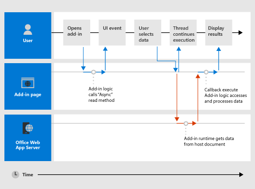

# Asynchronous programming in Office Add-ins

[!include[information about the common API](../includes/alert-common-api-info.md)]

Why does the Office Add-ins API use asynchronous programming? JavaScript is a single-threaded language. If a script invokes a long-running synchronous process of the Office client, all subsequent scripts are blocked until that process completes. Being asynchronous makes sure that Office Add-ins are responsive and fast.

The names of all asynchronous methods in the Common APIs end with "Async", such as the `Document.getSelectedDataAsync`, `Binding.getDataAsync`, or `Item.loadCustomPropertiesAsync` methods. When an "Async" method is called, it runs immediately. The rest of the script continues while the operation completes on the client-side. The optional callback function that you pass to an "Async" method runs as soon as the data or requested operation is ready. This generally occurs promptly, but there can be a slight delay.

The following diagram shows the flow of an "Async" method that reads the data the user selected in a document. When the "Async" call is made, the JavaScript thread is free to perform any additional client-side processing (although none is shown in the diagram). When the "Async" method returns, the callback resumes on the thread. The add-in can then access data, do something with it, and display the result. The pattern is the same across platforms.



## Write the callback function for an "Async" method

The callback function you pass as the *callback* argument to an "Async" method must declare a single parameter. The add-in runtime uses that parameter to provide access to an [AsyncResult](/javascript/api/office/office.asyncresult) object for the callback function.

The callback function can either be an anonymous function or a named function. An anonymous function is useful if you are only going to use its code once - because it has no name, you can't reference it in another part of your code. A named function is useful if you want to reuse the callback function for more than one "Async" method.

### Write an anonymous callback function

The following anonymous callback function declares a single parameter named `result` for the data returned by the client. It retrieves and writes that data from the [AsyncResult.value](/javascript/api/office/office.asyncresult#office-office-asyncresult-value-member) property when the callback returns.

```js
function (result) {
    write('Selected data: ' + result.value);
}
```

The following example shows this anonymous callback function in the context of a full "Async" method call to the `Document.getSelectedDataAsync(coercionType, callback)` method.

- The first *coercionType* argument, `Office.CoercionType.Text`, specifies to return the selected data as a string of text.

- The second *callback* argument is the anonymous function passed inline to the method. When the function runs, it uses the *result* parameter to access the `value` property of the `AsyncResult` object. It then displays the data selected by the user in the document.

```js
Office.context.document.getSelectedDataAsync(Office.CoercionType.Text, 
    function (result) {
        write('Selected data: ' + result.value);
    }
});

// Function that writes to a div with id='message' on the page.
function write(message){
    document.getElementById('message').innerText += message; 
}
```

You can also use the parameter of your callback function to access other properties of the `AsyncResult` object. Use the [AsyncResult.status](/javascript/api/office/office.asyncresult#office-office-asyncresult-status-member) property to determine if the call succeeded or failed. If your call failed, use the [AsyncResult.error](/javascript/api/office/office.asyncresult#office-office-asyncresult-error-member) property to access an [Error](/javascript/api/office/office.error) object to help decide what to do.

For more information on the `getSelectedDataAsync` method, see [Read and write data to the active selection in a document or spreadsheet](read-and-write-data-to-the-active-selection-in-a-document-or-spreadsheet.md).

### Write a named callback function

Alternatively, you can write a named function and pass its name to the *callback* parameter of an "Async" method. Here, the previous example is rewritten to pass a function named `writeDataCallback` as the *callback* parameter.

```js
Office.context.document.getSelectedDataAsync(Office.CoercionType.Text, 
    writeDataCallback);

// Callback to write the selected data to the add-in UI.
function writeDataCallback(result) {
    write('Selected data: ' + result.value);
}

// Function that writes to a div with id='message' on the page.
function write(message){
    document.getElementById('message').innerText += message;
}
```

## Differences in what's returned to the `AsyncResult.value` property

The `asyncContext`, `status`, and `error` properties of the `AsyncResult` object return the same kinds of information to the callback functions passed to all "Async" methods. However, what's returned to the `AsyncResult.value` property varies depending on the functionality of the "Async" method.

For example, the `addHandlerAsync` methods (of the [Binding](/javascript/api/office/office.binding), [CustomXmlPart](/javascript/api/office/office.customxmlpart), [Document](/javascript/api/office/office.document), [RoamingSettings](/javascript/api/outlook/office.roamingsettings), and [Settings](/javascript/api/office/office.settings) objects) are used to add event handler functions. The `AsyncResult.value` property in those callback functions always returns **undefined**, since no data or object is accessed when you add an event handler.

On the other hand, if you call the `Document.getSelectedDataAsync` method, it returns the data the user selected in the document as the `AsyncResult.value` property in the callback. Or, if you call the [Bindings.getAllAsync](/javascript/api/office/office.bindings#office-office-bindings-getallasync-member(1)) method, it returns an array of all of the `Binding` objects in the document.

For a description of what's returned to the `AsyncResult.value` property for an `Async` method, see the **`callback`** section of that method's reference topic.

## Asynchronous programming patterns

The Common APIs in the Office JavaScript API support two kinds of asynchronous programming patterns.

- Nested callbacks
- Promises

> [!NOTE]
> In the current version of the Office JavaScript API, *built-in* support for the promises pattern only works with code for [bindings in Excel spreadsheets and Word documents](bind-to-regions-in-a-document-or-spreadsheet.md). However, you can wrap other functions that have callbacks inside your own custom `Promise`-returning function. For more information, see [Wrap Common APIs in Promise-returning functions](#wrap-common-apis-in-promise-returning-functions).

### Asynchronous programming using nested callback functions

Frequently, you need to perform two or more asynchronous operations to complete a task. To accomplish that, you can nest one "Async" call inside another.

The following code example nests two asynchronous calls.

- First, the [Bindings.getByIdAsync](/javascript/api/office/office.bindings#office-office-bindings-getbyidasync-member(1)) method is called to access a binding in the document named "MyBinding". The `AsyncResult` object returned to the `result` parameter of that callback provides access to the specified binding object from the `AsyncResult.value` property.
- Then, the binding object accessed from the first `result` parameter is used to call the [Binding.getDataAsync](/javascript/api/office/office.binding#office-office-binding-getdataasync-member(1)) method.
- Finally, the `result2` parameter of the callback passed to the `Binding.getDataAsync` method is used to display the data in the binding.

```js
function readData() {
    Office.context.document.bindings.getByIdAsync("MyBinding", function (result) {
        result.value.getDataAsync({ coercionType: 'text' }, function (result2) {
            write(result2.value);
        });
    });
}

// Function that writes to a div with id='message' on the page.
function write(message){
    document.getElementById('message').innerText += message; 
}
```

This basic nested callback pattern can be used for all asynchronous methods in the Common APIs.

### Asynchronous programming using the promises pattern to access data in bindings

Instead of passing a callback function and waiting for the function to return before the script continues, the promises programming pattern immediately returns a `Promise` object that represents its intended result. However, unlike true synchronous programming, under the covers the fulfillment of the promised result is actually deferred until the Office Add-ins runtime environment completes the request. An *onError* handler is provided to cover situations when the request can't be fulfilled.

The Common APIs provide the [Office.select](/javascript/api/office#Office_select_expression__callback_) function to support the promises pattern when working with existing binding objects. The promise object returned to the `Office.select` function only supports the four methods directly accessible from the [Binding](/javascript/api/office/office.binding) object.

- [getDataAsync](/javascript/api/office/office.binding#office-office-binding-getdataasync-member(1))
- [setDataAsync](/javascript/api/office/office.binding#office-office-binding-setdataasync-member(1))
- [addHandlerAsync](/javascript/api/office/office.binding#office-office-binding-addhandlerasync-member(1))
- [removeHandlerAsync](/javascript/api/office/office.binding#office-office-binding-removehandlerasync-member(1))

The promises pattern for working with bindings takes this form.

`Office.select(`*selectorExpression*`,` *onError*`).`*BindingObjectAsyncMethod*`;`

The *selectorExpression* parameter takes the form `"bindings#bindingId"`, where *bindingId* is the name ( `id`) of a binding that you created in the document or spreadsheet (using one of the "addFrom" methods of the `Bindings` collection: `addFromNamedItemAsync`, `addFromPromptAsync`, or `addFromSelectionAsync`). The example *selectorExpression* of `bindings#cities` specifies that you want to access the binding with an **id** of 'cities'.

The *onError* parameter is an error handling function which takes a single parameter of type `AsyncResult`. This is used to access an `Error` object if the `select` function fails to access the specified binding. The following example shows a basic error handler function that can be passed to the *onError* parameter.

```js
function onError(result){
    const err = result.error;
    write(err.name + ": " + err.message);
}

// Function that writes to a div with id='message' on the page.
function write(message){
    document.getElementById('message').innerText += message; 
}
```

Replace the *BindingObjectAsyncMethod* placeholder with a call to any of the four `Binding` object methods supported by the promise object: `getDataAsync`, `setDataAsync`, `addHandlerAsync`, or `removeHandlerAsync`. Calls to these methods don't support additional promises. In that case, you must use the [nested callback function pattern](#asynchronous-programming-using-nested-callback-functions).

After a `Binding` object promise is fulfilled, it can be reused in the chained method call as if it were a binding. If it's successful, the add-in runtime won't asynchronously retry fulfilling the promise. If the `Binding` object promise can't be fulfilled, the add-in runtime will try again to access the binding object the next time one of its asynchronous methods is invoked.

The following example uses the `select` function to retrieve a binding with the `id` "`cities`" from the `Bindings` collection, and then calls the [addHandlerAsync](/javascript/api/office/office.binding#office-office-binding-addhandlerasync-member(1)) method to add an event handler for the [dataChanged](/javascript/api/office/office.bindingdatachangedeventargs) event of the binding.

```js
function addBindingDataChangedEventHandler() {
    Office.select("bindings#cities", function onError(){/* error handling code */}).addHandlerAsync(Office.EventType.BindingDataChanged,
    function (eventArgs) {
        doSomethingWithBinding(eventArgs.binding);
    });
}

```

> [!IMPORTANT]
> The `Binding` object promise returned by the `Office.select` function provides access to only the four methods of the `Binding` object. If you need to access any of the other members of the `Binding` object, instead you must use the `Document.bindings` property and `Bindings.getByIdAsync` or `Bindings.getAllAsync` methods to retrieve the `Binding` object.

## Pass optional parameters to asynchronous methods

The common syntax for all "Async" methods follows this pattern.

 *asyncMethod* `(` *requiredParameters* `, [` *optionalParameters* `],` *callbackFunction* `);`

All asynchronous methods support optional parameters. These are passed in as a JavaScript object. The object that contains the optional parameters is an *unordered* collection of key-value pairs. You can create the object that contains optional parameters inline, or by creating an `options` object and passing that in as the *options* parameter.

### Pass optional parameters inline

Here is an example of the [Document.setSelectedDataAsync](/javascript/api/office/office.document#office-office-document-setselecteddataasync-member(1)) method with optional parameters defined inline. The two optional parameters, *coercionType* and *asyncContext*, are defined as an anonymous JavaScript object.

```js
Office.context.document.setSelectedDataAsync(
    "<html><body>hello world</body></html>",
    {coercionType: "html", asyncContext: 42},
    function(asyncResult) {
        write(asyncResult.status + " " + asyncResult.asyncContext);
    }
)

// Function that writes to a div with id='message' on the page.
function write(message){
    document.getElementById('message').innerText += message; 
}
```

### Pass optional parameters in a named object

Alternatively, you can create a named object that specifies the optional parameters separately from the method call and then pass the object as the *options* argument. The following example shows one way of creating an `options` object, where `parameter1`, `value1`, and so on, are placeholders for the actual parameter names and values.

```js
const options = {
    parameter1: value1,
    parameter2: value2,
    ...
    parameterN: valueN
};
```

Which looks like the following example when used to specify the [ValueFormat](/javascript/api/office/office.valueformat) and [FilterType](/javascript/api/office/office.filtertype) parameters.

```js
const options = {
    valueFormat: "unformatted",
    filterType: "all"
};
```

Here's another way of creating the `options` object.

```js
const options = {};
options[parameter1] = value1;
options[parameter2] = value2;
...
options[parameterN] = valueN;
```

Which looks like the following example when used to specify the `ValueFormat` and `FilterType` parameters:

```js
const options = {};
options["ValueFormat"] = "unformatted";
options["FilterType"] = "all";
```

The following example shows how to call to the `Document.setSelectedDataAsync` method by specifying optional parameters in an `options` object.

```js
const options = {
   coercionType: "html",
   asyncContext: 42
};

document.setSelectedDataAsync(
    "<html><body>hello world</body></html>",
    options,
    function(asyncResult) {
        write(asyncResult.status + " " + asyncResult.asyncContext);
    }
)

// Function that writes to a div with id='message' on the page.
function write(message){
    document.getElementById('message').innerText += message; 
}
```

In both optional parameter examples, the *callback* parameter is specified as the last parameter (following the inline optional parameters, or following the *options* argument object). Alternatively, you can specify the *callback* parameter inside either the inline JavaScript object, or in the `options` object. However, you can pass the *callback* parameter in only one location: either in the `options` object (inline or created externally), or as the last parameter, but not both.

## Wrap Common APIs in `Promise`-returning functions

The Common API (and Outlook API) methods do not return [Promises](https://developer.mozilla.org/docs/Web/JavaScript/Reference/Global_Objects/Promise). Therefore, you cannot use [await](https://developer.mozilla.org/docs/Web/JavaScript/Reference/Operators/await) to pause the execution until the asynchronous operation completes. If you need `await` behavior, wrap the method call in an explicitly created `Promise`.

The basic pattern is to create an asynchronous method that returns a Promise object immediately and *resolves* that Promise object when the inner method completes, or *rejects* the object if the method fails. The following is a simple example.

```javascript
function getDocumentFilePath() {
    return new OfficeExtension.Promise(function (resolve, reject) {
        try {
            Office.context.document.getFilePropertiesAsync(function (asyncResult) {
                resolve(asyncResult.value.url);
            });
        }
        catch (error) {
            reject(WordMarkdownConversion.errorHandler(error));
        }
    })
}
```

When this function needs to be awaited, it can be either called with the `await` keyword or passed to a `then` function.

> [!NOTE]
> This technique is especially useful when you need to call a Common API inside a call of the `run` function in an application-specific object model. For an example of the `getDocumentFilePath` function being used in this way, see the file [Home.js in the sample Word-Add-in-JavaScript-MDConversion](https://github.com/OfficeDev/Word-Add-in-MarkdownConversion/blob/master/Word-Add-in-JavaScript-MDConversionWeb/Home.js).

## See also

- [Understanding the Office JavaScript API](understanding-the-javascript-api-for-office.md)
- [Office JavaScript API](../reference/javascript-api-for-office.md)
- [Runtimes in Office Add-ins](../testing/runtimes.md)
