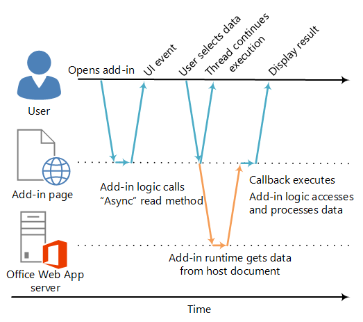

# Asynchronous programming in Office Add-ins

 Why does the Office Add-ins API use asynchronous programming? Because JavaScript is a single-threaded language, if script invokes a long-running synchronous process, all subsequent script execution will be blocked until that process completes. Because certain operations against Office web clients (but rich clients as well) could block execution if they are run synchronously, most of the methods in the JavaScript API for Office are designed to execute asynchronously. This makes sure that Office Add-ins are responsive and highly performing. It also frequently requires you to write callback functions when working with these asynchronous methods.

The names of all asynchronous methods in the API end with "Async", such as the  [Document.getSelectedDataAsync](../../reference/shared/document.getselecteddataasync.md), [Binding.getDataAsync](../../reference/shared/binding.getdataasync.md), or [Item.loadCustomPropertiesAsync](../../reference/outlook/Office.context.mailbox.item.md) methods. When an "Async" method is called, it executes immediately and any subsequent script execution can continue. The optional callback function you pass to an "Async" method executes as soon as the data or requested operation is ready. This generally occurs promptly, but there can be a slight delay before it returns.

The following diagram shows the flow of execution for a call to an "Async" method that reads the data the user selected in a document open in the server-based Word Online or Excel Online. At the point when the "Async" call is made, the JavaScript execution thread is free to perform any additional client-side processing. (Although none are shown in the diagram.) When the "Async" method returns, the callback resumes execution on the thread, and the add-in can the access data, do something with it, and display the result. The same asynchronous execution pattern holds when working with the Office rich client host applications, such as Word 2013 or Excel 2013.

**Figure 1. Asynchronous programing execution flow**




Support for this asynchronous design in both rich and web clients is part of the "write once-run cross-platform" design goals of the Office Add-ins development model. For example, you can create a content or task pane add-in with a single code base that will run in both Excel 2013 and Excel Online.

## Writing the callback function for an "Async" method


The callback function you pass as the  _callback_ argument to an "Async" method must declare a single parameter that the add-in runtime will use to provide access to an [AsyncResult](../../reference/shared/asyncresult.md) object when the callback function executes. You can write:


- An anonymous function that must be written and passed directly in line with the call to the "Async" method as the  _callback_ parameter of the "Async" method.
    
- A named function, passing the name of that function as the  _callback_ parameter of an "Async" method.
    
An anonymous function is useful if you are only going to use its code once - because it has no name, you can't reference it in another part of your code. A named function is useful if you want to reuse the callback function for more than one "Async" method.


### Writing an anonymous callback function

The following anonymous callback function declares a single parameter named  `result` that retrieves data from the [AsyncResult.value](../../reference/shared/asyncresult.status.md) property when the callback returns.


```
function (result) {
        write('Selected data: ' + result.value);
}
```

The following example shows how to pass this anonymous callback function in line in the context of a full "Async" method call to the  **Document.getSelectedDataAsync** method.


- The first  _coercionType_ argument, `Office.CoercionType.Text`, specifies to return the selected data as a string of text.
    
- The second  _callback_ argument is the anonymous function passed in-line to the method. When the function executes, it uses the _result_ parameter to access the **value** property of the **AsyncResult** object to display the data selected by the user in the document.
    


```js
Office.context.document.getSelectedDataAsync(Office.CoercionType.Text, 
    function (result) {
        write('Selected data: ' + result.value);
    }
});

// Function that writes to a div with id='message' on the page.
function write(message){
    document.getElementById('message').innerText += message; 
}
```

You can also use the parameter of your callback function to access other properties of the  **AsyncResult** object. Use the [AsyncResult.status](../../reference/shared/asyncresult.error.md) property to determine if the call succeeded or failed. If your call fails you can use the [AsyncResult.error](../../reference/shared/asyncresult.context.md) property to access an [Error](../../reference/shared/error.md) object for error information.

For more information about using the  **getSelectedDataAsync** method, see [Read and write data to the active selection in a document or spreadsheet](../../docs/develop/read-and-write-data-to-the-active-selection-in-a-document-or-spreadsheet.md). 


### Writing a named callback function

Alternatively, you can write a named function and pass its name to the  _callback_ parameter of an "Async" method. For example, the previous example can be rewritten to pass a function named `writeDataCallback` as the _callback_ parameter like this.


```
Office.context.document.getSelectedDataAsync(Office.CoercionType.Text, 
    writeDataCallback);

// Callback to write the selected data to the add-in UI.
function writeDataCallback(result) {
    write('Selected data: ' + result.value);
}

// Function that writes to a div with id='message' on the page.
function write(message){
    document.getElementById('message').innerText += message; 
}
```


## Differences in what's returned to the AsyncResult.value property


The  **asyncContext**,  **status**, and  **error** properties of the **AsyncResult** object return the same kinds of information to the callback function passed to all "Async" methods. However, what's returned to the **AsyncResult.value** property varies depending on the functionality of the "Async" method.

For example, the  **addHandlerAsync** methods (of the [Binding](../../reference/shared/binding.md), [CustomXmlPart](../../reference/shared/customxmlpart.customxmlpart.md), [Document](../../reference/shared/document.md), [RoamingSettings](../../reference/outlook/RoamingSettings.md), and [Settings](../../reference/shared/document.settings.md) objects) are used to add event handler functions to the items represented by these objects. You can access the **AsyncResult.value** property from the callback function you pass to any of the **addHandlerAsync** methods, but since no data or object is being accessed when you add an event handler, the **value** property always returns **undefined** if you attempt to access it.

On the other hand, if you call the  **Document.getSelectedDataAsync** method, it returns the data the user selected in the document to the **AsyncResult.value** property in the callback. Or, if you call the [Bindings.getAllAsync](../../reference/shared/bindings.getallasync.md) method, it returns an array of all of the **Binding** objects in the document. And, if you call the [Bindings.getByIdAsync](../../reference/shared/bindings.getbyidasync.md) method, it returns a single **Binding** object.

For a description of what's returned to the  **AsyncResult.value** property for an "Async" method, see the "Callback value" section of that method's reference topic. For a summary of all of the objects that provide "Async" methods, see the table at the bottom of the [AsyncResult](../../reference/shared/asyncresult.md) object topic.


## Asynchronous programming patterns


The JavaScript API for Office supports two kinds of asynchronous programming patterns:


- Using nested callbacks
    
- Using the promises pattern
    
Asynchronous programming with callback functions frequently requires you to nest the returned result of one callback within two or more callbacks. If you need to do so, you can use nested callbacks from all "Async" methods of the API.

Using nested callbacks is a programming pattern familiar to most JavaScript developers, but code with deeply nested callbacks can be difficult to read and understand. As an alternative to nested callbacks, the JavaScript API for Office also supports an implementation of the promises pattern. However, in the current version of the JavaScript API for Office, the promises pattern only works with code for [bindings in Excel spreadsheets and Word documents](../../docs/develop/bind-to-regions-in-a-document-or-spreadsheet.md).


### Asynchronous programming using nested callback functions


Frequently, you need to perform two or more asynchronous operations to complete a task. To accomplish that, you can nest one "Async" call inside another. 

The following code example nests two asynchronous calls. 


- First, the [Bindings.getByIdAsync](../../reference/shared/bindings.getbyidasync.md) method is called to access a binding in the document named "MyBinding". The **AsyncResult** object returned to the `result` parameter of that callback provides access to the specified binding object from the **AsyncResult.value** property.
    
- Then, the binding object accessed from the first  `result` parameter is used to call the [Binding.getDataAsync](../../reference/shared/binding.getdataasync.md) method.
    
- Finally, the  `result2` parameter of the callback passed to the **Binding.getDataAsync** method is used to display the data in the binding.
    


```js
function readData() {
    Office.context.document.bindings.getByIdAsync("MyBinding", function (result) {
        result.value.getDataAsync({ coercionType: 'text' }, function (result2) {
            write(result2.value);
        });
    });
}

// Function that writes to a div with id='message' on the page.
function write(message){
    document.getElementById('message').innerText += message; 
}
```

This basic nested callback pattern can be used for all asynchronous methods in the JavaScript API for Office.

The following sections show how to use either anonymous or named functions for nested callbacks in asynchronous methods.


#### Using anonymous functions for nested callbacks

In the following example, two anonymous functions are declared inline and passed into the  **getByIdAsync** and **getDataAsync** methods as nested callbacks. Because the functions are simple and inline, the intent of the implementation is immediately clear.


```js
Office.context.document.bindings.getByIdAsync('myBinding', function (bindingResult) {
    bindingResult.value.getDataAsync(function (getResult) {
        if (getResult.status == Office.AsyncResultStatus.Failed) {
            write('Action failed. Error: ' + asyncResult.error.message);
        } else {
            write('Data has been read successfully.');
        }
    });
});

// Function that writes to a div with id='message' on the page.
function write(message){
    document.getElementById('message').innerText += message; 
}
```


#### Using named functions for nested callbacks

In complex implementations, it may be helpful to use named functions to make your code easier to read, maintain, and reuse. In the following example, the two anonymous functions from the example in the previous section have been rewritten as functions named  `deleteAllData` and `showResult`. These named functions are then passed into the  **getByIdAsync** and **deleteAllDataValuesAsync** methods as callbacks by name.


```js
Office.context.document.bindings.getByIdAsync('myBinding', deleteAllData);

function deleteAllData(asyncResult) {
    asyncResult.value.deleteAllDataValuesAsync(showResult);
}

function showResult(asyncResult) {
    if (asyncResult.status == Office.AsyncResultStatus.Failed) {
        write('Action failed. Error: ' + asyncResult.error.message);
    } else {
        write('Data has been deleted successfully.');
    }
}

// Function that writes to a div with id='message' on the page.
function write(message){
    document.getElementById('message').innerText += message; 
}
```


### Asynchronous programming using the promises pattern to access data in bindings


Instead of passing a callback function and waiting for the function to return before execution continues, the promises programming pattern immediately returns apromise object that represents its intended result. However, unlike true synchronous programming, under the covers the fulfillment of the promised result is actually deferred until the Office Add-ins runtime environment can complete the request. An _onError_ handler is provided to cover situations when the request can't be fulfilled.

The JavaScript API for Office provides the [Office.select](../../reference/shared/office.select.md) method to support the promises pattern for working with existing binding objects. The promise object returned to the **Office.select** method supports only the four methods that you can access directly from the [Binding](../../reference/shared/binding.md) object: [getDataAsync](../../reference/shared/binding.getdataasync.md), [setDataAsync](../../reference/shared/binding.setdataasync.md), [addHandlerAsync](../../reference/shared/asyncresult.value.md), and [removeHandlerAsync](../../reference/shared/binding.removehandlerasync.md).

The promises pattern for working with bindings takes this form:

 **Office.select(**_selectorExpression_,  _onError_**).**_BindingObjectAsyncMethod_

The  _selectorExpression_ parameter takes the form `"bindings#bindingId"`, where  _bindingId_ is the name ( **id**) of a binding that you created previously in the document or spreadsheet (using one of the "addFrom" methods of the  **Bindings** collection: **addFromNamedItemAsync**,  **addFromPromptAsync**, or  **addFromSelectionAsync**). For example, the selector expression  `bindings#cities` specifies that you want to access the binding with an **id** of 'cities'.

The  _onError_ parameter is an error handling function which takes a single parameter of type **AsyncResult** that can be used to access an **Error** object, if the **select** method fails to access the specified binding. The following example shows a basic error handler function that can be passed to the _onError_ parameter.


```js
function onError(result){
    var err = result.error;
    write(err.name + ": " + err.message);
}
// Function that writes to a div with id='message' on the page.
function write(message){
    document.getElementById('message').innerText += message; 
}
```

Replace the  _BindingObjectAsyncMethod_ placeholder with a call to any of the four **Binding** object methods supported by the promise object: **getDataAsync**,  **setDataAsync**,  **addHandlerAsync**, or  **removeHandlerAsync**. Calls to these methods don't support additional promises. You must call them using the [nested callback function pattern](../../docs/develop/asynchronous-programming-in-office-add-ins.md#AsyncProgramming_NestedCallbacks).

After a  **Binding** object promise is fulfilled, it can be reused in the chained method call as if it were a binding (the add-in runtime won't asynchronously retry fulfilling the promise). If the **Binding** object promise can't be fulfilled, the add-in runtime will try again to access the binding object the next time one of its asynchronous methods is invoked.

The following code example uses the  **select** method to retrieve a binding with the **id** " `cities`" from the  **Bindings** collection, and then calls the [addHandlerAsync](../../reference/shared/asyncresult.value.md) method to add an event handler for the [dataChanged](../../reference/shared/binding.bindingdatachangedevent.md) event of the binding.


```js
function addBindingDataChangedEventHandler() {
    Office.select("bindings#cities", function onError(){/* error handling code */}).addHandlerAsync(Office.EventType.BindingDataChanged,
    function (eventArgs) {
        doSomethingWithBinding(eventArgs.binding);
    });
}

```


 >**Important**  The  **Binding** object promise returned by the **Office.select** method provides access to only the four methods of the **Binding** object. If you need to access any of the other members of the **Binding** object, instead you must use the **Document.bindings** property and **Bindings.getByIdAsync** or **Bindings.getAllAsync** methods to retrieve the **Binding** object. For example, if you need to access any of the **Binding** object's properties (the **document**,  **id**, or  **type** properties), or need to access the properties of the [MatrixBinding](../../reference/shared/binding.matrixbinding.md) or [TableBinding](../../reference/shared/binding.tablebinding.md) objects, you must use the **getByIdAsync** or **getAllAsync** methods to retrieve a **Binding** object.


## Passing optional parameters to asynchronous methods


The common syntax for all "Async" methods follows this pattern:

 _AsyncMethod_ `(` _RequiredParameters_ `, [` _OptionalParameters_ `],` _CallbackFunction_ `);`

All asynchronous methods support optional parameters, which are passed in as a JavaScript Object Notation (JSON) object that contains one or more optional parameters. The JSON object containing the optional parameters is an unordered collection of key-value pairs with the ":" character separating the key and the value. Each pair in the object is comma-separated, and the entire set of pairs is enclosed in braces. The key is the parameter name, and value is the value to pass for that parameter.

You can create the JSON object that contains optional parameters inline, or by creating an  `options` object and passing that in as the _options_ parameter.


### Passing optional parameters inline

For example, the syntax for calling the [Document.setSelectedDataAsync](../../reference/shared/document.getselecteddataasync.md) method with optional parameters inline looks like this:

 `Office.context.document.setSelectedDataAsync(` _data_ `, {coercionType:` _coercionType_ `, asyncContext:` _asyncContext_ `},` _callback_ `);`

In this form of the calling syntax, the two optional parameters,  _coercionType_ and _asyncContext_, are defined as a JSON object inline enclosed in braces.

The following example shows how to call to the  **Document.setSelectedDataAsync** method by specifying optional parameters inline.


```
Office.context.document.setSelectedDataAsync(
    "<html><body>hello world</body></html>",
    {coercionType: "html", asyncContext: 42},
    function(asyncResult) {
        write(asyncResult.status + " " + asyncResult.asyncContext);
    }
)

// Function that writes to a div with id='message' on the page.
function write(message){
    document.getElementById('message').innerText += message; 
}
```


 >**Note**  You can specify optional parameters in any order in the JSON object as long as their names are specified correctly.


### Passing optional parameters in an options object

Alternatively, you can create an object named  `options` that specifies the optional parameters separately from the method call, and then pass the `options` object as the _options_ argument.

The following example shows one way of creating the  `options` object, where `parameter1`,  `value1`, and so on, are placeholders for the actual parameter names and values.


```
var options = {
    parameter1: value1,
    parameter2: value2,
    ...
    parameterN: valueN
};

```

Which looks like the following example when used to specify the [ValueFormat](../../reference/shared/valueformat-enumeration.md) and [FilterType](../../reference/shared/filtertype-enumeration.md) parameters.


```
var options = {
    valueFormat: "unformatted",
    filterType: "all"
};
```

Here's another way of creating the  `options` object.


```
var options = {};
options[parameter1] = value1;
options[parameter2] = value2;
...
options[parameterN] = valueN;
```

Which looks like the following example when used to specify the  **ValueFormat** and **FilterType** parameters.:


```
var options = {};
options["ValueFormat"] = "unformatted";
options["FilterType"] = "all";
```


 >**Note**  When using either method of creating the  `options` object, you can specify optional parameters in any order as long as their names are specified correctly.

The following example shows how to call to the  **Document.setSelectedDataAsync** method by specifying optional parameters in an `options` object.


```
var options = {
   coercionType: "html",
   asyncContext: 42
};

document.setSelectedDataAsync(
    "<html><body>hello world</body></html>",
    options,
    function(asyncResult) {
        write(asyncResult.status + " " + asyncResult.asyncContext);
    }
)

// Function that writes to a div with id='message' on the page.
function write(message){
    document.getElementById('message').innerText += message; 
}
```


In both optional parameter examples, the  _callback_ parameter is specified as the last parameter (following the inline optional parameters, or following the _options_ argument object). Alternatively, you can specify the _callback_ parameter inside either the inline JSON object, or in the `options` object. However, you can pass the _callback_ parameter in only one location: either in the _options_ object (inline or created externally), or as the last parameter, but not both.


## Additional resources


- [Understanding the JavaScript API for Office](../../docs/develop/understanding-the-javascript-api-for-office.md)
    
- [JavaScript API for Office](../../reference/javascript-api-for-office.md)
    
