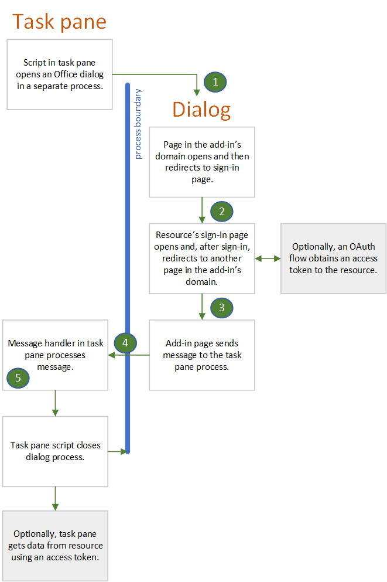

# Authenticate and authorize with the Office Dialog API

> [!NOTE]
> This article assumes that you are familiar with [Use the Dialog API in your Office Add-ins](dialog-api-in-office-add-ins.md).

Many identity authorities, also called Secure Token Services (STS), prevent their login page from opening in an iframe. These include Google, Facebook, and services protected by Microsoft Identity Platform (formerly Azure AD V 2.0) such as Microsoft Account and Office 365 (Work or School accounts). This creates a problem for Office Add-ins because when the add-in is running in **Office on the web**, the task pane is an iframe. Users of an add-in can only login to one of these services if the add-in can open an entirely separate browser instance. This is why Office provides its [Dialog API](dialog-api-in-office-add-ins.md), specifically the [displayDialogAsync](/javascript/api/office/office.ui) method.

The dialog box that is opened with this API has the following characteristics:

- It is [non-modal](https://en.wikipedia.org/wiki/Dialog_box).
- It is a completely separate browser instance from the task pane, meaning:
  - It has its own JavaScript runtime environment and window object and global variables.
  - There is no shared execution environment with the task pane.
  - It does not share the same session storage as the task pane.
- The first page opened in the dialog box must be hosted in the same domain as the task pane, including protocol, subdomains, and port, if any.
- The dialog box can send information back to the task pane by using the [messageParent](/javascript/api/office/office.ui#messageparent-message-) method, but this method can be called only from a page that is hosted in the same domain as the task pane, including protocol, subdomains, and port.

When the dialog is not an iframe (which is the default), it can open the login page of an identity provider. As you'll see below, the characteristics of the Dialog have implications for how you use authentication or authorization libraries such as MSAL and Passport.

> [!NOTE]
> There is a way to configure the dialog to open in a floating iframe: you simply pass the `displayInIframe: true` option in the call to `displayDialogAsync`. Do *not* do this when you are using the Dialog API for login.

## Authentication flow with the Dialog

The following is a simple and typical authentication flow. Details are after the diagram.

1. The first page that opens in the dialog box is a page (or other resource) that is hosted in the add-in's domain; that is, the same domain as the task pane window. This page can have a simple UI that says "Please wait, we are redirecting you to the page where you can sign in to *NAME-OF-PROVIDER*." The code in this page constructs the URL of the identity provider's sign-in page with information that is either passed to the dialog box as described in [Pass information to the dialog box](dialog-api-in-office-add-ins.md#pass-information-to-the-dialog-box) or is hardcoded into a configuration file of the add-in, such as a web.config file.
2. The dialog window then redirects to the sign-in page. The URL includes a query parameter that tells the identity provider to redirect the dialog window to a specific page after the user signs in. In this article, we'll call this page **redirectPage.html**. *This must be a page in the same domain as the host window*, so that the results of the sign-in attempt can be passed to the task pane with a call of `messageParent`.
3. The identity provider's service processes the incoming GET request from the dialog window. If the user is already signed in, it immediately redirects the window to **redirectPage.html** and includes user data as a query parameter. If the user is not already signed in, the provider's sign-in page appears in the window, and the user signs in. For most providers, if the user cannot sign in successfully, the provider shows an error page in the dialog window and does not redirect to **redirectPage.html**. The user must close the window by selecting the **X** in the corner. If the user successfully signs in, the dialog window is redirected to **redirectPage.html** and user data is included as a query parameter.
4. When the **redirectPage.html** page opens, it calls `messageParent` to report the success or failure to the task pane page and optionally also report user data or error data. Other possible messages include passing an access token or telling the task pane that the token is in storage.
5. The `DialogMessageReceived` event fires in the task pane page and its handler closes the dialog window and may further process of the message.

#### Support multiple identity providers

If your add-in gives the user a choice of providers, such as Microsoft Account, Google, or Facebook, you need a local first page (see preceding section) that provides a UI for the user to select a provider. Selection triggers the construction of the sign-in URL and redirection to it.

#### Authorization of the add-in to an external resource

In the modern web, users and web applications are security principals. The application has its own identity and permissions to an online resource such as Office 365, Google Plus, Facebook, or LinkedIn. The application is registered with the resource provider before it is deployed. The registration includes:

- A list of the permissions that the application needs.
- A URL to which the resource service should return an access token when the application accesses the service.  

When a user invokes a function in the application that accesses the user's data in the resource service, they are prompted to sign in to the service and then prompted to grant the application the permissions it needs to the user's resources. The service then redirects the sign-in window to the previously registered URL and passes the access token. The application uses the access token to access the user's resources.

You can use the Dialog API to manage this process by using a flow that is similar to the one described for users to sign in. The only differences are:

- If the user hasn't previously granted the application the permissions it needs, the user is prompted to do so in the dialog box after signing in.
- The dialog window sends the access token to the host window either by using `messageParent` to send the stringified access token or by storing the access token where the host window can retrieve it (and using `messageParent` to tell the host window that the token is available). The token has a time limit, but while it lasts, the host window can use it to directly access the user's resources without any further prompting.

Some authentication sample add-ins that use the Dialog API for this purpose are listed in [Samples](#samples).

## Using authentication libraries with the dialog

The fact that the Office Dialog and the task pane run in different browser, and JavaScript runtime, instances means that you must use many authentication/authorization libraries in the way that is different from how they are used when authentication and authorization can take place in the same window. The following sections describe the main ways that you usually cannot use these libraries and the way that you *can* use them.

### You usually cannot use the library's internal cache to store tokens

Typically, auth-related libraries provide an in-memory cache to store the access token. If subsequent calls to the resource provider (such as Google, Microsoft Graph, Facebook, etc.) are made, the library will first check to see if the token in its cache is expired. If it is unexpired, the library returns the cached token rather than making another round-trip to the STS for a new token. But this pattern is not usable in Office add-ins. Since the login occurs in the Office Dialog's browser instance, the token cache is in that instance.

Closely related to this is the fact that a library will typically provide both interactive and "silent" methods for getting a token. When you can do both the authentication and the data calls to the resource in the same browser instance, your code calls the silent method to obtain a token just before your code adds the token to the data call. The silent method checks for an unexpired token in the cache and returns it, if there is one. Otherwise, the silent method calls the interactive method which redirects to the STS's login. After login completes, the interactive method returns the token, but also caches it in memory. But when the Office Dialog API is being used, the data calls to the resource, which would call the silent method, are in the task pane's browser instance. The library's token cache does not exist in that instance.

As an alternative, your add-in's Dialog browser instance can directly call the library's interactive method. When that method returns a token, your code must explicitly store the token someplace where the task pane's browser instance can retrieve it, such as Local Storage\* or a server-side database. Another option is to pass the token to the task pane with the `messageParent` method. This alternative is only possible if the interactive method stores the access token in a place where your code can read it. Sometimes a library's interactive method is designed to store the token in a private property of an object that is inaccessible to your code.

> [!NOTE]
> \* There is a bug that will effect your strategy for token handling. If the add-in is running in **Office on the web** in either the Safari or Edge browser, the dialog and task pane do not share the same Local Storage, so it cannot be used to communicate between them.

### You usually cannot use the library's "auth context" object

Often, an auth-related library has a method that both obtains a token interactively and also creates an "auth-context" object which the method returns. The token is a property of the object (possibly private and inaccessible directly from your code). That object has the methods that get data from the resource. These methods include the token in the HTTP Requests that they make to the resource provider (such as Google, Microsoft Graph, Facebook, etc.).

These auth-context objects, and the methods that create them, are not usable in Office add-ins. Since the login occurs in the Office Dialog's browser instance, the object would have to be created there. But the data calls to the resource are in the task pane browser instance and there is no way to get the object from one instance to another. For example, you cannot pass the object with `messageParent` because `messageParent` can only pass strings or boolean values. A JavaScript object with methods cannot be reliably stringified.

### How you can use libraries with the Office Dialog API

In addition to, or instead of, monolithic "auth context" objects, most libraries provide APIs at a lower level of abstraction that enable your code to create less monolithic helper objects. For example, [MSAL.NET](https://github.com/AzureAD/microsoft-authentication-library-for-dotnet/wiki#conceptual-documentation) v. 3.x.x has an API to construct a login URL, and another API that constructs an AuthResult object that contains an access token in a property that is accessible to your code. For examples of MSAL.NET in an Office add-in see: [Office Add-in Microsoft Graph ASP.NET](https://github.com/OfficeDev/PnP-OfficeAddins/tree/master/Samples/auth/Office-Add-in-Microsoft-Graph-ASPNET) and [Outlook Add-in Microsoft Graph ASP.NET](https://github.com/OfficeDev/PnP-OfficeAddins/tree/master/Samples/auth/Outlook-Add-in-Microsoft-Graph-ASPNET). For an example of using [msal.js](https://github.com/AzureAD/microsoft-authentication-library-for-js) in an add-in, see [Office Add-in Microsoft Graph React](https://github.com/OfficeDev/PnP-OfficeAddins/tree/master/Samples/auth/Office-Add-in-Microsoft-Graph-React).

For more information about authentication and authorization libraries, see [Microsoft Graph: Recommended libraries](authorize-to-microsoft-graph-without-sso.md#recommended-libraries-and-samples) and [Other external services: Libraries](auth-external-add-ins.md#libraries).

## Samples

- [Office Add-in Microsoft Graph ASP.NET](https://github.com/OfficeDev/PnP-OfficeAddins/tree/master/Samples/auth/Office-Add-in-Microsoft-Graph-ASPNET): An ASP.NET based add-in (Excel, Word, or PowerPoint) that uses the MSAL.NET library and the Authorization Code Flow to log in and get an access token for Microsoft Graph data.
- [Outlook Add-in Microsoft Graph ASP.NET](https://github.com/OfficeDev/PnP-OfficeAddins/tree/master/Samples/auth/Outlook-Add-in-Microsoft-Graph-ASPNET): Just like the one above, but the Office application is Outlook.
- [Office Add-in Microsoft Graph React](https://github.com/OfficeDev/PnP-OfficeAddins/tree/master/Samples/auth/Office-Add-in-Microsoft-Graph-React): A NodeJS based add-in (Excel, Word, or PowerPoint) that uses the msal.js library and the Implicit Flow to log in and get an access token for Microsoft Graph data.

For more information, see:
- [Authorize external services in your Office Add-in](auth-external-add-ins.md)
- [Use the Dialog API in your Office Add-ins](dialog-api-in-office-add-ins.md)
