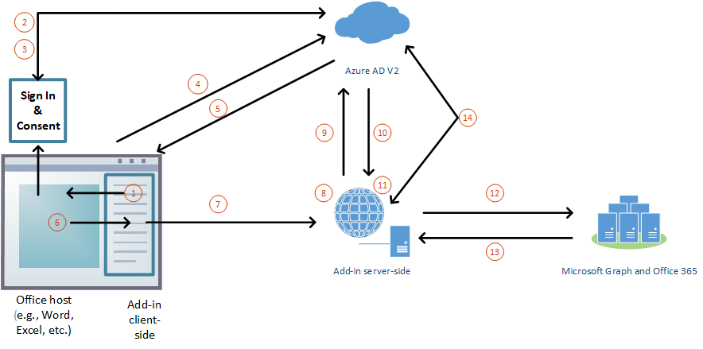

# Authorize to Microsoft Graph in your Office Add-in (preview)

Users sign in to Office (online, mobile, and desktop platforms) using either their personal Microsoft account or their work or school (Office 365) account. The best way for an Office Add-in to get authorized access to [Microsoft Graph](https://developer.microsoft.com/graph/docs) is to use the credentials from the user's Office sign on. This enables them to access their Microsoft Graph data without needing to sign in a second time. 

> [!NOTE]
> The Single Sign-on API is currently supported in preview for Word, Excel, Outlook, and PowerPoint. For more information about where the Single Sign-on API is currently supported, see [IdentityAPI requirement sets](https://docs.microsoft.com/office/dev/add-ins/reference/requirement-sets/identity-api-requirement-sets).
> If you are working with an Outlook add-in, be sure to enable Modern Authentication for the Office 365 tenancy. For information about how to do this, see [Exchange Online: How to enable your tenant for modern authentication](https://social.technet.microsoft.com/wiki/contents/articles/32711.exchange-online-how-to-enable-your-tenant-for-modern-authentication.aspx).

## Add-in architecture for SSO and Microsoft Graph

In addition to hosting the pages and JavaScript of the web application, the add-in must also host, at the same [fully qualified domain name](https://docs.microsoft.com/windows/desktop/DNS/f-gly#_dns_fully_qualified_domain_name_fqdn__gly), one or more web APIs that will get an access token to Microsoft Graph and make requests to it.

The add-in manifest contains markup that specifies how the add-in is registered in the Azure Active Directory (Azure AD) v2.0 endpoint, and it specifies any permissions to Microsoft Graph that the add-in needs.

### How it works at runtime

The following diagram shows how the process of signing in and getting access to Microsoft Graph works.

1. In the add-in, JavaScript calls a new Office.js API [getAccessTokenAsync](https://docs.microsoft.com/office/dev/add-ins/develop/sso-in-office-add-ins#sso-api-reference). This tells the Office host application to obtain an access token to the add-in. (Hereafter, this is called the **bootstrap access token** because it is replaced with a second token later in the process. For an example of a decoded bootstrap access token, see [Example access token](sso-in-office-add-ins.md#example-access-token).)
1. If the user is not signed in, the Office host application opens a pop-up window for the user to sign in.
1. If this is the first time the current user has used your add-in, he or she is prompted to consent.
1. The Office host application requests the **bootstrap access token** from the Azure AD v2.0 endpoint for the current user.
1. Azure AD sends the bootstrap token to the Office host application.
1. The Office host application sends the **bootstrap access token** to the add-in as part of the result object returned by the `getAccessTokenAsync` call.
1. JavaScript in the add-in makes an HTTP request to a web API that is hosted at the same fully-qualified domain as the add-in, and it includes the **bootstrap access token** as authorization proof.  
1. Server-side code validates the incoming **bootstrap access token**.
1. Server-side code uses the “on behalf of” flow (defined at [OAuth2 Token Exchange](https://tools.ietf.org/html/draft-ietf-oauth-token-exchange-02) and the [daemon or server application to web API Azure scenario](https://docs.microsoft.com/azure/active-directory/develop/active-directory-authentication-scenarios)) to obtain an access token for Microsoft Graph in exchange for the bootstrap access token.
1. Azure AD returns the access token to Microsoft Graph (and a refresh token, if the add-in requests *offline_access* permission) to the add-in.
1. Server-side code caches the access token to Microsoft Graph.
1. Server-side code makes requests to Microsoft Graph and includes the access token to Microsoft Graph.
1. Microsoft Graph returns data to the add-in, which can pass it on to the add-in’s UI.
1. When the access token to Microsoft Graph expires, the server-side code can use its refresh token to get a new access token to Microsoft Graph.

## Develop an SSO add-in that accesses Microsoft Graph

You develop an add-in that accesses Microsoft Graph just as you would any other add-in that uses SSO. For a thorough description, see [Enable single sign-on for Office Add-ins](https://docs.microsoft.com/office/dev/add-ins/develop/sso-in-office-add-ins). The difference is that it is mandatory that the add-in have a server-side Web API, and what's called the access token in that article is called the "bootstrap access token." 

Depending on your language and framework, libraries might be available that will simplify the server-side code you have to write. Your code should do the following:

* Validate the add-in bootstrap access token that is received from the token handler you created earlier. For more information, see [Validate the access token](sso-in-office-add-ins.md#validate-the-access-token). 
* Initiate the “on behalf of” flow with a call to the Azure AD v2.0 endpoint that includes the bootstrap access token, some metadata about the user, and the credentials of the add-in (its ID and secret).
* Cache the returned access token to Microsoft Graph. For more information about this flow see [Azure Active Directory v2.0 and OAuth 2.0 On-Behalf-Of flow](https://docs.microsoft.com/azure/active-directory/develop/active-directory-v2-protocols-oauth-on-behalf-of).
* Create one or more Web API methods that get Microsoft Graph data by passing the cached access token to Microsoft Graph.

> [!NOTE]
> For examples of decoded access tokens for Microsoft Graph that have been obtained by the "on-behalf-of" flow, see [Azure Active Directory v2.0 and OAuth 2.0 On-Behalf-Of flow](https://docs.microsoft.com/azure/active-directory/develop/active-directory-v2-protocols-oauth-on-behalf-of).

For examples of detailed walkthroughs and scenarios, see:

* [Create a Node.js Office Add-in that uses single sign-on](create-sso-office-add-ins-nodejs.md)
* [Create an ASP.NET Office Add-in that uses single sign-on](create-sso-office-add-ins-aspnet.md)
* [Scenario: Implement single sign-on to your service in an Outlook add-in](https://docs.microsoft.com/outlook/add-ins/implement-sso-in-outlook-add-in)

