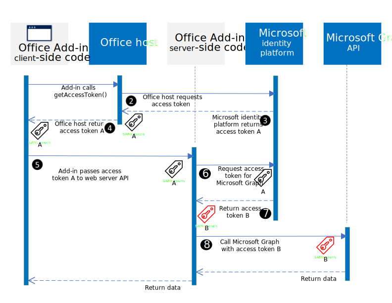

# Authorize to Microsoft Graph with SSO

Users sign in to Office (online, mobile, and desktop platforms) using either their personal Microsoft account or their Microsoft 365 Education or work account. The best way for an Office Add-in to get authorized access to [Microsoft Graph](https://developer.microsoft.com/graph/docs) is to use the credentials from the user's Office sign on. This enables them to access their Microsoft Graph data without needing to sign in a second time.

> [!NOTE]
> The Single Sign-on API is currently supported for Word, Excel, Outlook, and PowerPoint. For more information about where the Single Sign-on API is currently supported, see [IdentityAPI requirement sets](../reference/requirement-sets/identity-api-requirement-sets.md).
> If you are working with an Outlook add-in, be sure to enable Modern Authentication for the Microsoft 365 tenancy. For information about how to do this, see [Exchange Online: How to enable your tenant for modern authentication](https://social.technet.microsoft.com/wiki/contents/articles/32711.exchange-online-how-to-enable-your-tenant-for-modern-authentication.aspx).

## Add-in architecture for SSO and Microsoft Graph

In addition to hosting the pages and JavaScript of the web application, the add-in must also host, at the same [fully qualified domain name](/windows/desktop/DNS/f-gly#_dns_fully_qualified_domain_name_fqdn__gly), one or more web APIs that will get an access token to Microsoft Graph and make requests to it.

The add-in manifest contains markup that specifies how the add-in is registered in the Azure Active Directory (Azure AD) v2.0 endpoint, and it specifies any permissions to Microsoft Graph that the add-in needs.

### How it works at runtime

The following diagram shows the steps involved to sign in and access Microsoft Graph.

1. In the add-in, JavaScript calls a new Office.js API [getAccessToken](/javascript/api/office-runtime/officeruntime.auth#getAccessToken_options_). This tells the Office client application to obtain an access token to the add-in. For an example of a decoded access token, see [Example access token](sso-in-office-add-ins.md#example-access-token).
2. If the user is not signed in, the Office client application opens a pop-up window for the user to sign in.
3. If this is the first time the current user has used your add-in, they are prompted to consent.
4. The Office client application requests the access token from the Microsoft identity platform for the current user.
5. Microsoft identity platform sends the access token to the Office client application.
6. The Office client application sends the access token to the add-in as part of the result object returned by the `getAccessToken` call.
7. JavaScript in the add-in makes an HTTP request to a web API that is hosted at the same fully-qualified domain as the add-in, and it includes the access token as authorization proof.
8. Server-side code validates the incoming access token.
9. Server-side code uses the OAuth 2.0 On-Behalf-Of flow (OBO) to request a new access token with permissions to Microsoft Graph in exchange for the original access token.
10. Microsoft identity platform returns the new access token with permissions to Microsoft Graph (and a refresh token, if the add-in requests *offline_access* permission) to the add-in.
11. Server-side code caches the access token with permissions to Microsoft Graph.
12. Server-side code makes requests to Microsoft Graph and includes the new access token with permissions to Microsoft Graph.
13. Microsoft Graph returns data to the add-in, which can be returned to the add-in client-side.
14. When the access token with permissions to Microsoft Graph expires, the server-side code can use its refresh token to get a new access token for Microsoft Graph.

## Develop an SSO add-in that accesses Microsoft Graph

You develop an add-in that accesses Microsoft Graph just as you would any other add-in that uses SSO. For a thorough description, see [Enable single sign-on for Office Add-ins](../develop/sso-in-office-add-ins.md). The difference is that it is mandatory that the add-in have a server-side Web API.

Depending on your language and framework, libraries might be available that will simplify the server-side code you have to write. Your code should do the following:

* Validate the access token that is received from the client-side code. For more information, see [Validate the access token](sso-in-office-add-ins.md#pass-the-access-token-to-server-side-code).
* Initiate the OAuth 2.0 On-Behalf-Of flow (OBO) with a call to the Microsoft identity platform that includes the access token, some metadata about the user, and the credentials of the add-in (its ID and secret). For more information about the OBO flow, see [Microsoft identity platform and OAuth 2.0 On-Behalf-Of flow](/azure/active-directory/develop/v2-oauth2-on-behalf-of-flow).
* Optionally, after the flow completes, cache the returned access token with permissions to Microsoft Graph. You'll want to do this if the add-in makes more than one call to Microsoft Graph. For more information, see [Acquire and cache tokens using the Microsoft Authentication Library (MSAL)](/azure/active-directory/develop/msal-acquire-cache-tokens)
* Create one or more Web API methods that get Microsoft Graph data by passing the (possibly cached) new access token to Microsoft Graph.

> [!NOTE]
> For examples of decoded access tokens for Microsoft Graph that have been obtained by the "on-behalf-of" flow, see [Microsoft identity platform and OAuth 2.0 On-Behalf-Of flow](/azure/active-directory/develop/v2-oauth2-on-behalf-of-flow).

For examples of detailed walkthroughs and scenarios, see:

* [Create a Node.js Office Add-in that uses single sign-on](create-sso-office-add-ins-nodejs.md)
* [Create an ASP.NET Office Add-in that uses single sign-on](create-sso-office-add-ins-aspnet.md)
* [Scenario: Implement single sign-on to your service in an Outlook add-in](../outlook/implement-sso-in-outlook-add-in.md)

## Distributing SSO-enabled add-ins in Microsoft AppSource

When a Microsoft 365 admin acquires an add-in from [AppSource](https://appsource.microsoft.com), the admin can redistribute it through [Integrated Apps](/microsoft-365/admin/manage/test-and-deploy-microsoft-365-apps) and grant admin consent to the add-in to access Microsoft Graph scopes. It's also possible, however, for the end user to acquire the add-in directly from AppSource, in which case the user must grant consent to the add-in. This can create a potential performance problem for which we've provided a solution.

If your code passes the `allowConsentPrompt` option in the call of `getAccessToken`, like `OfficeRuntime.auth.getAccessToken( { allowConsentPrompt: true } );`, then Office can prompt the user for consent if the Microsoft identity platform reports to Office that consent has not yet been granted to the add-in. However, for security reasons, Office can only prompt the user to consent to the Microsoft Graph `profile` scope. *Office cannot prompt for consent to other Microsoft Graph scopes*, not even `User.Read`. This means that if the user grants consent on the prompt, Office returns an access token. But the attempt to exchange the access token for a new access token with additional Microsoft Graph scopes fails with error AADSTS65001, which means consent (to Microsoft Graph scopes) has not been granted.

> [!NOTE]
> The request for consent with `{ allowConsentPrompt: true }` could still fail even for the `profile` scope if the administrator has turned off end-user consent. For more information, see [Configure how end-users consent to applications using Azure Active Directory](/azure/active-directory/manage-apps/configure-user-consent).

Your code can, and should, handle this error by falling back to an alternate system of authentication, which prompts the user for consent to Microsoft Graph scopes. For code examples, see [Create a Node.js Office Add-in that uses single sign-on](create-sso-office-add-ins-nodejs.md) and [Create an ASP.NET Office Add-in that uses single sign-on](create-sso-office-add-ins-aspnet.md) and the samples they link to. The entire process requires multiple round trips to the Microsoft identity platform. To avoid this performance penalty, include the `forMSGraphAccess` option in the call of `getAccessToken`; for example, `OfficeRuntime.auth.getAccessToken( { forMSGraphAccess: true } )`. This signals to Office that your add-in needs Microsoft Graph scopes. Office will ask the Microsoft identity platform to verify that consent to Microsoft Graph scopes has already been granted to the add-in. If it has, the access token is returned. If it hasn't, then the call of `getAccessToken` returns error 13012. Your code can handle this error by falling back to an alternate system of authentication immediately, without making a doomed attempt to exchange tokens with the Microsoft identity platform.

As a best practice, always pass `forMSGraphAccess` to `getAccessToken` when your add-in will be distributed in AppSource and needs Microsoft Graph scopes.

> [!TIP]
> If you develop an Outlook add-in that uses SSO and you sideload it for testing, Office will *always* return error 13012 when `forMSGraphAccess` is passed to `getAccessToken` even if administrator consent has been granted. For this reason, you should comment out the `forMSGraphAccess` option **when developing** an Outlook add-in. Be sure to uncomment the option when you deploy for production. The bogus 13012 only happens when you are sideloading in Outlook.

## See also

- [OAuth2 Token Exchange](https://tools.ietf.org/html/draft-ietf-oauth-token-exchange-02)
- [Microsoft identity platform and OAuth 2.0 On-Behalf-Of flow](/azure/active-directory/develop/v2-oauth2-on-behalf-of-flow)