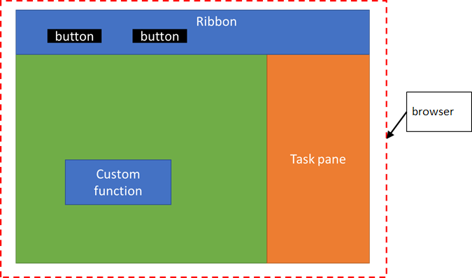

---
title: Configure your Office Add-in to use a shared runtime
description: Configure your Office Add-in to use a shared runtime to support additional ribbon, task pane, and custom function features.
ms.topic: how-to
ms.date: 11/06/2025
ms.localizationpriority: high
---

# Configure your Office Add-in to use a shared runtime

[!include[Shared runtime requirements](../includes/shared-runtime-requirements-note.md)]

You can configure your Office Add-in to run all of its code in a single [shared runtime](../testing/runtimes.md#shared-runtime). With a shared runtime, you'll have better coordination across your add-in and access to the DOM and CORS from all parts of your add-in. You'll also have access to additional features, such as running code when the document opens or activating ribbon buttons in certain contexts. To configure your add-in to use a shared runtime, follow the instructions in this article.

## Create the add-in project

If you're starting a new project, use the [Yeoman generator for Office Add-ins](yeoman-generator-overview.md) to create an Excel, PowerPoint, or Word add-in project.

> [!TIP]
> If you're using the Yeoman generator to create custom functions in Excel, select the following options:
>
> - **Project type**: `Excel Custom Functions using a Shared Runtime`
> - **Script type**: `JavaScript`

If your add-in uses an add-in only manifest, you can also use the steps in this article to update a Visual Studio project to use the shared runtime. However, you may need to update the XML schemas for the manifest. For more information, see [Troubleshoot development errors with Office Add-ins](../testing/troubleshoot-development-errors.md#add-in-only-manifest-schema-validation-errors-in-visual-studio-projects).

## Configure the manifest

Follow these steps to configure a new or existing project to use a shared runtime. These steps assume you have generated your project using the [Yeoman generator for Office Add-ins](yeoman-generator-overview.md). Select the tab for the type of manifest your add-in is using.

# [Unified manifest for Microsoft 365](#tab/jsonmanifest)

> [!NOTE]
> Implementing a shared runtime with the unified manifest for Microsoft 365 is in public developer preview. This shouldn't be used in production add-ins. We invite you to try it out in test or development environments. For more information, see the [Microsoft 365 app manifest schema reference](/microsoft-365/extensibility/schema).

1. Open your add-in project in Visual Studio Code.
1. Open the **manifest.json** file.
1. Add the following object to the [`"extensions.runtimes"`](/microsoft-365/extensibility/schema/extension-runtimes-array?view=m365-app-prev&preserve-view=true) array. Note the following about this markup.
    - The [SharedRuntime 1.1 requirement set](/javascript/api/requirement-sets/common/shared-runtime-requirement-sets#sharedruntime-api-11) is specified in the [`"requirements.capabilities"`](/microsoft-365/extensibility/schema/requirements-extension-element-capabilities) object. This configures your add-in to run in a shared runtime on supported clients. For a list of clients that support the SharedRuntime 1.1 requirement set, see [Shared runtime requirement sets](/javascript/api/requirement-sets/common/shared-runtime-requirement-sets).
    - The `"id"` of the runtime is set to the descriptive name `"SharedRuntime"`.
    - The `"lifetime"` property is set to `"long"`, so that your add-in can take advantage of features, such as starting your add-in when the document opens, continuing to run code after the task pane is closed, or using CORS and DOM from custom functions. If you set the property to `"short"` in this example, your add-in will start when one of your ribbon buttons is pressed, but it may shut down after your ribbon handler is done running. Similarly, your add-in will start when the task pane is opened, but it may shut down when the task pane is closed.

    ```json
    "runtimes": [
        "requirements": {
            "capabilities": [
                {
                    "name": "SharedRuntime",
                    "minVersion": "1.1"
                }
            ]
        },
        "id": "SharedRuntime",
        "type": "general",
        "code": {
            "page": "https://localhost:3000/taskpane.html"
        },
        "lifetime": "long",
        "actions": [
            ...
        ]
    ]
    ```

1. Save your changes.

# [Add-in only manifest](#tab/xmlmanifest)

1. Open your add-in project in Visual Studio Code.
1. Open the **manifest.xml** file.
1. Update the requirements section to include the [shared runtime](/javascript/api/requirement-sets/common/shared-runtime-requirement-sets) as follows.

    ```xml
    <Hosts>
      <Host ...>
    </Hosts>
    <Requirements>
      <Sets DefaultMinVersion="1.1">
        <Set Name="SharedRuntime" MinVersion="1.1"/>
      </Sets>
    </Requirements>
    ```

1. Find the `<VersionOverrides>` section and add the following `<Runtimes>` section. Note the following about this markup.
    - The lifetime needs to be **long** so that your add-in can take advantage of features, such as starting your add-in when the document opens, continuing to run code after the task pane is closed, or using CORS and DOM from custom functions. If you set the lifetime to **short** in this example, your add-in will start when one of your ribbon buttons is pressed, but it may shut down after your ribbon handler is done running. Similarly, your add-in will start when the task pane is opened, but it may shut down when the task pane is closed.
    - The `resid` value is **Taskpane.Url**, which references the **taskpane.html** file location specified in the `<bt:Urls>` section near the bottom of the **manifest.xml** file.

        > [!IMPORTANT]
        > The shared runtime won't load if the `resid` uses different values in the manifest. If you change the value to something other than **Taskpane.Url**, be sure to also change the value in all locations shown in the following steps in this article.

    - The `<Runtimes>` section must be entered after the `<Host>` element in the exact order shown in the following XML.

    ```xml
    <VersionOverrides ...>
      <Hosts>
        <Host ...>
          <Runtimes>
            <Runtime resid="Taskpane.Url" lifetime="long" />
          </Runtimes>
        ...
        </Host>
    ```

1. If you generated an Excel add-in with custom functions, find the `<Page>` element. Then change the source location from **Functions.Page.Url** to **Taskpane.Url**.

   ```xml
   <AllFormFactors>
   ...
   <Page>
     <SourceLocation resid="Taskpane.Url"/>
   </Page>
   ...
   ```

1. Find the `<FunctionFile>` tag and change the `resid` from **Commands.Url** to  **Taskpane.Url**. Note that if you don't have action commands, you won't have a `<FunctionFile>` entry, and can skip this step.

    ```xml
    </GetStarted>
    ...
    <FunctionFile resid="Taskpane.Url"/>
    ...
    ```

1. Save your changes.

---

## Configure the webpack.config.js file

The **webpack.config.js** will build multiple runtime loaders. You need to modify it to load only the shared runtime via the **taskpane.html** file.

1. Start Visual Studio Code and open the add-in project you generated.
1. Open the **webpack.config.js** file.
1. If your **webpack.config.js** file has the following **functions.html** plugin code, remove it.

    ```javascript
    new HtmlWebpackPlugin({
        filename: "functions.html",
        template: "./src/functions/functions.html",
        chunks: ["polyfill", "functions"]
      })
    ```

1. If your **webpack.config.js** file has the following **commands.html** plugin code, remove it.

    ```javascript
    new HtmlWebpackPlugin({
        filename: "commands.html",
        template: "./src/commands/commands.html",
        chunks: ["polyfill", "commands"]
      })
    ```

1. If your project used either the **functions** or **commands** chunks, add them to the chunks list as shown next (the following code is for if your project used both chunks).

    ```javascript
      new HtmlWebpackPlugin({
        filename: "taskpane.html",
        template: "./src/taskpane/taskpane.html",
        chunks: ["polyfill", "taskpane", "commands", "functions"]
      })
    ```

1. Save your changes and rebuild the project.

   ```command line
   npm run build
   ```

> [!NOTE]
> If your project has a **functions.html** file or **commands.html** file, they can be removed. The **taskpane.html** will load the **functions.js** and **commands.js** code into the shared runtime via the webpack updates you just made.

## Test your Office Add-in changes

Confirm that you're using the shared runtime correctly by using the following instructions.

1. Open the **taskpane.js** file.
1. Replace the entire contents of the file with the following code. This will display a count of how many times the task pane has been opened. Adding the `onVisibilityModeChanged` event is only supported in a shared runtime.

    ```javascript
    /*global document, Office*/

    let _count = 0;

    Office.onReady(() => {
      document.getElementById("sideload-msg").style.display = "none";
      document.getElementById("app-body").style.display = "flex";

      updateCount(); // Update count on first open.
      Office.addin.onVisibilityModeChanged((args) => {
        if (args.visibilityMode === Office.VisibilityMode.taskpane) {
          updateCount(); // Update count on subsequent opens.
        }
      });
    });

    function updateCount() {
      _count++;
      document.getElementById("run").textContent = "Task pane opened " + _count + " times.";
    }
    ```

1. Save your changes and run the project.

   ```command&nbsp;line
   npm start
   ```

Each time you open the task pane, the count of how many times it has been opened will be incremented. The value of **_count** won't be lost because the shared runtime keeps your code running even when the task pane is closed.

When you're ready to stop the dev server and uninstall the add-in, run the following command.

```command&nbsp;line
npm stop
```

## About the shared runtime

On Windows or on Mac, your add-in will run code for ribbon buttons, custom functions, and the task pane in separate runtime environments. This creates limitations, such as not being able to easily share global data, and not being able to access all CORS functionality from a custom function.

However, you can configure your Office Add-in to share code in the same runtime (also referred to as a shared runtime). This enables better coordination across your add-in and access to the task pane DOM and CORS from all parts of your add-in.

Configuring a shared runtime enables the following scenarios.

- Your Office Add-in can use additional UI features.
  - [Change the availability of add-in commands](../design/disable-add-in-commands.md)
  - [Run code in your Office Add-in when the document opens](run-code-on-document-open.md)
  - [Show or hide the task pane of your Office Add-in](show-hide-add-in.md)
  - [Add custom keyboard shortcuts to your Office Add-ins](../design/keyboard-shortcuts.md) (supported in Excel and Word add-ins only)
- The following are available for Excel add-ins only.
  - [Create custom contextual tabs in Office Add-ins](../design/contextual-tabs.md)
  - Custom functions will have full CORS support.
  - Custom functions can call Office.js APIs to read spreadsheet document data.

Additionally, any buttons that your add-in displays on the ribbon will run in the same shared runtime. The following image shows how custom functions, the ribbon UI, and the task pane code will all run in the same runtime.



### Multiple task panes

Don't design your add-in to use multiple task panes if you are planning to use a shared runtime. A shared runtime only supports the use of one task pane. Note that any task pane without a `<TaskpaneID>` is considered a different task pane.

## See also

- [Call Excel APIs from a custom function](../excel/call-excel-apis-from-custom-function.md)
- [Add custom keyboard shortcuts to your Office Add-ins](../design/keyboard-shortcuts.md)
- [Create custom contextual tabs in Office Add-ins](../design/contextual-tabs.md)
- [Change the availability of add-in commands](../design/disable-add-in-commands.md)
- [Run code in your Office Add-in when the document opens](run-code-on-document-open.md)
- [Show or hide the task pane of your Office Add-in](show-hide-add-in.md)
- [Tutorial: Share data and events between Excel custom functions and the task pane](../tutorials/share-data-and-events-between-custom-functions-and-the-task-pane-tutorial.md)
- [Runtimes in Office Add-ins](../testing/runtimes.md)
