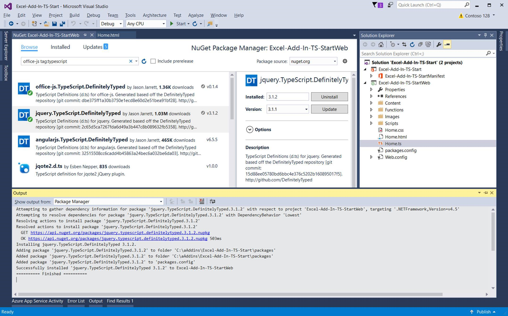

# Convert an Office Add-in task pane template in Visual Studio to TypeScript

You can use the Office Add-in JavaScript template in Visual Studio to create an add-in that uses TypeScript. After you create the new add-in in Visual Studio, you can convert the project to TypeScript. That way, you don't have to start the Office Add-in TypeScript project from scratch.  

> [!NOTE]
> To create an Office Add-in TypeScript project without using Visual Studio, follow the instructions in the "Any editor" section of any [5-minute quickstart](../index.yml) and choose `TypeScript` when prompted by the [Yeoman generator for Office Add-ins](https://github.com/OfficeDev/generator-office).

In your TypeScript project, you can have a mix of TypeScript and JavaScript files and your project will compile. This is because TypeScript is a typed superset of JavaScript that compiles JavaScript. 

This article shows you how to convert an Excel add-in task pane template in Visual Studio from JavaScript to TypeScript. You can use the same steps to convert other Office Add-in JavaScript templates to TypeScript.

To view or download the code sample that this article is based on, see [Excel-Add-In-TS-Start](https://github.com/OfficeDev/Excel-Add-In-TS-Start) on GitHub.

## Prerequisites

- [Visual Studio 2017](https://www.visualstudio.com/vs/) with the **Office/SharePoint development** workload installed

    > [!NOTE]
    > If you've previously installed Visual Studio 2017, [use the Visual Studio Installer](https://docs.microsoft.com/en-us/visualstudio/install/modify-visual-studio) to ensure that the **Office/SharePoint development** workload is installed. 

- TypeScript 2.3 for Visual Studio 2017

    > [!NOTE]
    > TypeScript should be installed by default with Visual Studio 2017, but you can [use the Visual Studio Installer](https://docs.microsoft.com/en-us/visualstudio/install/modify-visual-studio) to confirm that it is installed. In the Visual Studio Installer, select the **Individaul components** tab and then verify that **TypeScript 2.3 SDK** is selected under **SDKs, libraries, and frameworks**.

- Excel 2016

## Create the add-in project

1. Open Visual Studio and on the Visual Studio menu bar, choose  **File** > **New** > **Project**.
    
2. In the list of project types under **Visual C#** or **Visual Basic**, expand  **Office/SharePoint**, choose **Add-ins**, and then choose **Excel Web Add-in** as the project type. 

3. Name the project, and then choose **OK**.

4. In the **Create Office Add-in** dialog window, choose **Add new functionalities to Excel**, and then choose **Finish** to create the project.

5. Visual Studio creates a solution and its two projects appear in **Solution Explorer**. The **Home.html** file opens in Visual Studio.
    
## Convert the add-in project to TypeScript

1. In **Solution Explorer**, rename the Home.js file to Home.ts.

2. Select **Yes** when prompted to confirm that you want to change file name extension.

3. In **Solution Explorer**, right-click on the project and select **Manage NuGet Packages**.

4. In the NuGet Package Manager, choose the **Browse** tab and type `office-js tag:typescript` into the search box.

5. Select **office.js.TypeScript.DefinitelyTyped** in the list of search results and choose the **Install** button. Follow the prompts to accept the changes and install the package.

6. Locate **jquery.TypeScript.DefinitelyTyped** in the list of search results and choose the **Install** button. Follow the prompts to accept the changes and install the package.

	

7. Open the Home.ts file and add the following declaration at the top of the file:

	```javascript
	declare var fabric: any;
	```

8. In the Home.ts file, change **'1.1'** to **1.1** (that is, remove the quotation marks) in the following line:

	```javascript
	if (!Office.context.requirements.isSetSupported('ExcelApi', '1.1')) {
	```

## Run the converted add-in project

1. In Visual Studio, press F5 or choose the **Start** button to launch Excel with the **Show Taskpane** add-in button displayed in the ribbon. The add-in will be hosted locally on IIS.

2. In Excel, choose the **Home** tab, and then choose the **Show Taskpane** button in the ribbon to open the add-in task pane.

3. In the worksheet, select the nine cells that contain numbers.

4. Press the **Highlight** button on the task pane to highlight the cell in the selected range that contains the highest value.

## Home.ts code file

For your reference, the following is the code included in the Home.ts file. This file includes the minimum number of changes needed in order for your add-in to run.

> [!NOTE]
> For a complete example of a JavaScript file that has been converted to TypeScript, see [Excel-Add-In-TS-StartWeb/Home.ts](https://github.com/OfficeDev/Excel-Add-In-TS-Start/blob/master/Excel-Add-In-TS-StartWeb/Home.ts). 

```javascript
declare var fabric: any;

(function () {
    "use strict";

    var cellToHighlight;
    var messageBanner;

    // The initialize function must be run each time a new page is loaded.
    Office.initialize = function (reason) {
        $(document).ready(function () {
            // Initialize the FabricUI notification mechanism and hide it
            var element = document.querySelector('.ms-MessageBanner');
            messageBanner = new fabric.MessageBanner(element);
            messageBanner.hideBanner();
            
            // If not using Excel 2016, use fallback logic.
            if (!Office.context.requirements.isSetSupported('ExcelApi', 1.1)) {
                $("#template-description").text("This sample will display the value of the cells you have selected in the spreadsheet.");
                $('#button-text').text("Display!");
                $('#button-desc').text("Display the selection");

                $('#highlight-button').click(
                    displaySelectedCells);
                return;
            }

            $("#template-description").text("This sample highlights the highest value from the cells you have selected in the spreadsheet.");
            $('#button-text').text("Highlight!");
            $('#button-desc').text("Highlights the largest number.");
                
            loadSampleData();

            // Add a click event handler for the highlight button.
            $('#highlight-button').click(
                hightlightHighestValue);
        });
    }

    function loadSampleData() {

        var values = [
                        [Math.floor(Math.random() * 1000), Math.floor(Math.random() * 1000), Math.floor(Math.random() * 1000)],
                        [Math.floor(Math.random() * 1000), Math.floor(Math.random() * 1000), Math.floor(Math.random() * 1000)],
                        [Math.floor(Math.random() * 1000), Math.floor(Math.random() * 1000), Math.floor(Math.random() * 1000)]
        ];

        // Run a batch operation against the Excel object model.
        Excel.run(function (ctx) {
            // Create a proxy object for the active sheet
            var sheet = ctx.workbook.worksheets.getActiveWorksheet();
            // Queue a command to write the sample data to the worksheet
            sheet.getRange("B3:D5").values = values;

            // Run the queued-up commands, and return a promise to indicate task completion
            return ctx.sync();
        })
        .catch(errorHandler);
    }

    function hightlightHighestValue() {

        // Run a batch operation against the Excel object model.
        Excel.run(function (ctx) {

            // Create a proxy object for the selected range and load its address and values properties.
            var sourceRange = ctx.workbook.getSelectedRange().load("values, address, rowIndex, columnIndex, rowCount, columnCount");

            // Run the queued-up command, and return a promise to indicate task completion
            return ctx.sync().
                .then(function () {
                    var highestRow = 0;
                    var highestCol = 0;
                    var highestValue = sourceRange.values[0][0];

                    // Find the cell to highlight
                    for (var i = 0; i < sourceRange.rowCount; i++) {
                        for (var j = 0; j < sourceRange.columnCount; j++) {
                            if (!isNaN(sourceRange.values[i][j]) && sourceRange.values[i][j] > highestValue) {
                                highestRow = i;
                                highestCol = j;
                                highestValue = sourceRange.values[i][j];
                            }
                        }
                    }

                    cellToHighlight = sourceRange.getCell(highestRow, highestCol);
                    sourceRange.worksheet.getUsedRange().format.fill.clear();
                    sourceRange.worksheet.getUsedRange().format.font.bold = false;

                    cellToHighlight.load("values");
                })
                   // Run the queued-up commands.
                .then(ctx.sync)
                .then(function () {
                    // Highlight the cell
                    cellToHighlight.format.fill.color = "orange";
                    cellToHighlight.format.font.bold = true;
                })
                .then(ctx.sync)
        })
        .catch(errorHandler);
    }

    function displaySelectedCells() {
        Office.context.document.getSelectedDataAsync(Office.CoercionType.Text,
            function (result) {
                if (result.status === Office.AsyncResultStatus.Succeeded) {
                    showNotification('The selected text is:', '"' + result.value + '"');
                } else {
                    showNotification('Error', result.error.message);
                }
            });
    }

    // Helper function for treating errors.
    function errorHandler(error) {
        // Always be sure to catch any accumulated errors that bubble up from the Excel.run execution
        showNotification("Error", error);
        console.log("Error: " + error);
        if (error instanceof OfficeExtension.Error) {
            console.log("Debug info: " + JSON.stringify(error.debugInfo));
        }
    }

    // Helper function for displaying notifications
    function showNotification(header, content) {
        $("#notificationHeader").text(header);
        $("#notificationBody").text(content);
        messageBanner.showBanner();
        messageBanner.toggleExpansion();
    }
})();
```


## See also

* [Promise implementation discussion on StackOverflow](https://stackoverflow.com/questions/44461312/office-addins-file-in-its-typescript-version-doesnt-work)
* [Office Add-in samples on GitHub](https://github.com/officedev)
