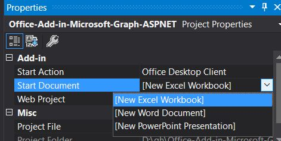

# Create an ASP.NET Office Add-in that uses single sign-on (preview)

When users are signed in to Office, your add-in can use the same credentials to permit users to access multiple applications without requiring them to sign in a second time. For an overview, see [Enable SSO in an Office Add-in](sso-in-office-add-ins.md).
This article walks you through the process of enabling single sign-on (SSO) in an add-in that is built with Node.js and Express.

> [!NOTE]
> For a similar article about an ASP.NET-based add-in, see [Create a Node.js Office Add-in that uses single sign-on](create-sso-office-add-ins-nodejs.md).

## Prerequisites

* Visual Studio 2019 or later.

* [Office Developer Tools](https://www.visualstudio.com/features/office-tools-vs.aspx)

* Office 365 (the subscription version of Office) account which you can get by joining the [Office 365 Developer Program](https://aka.ms/devprogramsignup) that includes a free, 90-day renewable subscription to Office 365. You should use the latest monthly version and build from the Insiders channel but you need to be an Office Insider to get this version. For more information, see [Be an Office Insider](https://products.office.com/office-insider?tab=tab-1). Please note that when a build graduates to the production semi-annual channel, support for preview features, including SSO, is turned off for that build.

* At least a few files and folders stored on OneDrive for Business in your Office 365 subscription.

* A Microsoft Azure Tenant. This add-in requires Azure Active Directory (AD). Azure AD provides identity services that applications use for authentication and authorization. A trial subscription can be acquired at [Microsoft Azure](https://account.windowsazure.com/SignUp).

## Set up the starter project

Clone or download the repo at [Office Add-in ASPNET SSO](https://github.com/officedev/office-add-in-aspnet-sso).

> [!NOTE]
> There are two versions of the sample:
>
> * The **Before** folder is a starter project. The UI and other aspects of the add-in that are not directly connected to SSO or authorization are already done. Later sections of this article walk you through the process of completing it.
> * The **Complete** version of the sample is just like the add-in that you would have if you completed the procedures of this article, except that the completed project has code comments that would be redundant with the text of this article. To use the completed version, just follow the instructions in this article, but replace "Before" with "Complete" and skip the sections **Code the client side** and **Code the server side**.


## Register the add-in with Azure AD v2.0 endpoint

1. Navigate to the [Azure portal - App registrations](https://go.microsoft.com/fwlink/?linkid=2083908) page to register your app.

1. Sign in with the ***admin*** credentials to your Office 365 tenancy. For example, MyName@contoso.onmicrosoft.com.

1. Select **New registration**. On the **Register an application** page, set the values as follows.

    * Set **Name** to `Office-Add-in-ASPNET-SSO`.
    * Set **Supported account types** to **Accounts in any organizational directory (Any Azure AD directory - Multitenant) and personal Microsoft accounts (e.g. Skype, Xbox)**. (If you want the add-in to be usable only by users in the tenancy where you are registering it, you can choose **Accounts in this organizational directory only ...** instead, but you will need to go through some additional setup steps. See **Setup for single-tenant** below.)
    * In the **Redirect URI** section, ensure that **Web** is selected in the drop down and then set the URI to` https://localhost:44355/AzureADAuth/Authorize`.
    * Choose **Register**.

1. On the **Office-Add-in-NodeJS-SSO** page, copy and save the values for the **Application (client) ID** and the **Directory (tenant) ID**. You'll use both of them in later procedures.

    > [!NOTE]
    > This ID is the "audience" value when other applications, such as the Office host application (e.g., PowerPoint, Word, Excel), seek authorized access to the application. It is also the "client ID" of the application when it, in turn, seeks authorized access to Microsoft Graph.

1. Under **Manage**, select **Certificates & secrets**. Select the **New client secret** button. Enter a value for **Description**, then select an appropriate option for **Expires** and choose **Add**. *Copy the client secret value immediately and save it with the application ID* before proceeding as you'll need it in a later procedure.

1. Under **Manage**, select **Expose an API**. Select the **Set** link to generate the Application ID URI in the form "api://$App ID GUID$", where $App ID GUID$ is the **Application (client) ID**. Insert `localhost:44355/` (note the forward slash "/" appended to the end) after the `//` and before the GUID. The entire ID should have the form `api://localhost:44355/$App ID GUID$`; for example `api://localhost:44355/c6c1f32b-5e55-4997-881a-753cc1d563b7`.

1. Select **Save** on the dialog.

1. Select the **Add a scope** button. In the panel that opens, enter `access_as_user` as the **Scope** name.

1. Set **Who can consent?** to **Admins and users**.

1. Fill in the fields for configuring the admin and user consent prompts with values that are appropriate for the `access_as_user` scope which enables the Office host application to use your add-in's web APIs with the same rights as the current user. Suggestions:

    - **Admin consent title**: Office can act as the user.
    - **Admin consent description**: Enable Office to call the add-in's web APIs with the same rights as the current user.
    - **User consent title**: Office can act as you.
    - **Admin consent description**: Enable Office to call the add-in's web APIs with the same rights that you have.

1. Ensure that **State** is set to **Enabled**.

1. Select **Add scope** .

    > [!NOTE]
    > The domain part of the **Scope** name displayed just below the text field should automatically match the Application ID URI that you set earlier, with `/access_as_user` appended to the end; for example, `api://localhost:6789/c6c1f32b-5e55-4997-881a-753cc1d563b7/access_as_user`.

1. In the **Authorized client applications** section, you identify the applications that you want to authorize to your add-in's web application. Each of the following IDs needs to be pre-authorized.

    - `d3590ed6-52b3-4102-aeff-aad2292ab01c` (Microsoft Office)
    - `ea5a67f6-b6f3-4338-b240-c655ddc3cc8e` (Microsoft Office)
    - `57fb890c-0dab-4253-a5e0-7188c88b2bb4` (Office on the web)
    - `bc59ab01-8403-45c6-8796-ac3ef710b3e3` (Office on the web)

    For each ID, take these steps:

    a. Select **Add a client application** button and then, in the panel that opens, set the Client ID to the respective GUID and check the box for `api://localhost:44355/$App ID GUID$/access_as_user`.

    b. Select **Add application**.

1. Under **Manage**, select **API permissions** and then select **Add a permission**. On the panel that opens, choose **Microsoft Graph** and then choose **Delegated permissions**.

1. Use the **Select permissions** search box to search for the permissions your add-in needs. Select the following. Only the first is really required by your add-in itself; but the `profile` permission is required for the Office host to get a token to your add-in web application. (Only Files.Read.All and profile are actually needed by the add-in. You must request the other two because the MSAL.NET library requires them.)

    * Files.Read.All
    * offline_access
    * openid
    * profile

    > [!NOTE]
    > The `User.Read` permission may already be listed by default. It is a good practice not to ask for permissions that are not needed, so we recommend that you uncheck the box for this permission if your add-in does not actually need it.

1. Select the check box for each permission as it appears. After selecting the permissions that your add-in needs, select the **Add permissions** button at the bottom of the panel.

1. On the same page, choose the **Grant admin consent for [tenant name]** button, and then select **Accept** for the confirmation that appears.

    > [!NOTE]
    > After choosing **Grant admin consent for [tenant name]**, you may see a banner message asking you to try again in a few minutes so that the consent prompt can be constructed. If so, you can start work on the next section, ***but don't forget to come back to the portal and press this button***!

## Configure the solution

1. In the root of the **Before** folder, open the solution (.sln) file in **Visual Studio**. Right-click the top node in **Solution Explorer** (the Solution node, not either of the project nodes), and then select **Set startup projects**.

1. Under **Common Properties**, select **Startup Project**, and then **Multiple startup projects**. Ensure that the **Action** for both projects is set to **Start**, and that the project that ends in "...WebAPI" is listed first. Close the dialog.

1. Back in **Solution Explorer**, select (don't right-click) the **Office-Add-in-Microsoft-Graph-ASPNETWebAPI** project. The **Properties** pane opens. Ensure that **SSL Enabled** is **True**. Verify that the **SSL URL** is `http://localhost:44355/`.

1. In "Web.config", use the values that you copied in earlier. Set both the **ida:ClientID** and the **ida:Audience** to your **Application (client) ID**, and set **ida:Password** to your client secret.

    > [!NOTE]
    > The **Application (client) ID** is the "audience" value when other applications, such as the Office host application (e.g., PowerPoint, Word, Excel), seek authorized access to the application. It is also the "client ID" of the application when it, in turn, seeks authorized access to Microsoft Graph.

1. If you didn't choose "Accounts in this organizational directory only" for **SUPPORTED ACCOUNT TYPES** when you registered the add-in, save and close the web.config. Otherwise, save but leave it open.

1. Still in **Solution Explorer**, choose the **Office-Add-in-Microsoft-Graph-ASPNET** project and open the add-in manifest file “Office-Add-in-ASPNET-SSO.xml” and then scroll to the bottom of the file. Just above the end `</VersionOverrides>` tag, you'll find the following markup:

    ```xml
    <WebApplicationInfo>
      <Id>$application_GUID here$</Id>
      <Resource>api://localhost:44355/$application_GUID here$</Resource>
      <Scopes>
          <Scope>Files.Read.All</Scope>
          <Scope>offline_access</Scope>
          <Scope>openid</Scope>
          <Scope>profile</Scope>
      </Scopes>
    </WebApplicationInfo>
    ```

1. Replace the placeholder “$application_GUID here$” *in both places* in the markup with the Application ID that you copied when you registered your add-in. The "$" signs are not part of the ID, so do not include them. This is the same ID you used in for the ClientID and Audience in the web.config.

  > [!NOTE]
  > The **Resource** value is the **Application ID URI** you set when you registered the add-in. The **Scopes** section is used only to generate a consent dialog box if the add-in is sold through AppSource.

1. Save and close the file.

### Setup for single-tenant

If you chose "Accounts in this organizational directory only" for **SUPPORTED ACCOUNT TYPES** when you registered the add-in, you need to take these additional setup steps:

1. Go back to the Azure Portal and open the **Overview** blade of the add-in's registration. Copy the **Directory (tenant) ID**.

1. In the web.config, replace the "common" in the value of **ida:Authority** with the GUID you copied in the preceding step. When you are finished the value should look similar to this: `<add key="ida:Authority" value="https://login.microsoftonline.com/12345678-91ab-cdef-0123-456789abcdef/oauth2/v2.0" />`.

1. Save and close the web.config.

## Code the client side

1. Open the HomeES6.js file in the **Scripts** folder. It already has some code in it:

    * A polyfill that assigns the Office.Promise object to the global window object so that the add-in can run when Office is using Internet Explorer for the UI. (For more information, see [Browsers used by Office Add-ins](../concepts/browsers-used-by-office-web-add-ins.md).)
    * An assignment to the `Office.initialize` method that, in turn, assigns a handler to the `getGraphAccessTokenButton` button click event.
    * A `showResult` method that will display data returned from Microsoft Graph (or an error message) at the bottom of the task pane.
    * A `logErrors` method that will log to console errors that are not intended for the end user.
    * Code that implements the fallback authorization system that the add-in will use in scenarios where SSO is not supported or has errored.

1. Below the assignment to `Office.initialize`, add the code below. Note the following about this code:

    * The error-handling in the add-in will sometimes automatically attempt a second time to get an access token, using a different set of options. The counter variable `retryGetAccessToken` is used to ensure that the user isn't cycled repeatedly through failed attempts to get a token.
    * The `getGraphData` function is defined with the ES6 `async` keyword. Using ES6 syntax makes the SSO API in Office Add-ins much easier to to use. This is the only file in the solution that will use syntax that is not supported by Internet Explorer. We put 'ES6' in the filename as a reminder. The solution uses the tsc transpiler to transpile this file to ES5, so that the add-in can run when Office is using Internet Explorer for the UI. (See the tsconfig.json file in the root of the project.)

    ```javascript
    var retryGetAccessToken = 0;

    async function getGraphData() {
        await getDataWithToken({ allowSignInPrompt: true, forMSGraphAccess: true });
    }
    ```

1. Below the `getGraphData` function add the following function. Note that you create the `handleClientSideErrors` function in a later step.

    ```javascript
    async function getDataWithToken() {
        try {

            // TODO 1: Get the bootstrap token and send it to the server to exchange
            //         for an access token to Microsoft Graphn and then get the data
            //         from Microsoft Graph.

        }
        catch (exception) {
            if (exception.code) {
                handleClientSideErrors(exception);
            }
            else {
                showResult(["EXCEPTION: " + JSON.stringify(exception)]);
            }
        }
    }
    ```

1. Replace `TODO 1` with the following. About this code, note:

    * `getAccessToken` tells Office to get a bootstrap token from Azure AD and return to the add-in.
    * `allowSignInPrompt` tells Office to prompt the user to sign in if the user isn't already signed into Office.
    * `forMSGraphAccess` tells Office that the add-in intends to swap the bootstrap token for an access token to Microsoft Graph (instead of just using the bootstrap token as a user ID token). Setting this option gives Office a chance to cancel the process of getting a bootstrap token (and return error code 13012) if the user's tenant administrator has not granted consent to the add-in. The add-in's client-side code can respond to the 13012 by branching to a fallback authorization system. If the `forMSGraphAccess` is not used, and the admin has not granted consent, the bootstrap token is returned, but the attempt to exhange it with the on-behalf-of flow would result in an error. Thus, the `forMSGraphAccess` option enables the add-in to branch to the fallback system quickly.
    * You create the `getData` function in a later step.
    * The `/api/values` parameter is the URL of a server-side controller that will make the token exchange and use the access token it gets back to make the call to Microsoft Graph.

    ```javascript
    let bootstrapToken = await OfficeRuntime.auth.getAccessToken({
        allowSignInPrompt: true,
        forMSGraphAccess: true });

    getData("/api/values", bootstrapToken);
    ```

1. Below the `getGraphData` function, add the following. About this code, note:

    * It is used by both the SSO and the fallback authorization systems.
    * The `relativeUrl` parameter is a server-side controller.
    * The `accessToken` parameter can be a bootstrap token or a full access token.
    * The `writeFileNamesToOfficeDocument` is already part of the project.
    * You create the `handleServerSideErrors` function in a later step.

    ```javascript
    function getData(relativeUrl, accessToken) {

        $.ajax({
            url: relativeUrl,
            headers: { "Authorization": "Bearer " + accessToken },
            type: "GET"
        })
            .done(function (result) {
                writeFileNamesToOfficeDocument(result)
                    .then(function () {
                        showResult(["Your data has been added to the document."]);
                    })
                    .catch(function (error) {
                        showResult([JSON.stringify(error)]);
                    });
            })
            .fail(function (result) {
                handleServerSideErrors(result);
            });
    }
    ```

### Handle client-side errors

1. Below the `getData` function, add the following function. Note that `error.code` is a number, usually in the range 13xxx.

    ```javascript
    function handleClientSideErrors(error) {
        switch (error.code) {

            // TODO 2: Handle errors where the add-in should NOT invoke
            //         the alternative system of authorization.

            // TODO 3: Handle errors where the add-in should invoke
            //         the alternative system of authorization.

        }
    }
    ```

1. Replace `TODO 2` with the following code. For more information about these errors, see [Troubleshoot SSO in Office Add-ins](troubleshoot-sso-in-office-add-ins.md).

    ```javascript
    case 13001:
        // No one is signed into Office. If the add-in cannot be effectively used when no one
        // is logged into Office, then the first call of getAccessToken should pass the
        // `allowSignInPrompt: true` option.
        showResult(["No one is signed into Office. But you can use many of the add-ins functions anyway. If you want to log in, press the Get OneDrive File Names button again."]);
        break;
    case 13002:
        // The user aborted the consent prompt. If the add-in cannot be effectively used when consent
        // has not been granted, then the first call of getAccessToken should pass the `allowConsentPrompt: true` option.
        showResult(["You can use many of the add-ins functions even though you have not granted consent. If you want to grant consent, press the Get OneDrive File Names button again."]);
        break;
    case 13006:
        // Only seen in Office on the Web.
        showResult(["Office on the Web is experiencing a problem. Please sign out of Office, close the browser, and then start again."]);
        break;
    case 13008:
        // Only seen in Office on the Web.
        showResult(["Office is still working on the last operation. When it completes, try this operation again."]);
        break;
    case 13010:
        // Only seen in Office on the Web.
        showResult(["Follow the instructions to change your browser's zone configuration."]);
        break;
    ```

1. Replace `TODO 3` with the following code. For all other errors, the add-in branches to the fallback authorization system. For more information about these errors, see [Troubleshoot SSO in Office Add-ins](troubleshoot-sso-in-office-add-ins.md). In this add-in, the fallback system opens a dialog which requires the user to sign in, even if the user already is, and uses msal.js and the Implicit Flow to get an access token to Microsoft Graph.

    ```javascript
    default:
        dialogFallback();
        break;
    ```

### Handle server-side errors

1. Below the `handleClientSideErrors` function, add the following function.

    ```javascript
    function handleServerSideErrors(result) {

    // TODO 4: Parse the JSON response.

    // TODO 5: Handle case where Microsoft Graph requires an additional form
    //         of authentication.

    // TODO 6: Handle other Azure AD errors

    }
    ```

1. Replace `TODO 4` with the following. About this code, note that ASP.NET error classes were created before there was such a thing as MFA. As a side-effect of how our server-side logic handles the requests for a second authentication factor, the server-side error sent to the client has a **Message** property but no **ExceptionMessage** property. But all other errors will have a **ExceptionMessage** property, so the client-side code has to parse the response for both. Either one or the other variable will be undefined.

    ```javascript
	var message = JSON.parse(result.responseText).Message;
	var exceptionMessage = JSON.parse(result.responseText).ExceptionMessage;
    ```

1. Replace `TODO 5` with the following. When Microsoft Graph requires an additional form of authentication, it sends error AADSTS50076. It includes information about the additional requirement in the **Message.Claims** property. To handle this, the code makes a second attempt to get the bootstrap token, but this time it includes the request for an additional factor as the value of the `authChallenge` option, which tells Azure AD to prompt the user for all required forms of authentication.

    ```javascript
	if (message) {
		if (message.indexOf("AADSTS50076") !== -1) {
			var claims = JSON.parse(message).Claims;
			var claimsAsString = JSON.stringify(claims);
			getDataWithToken({ authChallenge: claimsAsString });
			return;
		}
	}
    ```

1. Replace `TODO 6` with the following.

    ```javascript
    if (exceptionMessage) {

        // TODO 7: Handle case where bootstrap token has expired.

        // TODO 8: Handle all other Azure AD errors.
	}
    ```

1. Replace `TODO 7` with the following. Note that on rare occasions the bootstrap token is unexpired when Office validates it, but expires by the time it is sent to Azure AD for exchange. Azure AD will respond with error AADSTS500133. When this happens, the code  recalls the SSO API (but no more than once). This time Office returns a new unexpired bootstrap token.

    ```javascript
    if ((exceptionMessage.indexOf("AADSTS500133") !== -1)
        && (retryGetAccessToken <= 0)) {

        retryGetAccessToken++;
        getGraphData();
    }
    ```

1. Replace `TODO 8` with the following.

    ```javascript
    else {
        dialogFallback();
    }
    ```

1. Save the file.

## Code the server side

### Configure the OWIN middleware

1. Open the Startup.cs file in the root of the **Office-Add-in-ASPNET-SSO-WebAPI** project and add the following method to the **Startup** class. Note that you create the `ConfigureAuth` method in a later step.

    ```csharp
    public void Configuration(IAppBuilder app)
    {
        ConfigureAuth(app);
    }
    ```

1. Save and close the file.

1. Right-click the **App_Start** folder and select **Add > Class**.

1. In the **Add new item** dialog name the file **Startup.Auth.cs** and then click **Add**.

1. Shorten the namespace name in the new file to `Office_Add_in_ASPNET_SSO_WebAPI`.

1. Ensure that all of the following `using` statements are at the top of the file.

    ```csharp
    using Owin;
    using Microsoft.IdentityModel.Tokens;
    using System.Configuration;
    using Microsoft.Owin.Security.OAuth;
    using Microsoft.Owin.Security.Jwt;
    using Office_Add_in_ASPNET_SSO_WebAPI.App_Start;
    ```

1. Add the keyword `partial` to the declaration of the `Startup` class, if it is not already there. It should look like this:

    `public partial class Startup`

1. Add the following method to the `Startup` class. This method specifies how the OWIN middleware will validate the access tokens that are passed to it from the `getData` method in the client-side Home.js file. The authorization process is triggered whenever a Web API endpoint that is decorated with the `[Authorize]` attribute is called.

    ```csharp
    public void ConfigureAuth(IAppBuilder app)
    {
        // TODO 1: Configure the validation settings

        // TODO 2: Specify the type of authorization and the discovery endpoint
        //        of the secure token service.
    }
    ```

1. Replace the `TODO 1` with the following. Note about this code:

    * The code instructs OWIN to ensure that the audience specified in the bootstrap token that comes from the Office host must match the value specified in the web.config.
    * Microsoft Accounts have an issuer GUID that is different from any organizational tenant GUID, so to support both kinds of accounts, we do not validate the issuer.
    * Setting `SaveSigninToken` to `true` causes OWIN to save the raw bootstrap token from the Office host. The add-in needs it to obtain an access token to Microsoft Graph with the on-behalf-of flow.
    * Scopes are not validated by the OWIN middleware. The scopes of the bootstrap token, which should include `access_as_user`, is validated in the controller.

    ```csharp
    TokenValidationParameters tvps = new TokenValidationParameters
    {
        ValidAudience = ConfigurationManager.AppSettings["ida:Audience"],
        ValidateIssuer = false,
        SaveSigninToken = true
    };
    ```

1. Replace `TODO 2` with the following. Note about this code:

    * The method `UseOAuthBearerAuthentication` is called instead of the more common `UseWindowsAzureActiveDirectoryBearerAuthentication` because the latter is not compatible with the Azure AD V2 endpoint.
    * The URL that is passed to the method is where the OWIN middleware obtains instructions for getting the key it needs to verify the signature on the bootstrap token received from the Office host. The Authority segment of the URL comes from the web.config. It is either the string "common" or, for a single-tenant add-in, a GUID.

    ```csharp
    string[] endAuthoritySegments = { "oauth2/v2.0" };
    string[] parsedAuthority = ConfigurationManager.AppSettings["ida:Authority"].Split(endAuthoritySegments, System.StringSplitOptions.None);
    string wellKnownURL = parsedAuthority[0] + "v2.0/.well-known/openid-configuration";

    app.UseOAuthBearerAuthentication(new OAuthBearerAuthenticationOptions
    {
        AccessTokenFormat = new JwtFormat(tvps, new OpenIdConnectCachingSecurityTokenProvider(wellKnownURL))
    });
    ```

1. Save and close the file.

### Create the /api/values controller

1. Open the file **Controllers\ValueController.cs**. This controller is used when the SSO system has successfully obtained a bootstrap token. It is not used as part of the fallback authorization system. That system used the AzureADAuthController, which has been created for you.

1. Ensure that the following `using` statements are at the top of the file.

    ```csharp
    using Microsoft.Identity.Client;
    using System.Configuration;
    using System.Linq;
    using System.Security.Claims;
    using System.Threading.Tasks;
    using System.Web.Http;
    using System;
    using System.Net;
    using System.Net.Http;
    using Office_Add_in_ASPNET_SSO_WebAPI.Helpers;
    ```

1. Just above the line that declares the `ValuesController`, add the `[Authorize]` attribute. This ensures that your add-in will run the authorization process that you configured in the last procedure whenever a controller method is called. Only callers with a valid access token to your add-in can invoke the methods of the controller.

1. Add the following method to the `ValuesController`. Note that the return value is `Task<HttpResponseMessage>` instead of `Task<IEnumerable<string>>` as would be more common for a `GET api/values` method. This is a side effect of that fact that the OAuth  authorization logic must be in the controller, instead of in an ASP.NET filter. Some error conditions in that logic require that an HTTP Response object be sent to the add-in's client.

    ```csharp
    // GET api/values
    public async Task<HttpResponseMessage> Get()
    {
        // TODO 1: Validate the scopes of the bootstrap token.

        // TODO 2: Assemble all the information that is needed to get a
        //        token for Microsoft Graph using the on-behalf-of flow.

        // TODO 3: Get the access token for Microsoft Graph.

        // TODO 4: Use the token to call Microsoft Graph.
    }
    ```

1. Replace `TODO1` with the following code to validate that the scopes that are specified in the token include `access_as_user`. Note that the second parameter of the `SendErrorToClient` method is an **Exception** object. In this case, the code passes `null` because including the **Exception** object blocks the inclusion of the **Message** property in the HTTP Response that is generated.


    ```csharp
    string[] addinScopes = ClaimsPrincipal.Current.FindFirst("http://schemas.microsoft.com/identity/claims/scope").Value.Split(' ');
    if (!(addinScopes.Contains("access_as_user")))
    {
        return HttpErrorHelper.SendErrorToClient(HttpStatusCode.Unauthorized, null, "Missing access_as_user.");
    }
    ```

1. Replace `TODO 2` with the following code to assemble all the information that is needed to get a token for Microsoft Graph using the "on behalf of" flow. About this code, note:

    * Your add-in is no longer playing the role of a resource (or audience) to which the Office host and user need access. Now it is itself a client that needs access to Microsoft Graph. `ConfidentialClientApplication` is the MSAL “client context” object.
    * Beginning with MSAL.NET 3.x.x, the `bootstrapContext` is just the bootstrap token itself.
    * The Authority comes from the web.config. It is either the string "common" or, for a single-tenant add-in, a GUID.
    * MSAL requires the `openid` and `offline_access` scopes to function, but it throws an error if your code redundantly requests them. It will also throw an error if your code requests `profile`, which is really only used when the Office host application gets the token to your add-in's web application. So only `Files.Read.All` is explicitly requested.

    ```csharp
    string bootstrapContext = ClaimsPrincipal.Current.Identities.First().BootstrapContext.ToString();
    UserAssertion userAssertion = new UserAssertion(bootstrapContext);

    var cca = ConfidentialClientApplicationBuilder.Create(ConfigurationManager.AppSettings["ida:ClientID"])
                                                    .WithRedirectUri("https://localhost:44355")
                                                    .WithClientSecret(ConfigurationManager.AppSettings["ida:Password"])
                                                    .WithAuthority(ConfigurationManager.AppSettings["ida:Authority"])
                                                    .Build();

    string[] graphScopes = { "https://graph.microsoft.com/Files.Read.All" };
    ```

1. Replace `TODO 3` with the following code. Note about this code:

    * The `ConfidentialClientApplication.AcquireTokenOnBehalfOfAsync` method will first look in the MSAL cache, which is in memory, for a matching access token. Only if there isn't one, does it initiate the on-behalf-of flow with the Azure AD V2 endpoint.
    * Any exceptions that are not of type `MsalServiceException` are intentionally not caught, so they will propagate to the client as `500 Server Error` messages.

    ```csharp
    AcquireTokenOnBehalfOfParameterBuilder parameterBuilder = null;
    AuthenticationResult authResult = null;
    try
    {
        parameterBuilder = cca.AcquireTokenOnBehalfOf(graphScopes, userAssertion);
        authResult = await parameterBuilder.ExecuteAsync();
    }
    catch (MsalServiceException e)
    {
        // TODO 3a: Handle request for multi-factor authentication.

        // TODO 3b: Handle lack of consent and invalid scope (permission).

        // TODO 3c: Handle all other MsalServiceExceptions.
    }
    ```

1. Replace `TODO 3a` with the following code. About this code, note:

    * If multi-factor authentication is required by the Microsoft Graph resource and the user has not yet provided it, Azure AD will return "400 Bad Request" with error `AADSTS50076` and a **Claims** property. MSAL throws a **MsalUiRequiredException** (which inherits from **MsalServiceException**) with this information.
    * The **Claims** property value must be passed to the client which should pass it to the Office host, which then includes it in a request for a new bootstrap token. Azure AD will prompt the user for all required forms of authentication.
    * The APIs that create HTTP Responses from exceptions don't know about the **Claims** property, so they don't include it in the response object. We have to manually create a message that includes it. A custom **Message** property, however, blocks the creation of an **ExceptionMessage** property, so the only way to get the error ID `AADSTS50076` to the client is to add it to the custom **Message**. JavaScript in the client will need to discover if a response has a **Message** or **ExceptionMessage**, so it knows which to read.
    * The custom message is formatted as JSON so that the client-side JavaScript can parse it with well-known JavaScript `JSON` object methods.

    ```csharp
    if (e.Message.StartsWith("AADSTS50076"))
    {
        string responseMessage = String.Format("{{\"AADError\":\"AADSTS50076\",\"Claims\":{0}}}", e.Claims);
        return HttpErrorHelper.SendErrorToClient(HttpStatusCode.Forbidden, null, responseMessage);
    }
    ```

1. Replace `TODO 3b` with the following code. About this code, note:

    * If the call to Azure AD contained at least one scope (permission) for which neither the user nor a tenant administrator has consented (or consent was revoked), Azure AD will return "400 Bad Request" with error `AADSTS65001`. MSAL throws a **MsalUiRequiredException** with this information.
    *  If the call to Azure AD contained at least one scope that Azure AD does not recognize, AAD returns "400 Bad Request" with error `AADSTS70011`. MSAL throws a **MsalUiRequiredException** with this information.
    *  The entire description is included because 70011 is returned in other conditions and it should only be handled in this add-in when it means that there is an invalid scope.
    *  The **MsalUiRequiredException** object is passed to `SendErrorToClient`. This ensures that an **ExceptionMessage** property that contains the error information is included in the HTTP Response.

    ```csharp
    if ((e.Message.StartsWith("AADSTS65001")) || (e.Message.StartsWith("AADSTS70011: The provided value for the input parameter 'scope' is not valid.")))
    {
        return HttpErrorHelper.SendErrorToClient(HttpStatusCode.Forbidden, e, null);
    }
    ```

1. Replace `TODO 3c` with the following code to handle all other **MsalServiceException**s. As noted earlier,

    ```csharp
    else
    {
        throw e;
    }
    ```

1. Replace `TODO 4` with the following code. The `GraphApiHelper.GetOneDriveFileNames` method, which has been created for you, makes the request for data to Microsoft Graph and includes the access token.

    ```csharp
    return await GraphApiHelper.GetOneDriveFileNames(authResult.AccessToken);
    ```

1. Save and close the file.

## Run the solution

1. Open the Visual Studio solution file.
1. On the **Build** menu, select **Clean Solution**. When it finishes, open the **Build** menu again and select **Build Solution**.
1. In **Solution Explorer**, select the **Office-Add-in-ASPNET-SSO** project node (not the top solution node and not the project whose name ends in "WebAPI").
1. In the **Properties** pane, open the **Start Document** drop down and choose one of the three options (Excel, Word, or PowerPoint).

    

1. Press F5.
1. In the Office application, on the **Home** ribbon, select the **Show Add-in** in the **SSO ASP.NET** group to open the task pane add-in.
1. Click the **Get OneDrive File Names** button. If you are logged into Office with either a Work or School (Office 365) account or Microsoft Account, and SSO is working as expected, the first 10 file and folder names in your OneDrive for Business are displayed on the task pane. If you are not logged in, or you are in a scenario that does not support SSO, or SSO is not working for any reason, you will be prompted to log in. After you log in, the file and folder names appear.
