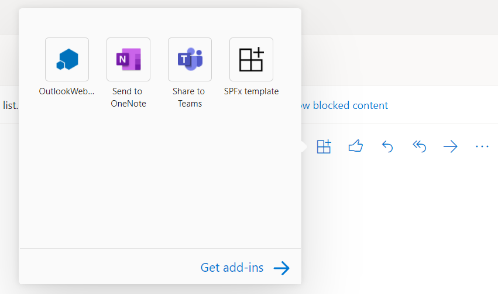

# Debug Office Add-ins in Visual Studio

This article describes how to debug client-side code in Office Add-ins that are created with one of the Office Add-in project templates in Visual Studio 2022.  For information about debugging server-side code in Office Add-ins, see [Overview of debugging Office Add-ins - Server-side or client-side?](../testing/debug-add-ins-overview.md#server-side-or-client-side).

> [!NOTE]
> You can't use Visual Studio to debug add-ins in Office on Mac. For information about debugging on a Mac, see [Debug Office Add-ins on a Mac](../testing/debug-office-add-ins-on-ipad-and-mac.md).

## Review the build and debug properties

Before you start debugging, review the properties of each project in the solution to confirm that Visual Studio will open the desired Office application and that other build and debug properties are set appropriately.

### Add-in project properties

Open the **Properties** window for the add-in project to review project properties.

1. In **Solution Explorer**, choose the add-in project (*not* the web application project).

1. From the menu bar, choose **View** > **Properties Window**.

The following table describes the properties of the add-in project.

|Property|Description|
|:-----|:-----|
|**Start Action**|Specifies the debug mode for your add-in. This should be set to **Office Desktop Client** when you want to debug in Microsoft 365 on Windows. To debug in Microsoft 365 on the web, it should be set to **Microsoft Edge**. |
|**Start Document**<br/>(Excel, PowerPoint, and Word add-ins only)|Specifies what document to open when you start the project. In a new project, this is set to **[New Excel Workbook]**, **[New Word Document]**, or **[New PowerPoint Presentation]**. To specify a particular document, follow the steps in [Use an existing document to debug the add-in](#use-an-existing-document-to-debug-the-add-in).|
|**Web Project**|Specifies the name of the web project associated with the add-in.|
|**Email Address**<br/>(Outlook add-ins only)|Specifies the email address of the user account in Exchange Server or Exchange Online that you want to use to test your Outlook add-in. If left blank, you'll be prompted for the email address when you start debugging.|
|**EWS Url**<br/>(Outlook add-ins only)|Specifies the Exchange Web Services URL (For example: `https://www.contoso.com/ews/exchange.aspx`). This property can be left blank.|
|**OWA Url**<br/>(Outlook add-ins only)|Specifies the Outlook on the web URL (For example: `https://www.contoso.com/owa`). This property can be left blank.|
|**Use multi-factor auth**<br/>(Outlook add-ins only)|Specifies the boolean value that indicates whether multi-factor authentication should be used. The default is **false**, but the property has no practical effect. If you normally have to provide a second factor to login to the email account, you'll be prompted to when you start debugging. |
|**User Name**<br/>(Outlook add-ins only)|Specifies the name of the user account in Exchange Server or Exchange Online that you want to use to test your Outlook add-in. This property can be left blank.|
|**Project File**|Specifies the name of the file containing build, configuration, and other information about the project.|
|**Project Folder**|Specifies the location of the project file.|
|**Active Deployment Configuration**<br/>(present only when debugging Excel,<br/> PowerPoint, or Word on the web)|Specifies the deployment configuration. This should be set to **Default**.|
|**Server Connection**<br/>(present only when debugging Excel,<br/> PowerPoint, or Word on the web)|Specifies whether the project connects to the SharePoint service specified in the **Site URL** property. This should be set to **Online**.|
|**Site URL**<br/>(present only when debugging Excel,<br/> PowerPoint, or Word on the web)|Specifies the full, absolute URL of the SharePoint tenant that you want to host the add-in pages when debugging. For example `https://mysite.sharepoint.com/`|

> [!NOTE]
> For an Outlook add-in, you may choose to specify values for one or more of the *Outlook add-ins only* properties in the **Properties** window, but doing so isn't required.

### Web application project properties

Open the **Properties** window for the web application project to review project properties.

1. In **Solution Explorer**, choose the web application project.

1. From the menu bar, choose **View** > **Properties Window**.

The following table describes the properties of the web application project that are most relevant to Office Add-in projects.

|Property|Description|
|:-----|:-----|
|**SSL Enabled**|Specifies whether SSL is enabled on the site. This property should be set to **True** for Office Add-in projects.|
|**SSL URL**|Specifies the secure HTTPS URL for the site. Read-only.|
|**URL**|Specifies the HTTP URL for the site. Read-only.|
|**Project File**|Specifies the name of the file containing build, configuration, and other information about the project.|
|**Project Folder**|Specifies the location of the project file. Read-only. The manifest file that Visual Studio generates at runtime is written to the `bin\Debug\OfficeAppManifests` folder in this location.|

## Debug an add-in project on Windows desktop

This section describes how to start and debug an add-in in desktop Office on Windows; that is, when the **Start Action** property of the add-in project is set to **Office Desktop Client**.

### Start the add-in project

Start the project by choosing **Debug** > **Start Debugging** from the menu bar or press the <kbd>F5</kbd> button. Visual Studio automatically builds the solution and starts the Office host application.

When Visual Studio builds the project, it performs the following tasks:

1. Creates a copy of the add-in only manifest file and adds it to the  `_ProjectName_\bin\Debug\OfficeAppManifests` directory. The Office application that hosts your add-in consumes this copy when you start Visual Studio and debug the add-in.

1. Creates a set of registry entries on your Windows computer that enables the add-in to appear in the Office application.

1. Builds the web application project, and then deploys it to the local IIS web server (`https://localhost`).

1. If this is the first add-in project that you have deployed to the local IIS web server, you may be prompted to install a Self-Signed Certificate to the current user's Trusted Root Certificate store. This is required for IIS Express to display the content of your add-in correctly.

> [!NOTE]
> If Office uses the Edge Legacy webview control (EdgeHTML) to run add-ins on your Windows computer, Visual Studio may prompt you to add a local network loopback exemption. This is required for the webview control to be able to access the website deployed to the local IIS web server. You can also change this setting anytime in Visual Studio under **Tools** > **Options** > **Office Tools (Web)** > **Web Add-In Debugging**. To find out what webview control is used on your Windows computer, see [Browsers and webview controls used by Office Add-ins](../concepts/browsers-used-by-office-web-add-ins.md).

> [!TIP]
> [!INCLUDE[Identify the webview through the add-in UI](../includes/identify-webview-in-ui.md)]

Next, Visual Studio does the following:

1. Modifies the [SourceLocation](/javascript/api/manifest/sourcelocation) element of the add-in only manifest file (that was copied to the `_ProjectName_\bin\Debug\OfficeAppManifests` directory) by replacing the `~remoteAppUrl` token with the fully qualified address of the start page (for example, `https://localhost:44302/Home.html`).

1. Starts the web application project in IIS Express.

1. Validates the manifest.  

   > [!IMPORTANT]
   > If you get validation errors for the manifest, it may be that Visual Studio's manifest schema files haven't been updated to support the latest features. Your first troubleshooting step should be to replace one or more of these files with the latest versions. For detailed instructions, see [Manifest schema validation errors in Visual Studio projects](../testing/troubleshoot-development-errors.md#add-in-only-manifest-schema-validation-errors-in-visual-studio-projects).

1. Opens the Office application and sideloads your add-in.

### Debug the add-in

The best method for debugging an add-in in Visual Studio 2022 depends on whether the add-in is running in WebView2, which is the webview control that is associated with Microsoft Edge (Chromium), or an older webview control. If your computer is using WebView2, see [Use the built-in Visual Studio debugger to debug on the desktop](#use-the-built-in-visual-studio-debugger-to-debug-on-the-desktop). For any other webview control, see [Use the browser developer tools to debug on the desktop](#use-the-browser-developer-tools-to-debug-on-the-desktop). To determine which webview control is being used, see [Browsers and webview controls used by Office Add-ins](../concepts/browsers-used-by-office-web-add-ins.md).

> [!TIP]
> [!INCLUDE[Identify the webview through the add-in UI](../includes/identify-webview-in-ui.md)]

#### Use the built-in Visual Studio debugger to debug on the desktop

1. Set breakpoints, as needed, in the source JavaScript or TypeScript files. You can do this either before or after you start the add-in as described in the earlier section [Start the add-in project](#start-the-add-in-project). If setting a breakpoint causes the Internet Information Services (IIS) server to shut down, restart debugging after you have set your breakpoints.

1. When the add-in is running, use the add-in's UI to run the code that contains your breakpoints. 

> [!IMPORTANT]
> Breakpoints set in `Office.initialize` or `Office.onReady` aren't hit. To debug these methods, see [Debug the initialize and onReady functions](../testing/debug-initialize-onready.md).

> [!TIP]
> If you encounter any problems, there's more information at [Debug a JavaScript or TypeScript app in Visual Studio](/visualstudio/javascript/debug-nodejs?view=vs-2022&preserve-view=true).

#### Use the browser developer tools to debug on the desktop

1. Follow the steps in the earlier section [Start the add-in project](#start-the-add-in-project).

1. Launch the add-in in the Office application if it isn't already open. For example, if it's a task pane add-in, it'll have added a button (for example, a **Show Taskpane** button) to the **Home** ribbon or to a custom ribbon tab that's installed with the add-in. Select the button on the ribbon.

1. Open the [personality menu](../design/task-pane-add-ins.md#personality-menu) and then choose **Attach a debugger**. This action opens the debugging tools for the webview control that Office is using to run add-ins on your Windows computer. You can set breakpoints and step through code as described in one of the following articles:

    - [Debug add-ins using developer tools for Internet Explorer](../testing/debug-add-ins-using-f12-tools-ie.md)
    - [Debug add-ins using developer tools for Edge Legacy](../testing/debug-add-ins-using-devtools-edge-legacy.md)
    - [Debug add-ins using developer tools in Microsoft Edge (Chromium-based)](../testing/debug-add-ins-using-devtools-edge-chromium.md)

1. To make changes to your code, first stop the debugging session in Visual Studio and close the Office application. Make your changes, and start a new debugging session.

## Debug an add-in project in Microsoft 365 on the web

This section describes how to start and debug an add-in in desktop Office on the web; that is, when the **Start Action** property of the add-in project is set to **Microsoft Edge**.

### Start the add-in project on the web

Start the project by choosing **Debug** > **Start Debugging** from the menu bar or press the <kbd>F5</kbd> button. Visual Studio automatically builds the solution and launches the Office application host page of your Microsoft 365 tenancy.

> [!NOTE]
> When you're debugging an add-in on the web, you may get an AADSTS50011 error similar to the following:
>
>    "The redirect URI `{Full absolute URL to add-in home page}` specified in the request doesn't match the redirect URIs configured for the application  ... "
>
> This occurs because new web applications that are deployed to SharePoint may take up to 24 hours to be available. To make your add-in debuggable immediately, take the following steps:
>
>    1. Stop debugging in Visual Studio.
>    1. [Create a PowerShell script](/powershell/scripting/windows-powershell/ise/how-to-write-and-run-scripts-in-the-windows-powershell-ise) with the following lines. Replace the placeholder `{Full absolute URL to add-in home page}` with the redirect URL in the error message; for example, "https://contoso-79d42f062409ae.sharepoint.com/_forms/default.aspx".
>
>       ```powershell
>       Connect-MgGraph -Scopes Application.ReadWrite.All
>       $sharepointPrincipal = Get-MgServiceprincipal -Filter "AppId eq '00000003-0000-0ff1-ce00-000000000000'"
>       $sharepointPrincipal | fl
>       $replyUrls = $sharepointPrincipal.ReplyUrls
>       $replyUrls += "{Full absolute URL to add-in home page}"
>       Update-MgServiceprincipal -ServicePrincipalId $sharepointPrincipal.Id -ReplyUrls $replyUrls
>       ```
>
>    1. Run the script in PowerShell.
>    1. Restart the project by choosing **Debug** > **Start Debugging** from the menu bar or press the <kbd>F5</kbd> button.

When Visual Studio builds the project it performs the following tasks.

1. Prompts you for login credentials. If you're asked to sign in repeatedly or if you receive an error that you're unauthorized, then Basic Auth may be disabled for accounts on your Microsoft 365 tenant. In this case, try using a Microsoft account instead. You can also try setting the property **Use multi-factor auth** to **True** in the add-in project properties pane. See [Add-in project properties](#add-in-project-properties).

1. Creates a copy of the add-in only manifest file and adds it to the `_ProjectName_\bin\Debug\OfficeAppManifests` directory. Microsoft 365 consumes this copy when you start Visual Studio and debug the add-in.

1. Builds the web application project, and then deploys it to the Microsoft 365 tenancy.

Next, Visual Studio does the following:

1. Modifies the [SourceLocation](/javascript/api/manifest/sourcelocation) element of the add-in only manifest file (that was copied to the `_ProjectName_\bin\Debug\OfficeAppManifests` directory) by replacing the `~remoteAppUrl` token with the fully qualified address of the start page (for example, `https://contoso-79d42f062409ae.sharepoint.com/_forms/default.aspx`).

1. Starts the web application project.

1. Validates the manifest.  

   > [!IMPORTANT]
   > If you get validation errors for the manifest, it may be that Visual Studio's manifest schema files haven't been updated to support the latest features. Your first troubleshooting step should be to replace one or more of these files with the latest versions. For detailed instructions, see [Manifest schema validation errors in Visual Studio projects](../testing/troubleshoot-development-errors.md#add-in-only-manifest-schema-validation-errors-in-visual-studio-projects).

1. Opens the Office application host page of your Microsoft 365 tenancy in Microsoft Edge.

> [!TIP]
> If for any reason, Visual Studio doesn't fully sideload the add-in and none of the fixes earlier works, you can manually sideload it. Follow the steps in [Sideload an add-in to Microsoft 365](../testing/sideload-office-add-ins-for-testing.md#sideload-an-add-in-to-microsoft-365). When you're instructed to browse to the manifest, navigate to the XML file in the folder `_ProjectName_\bin\Debug\OfficeAppManifests` directory.

### Debug the add-in on the web

The best method for debugging an add-in in Visual Studio 2022 depends on whether the add-in is running in WebView2, which is the webview control that is associated with Microsoft Edge (Chromium), or an older webview control. If your computer is using WebView2, see [Use the built-in Visual Studio debugger to debug on the web](#use-the-built-in-visual-studio-debugger-to-debug-on-the-web). For any other webview control, see [Use the browser developer tools to debug on the web](#use-the-browser-developer-tools-to-debug-on-the-web). To determine which webview control is being used, see [Browsers and webview controls used by Office Add-ins](../concepts/browsers-used-by-office-web-add-ins.md). 

> [!TIP]
> [!INCLUDE[Identify the webview through the add-in UI](../includes/identify-webview-in-ui.md)]

#### Use the built-in Visual Studio debugger to debug on the web

1. Set breakpoints, as needed, in the source JavaScript or TypeScript files. You can do this either before or after you start the add-in as described in the earlier section [Start the add-in project on the web](#start-the-add-in-project-on-the-web).

1. When the add-in is running, use the add-in's UI to run the code that contains your breakpoints. 

> [!TIP]
>
> - Sometimes in Outlook on the web, the Visual Studio debugger doesn't attach. If you get errors by the breakpoints that indicate they won't be hit, use the browser developer tools to attach to the Visual Studio debugger: After you have pressed F5 to start debugging and Outlook on the web has opened, follow the first four steps in the [Use the browser developer tools to debug on the web](#use-the-browser-developer-tools-to-debug-on-the-web). (Use the instructions for Microsoft Edge (Chromium-based).) After you set a breakpoint in the browser tools and it's hit, execution pauses on the breakpoint in *both* the browser tools *and* in Visual Studio. This indicates that the Visual Studio debugger is attached. At this point, you can close the browser tools and add breakpoints in Visual Studio as you normally would.
> - If you encounter any problems, there's more information at [Debug a JavaScript or TypeScript app in Visual Studio](/visualstudio/javascript/debug-nodejs?view=vs-2022&preserve-view=true).

#### Use the browser developer tools to debug on the web

1. For an add-in in any host except Outlook, in the Office host application page, press <kbd>F12</kbd> to open the debugging tool.

1. For an Outlook add-in, if the add-in's manifest is configured for a read surface, select an email message or appointment item to open it in its own window. If the add-in is configured for only a compose surface, open a new message, reply to message, or new appointment window. Ensure that the appropriate window has focus and press <kbd>F12</kbd> to pen the debugging tool.

1. After the tool is open, launch the add-in. The exact steps vary depending on the design of your add-in. Typically, you press a button to open a task pane. In Outlook, in the toolbar at the top of the window, select the **More apps** button, and then select your add-in from the callout that opens.

   

1. Use the instructions in one of the following articles to set breakpoints and step through code. They each have a link to more detailed guidance.

   - [Debug add-ins using developer tools for Edge Legacy](../testing/debug-add-ins-using-devtools-edge-legacy.md)
   - [Debug add-ins using developer tools in Microsoft Edge (Chromium-based)](../testing/debug-add-ins-using-devtools-edge-chromium.md)

   > [!TIP]
   > To debug code that runs in the `Office.initialize` function or an `Office.onReady` function that runs when the add-in opens, set your breakpoints, and then close and reopen the add-in. For more information about these functions, see [Initialize your Office Add-in](../develop/initialize-add-in.md).

1. To make changes to your code, first stop the debugging session in Visual Studio and close the Office on the web page. Make your changes, and start a new debugging session.

## Use an existing document to debug the add-in

If you have a document that contains test data you want to use while debugging your Excel, PowerPoint, or Word add-in, Visual Studio can be configured to open that document when you start the project. To specify an existing document to use while debugging the add-in, complete the following steps.

1. In **Solution Explorer**, choose the add-in project (*not* the web application project).

1. From the menu bar, choose **Project** > **Add Existing Item**.

1. In the **Add Existing Item** dialog box, locate and select the document that you want to add.

1. Choose the **Add** button to add the document to your project.

1. In **Solution Explorer**, choose the add-in project (*not* the web application project).

1. From the menu bar, choose **View** > **Properties Window**.

1. In the **Properties** window, choose the **Start Document** list, and then select the document that you added to the project. The project is now configured to start the add-in in that document.

## Next steps

After your add-in is working as desired, see [Deploy and publish your Office Add-in](../publish/publish.md) to learn about the ways you can distribute the add-in to users.
