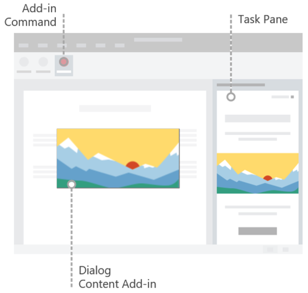

# Develop Office Add-ins

> [!TIP]
> Please review [Office Add-ins platform overview](../overview/office-add-ins.md) before reading this article.

All Office Add-ins are built upon the Office Add-ins platform. For any add-in you build, you'll need to understand important concepts like application and platform availability, Office JavaScript API programming patterns, how to specify an add-in's settings and capabilities in the manifest file, how to design the UI and user experience, and more. Core development concepts like these are covered here in the **Development lifecycle** > **Develop** section of the documentation. Review the information here before exploring the application-specific documentation that corresponds to the add-in you're building (for example, [Excel](../excel/index.yml)).

## Create an Office Add-in

You can create an Office Add-in by using the [Yeoman generator for Office Add-ins](yeoman-generator-overview.md), Visual Studio, Microsoft 365 Agents Toolkit, or the [Office Add-ins Development Kit](development-kit-overview.md).

### Yeoman generator

The Yeoman generator for Office Add-ins can be used to create a Node.js Office Add-in project that can be managed with Visual Studio Code or any other editor. The generator can create Office Add-ins for any of the following:

- Excel
- OneNote
- Outlook
- PowerPoint
- Project
- Word
- Excel custom functions

Create your project using HTML, CSS and JavaScript (or TypeScript), or using React. If you choose React, you can choose between JavaScript and Typescript as well. For more information about creating add-ins with the generator, see [Yeoman generator for Office Add-ins](yeoman-generator-overview.md).

### Visual Studio

Visual Studio can be used to create Office Add-ins for Excel, Outlook, Word, and PowerPoint. An Office Add-in project gets created as part of a Visual Studio solution and uses HTML, CSS, and JavaScript. For more information about creating add-ins with Visual Studio, see [Develop Office Add-ins with Visual Studio](../develop/develop-add-ins-visual-studio.md).

### Agents Toolkit

The Agents Toolkit can be used to create almost any kind of Microsoft 365 extension. For details about creating an add-in, see [Create Office Add-in projects with Microsoft 365 Agents Toolkit](agents-toolkit-overview.md).

### Office Add-ins Development Kit (preview)

The Office Add-ins Development Kit is an extension for Visual Studio Code. It lets you create new add-in projects and load samples directly from the IDE. Download the extension from the [Visual Studio Marketplace](https://marketplace.visualstudio.com/items?itemName=msoffice.microsoft-office-add-in-debugger) or learn more in the article [Create Office Add-in projects using Office Add-ins Development Kit for Visual Studio Code](development-kit-overview.md).

## Understand the two parts of an Office Add-in

An Office Add-in consists of two parts.

- The add-in manifest that defines the settings and capabilities of the add-in.

- The web application that defines the UI and functionality of add-in components such as task panes, content add-ins, and dialog boxes.

The web application uses the Office JavaScript API to interact with content in the Office document where the add-in is running. Your add-in can also do other things that web applications typically do, like call external web services, facilitate user authentication, and more.

### Define an add-in's settings and capabilities

An Office Add-in's manifest defines the settings and capabilities of the add-in. You'll configure the manifest to specify things such as:

- Metadata that describes the add-in (for example, ID, version, description, display name, default locale).
- Office applications where the add-in will run.
- Permissions that the add-in requires.
- How the add-in integrates with Office, including any custom UI that the add-in creates (for example, a custom tab or custom ribbon buttons).
- Location of images that the add-in uses for branding and command iconography.
- Dimensions of the add-in (for example, dimensions for content add-ins, requested height for Outlook add-ins).
- Rules that specify when the add-in activates in the context of a message or appointment (for Outlook add-ins only).
- Keyboard shortcuts (for Excel and Word add-ins only).

For detailed information about the manifest, see [Office Add-ins manifest](add-in-manifests.md).

### Interact with content in an Office document

An Office Add-in can use the Office JavaScript APIs to interact with content in the Office document where the add-in is running.

#### Access the Office JavaScript API library

[!include[information about accessing the Office JS API library](../includes/office-js-access-library.md)]

#### API models

[!include[information about the Office JS API models](../includes/office-js-api-models.md)]

#### API requirement sets

[!include[information about the Office JS API requirement sets](../includes/office-js-requirement-sets.md)]

#### Explore APIs with Script Lab

Script Lab is an add-in that enables you to explore the Office JavaScript API and run code snippets while you're working in an Office program such as Excel or Word. It's available for free via AppSource and is a useful tool to include in your development toolkit as you prototype and verify the functionality you want in your add-in. In Script Lab, you can access a library of built-in samples to quickly try out APIs or even use a sample as the starting point for your own code.

The following one-minute video shows Script Lab in action.

For more information about Script Lab, see [Explore Office JavaScript APIs using Script Lab](../overview/explore-with-script-lab.md).

## Extend the Office UI

An Office Add-in can extend the Office UI by using add-in commands and HTML containers such as task panes, content add-ins, or dialog boxes.

- [Add-in commands](../design/add-in-commands.md) can be used to add a custom tab, custom buttons and menus to the default ribbon in Office, or to extend the default context menu that appears when users right-click (or select and hold) text in an Office document or an object in Excel. When users select an add-in command, they initiate the task that the add-in command specifies, such as running JavaScript code, opening a task pane, or launching a dialog box.

- HTML containers like [task panes](../design/task-pane-add-ins.md), [content add-ins](../design/content-add-ins.md), and [dialog boxes](../develop/dialog-api-in-office-add-ins.md) can be used to display custom UI and expose additional functionality within an Office application. The content and functionality of each task pane, content add-in, or dialog box derives from a web page that you specify. Those web pages can use the Office JavaScript API to interact with content in the Office document where the add-in is running, and can also do other things that web pages typically do, like call external web services, facilitate user authentication, and more.

The following image shows an add-in command on the ribbon, a task pane to the right of the document, and a dialog box or content add-in over the document.

For more information about extending the Office UI and designing the add-in's UX, see [Office UI elements for Office Add-ins](../design/interface-elements.md).

## Next steps

This article has outlined the different ways to create Office Add-ins, introduced the ways that an add-in can extend the Office UI, described the API sets, and introduced Script Lab as a valuable tool for exploring Office JavaScript APIs and prototyping add-in functionality. Now that you've explored this introductory information, consider continuing your Office Add-ins journey along the following paths.

### Create an Office Add-in

You can quickly create a basic add-in for Excel, OneNote, Outlook, PowerPoint, Project, or Word by completing a [5-minute quick start](../index.yml). If you've previously completed a quick start and want to create a slightly more complex add-in, you should try the [tutorial](../index.yml).

### Learn more

Learn more about developing, testing, and publishing Office Add-ins by exploring this documentation.

> [!TIP]
> For any add-in that you build, you'll use information in the [Development lifecycle](../overview/core-concepts-office-add-ins.md) section of this documentation, along with information in the application-specific section that corresponds to the type of add-in you're building (for example, [Excel](../excel/index.yml)).

## See also

- [Office Add-ins platform overview](../overview/office-add-ins.md)
- [Learn about the Microsoft 365 Developer Program](https://aka.ms/m365devprogram)
- [Design Office Add-ins](../design/add-in-design.md)
- [Test and debug Office Add-ins](../testing/test-debug-office-add-ins.md)
- [Publish Office Add-ins](../publish/publish.md)
