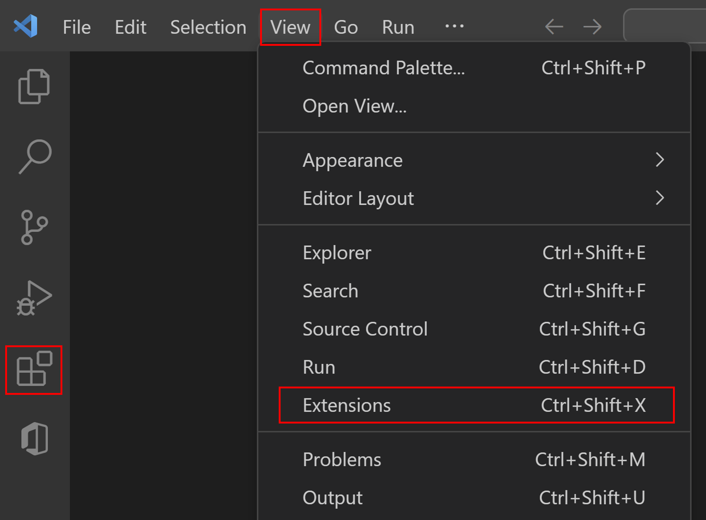
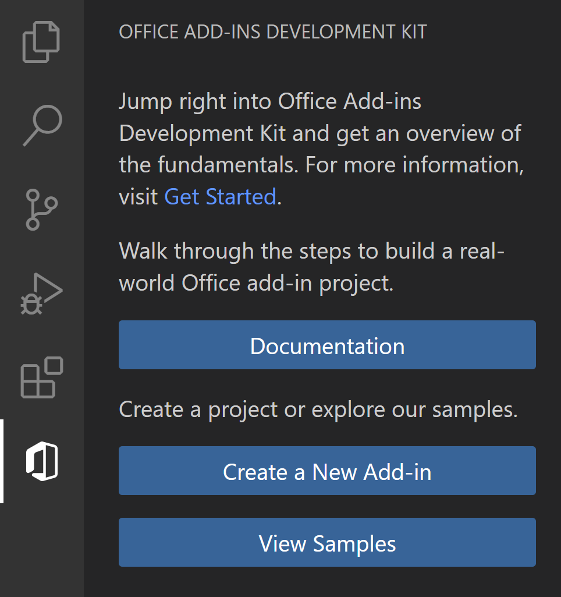

# Create Office Add-in projects using Office Add-ins Development Kit for Visual Studio Code (preview)

The Office Add-ins Development Kit helps developers set up the environment, create and build Office JS add-ins with a streamlined developer experience in Visual Studio Code.

- Add-ins created with Office Add-ins Development Kit use the [XML-formatted add-in only manifest](xml-manifest-overview.md).
- Only Excel, PowerPoint and Word add-ins can be created at this time. We're working hard to enable support for add-ins to other Office applications and platforms.

## Prerequisites

- Download and install [Visual Studio Code](https://visualstudio.microsoft.com/downloads/).
- Node.js (the latest LTS version). Visit the [Node.js site](https://nodejs.org/) to download and install the right version for your operating system. To verify if you've already installed these tools, run the commands `node -v` and `npm -v` in your terminal.
- Office connected to a Microsoft 365 subscription. You might qualify for a Microsoft 365 E5 developer subscription through the [Microsoft 365 Developer Program](https://developer.microsoft.com/microsoft-365/dev-program), see [FAQ](https://learn.microsoft.com/office/developer-program/microsoft-365-developer-program-faq#who-qualifies-for-a-microsoft-365-e5-developer-subscription-) for details. Alternatively, you can [sign up for a 1-month free trial](https://www.microsoft.com/microsoft-365/try?rtc=1) or [purchase a Microsoft 365 plan](https://www.microsoft.com/microsoft-365/buy/compare-all-microsoft-365-products).

## Install the development kit

You can install Office Add-ins Development Kit using **Extensions** in Visual Studio Code, or install it from the Visual Studio Code Marketplace.

# [Visual Studio Code](#tab/vscode)

1. Launch Visual Studio Code.
1. Select **View** > **Extensions** or **Ctrl+Shift+X**. You can also open extensions by selecting the **Extensions** tab from the Visual Studio Code activity bar.

    

1. Enter **Office Add-ins Development Kit** in the search box.
1. Select **Office Add-ins Development Kit**. From the Office Add-ins Development Kit extension page that appears in the right pane, select  **Install**. After successfully installing, the Office Add-ins Development Kit icon will appear in the Visual Studio Code activity bar.

    

# [Marketplace](#tab/marketplace)

1. open the [Office Add-ins Development Kit](https://marketplace.visualstudio.com/items?itemName=msoffice.microsoft-office-add-in-debugger) page in the Visual Studio Code Marketplace.

1. Select **Install** on the web page. If you're prompted that the extension requires Visual Studio Code, select **Continue**.

1. Your browser may ask you to verify that the site is trying to open Visual Studio Code. Allow Visual Studio Code to open. Visual Studio Code will then open with the Office Add-ins Development Kit extension readme displayed.

1. Select **Install** in Visual Studio Code. After successfully installing, the Office Add-ins Development Kit icon will appear in the Visual Studio Code activity bar.

    

## Create an add-in project

1. Open Visual Studio Code and select the Office Add-ins Development Kit icon in the **Activity Bar**.

1. Select **Create a New Add-in**.

    

1. In the now-active Quick Pick menu, select the Office application for your add-in.
1. Select an add-in template from the list of available templates.
1. Select "JavaScript" or "TypeScript" as the programming language.
1. In the **Workspace folder** dialog that opens, select the folder where you want to create the project.
1. Give a name to the project (with no spaces) when prompted. Office Add-ins Development Kit will create the project with basic files and scaffolding. It then opens the project in a *second* Visual Studio Code window. You can freely the original Visual Studio Code window.

## Test your add-in

To understand how the add-in will work in an Office application, use the Office Add-ins Development Kit to run and debug your Office add-in in your local development environment.

Select **Preview Your Office Add-in(F5)** to launch the add-in and debug the code. In the drop down menu, select the option **Desktop (Edge Chromium)**.

The extension checks that the prerequisites are met before debugging starts. Check the terminal for detailed information if there are issues with your environment. After this process, the Office desktop application launches and sideloads the add-in.

## Stop testing your Office Add-in

Once you are finished testing and debugging the add-in, select **Stop Previewing Your Office Add-in**. This closes the web server and removes the add-in from the registry and cache.

## Troubleshooting

If you have problems running the add-in, take these steps.

- Close any open instances of Office.
- Close the previous web server started for the add-in with the **Stop Previewing Your Office Add-in** Office Add-ins Development Kit extension option.

The article [Troubleshoot development errors with Office Add-ins](../testing/troubleshoot-development-errors.md) contains solutions to common problems. If you're still having issues, [create a GitHub issue](https://aka.ms/officedevkitnewissue) and we'll help you.  

For information on running the add-in on Office on the web, see [Sideload Office Add-ins to Office on the web](../testing/sideload-office-add-ins-for-testing.md).

For information on debugging on older versions of Office, see [Debug add-ins using developer tools in Microsoft Edge Legacy](../testing/debug-add-ins-using-devtools-edge-legacy.md).
