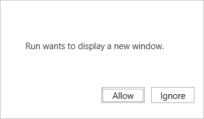

# Best practices and rules for the Office Dialog API

This article provides rules, limitations, and best practices for the Office Dialog API, including best practices for designing the UI of a dialog and using the API within a single-page application (SPA).

> [!NOTE]
> To familiarize yourself with the basics of using the Office Dialog API, see [Use the Office Dialog API in your Office Add-ins](dialog-api-in-office-add-ins.md).
>
> See also [Handling errors and events with the Office dialog box](dialog-handle-errors-events.md).

## Rules and limitations

- A dialog box can only navigate to HTTPS URLs, not HTTP.
- The URL passed to the [displayDialogAsync](/javascript/api/office/office.ui) method must be in the exact same domain as the add-in itself. It can't be a subdomain. However, the page that is passed to it can redirect to a page in another domain.
- A host page can have only one dialog box open at a time. The host page could be either a task pane or the [function file](/javascript/api/manifest/functionfile) of a [function command](../design/add-in-commands.md#types-of-add-in-commands). Multiple dialogs can be open at the same time from custom ribbon buttons or menu items.
- Only two Office APIs can be called in the dialog box,
  - [Office.context.ui.messageParent](/javascript/api/office/office.ui#office-office-ui-messageparent-member(1))
  - `Office.context.requirements.isSetSupported` (For more information, see [Specify Office applications and API requirements](specify-office-hosts-and-api-requirements.md).)
- The [messageParent](/javascript/api/office/office.ui#office-office-ui-messageparent-member(1)) function should usually be called from a page in the exact same domain as the add-in itself, but this isn't mandatory. For more information, see [Cross-domain messaging to the host runtime](dialog-api-in-office-add-ins.md#cross-domain-messaging-to-the-host-runtime).
- When a dialog box opens, it's centered on the screen on top of the Office application.
- A dialog box can be moved and resized by the user.
- A dialog box appears in the order in which it was created.

  > [!TIP]
  > In Office on the web and [new Outlook on Windows](https://support.microsoft.com/office/656bb8d9-5a60-49b2-a98b-ba7822bc7627), if the domain of your dialog is different from that of your add-in and it enforces the [Cross-Origin-Opener-Policy: same-origin](https://developer.mozilla.org/docs/Web/HTTP/Headers/Cross-Origin-Opener-Policy) response header, your add-in will be blocked from accessing messages from the dialog and your users will be shown [error 12006](dialog-handle-errors-events.md#errors-and-events-in-the-dialog-box). To prevent this, you must set the header to `Cross-Origin-Opener-Policy: unsafe-none` or configure your add-in and dialog to be in the same domain.

- In Outlook on the web and new Outlook on Windows, don't set the [window.name](https://developer.mozilla.org/docs/Web/API/Window/name) property when configuring a dialog in your add-in. The `window.name` property is used by these Outlook clients to maintain functionality across page redirects.

## Best practices

### Avoid overusing dialog boxes

Because overlapping UI elements are discouraged, avoid opening a dialog box from a task pane unless your scenario requires it. When you consider how to use the surface area of a task pane, note that task panes can be tabbed. For an example of a tabbed task pane, see the [Excel Add-in JavaScript SalesTracker](https://github.com/OfficeDev/Excel-Add-in-JavaScript-SalesTracker) sample.

### Design a dialog box UI

For best practices in dialog box design, see [Dialog boxes in Office Add-ins](../develop/dialog-api-in-office-add-ins.md).

### Handle pop-up blockers with Office on the web

Attempting to display a dialog box while using Office on the web may cause the browser's pop-up blocker to block the dialog box. To prevent this, Office on the web prompts the user to **Allow** or **Ignore** opening the dialog.



If the user chooses **Allow**, the Office dialog box opens. If the user chooses **Ignore**, the prompt closes and the Office dialog box does not open. Instead, the `displayDialogAsync` method returns error 12009. Your code should catch this error and either provide an alternate experience that doesn't require a dialog, or display a message to the user advising that the add-in requires them to allow the dialog. (For more about 12009, see [Errors from displayDialogAsync](dialog-handle-errors-events.md#errors-from-displaydialogasync).)

If, for any reason, you want to turn off this feature, then your code must opt out. It makes this request with the [DialogOptions](/javascript/api/office/office.dialogoptions) object that is passed to the `displayDialogAsync` method. Specifically, the object should include `promptBeforeOpen: false`. When this option is set to false, Office on the web won't prompt the user to allow the add-in to open a dialog, and the Office dialog won't open.

### Request access to device capabilities in Office on the web and new Outlook on Windows

If your add-in requires access to a user's device capabilities, a dialog to request for permissions is available through the [device permission API](/javascript/api/requirement-sets/common/device-permission-service-requirement-sets). Device capabilities include a user's camera, geolocation, and microphone. This applies to the following Office applications.

- Office on the web (Excel, Outlook, PowerPoint, and Word) running in Chromium-based browsers, such as Microsoft Edge or Google Chrome
- [new Outlook on Windows](https://support.microsoft.com/office/656bb8d9-5a60-49b2-a98b-ba7822bc7627)

When your add-in calls [Office.context.devicePermission.requestPermissions](/javascript/api/office/office.devicepermission#office-office-devicepermission-requestpermissions-member(1)) or [Office.context.devicePermission.requestPermissionsAsync](/javascript/api/office/office.devicepermission#office-office-devicepermission-requestpermissionsasync-member(1)), a dialog is shown with the requested device capabilities and the options to **Allow**, **Allow once**, or **Deny** access. To learn more, see [View, manage, and install add-ins for Excel, PowerPoint, and Word](https://support.microsoft.com/office/16278816-1948-4028-91e5-76dca5380f8d).

> [!NOTE]
>
> - Add-ins that run in Office desktop clients or in browsers not based on Chromium automatically show a dialog requesting for a user's permission. The developer doesn't need to implement the device permission API on these platforms.
> - Add-ins that run in Safari are blocked from accessing a user's device capabilities. The device permission API isn't supported in Safari.
> - Access to a user's geolocation is only supported in **Outlook on the web** and new **Outlook on Windows**.

### Don't use the \_host\_info value

Office automatically adds a query parameter called `_host_info` to the URL that is passed to `displayDialogAsync`. It is appended after your custom query parameters, if any. It isn't appended to any subsequent URLs that the dialog box navigates to. Microsoft may change the content of this value, or remove it entirely, so your code shouldn't read it. The same value is added to the dialog box's session storage (that is, the [Window.sessionStorage](https://developer.mozilla.org/docs/Web/API/Window/sessionStorage) property). Again, *your code should neither read nor write to this value*.

### Open another dialog immediately after closing one

You can't have more than one dialog open from a given host page, so your code should call [Dialog.close](/javascript/api/office/office.dialog#office-office-dialog-close-member(1)) on an open dialog before it calls `displayDialogAsync` to open another dialog. The `close` method is asynchronous. For this reason, if you call `displayDialogAsync` immediately after a call of `close`, the first dialog may not have completely closed when Office attempts to open the second. If that happens, Office will return a [12007](dialog-handle-errors-events.md#12007) error: "The operation failed because this add-in already has an active dialog."

The `close` method doesn't accept a callback parameter, and it doesn't return a Promise object so it cannot be awaited with either the `await` keyword or with a `then` method. For this reason, we suggest the following technique when you need to open a new dialog immediately after closing a dialog: encapsulate the code to open the new dialog in a function and design the function to recursively call itself if the call of `displayDialogAsync` returns `12007`. The following is an example.

```javascript
function openFirstDialog() {
  Office.context.ui.displayDialogAsync(
    "https://MyDomain/firstDialog.html",
    { width: 50, height: 50 },
    (result) => {
      if (result.status === Office.AsyncResultStatus.Succeeded) {
        const dialog = result.value;
        dialog.close();
        openSecondDialog();
      }
      else {
         // Handle errors.
      }
    }
  );
}
 
function openSecondDialog() {
  Office.context.ui.displayDialogAsync(
    "https://MyDomain/secondDialog.html",
    { width: 50, height: 50 },
    (result) => {
      if (result.status === Office.AsyncResultStatus.Failed) {
        if (result.error.code === 12007) {
          openSecondDialog(); // Recursive call.
        }
        else {
         // Handle other errors.
        }
      }
    }
  );
}
```

Alternatively, you could force the code to pause before it tries to open the second dialog by using the [setTimeout](https://www.w3schools.com/jsref/met_win_settimeout.asp) method. The following is an example.

```javascript
function openFirstDialog() {
  Office.context.ui.displayDialogAsync(
    "https://MyDomain/firstDialog.html",
    { width: 50, height: 50 },
    (result) => {
      if (result.status === Office.AsyncResultStatus.Succeeded) {
        const dialog = result.value;
        dialog.close();
        setTimeout(() => { 
          Office.context.ui.displayDialogAsync(
            "https://MyDomain/secondDialog.html",
            { width: 50, height: 50 },
            (result) => {
              // Callback body.
            }
          );
        }, 1000);
      }
      else {
         // Handle errors.
      }
    }
  );
}
```

### Best practices for using the Office Dialog API in an SPA

If your add-in uses client-side routing, as single-page applications (SPAs) typically do, you have the option to pass the URL of a route to the [displayDialogAsync](/javascript/api/office/office.ui) method instead of the URL of a separate HTML page. *We recommend against doing so for the reasons given below.*

> [!NOTE]
> This article isn't relevant to *server-side* routing, such as in an Express-based web application.

#### Problems with SPAs and the Office Dialog API

The Office dialog box is in a new window with its own instance of the JavaScript engine, and hence it's own complete execution context. If you pass a route, your base page and all its initialization and bootstrapping code run again in this new context, and any variables are set to their initial values in the dialog box. So this technique downloads and launches a second instance of your application in the  box window, which partially defeats the purpose of an SPA. In addition, code that changes variables in the dialog box window doesn't change the task pane version of the same variables. Similarly, the dialog box window has its own session storage (the [Window.sessionStorage](https://developer.mozilla.org/docs/Web/API/Window/sessionStorage) property), which isn't accessible from code in the task pane. The dialog box and the host page on which `displayDialogAsync` was called look like two different clients to your server. (For a reminder of what a host page is, see [Open a dialog box from a host page](dialog-api-in-office-add-ins.md#open-a-dialog-box-from-a-host-page).)

So, if you passed a route to the `displayDialogAsync` method, you wouldn't really have an SPA; you'd have *two instances of the same SPA*. Moreover, much of the code in the task pane instance would never be used in that instance and much of the code in the dialog box instance would never be used in that instance. It would be like having two SPAs in the same bundle.

#### Microsoft recommendations

Instead of passing a client-side route to the `displayDialogAsync` method, we recommend that you do one of the following:

- If the code that you want to run in the dialog box is sufficiently complex, create two different SPAs explicitly; that is, have two SPAs in different folders of the same domain. One SPA runs in the dialog box and the other in the dialog box's host page where `displayDialogAsync` was called.
- In most scenarios, only simple logic is needed in the dialog box. In such cases, your project will be greatly simplified by hosting a single HTML page, with embedded or referenced JavaScript, in the domain of your SPA. Pass the URL of the page to the `displayDialogAsync` method. While this means that you are deviating from the literal idea of a single-page app; you don't really have a single instance of an SPA when you are using the Office Dialog API.

## See also

- [Use the Office Dialog API in Office Add-ins](dialog-api-in-office-add-ins.md)
- [Handle errors and events in the Office dialog box](dialog-handle-errors-events.md)
