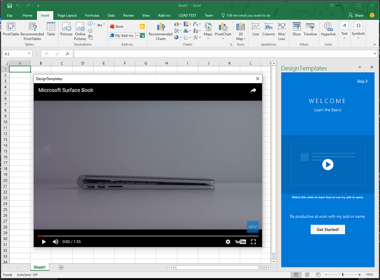

# Use the Office dialog box to show a video

This article shows you how to play a video in an Office Add-in dialog box to create more engaging user experiences.

Videos in dialog boxes are perfect for:

- **Onboarding tutorials** that guide users through your add-in's features.
- **Product demos** that showcase functionality.
- **Training content** that helps users get up to speed quickly.

> [!NOTE]
> This article presumes you're familiar with the basics of using the Office dialog box as described in [Use the Office dialog API in your Office Add-ins](dialog-api-in-office-add-ins.md).

To play a video in a dialog box with the Office dialog API, follow these steps.

1. Create a dedicated video page that contains an iframe and no other content. The page must be in the same domain as the host page. For a reminder of what a host page is, see [Open a dialog box from a host page](dialog-api-in-office-add-ins.md#open-a-dialog-box-from-a-host-page).

   In the `src` attribute of the iframe, point to the URL of an online video. The protocol of the video's URL must be HTTPS. In this example, we'll call this page "video.dialogbox.html".

   Here's the markup:

    ```HTML
    <iframe class="ms-firstrun-video__player"  width="640" height="360"
        src="https://www.youtube.com/embed/XVfOe5mFbAE?rel=0&autoplay=1"
        frameborder="0" allowfullscreen>
    </iframe>
    ```

1. Call `displayDialogAsync` in the host page to open "video.dialogbox.html".

1. Handle dialog close events (optional). If your add-in needs to know when the user closes the dialog box, register a handler for the `DialogEventReceived` event and handle the 12006 event. For details, see [Errors and events in the Office dialog box](dialog-handle-errors-events.md).

## See it in action

For a sample of a video playing in a dialog box, see the [video placemat design pattern](../design/first-run-experience-patterns.md#video-placemat).


