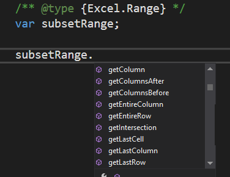
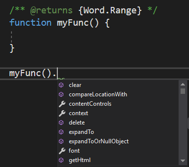
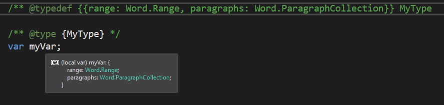

# Get JavaScript intellisense in Visual Studio 2017 when developing Office Add-ins

When you are using Visual Studio 2017, you can enable intellisense for your JavaScript variables, objects, parameters, and return values using specially formatted comments, officially known as "JSDoc." This article gives a brief overview with an emphasis on intellisense. For more details, see [JavaScript Intellisense](https://docs.microsoft.com/en-us/visualstudio/ide/javascript-intellisense) and [JSDoc support in JavaScript](https://github.com/Microsoft/TypeScript/wiki/JsDoc-support-in-JavaScript). 

## Office.js type definitions

Visual Studio needs to know the definitions of the types in Office.js. There are two ways to do this:

- You can have a local copy of the Office.js files in a folder in your solution named `\Office\1\`. The Office Add-in project templates in Visual Studio adds this local copy when you create an add-in project. 
- You can use an online version of Office.js by adding a tsconfig.json file to the root of the web application project in the add-in solution. The file should have the following content.

```
    {        
        "compilerOptions": {
            "allowJs": true,            // These settings apply to JavaScript files also
            "noEmit":  true             // Do not compile the JS (or TS) files in this project
        },
        "exclude": [
            "node_modules",             // Don't include any JavaScript found under "node_modules"
            "Scripts/Office/1"          // Suppress loading all the JavaScript files from the Office NuGet package
        ],
        "typeAcquisition": {
            "enable": true,             // Enable automatic fetching of type definitions for detected JavaScript libraries
            "include": [ "office-js" ]  // Ensure the "Office-js" type definition is fetched
        }
    }
```

## JSDoc syntax

The basic technique is to precede the variable (or parameter, ... etc.) with a comment that identifies its data type. This enables Visual Studio's intellisense to infer it's members. The following are examples.

### Variable

```
/** @type {Excel.Range} */
var subsetRange;
```


### Parameter

```
/** @param {Word.ParagraphCollection} paragraphs */
function myFunc(paragraphs){

}
```


### Return value

```
/** @returns {Word.Range} */
function myFunc() {

}
```


### Complex types

```
/** @typedef {{range: Word.Range, paragraphs: Word.ParagraphCollection}} MyType

/** @returns {MyType} */
function myFunc() {

}
```


