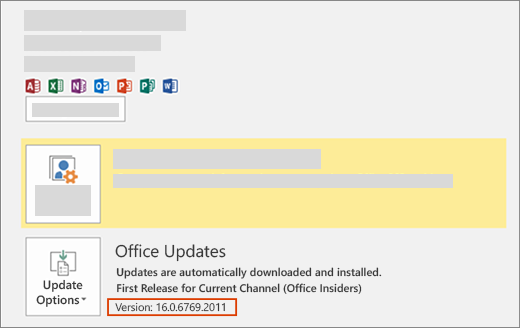

# Install the latest version of Office

New developer features, including those still in preview, are delivered first to subscribers who opt in to get the latest builds of Office.

## Opt in to getting the latest builds of Office

- If you're a Microsoft 365 Family, Personal, or University subscriber, see [Be a Microsoft 365 Insider](https://insider.microsoft365.com).
- If you're a Microsoft 365 Apps for business customer, see [Install the First Release build for Microsoft 365 Apps for business customers](https://support.office.com/article/4dd8ba40-73c0-4468-b778-c7b744d03ead).
- If you're running Office on a Mac:
  - Start an Office application.
  - Select **Check for Updates** on the Help menu.
  - In the Microsoft AutoUpdate box, check the box to join the Microsoft 365 Insider program.

## Get the latest build of Office

1. Download the [Office Deployment Tool](https://www.microsoft.com/download/details.aspx?id=49117).
1. Run the tool. This extracts a **setup.exe** and configuration files.
1. Create a new file named **configuration.xml** and add the following XML.

    ```xml
    <!-- Office 365 client configuration file sample. To be used for Office 365 ProPlus apps, 
     Office 365 Business apps, Project Pro for Office 365 and Visio Pro for Office 365. 

     For detailed information regarding configuration options visit: http://aka.ms/ODT. 
     To use the configuration file be sure to remove the comments

     The following sample allows you to download and install the 32 bit version of the Office 365 ProPlus apps 
     and Visio Pro for Office 365 directly from the Office CDN using the First Release Branch
     settings  -->

    <Configuration>
      <Add OfficeClientEdition="32" Branch="FirstReleaseCurrent">
        <Product ID="O365ProPlusRetail">
          <Language ID="en-us" />
        </Product>
      </Add>

      <Updates Enabled="TRUE" /> 
      <Display Level="None" AcceptEULA="TRUE" />  
      <Logging Level="Standard" Path="%temp%" /> 

      <!--  <Updates Enabled="TRUE" Branch="Current" /> -->

      <!--  <Display Level="None" AcceptEULA="TRUE" />  -->

      <!--  <Property Name="AUTOACTIVATE" Value="1" />  -->

    </Configuration>
    ```

1. Run the following command as an administrator.
    ```command&nbsp;line
    setup.exe /configure configuration.xml
    ```

> [!NOTE]
> The command might take a long time to run without indicating progress.

When the installation process finishes, you will have the latest Office applications installed. To verify that you have the latest build, go to **File** > **Account** from any Office application. Under Office Updates, you'll see the (Office Insiders) label above the version number.



## Minimum Office builds for Office JavaScript API requirement sets

- [Excel JavaScript API requirement sets](/javascript/api/requirement-sets/excel/excel-api-requirement-sets)
- [OneNote JavaScript API requirement sets](/javascript/api/requirement-sets/onenote/onenote-api-requirement-sets)
- [Outlook JavaScript API requirement sets](/javascript/api/requirement-sets/outlook/outlook-api-requirement-sets)
- [PowerPoint JavaScript API requirement sets](/javascript/api/requirement-sets/powerpoint/powerpoint-api-requirement-sets)
- [Word JavaScript API requirement sets](/javascript/api/requirement-sets/word/word-api-requirement-sets)
- [Dialog API requirement sets](/javascript/api/requirement-sets/common/dialog-api-requirement-sets)
- [Office Common API requirement sets](/javascript/api/requirement-sets/common/office-add-in-requirement-sets)
