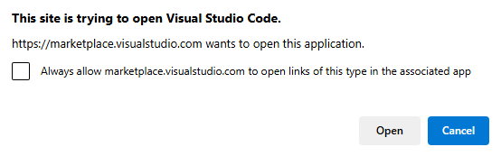

# Install Office Add-ins Development Kit for Visual Studio Code (preview)

This section helps you to know about the prerequisites, install Microsoft Office Add-ins Development Kit for Visual Studio Code, and install a different version of Office Add-ins Development Kit.

## Prerequisites
- Download and install [Visual Studio Code](https://visualstudio.microsoft.com/downloads/).
- Node.js (the latest LTS version). Visit the [Node.js site](https://nodejs.org/) to download and install the right version for your operating system. To verify if you've already installed these tools, run the commands `node -v` and `npm -v` in your terminal.
- Office connected to a Microsoft 365 subscription. You might qualify for a Microsoft 365 E5 developer subscription through the [Microsoft 365 Developer Program](https://developer.microsoft.com/microsoft-365/dev-program), see [FAQ](https://learn.microsoft.com/office/developer-program/microsoft-365-developer-program-faq#who-qualifies-for-a-microsoft-365-e5-developer-subscription-) for details. Alternatively, you can [sign up for a 1-month free trial](https://www.microsoft.com/microsoft-365/try?rtc=1) or [purchase a Microsoft 365 plan](https://www.microsoft.com/microsoft-365/buy/compare-all-microsoft-365-products).

## Install the Office Add-ins Development Kit extension for Visual Studio Code

You can install Office Add-ins Development Kit using **Extensions** in Visual Studio Code, or install it from the Visual Studio Code Marketplace.

# [Visual Studio Code](#tab/vscode)

1. Launch Visual Studio Code.
1. Select **View** > **Extensions** or **Ctrl+Shift+X**. You can also open extensions by selecting the extensions  icon from the Visual Studio Code activity bar.

    

1. Enter **Office Add-ins Development Kit** in the search box.

   Office Add-ins Development Kit appears in the search result.

1. Select **Office Add-ins Development Kit**, and then from the Office Add-ins Development Kit extension page that appears in the right pane, select  **Install**.
  
   After successful installation of Office Add-ins Development Kit in Visual Studio Code, the Office Add-ins Development Kit icon appears in the Visual Studio Code activity bar.
    
    
    
# [Marketplace](#tab/marketplace)

1. Go to [Visual Studio Code Marketplace](https://marketplace.visualstudio.com/items?itemName=msoffice.microsoft-office-add-in-debugger) in a web browser.

1. Select **Install**.

1. In the pop-up window, select **Open**.

    

   Visual Studio Code opens with the Office Add-ins Development Kit extension page.

1. Select **Install**.

    After successful installation of Office Add-ins Development Kit in Visual Studio Code, the Office Add-ins Development Kit icon appears in the Visual Studio Code activity bar.
    
    

## Next step

[Create Office Add-in projects using Office Add-ins Development Kit](office-add-ins-development-kit-overview.md)
