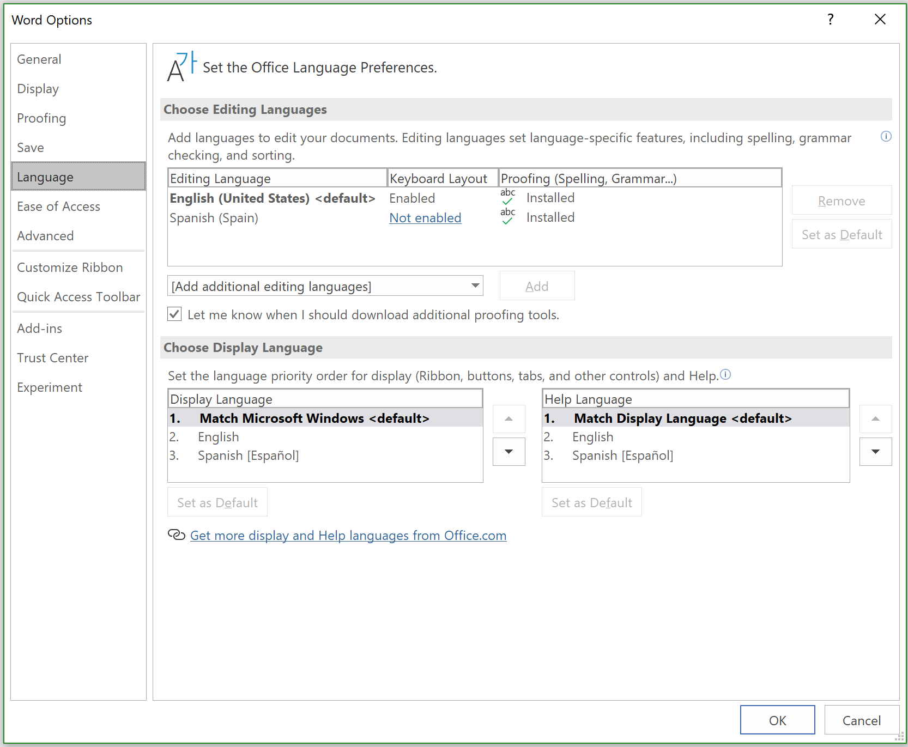

# Localization for Office Add-ins

You can implement any localization scheme that's appropriate for your Office Add-in. The JavaScript API and manifest schema of the Office Add-ins platform provide some choices. You can use the Office JavaScript API to determine a locale and display strings based on the locale of the Office application, or to interpret or display data based on the locale of the data. You can use the manifest to specify locale-specific add-in file location and descriptive information. Alternatively, you can use Visual Studio and Microsoft Ajax script to support globalization and localization.

## Use the JavaScript API to determine locale-specific strings

The Office JavaScript API provides two properties that support displaying or interpreting values consistent with the locale of the Office application and data.

- [Context.displayLanguage][displayLanguage] specifies the locale (or language) of the user interface of the Office application. The following example verifies if the Office application uses the en-US or fr-FR locale, and displays a locale-specific greeting.

    ```js
    function sayHelloWithDisplayLanguage() {
        const myLanguage = Office.context.displayLanguage;
        switch (myLanguage) {
            case 'en-US':
                write('Hello!');
                break;
            case 'fr-FR':
                write('Bonjour!');
                break;
        }
    }

    // Function that writes to a div with id='message' on the page.
    function write(message) {
        document.getElementById('message').innerText += message;
    }
    ```

- [Context.contentLanguage][contentLanguage] specifies the locale (or language) of the data. Extending the last code sample, instead of checking the [displayLanguage] property, assign `myLanguage` the value of the [contentLanguage] property, and use the rest of the same code to display a greeting based on the locale of the data.

    ```js
    const myLanguage = Office.context.contentLanguage;
    ```

## Control localization from the manifest

The techniques for localizing with the manifest differ depending on whether you're using the add-in only manifest or the unified app manifest for Microsoft 365.

# [Unified app manifest for Microsoft 365](#tab/jsonmanifest)

When using the unified app manifest for Microsoft 365, localize the public-facing strings in the manifest as described in [Localize strings in your app manifest](/microsoftteams/platform/concepts/build-and-test/apps-localization#localize-strings-in-your-app-manifest). The following is an example for an Outlook add-in. First is the [`"localizationInfo"`](/microsoft-365/extensibility/schema/root#localizationinfo) object in the manifest. Below that is the fr-fr.json file with the translated strings. The add-in has a task pane (with a French version of the home page), localized French icons, and a custom ribbon button that opens a video player in a dialog box.

```json
"localizationInfo": {
  "defaultLanguageTag": "en",
  "additionalLanguages": [
    {
      "languageTag": "fr-fr",
      "file": "fr-fr.json"
    }
  ]
}
```

```json
{
  "$schema": "https://developer.microsoft.com/json-schemas/teams/v1.16/MicrosoftTeams.Localization.schema.json",
  "name.short": "Lecteur vidéo",
  "name.full": "Lecteur vidéo pour Outlook",
  "description.short": "Voir les vidéos YouTube dans Outlook via les mails.",
  "description.full": "Visualisez les vidéos YouTube référencées dans vos courriers électronique directement depuis Outlook.",
  "icons.color": "https://localhost:3000/assets/fr-fr/icon-128.png",
  "extensions[0].audienceClaimUrl": "https://localhost:3000/fr-fr/taskpane.html",
  "extensions[0].ribbons[0].tabs[0].groups[0].label": "Outils de médias",
  "extensions[0].ribbons[0].tabs[0].groups[0].controls[0].icons[0].url": "https://localhost:3000/assets/fr-fr/player-icon.png",
  "extensions[0].ribbons[0].tabs[0].groups[0].controls[0].label": "Ouvrir le lecteur vidéo",
  "extensions[0].ribbons[0].tabs[0].groups[0].controls[0].supertip.description": "Cliquez pour ouvrir le lecteur vidéo.",
  "extensions[0].ribbons[0].tabs[0].groups[0].controls[0].supertip.title": "Ouvrir le lecteur vidéo",
}
```

# [Add-in only manifest](#tab/xmlmanifest)

Every Office Add-in specifies a [DefaultLocale] element and a locale in its manifest. By default, the Office Add-in platform and Office client applications apply the values of the [Description], [DisplayName], [IconUrl], [HighResolutionIconUrl], and [SourceLocation] elements to all locales. You can optionally support specific values for specific locales, by specifying an [Override] child element for each additional locale, for any of these five elements. The value for the [DefaultLocale] element and for the `Locale` attribute of the [Override] element is specified according to [RFC 3066], "Tags for the Identification of Languages." The following table describes the localizing support for these elements.

|Element|Localization support|
|:-----|:-----|
|[Description]   |Users in each locale you specify can see a localized description for the add-in in AppSource (or private catalog).<br/>For Outlook add-ins, users can see the description in the Exchange Admin Center (EAC) after installation.|
|[DisplayName]   |Users in each locale you specify can see a localized description for the add-in in AppSource (or private catalog).<br/>For Outlook add-ins, users can see the display name as a label for the Outlook add-in button and in the EAC after installation.<br/>For content and task pane add-ins, users can see the display name on the ribbon after installing the add-in.|
|[IconUrl]        |The icon image is optional. You can use the same override technique to specify a certain image for a specific culture. If you use and localize an icon, users in each locale you specify can see a localized icon image for the add-in.<br/>For Outlook add-ins, users can see the icon in the EAC after installing the add-in.<br/>For content and task pane add-ins, users can see the icon on the ribbon after installing the add-in.|
|[HighResolutionIconUrl] **Important:** This element is available only when using add-in manifest version 1.1.|The high resolution icon image is optional but if it is specified, it must occur after the  [IconUrl] element. When [HighResolutionIconUrl] is specified, and the add-in is installed on a device that supports high dpi resolution, the [HighResolutionIconUrl] value is used instead of the value for [IconUrl].<br/>You can use the same override technique to specify a certain image for a specific culture. If you use and localize an icon, users in each locale you specify can see a localized icon image for the add-in.<br/>For Outlook add-ins, users can see the icon in the EAC after installing the add-in.<br/>For content and task pane add-ins, users can see the icon on the ribbon after installing the add-in.|
|[Resources] **Important:** This element is available only when using add-in manifest version 1.1.   |Users in each locale you specify can see string and icon resources that you specifically create for the add-in for that locale. |
|[SourceLocation]   |Users in each locale you specify can see a webpage that you specifically design for the add-in for that locale. |

> [!NOTE]
> You can localize the description and display name for only the locales that Office supports. See [Overview of deploying languages for Microsoft 365 Apps](/deployoffice/overview-deploying-languages-microsoft-365-apps) for a list of languages and locales for the current release of Office.

### Examples

For example, an Office Add-in can specify the [DefaultLocale] as `en-us`. For the [DisplayName] element, the add-in can specify an [Override] child element for the locale `fr-fr`, as shown below.

```xml
<DefaultLocale>en-us</DefaultLocale>
...
<DisplayName DefaultValue="Video player">
    <Override Locale="fr-fr" Value="Lecteur vidéo" />
</DisplayName>
```

> [!NOTE]
> If you need to localize for more than one area within a language family, such as `de-de` and `de-at`, we recommend that you use separate `Override` elements for each area. Using the language name alone, in this case, `de`, is not supported across all combinations of Office client applications and platforms.

This means that the add-in assumes the `en-us` locale by default. Users see the English display name of "Video player" for all locales unless the client computer's locale is `fr-fr`, in which case users would see the French display name "Lecteur vidéo".

> [!NOTE]
> You may only specify a single override per language, including for the default locale. For example, if your default locale is `en-us` you cannot not specify an  override for `en-us` as well.

The following example applies a locale override for the [Description] element. It first specifies a default locale of `en-us` and an English description, and then specifies an [Override] statement with a French description for the `fr-fr` locale.

```xml
<DefaultLocale>en-us</DefaultLocale>
...
<Description DefaultValue=
   "Watch YouTube videos referenced in the emails you receive
   without leaving your email client.">
   <Override Locale="fr-fr" Value=
   "Visualisez les vidéos YouTube référencées dans vos courriers 
   électronique directement depuis Outlook."/>
</Description>
```

This means that the add-in assumes the `en-us` locale by default. Users would see the English description in the `DefaultValue` attribute for all locales unless the client computer's locale is `fr-fr`, in which case they would see the French description.

In the following example, the add-in specifies a separate image that's more appropriate for the `fr-fr` locale and culture. Users see the image DefaultLogo.png by default, except when the locale of the client computer is `fr-fr`. In this case, users would see the image FrenchLogo.png.

```xml
<!-- Replace "domain" with a real web server name and path. -->
<IconUrl DefaultValue="https://<domain>/DefaultLogo.png"/>
<Override Locale="fr-fr" Value="https://<domain>/FrenchLogo.png"/>
```

The following example shows how to localize a resource in the `Resources` section. It applies a locale override for an image that is more appropriate for the `ja-jp` culture.

```xml
<Resources>
      <bt:Images>
        <bt:Image id="icon1_16x16" DefaultValue="https://www.contoso.com/icon_default.png">
          <bt:Override Locale="ja-jp" Value="https://www.contoso.com/ja-jp16-icon_default.png" />
        </bt:Image>
 ...
```

For the [SourceLocation] element, supporting additional locales means providing a separate source HTML file for each of the specified locales. Users in each locale you specify can see a customized webpage that you design for that them.

For Outlook add-ins, the [SourceLocation] element also aligns to the form factor. This allows you to provide a separate, localized source HTML file for each corresponding form factor. You can specify one or more [Override] child elements in each applicable settings element ([DesktopSettings], [TabletSettings], or [PhoneSettings]). The following example shows settings elements for the desktop, tablet, and smartphone form factors, each with one HTML file for the default locale and another for the French locale.

```xml
<DesktopSettings>
   <SourceLocation DefaultValue="https://contoso.com/Desktop.html">
      <Override Locale="fr-fr" Value="https://contoso.com/fr/Desktop.html" />
   </SourceLocation>
   <RequestedHeight>250</RequestedHeight>
</DesktopSettings>
<TabletSettings>
   <SourceLocation DefaultValue="https://contoso.com/Tablet.html">
      <Override Locale="fr-fr" Value="https://contoso.com/fr/Tablet.html" />
   </SourceLocation>
   <RequestedHeight>200</RequestedHeight>
</TabletSettings>
<PhoneSettings>
   <SourceLocation DefaultValue="https://contoso.com/Mobile.html">
      <Override Locale="fr-fr" Value="https://contoso.com/fr/Mobile.html" />
   </SourceLocation>
</PhoneSettings>
```

---

## Match date/time format with client locale

You can get the locale of the user interface of the Office client application by using the **[displayLanguage]** property. You can then display date and time values in a format consistent with the current locale of the Office application. One way to do that is to prepare a resource file that specifies the date/time display format to use for each locale that your Office Add-in supports. At run time, your add-in can use the resource file and match the appropriate date/time format with the locale obtained from the **[displayLanguage]** property.

You can get the locale of the data of the Office client application by using the [contentLanguage] property. Based on this value, you can then appropriately interpret or display date/time strings. For example, the `jp-JP` locale expresses data/time values as `yyyy/MM/dd`, and the `fr-FR` locale, `dd/MM/yyyy`.

## Use Visual Studio to create a localized and globalized add-in

If you use Visual Studio to create Office Add-ins, the .NET Framework and Ajax provide ways to globalize and localize client script files.

You can globalize and use the [Date](/previous-versions/bb310850(v=vs.140)) and [Number](/previous-versions/bb310835(v=vs.140)) JavaScript type extensions and the JavaScript [Date](https://developer.mozilla.org/docs/Web/JavaScript/Reference/Global_Objects/Date) object in the JavaScript code for an Office Add-in to display values based on the locale settings on the current browser. For more information, see [Walkthrough: Globalizing a Date by Using Client Script](/previous-versions/bb386581(v=vs.140)).

You can include localized resource strings directly in standalone JavaScript files to provide client script files for different locales, which are set on the browser or provided by the user. Create a separate script file for each supported locale. In each script file, include an object in JSON format that contains the resource strings for that locale. The localized values are applied when the script runs in the browser.

### Example: Build a localized Office Add-in

This section provides examples that show you how to localize an Office Add-in description, display name, and UI.

> [!NOTE]
> To download Visual Studio, see the [Visual Studio IDE page](https://visualstudio.microsoft.com/vs/). During installation you'll need to select the Office/SharePoint development workload.

#### Configure Office to use additional languages for display or editing

To run the sample code provided, configure Office on your computer to use additional languages so that you can test your add-in by switching the language used for display in menus and commands, for editing and proofing, or both.

You can use an Office Language pack to install an additional language. For more information about Language Packs and where to get them, see [Language Accessory Pack for Office](https://support.microsoft.com/office/82ee1236-0f9a-45ee-9c72-05b026ee809f).

After you install the Language Accessory Pack, you can configure Office to use the installed language for display in the UI, for editing document content, or both. The example in this article uses an installation of Office that has the Spanish Language Pack applied.

#### Create an Office Add-in project

You'll need to create a Visual Studio Office Add-in project.

> [!NOTE]
> If you haven't installed Visual Studio, see the [Visual Studio IDE page](https://visualstudio.microsoft.com/vs/) for download instructions. During installation you'll need to select the Office/SharePoint development workload. If you've previously installed Visual Studio 2019 or later, [use the Visual Studio Installer](/visualstudio/install/modify-visual-studio/) to ensure that the Office/SharePoint development workload is installed.

1. Choose **Create a new project**.

1. Using the search box, enter **add-in**. Choose **Word Web Add-in**, then select **Next**.

1. Name your project **WorldReadyAddIn** and select **Create**.

1. Visual Studio creates a solution and its two projects appear in **Solution Explorer**. The **Home.html** file opens in Visual Studio.

#### Localize the text used in your add-in

The text that you want to localize for another language appears in two areas.

- **Add-in display name and description**. This is controlled by entries in the add-in manifest file.

- **Add-in UI**. You can localize the strings that appear in your add-in UI by using JavaScript code, for example, by using a separate resource file that contains the localized strings.

##### Localize the add-in display name and description

1. In **Solution Explorer**, expand **WorldReadyAddIn**, **WorldReadyAddInManifest**, and then choose **WorldReadyAddIn.xml**.

1. In **WorldReadyAddInManifest.xml**, replace the [DisplayName] and [Description] elements with the following block of code.

    > [!NOTE]
    > You can replace the Spanish language localized strings used in this example for the [DisplayName] and [Description] elements with the localized strings for any other language.

    ```xml
    <DisplayName DefaultValue="World Ready add-in">
      <Override Locale="es-es" Value="Aplicación de uso internacional"/>
    </DisplayName>
    <Description DefaultValue="An add-in for testing localization">
      <Override Locale="es-es" Value="Una aplicación para la prueba de la localización"/>
    </Description>
    ```

1. When you change the display language for Microsoft 365 from English to Spanish, for example, and then run the add-in, the add-in display name and description are shown with localized text.

##### Lay out the add-in UI

1. In Visual Studio, in **Solution Explorer**, choose **Home.html**.

1. Replace the `<body>` element contents in **Home.html** with the following HTML, and save the file.

    ```html
    <body>
        <!-- Page content -->
        <div id="content-header" class="ms-bgColor-themePrimary ms-font-xl">
            <div class="padding">
                <h1 id="greeting" class="ms-fontColor-white"></h1>
            </div>
        </div>
        <div id="content-main">
            <div class="padding">
                <div class="ms-font-m">
                    <p id="about"></p>
                </div>
            </div>
        </div>
    </body>
    ```

The following figure shows the heading (h1) element and the paragraph (p) element that will display localized text when you complete the remaining steps and run the add-in.


#### Add the resource file that contains the localized strings

The JavaScript resource file contains the strings used for the add-in UI. The HTML for the sample add-in UI contains an `<h1>` element that displays a greeting, and a `<p>` element that introduces the add-in to the user.

To enable localized strings for the heading and paragraph, you place the strings in a separate resource file. The resource file creates a JavaScript object that contains a separate JavaScript Object Notation (JSON) object for each set of localized strings. The resource file also provides a method for getting back the appropriate JSON object for a given locale.

#### Add the resource file to the add-in project

1. In **Solution Explorer** in Visual Studio, right-click (or select and hold) the **WorldReadyAddInWeb** project, then choose **Add** > **New Item**.

1. In the **Add New Item** dialog box, choose **JavaScript File**.

1. Enter **UIStrings.js** as the file name and choose **Add**.

1. Add the following code to the **UIStrings.js** file, and save the file.

    ```js
    /* Store the locale-specific strings */

    const UIStrings = (() => {
        "use strict";

        const UIStrings = {};

        // JSON object for English strings
        UIStrings.EN = {
            "Greeting": "Welcome",
            "Introduction": "This is my localized add-in."
        };

        // JSON object for Spanish strings
        UIStrings.ES = {
            "Greeting": "Bienvenido",
            "Introduction": "Esta es mi aplicación localizada."
        };

        UIStrings.getLocaleStrings = (locale) => {
            let text;

            // Get the resource strings that match the language.
            switch (locale) {
                case 'en-US':
                    text = UIStrings.EN;
                    break;
                case 'es-ES':
                    text = UIStrings.ES;
                    break;
                default:
                    text = UIStrings.EN;
                    break;
            }

            return text;
        };

        return UIStrings;
    })();
    ```

The **UIStrings.js** resource file creates an object, **UIStrings**, which contains the localized strings for your add-in UI.

#### Localize the text used for the add-in UI

To use the resource file in your add-in, you'll need to add a script tag for it on **Home.html**. When **Home.html** is loaded, **UIStrings.js** executes and the **UIStrings** object that you use to get the strings is available to your code. Add the following HTML in the head tag for **Home.html** to make **UIStrings** available to your code.

```html
<!-- Resource file for localized strings: -->
<script src="../UIStrings.js" type="text/javascript"></script>
```

Now you can use the **UIStrings** object to set the strings for the UI of your add-in.

If you want to change the localization for your add-in based on what language is used for display in menus and commands in the Office client application, you use the **Office.context.displayLanguage** property to get the locale for that language. For example, if the application language uses Spanish for display in menus and commands, the **Office.context.displayLanguage** property will return the language code es-ES.

If you want to change the localization for your add-in based on what language is being used for editing document content, you use the **Office.context.contentLanguage** property to get the locale for that language. For example, if the application language uses Spanish for editing document content, the **Office.context.contentLanguage** property will return the language code es-ES.

After you know the language the application is using, you can use **UIStrings** to get the set of localized strings that matches the application language.

Replace the code in the **Home.js** file with the following code. The code shows how you can change the strings used in the UI elements on **Home.html** based on either the display language of the application or the editing language of the application.

> [!NOTE]
> To switch between changing the localization of the add-in based on the language used for editing, uncomment the line of code  `const myLanguage = Office.context.contentLanguage;` and comment out the line of code `const myLanguage = Office.context.displayLanguage;`

```js
/// <reference path="../App.js" />
/// <reference path="../UIStrings.js" />


(() => {
    "use strict";

    // The initialize function must be run each time a new page is loaded.
    Office.onReady(() => {
        $(document).ready(() => {
            // Get the language setting for editing document content.
            // To test this, uncomment the following line and then comment out the
            // line that uses Office.context.displayLanguage.
            // const myLanguage = Office.context.contentLanguage;
    
            // Get the language setting for UI display in the Office application.
            const myLanguage = Office.context.displayLanguage;
            let UIText;
    
            // Get the resource strings that match the language.
            // Use the UIStrings object from the UIStrings.js file
            // to get the JSON object with the correct localized strings.
            UIText = UIStrings.getLocaleStrings(myLanguage);
    
            // Set localized text for UI elements.
            $("#greeting").text(UIText.Greeting);
            $("#about").text(UIText.Introduction);
        });
    });
})();
```

#### Test your localized add-in

To test your localized add-in, change the language used for display or editing in the Office application and then run your add-in.

1. In Word, choose **File** > **Options** > **Language**. The following figure shows the **Word Options** dialog box opened to the Language tab.

    

2. Under **Choose Display Language**, select the language that you want for display, for example Spanish, and then choose the up arrow to move the Spanish language to the first position in the list. Alternatively, to change the language used for editing, under **Choose Editing Languages**, choose the language you want to use for editing, for example, Spanish, and then choose **Set as Default**.

3. Choose **OK** to confirm your selection, and then close Word.

4. Press <kbd>F5</kbd> in Visual Studio to run the sample add-in, or choose **Debug** > **Start Debugging** from the menu bar.

5. In Word, choose **Home** > **Show Taskpane**.

Once running, the strings in the add-in UI change to match the language used by the application, as shown in the following figure.


## See also

- [Design guidelines for Office Add-ins](../design/add-in-design.md)
- [Overview of deploying languages for Microsoft 365 Apps](/deployoffice/overview-deploying-languages-microsoft-365-apps)

[DefaultLocale]:         /javascript/api/manifest/defaultlocale
[Description]:           /javascript/api/manifest/description
[DisplayName]:           /javascript/api/manifest/displayname
[IconUrl]:               /javascript/api/manifest/iconurl
[HighResolutionIconUrl]: /javascript/api/manifest/highresolutioniconurl
[Resources]:             /javascript/api/manifest/resources
[SourceLocation]:        /javascript/api/manifest/sourcelocation
[Override]:              /javascript/api/manifest/override
[DesktopSettings]:       /javascript/api/manifest/desktopsettings
[TabletSettings]:        /javascript/api/manifest/tabletsettings
[PhoneSettings]:         /javascript/api/manifest/phonesettings
[displayLanguage]:       /javascript/api/office/office.context#displayLanguage
[contentLanguage]:       /javascript/api/office/office.context#contentLanguage
[RFC 3066]:              https://www.rfc-editor.org/info/rfc3066
