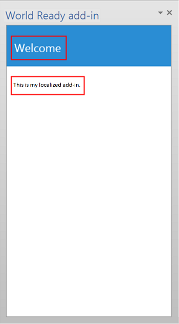
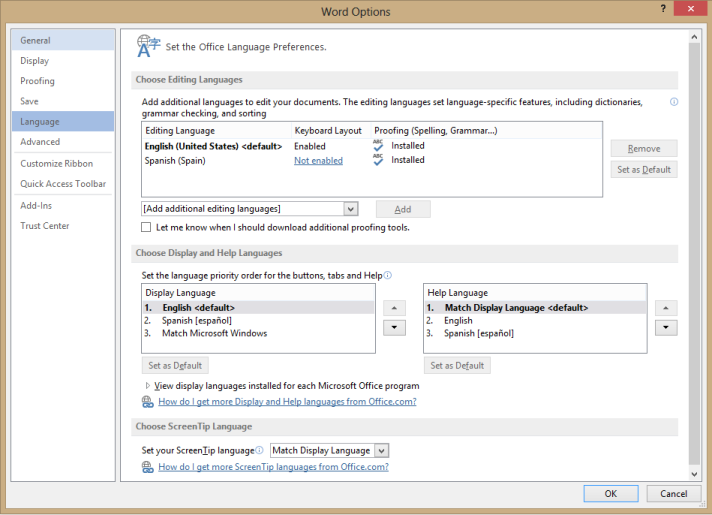

# Localization for Office Add-ins


You can implement any localization scheme that's appropriate for your Office Add-in. The JavaScript API and manifest schema of the Office Add-ins platform provide some choices. You can use the JavaScript API for Office to determine a locale and display strings based on the locale of the host application, or to interpret or display data based on the locale of the data. You can use the manifest to specify locale-specific add-in file location and descriptive information. Alternatively, you can use Microsoft Ajax script to support globalization and localization.

## Use the JavaScript API to determine locale-specific strings


The JavaScript API for Office provides two properties that support displaying or interpreting values consistent with the locale of the host application and data:


- [Context.displayLanguage](http://msdn.microsoft.com/library/732ba34c-c99f-4c00-836d-4250eb7f0dac.aspx) specifies the locale (or language) of the user interface of the host application. The following example verifies if the host application uses the en-US or fr-Fr locale, and displays a locale-specific greeting.
    
```js
      function sayHelloWithDisplayLanguage() {
        var myLanguage = Office.context.displayLanguage;
        switch (myLanguage) {
            case 'en-US':
                write('Hello!');
                break;
            case 'fr-FR':
                write('Bonjour!');
                break;
        }
    }
    // Function that writes to a div with id='message' on the page.
        function write(message){
        document.getElementById('message').innerText += message; 
     }

```

- [Context.contentLanguage](http://msdn.microsoft.com/library/4fd063c2-0cd0-4b5b-8993-93d7ff8ce3bf.aspx) specifies the locale (or language) of the data. Extending the last code sample, instead of checking the **displayLanguage** property:
    
    ```js
      var myLanguage = Office.context.displayLanguage;
    ```


    Assign  `myLanguage` to the **contentLanguage** property, and use the rest of the same code to display a greeting based on the locale of the data:
    


    ```js
      var myLanguage = Office.context.contentLanguage;
    ```


## Control localization from the manifest


Every Office Add-in specifies a [DefaultLocale](http://msdn.microsoft.com/library/04796a3a-3afa-dc85-db66-4677560c185c.aspx) element and a locale in its manifest. By default, the Office Add-in platform and Office host applications apply the values of the [Description](http://msdn.microsoft.com/library/bcce6bad-23d0-7631-7d8c-1064b8453b5a.aspx), [DisplayName](http://msdn.microsoft.com/library/529159ca-53bf-efcf-c245-e572dab0ef57.aspx), [IconUrl](http://msdn.microsoft.com/library/c7dac2d4-4fda-6fc7-3774-49f02b2d3e1e.aspx) (if present), [HighResolutionIconUrl](https://msdn.microsoft.com/en-us/library/office/dn592031.aspx) (if present), and **SourceLocation** elements to all locales. You can optionally support specific values for specific locales, by specifying an **Override** child element for each additional locale, for any of these five elements. The value for the **DefaultLocale** element and for the **Locale** attribute of the **Overrride** element is specified according to [RFC 3066](http://www.ietf.org/rfc/rfc3066.txt), "Tags for the Identification of Languages." Table 1 describes the localizing support for these elements.


**Table 1. Localization support**


|**Element**|**Localization support**|
|:-----|:-----|
|**Description***|Users in each locale you specify can see a localized description for the add-in in the Office Store (or private catalog).<br/>For Outlook add-ins, users can see the description in the Exchange Admin Center (EAC) after installation.|
|**DisplayName***|Users in each locale you specify can see a localized description for the add-in in the Office Store (or private catalog).<br/>For Outlook add-ins, users can see the display name as a label for the Outlook add-in button and in the EAC after installation.<br/>For content and task pane add-ins, users can see the display name in the ribbon after installing the add-in.|
|**IconUrl**|The icon image is optional. You can use the same override technique to specify a certain image for a specific culture. If you use and localize an icon, users in each locale you specify can see a localized icon image for the add-in.<br/>For Outlook add-ins, users can see the icon in the EAC after installing the add-in.<br/>For content and task pane add-ins, users can see the icon in the ribbon after installing the add-in.|
|**HighResolutionIconUrl** <br/><br/>**Important**  This element is available only when using add-in manifest version 1.1.|The high resolution icon image is optional but if it is specified, it must occur after the  **IconUrl** element. When **HighResolutionIconUrl** is specified, and the add-in is installed on a device that supports high dpi resolution, the **HighResolutionIconUrl** value is used instead of the value for **IconUrl**.<br/>You can use the same override technique to specify a certain image for a specific culture. If you use and localize an icon, users in each locale you specify can see a localized icon image for the add-in.<br/>For Outlook add-ins, users can see the icon in the EAC after installing the add-in.<br/>For content and task pane add-ins, users can see the icon in the ribbon after installing the add-in.|
|**SourceLocation**|Users in each locale you specify can see a webpage that you specifically design for the add-in for that locale. |

 >**Note** You can localize the description and display name for only the locales that Office supports. See [Language identifiers and OptionState Id values in Office 2013](http://technet.microsoft.com/en-us/library/cc179219.aspx) for a list of languages and locales for the current release of Office.


### Examples

For example, an Office Add-in can specify the  **DefaultLocale** as `en-us`. For the  **DisplayName** element, the add-in can specify an **Override** child element for the locale `fr-fr`, as shown below. 


```XML
<DefaultLocale>en-us</DefaultLocale>
...
<DisplayName DefaultValue="Video player">
    <Override Locale="fr-fr" Value="Lecteur vidéo" />
</DisplayName>
```

This means that the add-in assumes the  `en-us` locale by default. Users see the English display name of "Video player" for all locales unless the client computer's locale is `fr-fr`, in which case users would see the French display name "Lecteur vidéo".

The following example applies a locale override for the  **Description** element. It first specifies a default locale of `en-us` and an English description, and then specifies an [Override](http://msdn.microsoft.com/library/d6a0e4f3-1cc9-c544-89bf-8923c7434316.aspx) statement with a French description for the `fr-fr` locale:


```XML
<DefaultLocale>en-us</DefaultLocale>
...
<Description DefaultValue=
   "Watch YouTube videos referenced in the emails you receive 
   without leaving your email client.">
   <Override Locale="fr-fr" Value=
   "Visualisez les vidéos YouTube référencées dans vos courriers 
   électronique directement depuis Outlook et Outlook Web App."/>
</Description>
```

This means that the add-in assumes the  `en-us` locale by default. Users would see the English description in the **DefaultValue** attribute for all locales unless the client computer's locale is `fr-fr`, in which case they would see the French description.

In the following example, the add-in specifies a separate image that's more appropriate for the  `fr-fr` locale and culture. Users see the image DefaultLogo.png by default, except when the locale of the client computer is `fr-fr`. In this case, users would see the image FrenchLogo.png. 


```XML
<!-- Replace "domain" with a real web server name and path. -->
<IconUrl DefaultValue="https://<domain>/DefaultLogo.png"/>
    <Override Locale="fr-fr" Value="https://<domain>/FrenchLogo.png"/>
```

For the  **SourceLocation** element, supporting additional locales means providing a separate source HTML file for each of the specified locales. Users in each locale you specify can see a customized webpage that you design for that them.

For Outlook add-ins, the  **SourceLocation** element also aligns to the form factor. This allows you to provide a separate, localized source HTML file for each corresponding form factor. You can specify one or more **Override** child elements in each applicable settings element ([DesktopSettings](http://msdn.microsoft.com/library/da9fd085-b8cc-2be0-d329-2aa1ef5d3f1c.aspx), [TabletSettings](http://msdn.microsoft.com/library/5c89cc7c-7ae0-49c9-fdd5-4c52118228f6.aspx), or [PhoneSettings](http://msdn.microsoft.com/library/13e4eae3-8e8c-fd55-a1c2-3297b485f327.aspx)). The following example shows settings elements for the desktop, tablet, and smartphone form factors, each with one HTML file for the default locale and another for the French locale.


```XML
<DesktopSettings>
   <SourceLocation DefaultValue="https://contoso.com/Desktop.html">
      <Override Locale="fr-fr" Value="https://contoso.com/fr/Desktop.html" />
   </SourceLocation>
   <RequestedHeight>250</RequestedHeight>
</DesktopSettings>
<TabletSettings>
   <SourceLocation DefaultValue="https://contoso.com/Tablet.html">
      <Override Locale="fr-fr" Value="https://contoso.com/fr/Tablet.html" />
   </SourceLocation>
   <RequestedHeight>200</RequestedHeight>
</TabletSettings>
<PhoneSettings>
   <SourceLocation DefaultValue="https://contoso.com/Mobile.html">
      <Override Locale="fr-fr" Value="https://contoso.com/fr/Mobile.html" />
   </SourceLocation>

</PhoneSettings>

```


## Match date/time format with client locale


You can get the locale of the user interface of the hosting application by using the  **displayLanguage** property. You can then display date and time values in a format consistent with the current locale of the host application. One way to do that is to prepare a resource file that specifies the date/time display format to use for each locale that your Office Add-in supports. At run time, your add-in can use the resource file and match the appropriate date/time format with the locale obtained from the **displayLanguage** property.

You can get the locale of the data of the hosting application by using the  **contentLanguage** property. Based on this value, you can then appropriately interpret or display date/time strings. For example, the jp-JP locale expresses data/time values as yyyy/MM/dd, and the fr-FR locale, dd/MM/yyyy.


## Use Ajax for globalization and localization


If you use Visual Studio to create Office Add-ins, the .NET Framework and Ajax provide ways to globalize and localize client script files.

You can globalize and use the [Date](http://msdn.microsoft.com/library/caf98d32-2de2-4704-8198-692350343681.aspx) and [Number](http://msdn.microsoft.com/library/c216d3a1-12ae-47d1-bca1-c3666d04572f.aspx) JavaScript type extensions and the JavaScript [Date](http://msdn.microsoft.com/library/ce2202bb-7ec9-4f5a-bf48-3a04feff283e.aspx) object in the JavaScript code for an Office Add-in to display values based on the locale settings on the current browser. For more information, see [Walkthrough: Globalizing a Date by Using Client Script](http://msdn.microsoft.com/library/69b34e6d-d590-4d03-a763-b7ae54b47d74.aspx).

You can include localized resource strings directly in standalone JavaScript files to provide client script files for different locales, which are set on the browser or provided by the user. Create a separate script file for each supported locale. In each script file, include an object in JSON format that contains the resource strings for that locale. The localized values are applied when the script runs in the browser. 


## Example: Build a localized Office Add-in


This section provides examples that show you how to localize an Office Add-in description, display name, and UI.

To run the sample code provided, configure Microsoft Office 2013 on your computer to use additional languages so that you can test your add-in by switching the language used for display in menus and commands, for editing and proofing, or both.

Also, you'll need to create a Visual Studio 2015 Office Add-in project.


 >**Note**  To download Visual Studio 2015, see the [Office Developer Tools page](https://www.visualstudio.com/features/office-tools-vs). This page also has a link for the Office Developer Tools.


### Configure Office 2013 to use additional languages for display or editing

You can use an Office 2013 Language pack to install an additional language. For more information about Language Packs and where to get them, see [Office 2013 Language Options](http://office.microsoft.com/en-us/language-packs/).


 >**Note**  If you are an MSDN Subscriber, you might already have the Office 2013 Language Packs available to you. To determine whether your subscription offers Office 2013 Language Packs for download, go to [MSDN Subscriptions Home](https://msdn.microsoft.com/subscriptions/manage/), enter Office 2013 Language Pack in **Software downloads**, choose  **Search**, and then select  **Products available with my subscription**. Under  **Language**, select the check box for the Language Pack you want to download, and then choose  **Go**. 

After you install the Language Pack, you can configure Office 2013 to use the installed language for display in the UI, for editing document content, or both. The example in this article uses an installation of Office 2013 that has the Spanish Language Pack applied.


### Create an Office Add-in project


1. In Visual Studio, choose  **File** > **New Project**.
    
2. In the  **New Project** dialog box, under **Templates**, expand  **Visual Basic** or **Visual C#**, expand  **Office/SharePoint**, and then choose  **Office Add-ins**.
    
3. Choose  **Office Add-in**, and then name your add-in, for example WorldReadyAddIn. Choose  **OK**.
    
4. In the  **Create Office Add-in** dialog box, select **Task pane** and choose **Next**. On the next page, clear the check boxes for all host applications except Word. Choose  **Finish** to create the project.
    

### Localize the text used in your add-in


The text that you want to localize for another language appears in two areas:


-  **Add-in display name and description**. This is controlled by entries in the add-in manifest file.
    
-  **Add-in UI**. You can localize the strings that appear in your add-in UI by using JavaScript code—for example, by using a separate resource file that contains the localized strings.
    
To localize the add-in display name and description:


1. In  **Solution Explorer**, expand  **WorldReadyAddIn**,  **WorldReadyAddInManifest**, and then choose  **WorldReadyAddIn.xml**.
    
2. In WorldReadyAddInManifest.xml, replace the  **DisplayName** and **Description** elements with the following block of code:.
    
     >**Note**  You can replace the Spanish language localized strings used in this example for the  **DisplayName** and **Description** elements with the localized strings for any other language.

    ```XML
      <DisplayName DefaultValue="World Ready add-in">
        <Override Locale="es-es" Value="Aplicación de uso internacional"/>
      </DisplayName>
      <Description DefaultValue="An add-in for testing localization">
        <Override Locale="es-es" Value="Una aplicación para la prueba de la localización"/>
      </Description>
    ```

3. When you change the display language for Office 2013 from English to Spanish, for example, and then run the add-in, the add-in display name and description are shown with localized text. 
    
To lay out the add-in UI:


1. In Visual Studio, in  **Solution Explorer**, choose  **Home.html**.
    
2. Replace the HTML in Home.html with the following HTML.
    
    ```HTML
    <!DOCTYPE html>
    <html>
    <head>
        <meta charset="UTF-8" />
        <meta http-equiv="X-UA-Compatible" content="IE=Edge" />
        <title></title>
        <script src="../../Scripts/jquery-1.8.2.js" type="text/javascript"></script>
    
        <link href="../../Content/Office.css" rel="stylesheet" type="text/css" />
        <script src="https://appsforoffice.microsoft.com/lib/1.0/hosted/office.js" type="text/javascript"></script>
    
        <!-- To enable offline debugging using a local reference to Office.js, use:                        -->
        <!-- <script src="../../Scripts/Office/MicrosoftAjax.js" type="text/javascript"></script>          -->
        <!--    <script src="../../Scripts/Office/1.0/office.js" type="text/javascript"></script>          -->
    
        <link href="../App.css" rel="stylesheet" type="text/css" />
        <script src="../App.js" type="text/javascript"></script>
    
        <link href="Home.css" rel="stylesheet" type="text/css" />
        <script src="Home.js" type="text/javascript"></script> <body>
        <!-- Page content -->
        <div id="content-header">
            <div class="padding">
                <h1 id="greeting"></h1>
            </div>
        </div>
        <div id="content-main">
            <div class="padding">
                <div>
                    <p id="about"></p>
                </div>            
            </div>
        </div>
    </head>
    </html>
    ```

3. In Visual Studio, choose  **File**,  **Save AddIn\Home\Home.html**.
    
Figure 3 shows the heading (h1) element and the paragraph (p) element that will display localized text when your sample add-in runs.

**Figure 3. The add-in UI**




#### Add the resource file that contains the localized strings


The JavaScript resource file contains the strings used for the add-in UI. The sample add-in UI has an h1 element that displays a greeting, and a p element that introduces the add-in to the user. 

To enable localized strings for the heading and paragraph, you place the strings in a separate resource file. The resource file creates a JavaScript object that contains a separate JavaScript Object Notation (JSON) object for each set of localized strings. The resource file also provides a method for getting back the appropriate JSON object for a given locale. 

To add the resource file to the add-in project:


1. In  **Solution Explorer** in Visual Studio, choose the **Add-in** folder in the web project for the sample add-in, and choose **Add** > **JavaScript file**.
    
2. In the  **Specify Name for Item** dialog box, enterUIStrings.js.
    
3. Add the following code to the UIStrings.js file.

    ```js
      /* Store the locale-specific strings */
    
    var UIStrings = (function ()
    {
        "use strict";
    
        var UIStrings = {};
    
        // JSON object for English strings
        UIStrings.EN =
        {        
            "Greeting": "Welcome",
            "Introduction": "This is my localized add-in."        
        };
    
    
        // JSON object for Spanish strings
        UIStrings.ES =
        {        
            "Greeting": "Bienvenido",
            "Introduction": "Esta es mi aplicación localizada."
        };
    
        UIStrings.getLocaleStrings = function (locale)
        {
            var text;
            
            // Get the resource strings that match the language.
            switch (locale)
            {
                case 'en-US':
                    text = UIStrings.EN;
                    break;
                case 'es-ES':
                    text = UIStrings.ES;
                    break;
                default:
                    text = UIStrings.EN;
                    break;
            }
    
            return text;
        };
    
        return UIStrings;
    })();
    ```

The UIStrings.js resource file creates an object,  **UIStrings**, which contains the localized strings for your add-in UI. 

#### Localize the text used for the add-in UI


To use the resource file in your add-in, you'll need to add a script tag for it on Home.html. When Home.html is loaded, UIStrings.js executes and the  **UIStrings** object that you use to get the strings is available to your code. Add the following HTML in the head tag for Home.html to make **UIStrings** available to your code.


```HTML
<!-- Resource file for localized strings:                                                          -->
<script src="../UIStrings.js" type="text/javascript"></script>
```

Now you can use the  **UIStrings** object to set the strings for the UI of your add-in.

If you want to change the localization for your add-in based on what language is used for display in menus and commands in the host application, you use the  **Office.context.displayLanguage** property to get the locale for that language. For example, if the host application language uses Spanish for display in menus and commands, the **Office.context.displayLanguage** property will return the language code es-ES.

If you want to change the localization for your add-in based on what language is being used for editing document content, you use the  **Office.context.contentLanguage** property to get the locale for that language. For example, if the host application language uses Spanish for editing document content, the **Office.context.contentLanguage** property will return the language code es-ES.

After you know the language the host application is using, you can use  **UIStrings** to get the set of localized strings that matches the host application language.

Replace the code in the Home.js file with the following code. The code shows how you can change the strings used in the UI elements on Home.html based on either the display language of the host application or the editing language of the host application.


 >**Note**  To switch between changing the localization of the add-in based on the language used for editing, uncomment the line of code  `var myLanguage = Office.context.contentLanguage;` and comment out the line of code `var myLanguage = Office.context.displayLanguage;`


```js
/// <reference path="../App.js" />
/// <reference path="../UIStrings.js" />


(function () {
    "use strict";

    // The initialize function must be run each time a new page is loaded.
    Office.initialize = function (reason)
    {
       
        $(document).ready(function () {
            app.initialize();

            // Get the language setting for editing document content.
            // To test this, uncomment the following line and then comment out the
            // line that uses Office.context.displayLanguage.
            // var myLanguage = Office.context.contentLanguage;

            // Get the language setting for UI display in the host application.
            var myLanguage = Office.context.displayLanguage;            
            var UIText;

            // Get the resource strings that match the language.
            // Use the UIStrings object from the UIStrings.js file
            // to get the JSON object with the correct localized strings.
            UIText = UIStrings.getLocaleStrings(myLanguage);            

            // Set localized text for UI elements.
            $("#greeting").text(UIText.Greeting);
            $("#about").text(UIText.Instruction);
        });
    };    
})();
```


### Test your localized add-in


To test your localized add-in, change the language used for display or editing in the host application and then run your add-in. 

To change the language used for display or editing in your add-in:


1. In Word 2013, choose  **File**,  **Options**,  **Language**. Figure 4 shows the  **Word Options** dialog box opened to the Language tab.
    
    **Figure 4. Language options in the Word 2013 Options dialog box**

    

2. Under  **Choose Display and Help Languages**, select the language that you want for display, for example Spanish, and then choose the up arrow to move the Spanish language to the first position in the list. Alternatively, to change the language used for editing, under  **Choose editing languages**, choose the language you want to use for editing, for example, Spanish, and then choose  **Set as Default**.
    
3. Choose  **OK** to confirm your selection, and then close Word.
    
Run the sample add-in. The taskpane add-in loads in Word 2013, and the strings in the add-in UI change to match the language used by the host application, as shown in Figure 5.


**Figure 5. Add-in UI with localized text**


## Additional resources


- [Design guidelines for Office Add-ins](../../docs/design/add-in-design.md)
    
- [Language identifiers and OptionState Id values in Office 2013](http://technet.microsoft.com/en-us/library/cc179219%28Office.15%29.aspx)
    
