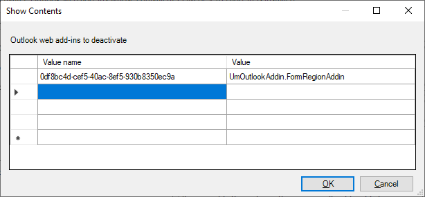

# Make your Office Add-in compatible with an existing COM add-in

If you have an existing COM add-in, you can build some or all of that functionality into your Office Web Add-in, thereby enabling your solution to run on other platforms such as Office on the web or Mac. In some cases, your Office Add-in may not be able to provide all of the functionality that's available in the corresponding COM add-in. In these situations, your COM add-in may provide a better user experience on Windows than the corresponding Office Add-in can provide.

[!INCLUDE [new-outlook-vsto-com-support](../includes/new-outlook-vsto-com-support.md)]

With the equivalent add-ins feature, you can configure your Office Add-in so that when the equivalent COM add-in is installed on a user's computer, Office on Windows runs the COM add-in instead of the Office Add-in. A COM add-in is called "equivalent" to an Office Add-in when the following conditions apply.

- They're both created by the same developer, typically the entity specified in the [`"developer"`](/microsoft-365/extensibility/schema/root-developer) property of the unified manifest or the [ProviderName](/javascript/api/manifest/providername) element in the add-in only manifest.
- They both are designed to be installed on the same Office application or applications, and they address the same workload with mainly overlapping functionality.
- They have identical, or highly similar, public names, and user interfaces including control names and icons.

If the COM add-in is ever uninstalled, Office will automatically activate the Office Add-in the next time the host Office application is started.
[!INCLUDE [Support note for equivalent add-ins feature](../includes/equivalent-add-in-support-note.md)]

> [!TIP]
> Currently, the COM add-in is always given preference to the Office Add-in. But there's an enhancement to this feature in preview that provides you with a way to reverse this preference or to give the user a choice between the COM add-in and Office Add-in. For more information, see [Option to disable the COM add-in instead (preview)](#option-to-disable-the-com-add-in-instead-preview).

## Specify an equivalent COM add-in

### Obtain the ProgId of a COM add-in

Before you can specify an equivalent COM add-in, you must first identify its `ProgId`. To obtain the `ProgId` of a COM add-in:

1. Open Windows Registry Editor on the computer where the COM add-in is installed.
1. Go to **HKEY_LOCAL_MACHINE\SOFTWARE\Microsoft\Office\\*<Office application\>*\Addins** or **HKEY_CURRENT_USER\SOFTWARE\Microsoft\Office\\*<Office application\>*\Addins**, where *\<Office application\>* is Excel, Outlook, PowerPoint, or Word. For example, **HKEY_LOCAL_MACHINE\SOFTWARE\Microsoft\Office\Excel\Addins**.
1. Copy the name of the registry key associated with the COM add-in you need. Note that the names are case-sensitive.

### Configure the manifest

> [!IMPORTANT]
> Applies to Excel, Outlook, PowerPoint, and Word.

To enable compatibility between your Office Add-in and COM add-in, identify the equivalent COM add-in in the [manifest](add-in-manifests.md) of your Office Add-in. Then, Office on Windows will use the COM add-in instead of the Office Add-in, if they're both installed. The configuration depends on the type of manifest that is being used.

# [Unified manifest for Microsoft 365](#tab/jsonmanifest)

The following example shows the portion of the manifest that specifies a COM add-in as an equivalent add-in. The value of the [`"alternates.prefer.comAddin.progId"`](/microsoft-365/extensibility/schema/extension-alternate-versions-array-prefer-com-addin#progid) property identifies the COM add-in.

```json
"extensions" [
  ...
  "alternates" [
    {
      "prefer": {
        "comAddin": {
          "progId": "ContosoCOMAddin"
        }
      }
    }
  ]
]
```

> [!TIP]
>
> - For information about COM add-in and XLL UDF compatibility, see [Make your custom functions compatible with XLL user-defined functions](../excel/make-custom-functions-compatible-with-xll-udf.md). Not applicable for Outlook.
> - If you're unable to specify the `alternates.prefer` property in the manifest of your Outlook web add-in, you must configure Group Policy instead. This only applies to Outlook. For guidance, see [Configure the Group Policy setting for Outlook add-ins](#configure-the-group-policy-setting-for-outlook-add-ins).

# [Add-in only manifest](#tab/xmlmanifest)

The following example shows the portion of the manifest that specifies a COM add-in as an equivalent add-in. The value of the `ProgId` element identifies the COM add-in and the [EquivalentAddins](/javascript/api/manifest/equivalentaddins) element must be positioned immediately before the closing `VersionOverrides` tag.

```xml
<VersionOverrides>
  ...
  <EquivalentAddins>
    <EquivalentAddin>
      <ProgId>ContosoCOMAddin</ProgId>
      <Type>COM</Type>
    </EquivalentAddin>
  </EquivalentAddins>
</VersionOverrides>
```

> [!TIP]
>
> - For information about COM add-in and XLL UDF compatibility, see [Make your custom functions compatible with XLL user-defined functions](../excel/make-custom-functions-compatible-with-xll-udf.md). Not applicable for Outlook.
> - If you're unable to specify the **\<EquivalentAddins\>** element in the manifest of your Outlook web add-in, you must configure Group Policy instead. This only applies to Outlook. For guidance, see [Configure the Group Policy setting for Outlook add-ins](#configure-the-group-policy-setting-for-outlook-add-ins).

---

### Configure the Group Policy setting for Outlook add-ins

For Outlook web add-ins, if you're unable to update the add-in's manifest to specify the **\<EquivalentAddins\>** element, you must identify the equivalent COM add-in in the **Deactivate Outlook web add-ins whose equivalent COM or VSTO add-in is installed** Group Policy setting instead. This setting must be configured on the user's machine. Then, classic Outlook on Windows will use the COM add-in instead of the web add-in if they're both installed.

> [!NOTE]
> Configuring the Group Policy setting isn't necessary if the add-in's manifest already contains an **\<EquivalentAddins\>** section.

1. Download the latest [Administrative Templates tool](https://www.microsoft.com/download/details.aspx?id=49030), paying attention to the tool's **Install Instructions**.
1. Open the Local Group Policy Editor (**gpedit.msc**).
1. Navigate to **User Configuration** > **Administrative Templates**  > **Microsoft Outlook 2016** > **Miscellaneous**.
1. Select the setting **Deactivate Outlook web add-ins whose equivalent COM or VSTO add-in is installed**.
1. Open the link to edit the policy setting.
1. In the dialog **Outlook web add-ins to deactivate**:
    1. Set **Value name** to the `Id` found in the web add-in's manifest. **Important**: Do *not* add curly braces `{}` around the entry.
    1. Set **Value** to the `ProgId` of the equivalent COM add-in.
    1. Select **OK** to put the update into effect.

    

## Equivalent behavior for users

When an [equivalent COM add-in is specified](#specify-an-equivalent-com-add-in), Office on Windows will not display your Office Add-in's user interface (UI) if the equivalent COM add-in is installed. Office only hides the ribbon buttons of the Office Add-in and doesn't prevent installation. Therefore, your Office Add-in will still appear in the following locations within the UI.

- Under **My add-ins**.
- As an entry on the ribbon manager (Excel, Word, and PowerPoint only).

> [!NOTE]
> Specifying an equivalent COM add-in in the manifest has no effect on other platforms, like Office on the web or on Mac.

The following scenarios describe what happens depending on how the user acquires the Office Add-in.

### AppSource acquisition of an Office Add-in

If a user acquires the Office Add-in from AppSource and the equivalent COM add-in is already installed, then Office will:

1. Install the Office Add-in.
2. Hide the Office Add-in UI on the ribbon.
3. Display a call-out for the user that points out the COM add-in ribbon button.

### Centralized deployment of Office Add-in

If an admin deploys the Office Add-in to their tenant using centralized deployment, and the equivalent COM add-in is already installed, the user must restart Office before they'll see any changes. After Office restarts, it will:

1. Install the Office Add-in.
2. Hide the Office Add-in UI on the ribbon.
3. Display a call-out for the user that points out the COM add-in ribbon button.

### Document shared with embedded Office Add-in

If a user has the COM add-in installed, and then gets a shared document with the embedded Office Add-in, then when they open the document, Office will:

1. Prompt the user to trust the Office Add-in.
2. If trusted, the Office Add-in will install.
3. Hide the Office Add-in UI on the ribbon.

## Other COM add-in behavior

### Excel, PowerPoint, Word

If a user uninstalls the equivalent COM add-in, then Office on Windows restores the Office Add-in UI.

After you specify an equivalent COM add-in for your Office Add-in, Office stops processing updates for your Office Add-in. To acquire the latest updates for the Office Add-in, the user must first uninstall the COM add-in.

### Outlook

The COM add-in must be connected when Outlook is started in order for the corresponding web add-in to be disabled.

If the COM add-in is then disconnected during a subsequent Outlook session, the web add-in will likely remain disabled until Outlook is restarted.

## Option to disable the COM add-in instead (preview)

> [!NOTE]
> The feature described in this section is in preview and shouldn't be used in a production add-in. It has the following limitations.
>
> - It's supported only for Excel, PowerPoint, and Word.
> - The minimum Office version that supports the feature depends on the type of manifest that add-in has.
>
>    - **Unified manifest for Microsoft 365**: ??????
>    - **Add-in only manifest**: Subscription Office on Windows Version 2505 (Build 18925.20042).

Use manifest markup to specify whether the COM add-in or the Office Add-in should be disabled and hidden on a Windows computer when they conflict, or give the user that is installing the Office Add-in the choice of which to use.

If you configure the manifest to give the user the choice, then the user sees a dialog similar to the following when they install the Office Add-in. The **Learn more** link in the dialog points to the following help page that provides information to help the user make the decision: [Resolve version conflicts for Office Add-ins](https://support.microsoft.com/office/1632ec51-82ed-4f8e-90b4-a246cbccccde).

:::image type="content" source="../images/com-preference-prompt.png" alt-text="A dialog titled 'Contoso JS Add-in Installer'. The first paragraph says 'Contoso JS Add-in has identified the following older versions of the add-in that may cause conflicts:'. Below this paragraph is a single bulleted paragraph that says 'COM Add-in name: Contoso'. Below this is a paragraph that says 'Do you want to disable the older add-in versions? (If you choose No, you will still get the new version if you open Office on Mac or Office on the web.)'. Below this is a link labelled 'Learn more'. Below this are two buttons labelled Yes and No.":::

If the user chooses **Yes** and Office successfully disables and hides the COM add-in, then a dialog similar to the following opens that advises the user to restart the Office application.

:::image type="content" source="../images/com-preference-disable-success.png" alt-text="A dialog titled 'The Older Version Add-in Disabled'. The first paragraph says 'The older version of the add-in has been successfully disabled.' Below this a paragraph says 'To ensure the changes take effect, we recommend restarting this Office application. You can continue without restarting, but some updates may not be applied until the next launch.' Below this is an OK button.":::

If the user chooses **Yes** but Office can't disable the COM add-in for any reason, then a dialog similar to the following opens that advises the user to manually disable the COM add-in.

:::image type="content" source="../images/com-preference-disable-failure.png" alt-text="A dialog titled 'Please Disable Add-in Manually'. The first paragraph says 'The older version of the add-in could not be fully disabled. To complete the process, please manually disable the COM add-in in the Office application where it was installed.' Below this are instructions labelled 'Here's how'. The instructions read as follows '1. Go to File, Options, Add-ins. 2. In the Manage dropdown at the bottom, choose the add-in type and click Go. 3. In the dialog, uncheck the add-in to disable it. 4. Restart the app to apply changes (optional but recommended). Below this is an OK button.":::

The details to configure this feature depend on which type of manifest is being used by the Office Add-in.

# [Unified manifest for Microsoft 365](#tab/jsonmanifest)

To disable the COM add-in instead of the Office Add-in (or to give the user the choice), use the `alternates.hide.windowsExtensions` and `alternates.hide.windowsExtensions.effect` properties. The two possible values of the `effect` property and their effects are as follows:

- **disableWithNotification**: All of the COM add-ins specified in the child `comAddin.progIds` array of the `windowsExtensions` property are disabled and hidden. A popup dialog notifies the user that this is happening.
- **userOptionToDisable**: The user is prompted to choose whether to disable and hide the COM add-ins specified in the child `comAddin.progIds` array of the `windowsExtensions` property or to disable and hide the Office Add-in.

> [!NOTE]
> To force the COM add-in to be enabled and the Office Add-in to be disabled and hidden on the Windows computer, use the `alternates.prefer` property as described in [Configure the manifest](?tabs=jsonmanifest#configure-the-manifest).

In the following example, the user will be prompted whether to disable the COM add-in "COM.addin.1" or to disable the Office Add-in.

```json
"extensions" [
  {   
    ...
    "alternates": [
      {
        "hide": {
          "windowsExtensions": {
            "effect": "userOptionToDisable",
            "comAddin": {
              "progIds": [
                "COM.Addin.1"
              ]
            }
          }
        }
      }
    ]
  }
]
```

# [Add-in only manifest](#tab/xmlmanifest)

To configure which add-in is used (or give the user the choice), there is an optional **\<Effect\>** child of the **\<EquivalentAddins\>** element that has one of the following effects when the Office Add-in is installed, depending on which of two possible values it's set to.

- **DisableWithNotification**: All of the COM add-ins specified in the child **\<EquivalentAddin\>** elements will be disabled and hidden. A popup dialog notifies the user that this happening.
- **UserOptionToDisable**: The user is prompted to choose whether to disable and hide COM add-ins specified in the child **\<EquivalentAddin\>** elements or to disable and hide the Office Add-in.

> [!NOTE]
> If the **\<Effect\>** element isn't present, the COM add-in is enabled and the Office Add-in is disabled and hidden on the Windows computer.

The following is an example. The **\<Effect\>** element must be after all the **\<EquivalentAddin\>** elements.

```xml
<VersionOverrides>
  ...
  <EquivalentAddins>
    <EquivalentAddin>
      <ProgId>ContosoCOMAddin</ProgId>
      <Type>COM</Type>
    </EquivalentAddin>
    <Effect>UserOptionToDisable</Effect>
  </EquivalentAddins>
</VersionOverrides>
```

---

## See also

- [Make your Custom Functions compatible with XLL User Defined Functions](../excel/make-custom-functions-compatible-with-xll-udf.md)
