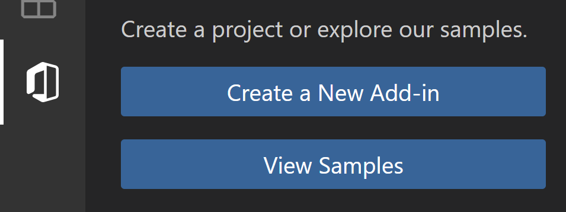
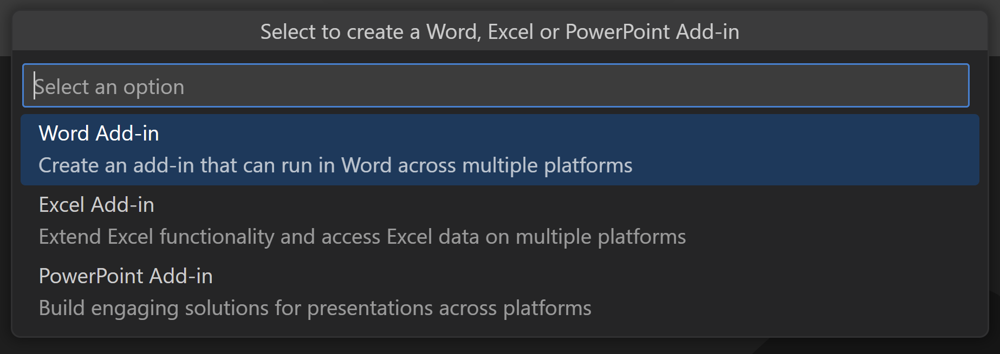
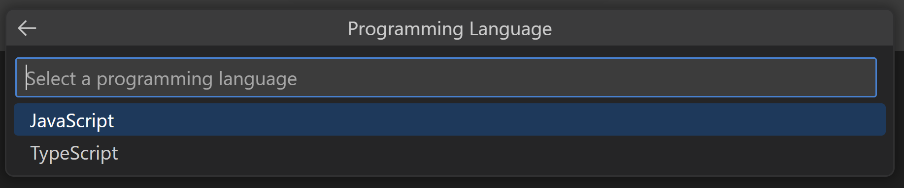
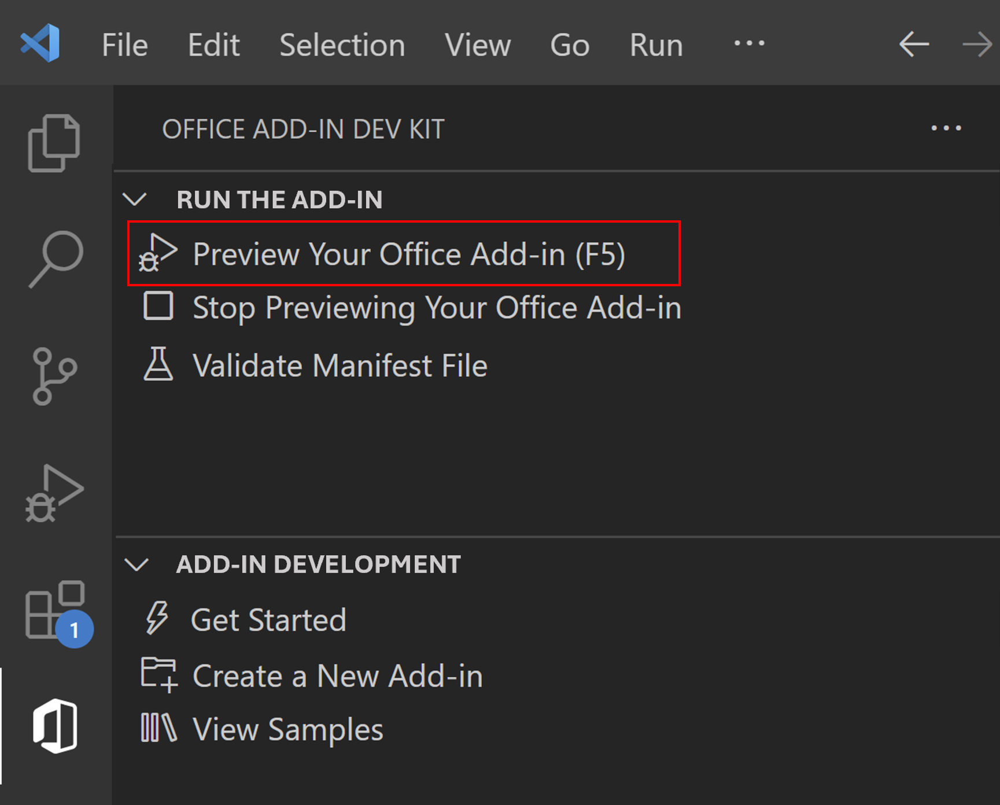

# Create Office Add-in projects using Office Add-ins Development Kit for Visual Studio Code (preview)

The Office Add-ins Development Kit helps developers set up the environment, create and build Office JS add-ins with a steamlined developer experience in Visual Studio Code.

- Add-ins created with Office Add-ins Development Kit use the [XML-formatted add-in only manifest](xml-manifest-overview.md).
- Only Excel, PowerPoint and Word add-ins can be created at this time. We're working hard to enable support for add-ins to other Office applications and platforms.

Install the latest version of Office Add-ins Development Kit into Visual Studio Code as described in [Install Office Add-ins Development Kit](install-office-add-ins-development-kit.md).

## Create an add-in project

1. Open Visual Studio Code and select the Office Add-ins Development Kit icon  in the **Activity Bar**.

1. Select **Create a New Add-in**.

    
    
1. In the drop down that opens, select an Office app that you want to build the add-in for.

    

1. Select an add-in template from the list of available templates.
1. Select JavaScript/TypeScript as the programming language.

    

1. In the **Workspace folder** dialog that opens, select the folder where you want to create the project.
1. Give a name to the project (with no spaces) when prompted. Office Add-ins Development Kit will create the project with basic files and scaffolding. It will then open the project *in a second Visual Studio Code window*. Close the original Visual Studio Code window.

## Preview your add-in in Office apps

To understand how the add-in will work in Office apps, you can use the Office Add-ins Development Kit to easily run and debug your Office add-in in your local dev environment.

### Preview Your Office Add-in (F5)

Select **Preview Your Office Add-in(F5)** to launch the add-in and debug the code. In the drop down menu, select the option **Desktop (Edge Chromium)**.

The extension then checks that the prerequisites are met before debugging starts. Check the terminal for detailed information if there are issues with your environment. After this process, the Office desktop application launches and sideloads the add-in.

### Stop Previewing Your Office Add-in

Once you are finished testing and debugging the add-in, select **Stop Previewing Your Office Add-in**. This closes the web server and removes the add-in from the registry and cache.

## Troubleshooting

If you have problems running the add-in, take these steps.
- Close any open instances of Office.
- Close the previous web server started for the add-in with the **Stop Previewing Your Office Add-in** Office Add-ins Development Kit extension option.

If you still have problems, see [troubleshoot development errors](https://learn.microsoft.com//office/dev/add-ins/testing/troubleshoot-development-errors) or [create a GitHub issue](https://aka.ms/officedevkitnewissue) and we'll help you.  

For information on running the add-in on Office on the web, see [Sideload Office Add-ins to Office on the web](https://learn.microsoft.com/office/dev/add-ins/testing/sideload-office-add-ins-for-testing).

For information on debugging on older versions of Office, see [Debug add-ins using developer tools in Microsoft Edge Legacy](https://learn.microsoft.com/office/dev/add-ins/testing/debug-add-ins-using-devtools-edge-legacy).
