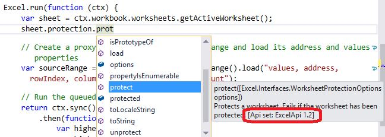

# Office.js API versioning 

| | |
|:--|:--|
||**This article is an excerpt from the book [Building Office Add-ins using Office.js](https://leanpub.com/buildingofficeaddins) by Michael Zlatkovsky, available for purchase as an e-book on LeanPub.com.**  Copyright © 2016-2017 by Michael Zlatkovsky, all rights reserved.|

There are several aspects to the versioning of the Office.js library.

## The JavaScript files 

First, there is versioning of the actual **JavaScript source files**.  Fortunately, this part is pretty simple:  you **always want the latest and greatest of the production Office.js**, which is conveniently obtainable through the CDN:
https://appsforoffice.microsoft.com/lib/1/hosted/Office.js.

In addition to the CDN, the production Office.js files are also shipped as a NuGet package to allow corporate firewalled development or offline development.  That said, the NuGet may lag several weeks behind the CDN, and any Store-bound add-ins are *required* to reference the production CDN location anyway.  So, in terms of Office.js versions, there isn't really much to the versioning of the actual JS files:  by far and away the best choice is to reference the evergreen, frequently-updated, always-backwards-compatible, Store-required CDN version.

## The host capabilities 

The more interesting bit for versioning are the **actual API capabilities that are offered by each host**.  Just because you have the latest and greatest JavaScript does not mean that older clients will be able to make use of all of it.  While some of your customers might be on the latest-and-greatest versions of Office, others won't be!  In particular, Office 2016 RTM will always only have access to the original set of Office 2016 APIs -- period.  And even customers who own subscription versions of office (Office 365 / click-to-run) might still be on older versions of the supposedly-evergreen version, depending on whether they are on the *Current Channel* or the *Deferred Channel* of Office 365.  This intersection of native-application-versioning to javascript-versioning is where things get trickly.

The solution to this complexity (albeit complex in its own right) is *Requirement Sets*.  For example, if you look at the [Excel API sets](https://dev.office.com/reference/add-ins/requirement-sets/excel-api-requirement-sets) documentation, you will see that the 2016 wave of Excel APIs has had three versions as of December 2016:  1.1, 1.2, and 1.3.  ExcelApi 1.1 was what shipped with Office 2016 RTM in September 2015; 1.2 shipped in early March 2016; and 1.3 shipped in October of 2016.  Each API set version has a corresponding Office host version that supports this API set. The version numbers are listed in the table, and there are links below the table to find a mapping from build numbers to dates.

The following image shows the table; see the [Excel JavaScript API requirement sets](../../reference/requirement-sets/excel-api-requirement-sets.md) topic for the latest content.

Each of the API set versions contain a number of fairly large features, as well as incremental improvements to existing features.  The topic for each requirement set, such as the link above, will provide a detailed listing of each of those features.  And as you're programming, if you are using the JavaScript or TypeScript IntelliSense, you should be able to see the API versions for each of your APIs displayed as part of the IntelliSense:

You can use the requirement set in one of two ways.  You can declare in the manifest that "I need API set ExcelApi 1.2, or else my add-in doesn't work at all" -- and that's fine, but then of course you aren't able to service older hosts, and so your add-in won't even show up there.  Alternatively, if you add-in could *sorta* work in a 1.1 environment, but you want to *light-up* additional functionality on newer hosts that support it, you can use the manifest to declare only your minimal API sets that you need (e.g., ExcelApi 1.1), and then do runtime checks for higher version numbers via the `isSetSupported` API.

For example, suppose that you are exporting some data to a new sheet, and you'd ideally like to autofit the column width -- but this is only available in ExcelApi 1.2.  Rather than block the add-in outright from running on an older host, you can do a light-up scenario on newer hosts that support the API, and skip over the functionality otherwise:

**Light-up functionality for a newer API set**

~~~
Excel.run(context => {
    let data = [
    	["Name", "Phone number"]
    	["Joe Doe", "425-123-4567"],
    	...
    ]
    let newSheet = workbook.worksheets.add();
    let dataRange = newSheet.getCell(0, 0)
    	.getResizedRange(values.length - 1, values[0].length - 1);
    dataRange.values = data;
    
    // markua-start-insert
    if (Office.context.requirements.isSetSupported("ExcelApi", 1.2)) {
    	dataRange.format.autofitColumns();
    }
    // markua-end-insert
    
    await context.sync();
})
~~~

> **Important:** Version numbers are *per API SET*
> To be very clear: Version numbers such as `ExcelApi 1.3` are relative *to the API set iself*, but has nothing to do with the version numbers of Office.js or of other API sets.  The different requirement sets move at completely different speeds (which makes sense -- you wouldn't want Excel APIs to be delayed by a few months, simply so that the Excel's 1.3 set can ship at the same time as Word's 1.3 set).
> Because of this, Office.js is an amalgam of different API Set version numbers at any given time.  So, while there is definitely such a thing as `ExcelApi 1.3`, ***there is no Office.js 1.3***.  It's always the single evergreen Office endpoint, and a variety of versioned API Sets that comprise it.

## The Beta Endpoint 

In addition to the production CDN, there is also a **beta** endpoint;  with the same URL but with "beta" in place of "1". Thus, the full Beta URL is https://appsforoffice.microsoft.com/lib/**beta**/hosted/Office.js

Before describing this beta endpoint, it's worth explaining the general lifecycle of an API.  It goes something like this:

1. Before any implementation starts, requirements & feature requests are gathered via a variety of channels (UserVoice, StackOverflow, conversations with partners, etc).
2. From those requirements, a number of feature areas (groups of related API functionality) are chosen to be the team's focus for the next release (where "release" is an increment to an API set, generally spaced out every 3-4 months). The APIs are then designed and iterated on.
3. When the design is ready, and roughly at the same time as implementation begins, the API specs are posted as part of the "Open Spec" process (<https://dev.office.com/reference/add-ins/openspec>), and feedback is gathered from members of the community (and incorporated into the design -- the sooner we get the feedback, the better!). The APIs might also be expanded to include related functionality, or tweaked based on implementation constraints.
4. The implementation is complete; but the actual release of the full API set might be another couple months away.  This is where the **beta** process comes in: for folks who are on the Office Insider Fast builds, they may be able to get the APIs and experiment with them a couple months ahead of their production rollout.  This is useful to developers so that they can plan ahead and be ready with new features once the API makes it out publicly; and it can also act as a catalyst for providing feedback about the API from real-life usage, rather than just imagining it in spec form.
5. Some time later, the API becomes part of the next wave of API sets, and is shipped to the world.

To use the beta endpoint, simply change out the script reference, and try out some APIs that you see in the open spec.  Some might be ready; others might not.  If you encounter a JavaScript runtime error to the tune of a nonexistant object or function, it's not part of the Beta endpoint yet; if the JavaScript is OK but you get an "`ApiNotFound`" error, you do not have a sufficently recent build (or perhaps no such build exists, yet).  Desktop, and sometimes Office Online, are the first two channels where the APIs are made available during the beta stage; the other platforms migth only receive the APIs once they roll into production.

There are a few caveats to the beta endpoint:

* It is inherently more experiemntal in nature, and should *not* be used for production.
* Any new APIs therein are effectively in preview mode, and might change at any time.  Possible changes include renaming, postponing (moving to a later API set), or having the API be removed or reworked altogether.
* While an API is part of an actively-worked-on (not-yet-shipped) API set version, the `isSetSupported` for said version will return `false` (regardless of production or beta JavaScript), so you won't be able to perform this check for the new APIs, until they make it into production.

All this being said:  As you become more familiar with the platform, and especially as you see features that you care about become open-spec-ed, I strongly encourage you to participate in the feedback process, and to use the beta endpoint to validate that the design meets your needs.  And as always, questions or feedback on StackOverflow about the APIs -- whether production or beta -- are always welcome.

### Tip: Writing `isSetSupported` for the Beta endpoint

As noted earlier, APIs in beta will not show `isSetSupported` as `true` until the functionality is already production-ready (see next section).  But on the other hand, what if you want to write the code just as you would for production, without changing a line (i.e., without needing to go back and uncomment the previously-commented-out `if` statements?)

My personal trick for this: go ahead and write your `isSetSupported` checks and `if` statements just as you would for a regular production API.  Go to your main HTML page (which ideally you have two copies of -- one for production, and one for development, where you can reference the Beta CDN) and write in the following script tag right beneath your beta CDN reference (let's assume that the API set you care about is `ExcelApi`; and you effectively want *any* new APIs to show up as if they are fully supported, for testing purposes):

 ~~~
   (function() {
     var originalIsSetSupported = Office.requirements.isSetSupported;
     Office.requirements.isSetSupported = function (apiSet, version) {
       if (apiSet === 'ExcelApi') { return true; }
       return originalIsSetSupported(apiSet, version);
     };
   })();
~~~

Essentially, the script above will return `true` for any API at all that is part of the API set that you want the latest-and-greatest beta functinality of (in this case, `ExcelApi`), and otherwise will redirect to the original `isSetSupported` function.

## How can you know than an API is "production-ready"? 

An API is production-ready when you look at the IntelliSense, see what API set version the API is supposed to be a part of, do `isSetSupported` on that version number, and see it return `true`.

This moment should roughly correspond with:

* Seeing the API listed in the documentation, no longer under an Open Spec.
* Seeing its IntelliSense listed in a public place like [DefinitelyTyped](https://github.com/DefinitelyTyped/DefinitelyTyped/blob/master/office-js/index.d.ts).

Note that some platforms might be ahead of others, with desktop generally leading.  So just because `isSetSupported` returns `true` on desktop, doesn't mean that it will necessarily return `true` on the Mac at the very same moment (though it generally will, within a month or two's time).  But the different cadence of implementation is precisely why `isSetSupported` (and/or manifest-based requirements specification) is needed in the first place.  As long as you surround any light-up functionality with `isSetSupported`, or add the manifest requirement, you shouldn't need to worry about what APIs are made available when; when the functionality becomes available on the given platform, your add-in will "just work" there.
