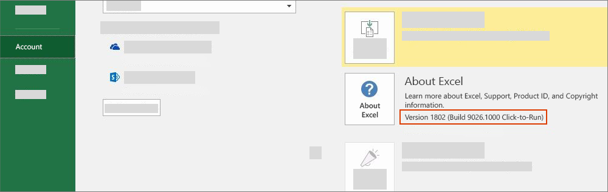

# Office versions and requirement sets

There are many versions of Office on several platforms, and they don't all support every API in Office JavaScript API (Office.js). Office 2013 on Windows was the earliest version of Office that supported Office Add-ins. You may not always have control over the version of Office your users have installed. To handle this situation, we provide a system called requirement sets to help you determine whether an Office application supports the capabilities you need in your Office Add-in.

> [!NOTE]
>
> - Office runs across multiple platforms, including Windows, in a browser, Mac, and iPad.
> - Examples of Office applications are Office products: Excel, Word, PowerPoint, Outlook, OneNote, and so forth.
> - Office is available by a Microsoft 365 subscription or perpetual license. The perpetual version is available by volume-licensing agreement or retail.
> - A requirement set is a named group of API members, for example, `ExcelApi 1.5`, `WordApi 1.3`, and so on.

## How to check your Office version

To identify the Office version that you're using, from within an Office application, select the **File** menu, and then choose **Account**. The version of Office appears in the **Product Information** section. For example, the following screenshot indicates Office Version 1802 (Build 9026.1000).

> [!NOTE]
> If your version of Office is different from this, see [What version of Outlook do I have?](https://support.microsoft.com/office/b3a9568c-edb5-42b9-9825-d48d82b2257c) or [About Office: What version of Office am I using?](https://support.microsoft.com/topic/932788b8-a3ce-44bf-bb09-e334518b8b19) to understand how to get this information for your version.

## Deployment

How your add-in is deployed can affect your add-in's availability on the various platforms and clients. To learn more about deployment options, see [Deploy and publish Office Add-ins](../publish/publish.md).

## Office requirement sets availability

Office Add-ins can use API requirement sets to determine whether the Office application supports the API members that it need to use. Requirement set support varies by Office application and the Office application version (see earlier section [How to check your Office version](#how-to-check-your-office-version)).

Some Office applications have their own API requirement sets. For example, the first requirement set for the Excel API was `ExcelApi 1.1` and the first requirement set for the Word API was `WordApi 1.1`. Since then, multiple new ExcelApi requirement sets and WordApi requirement sets have been added to provide additional API functionality.

In addition, other functionality such as add-in commands (ribbon extensibility) and the ability to launch dialog boxes (Dialog API) were added to the Common API. Add-in commands and Dialog API requirement sets are examples of API sets that various Office applications share in common.

An add-in can only use APIs in requirement sets that are supported by the version of Office application where the add-in is running. To know exactly which requirement sets are available for a specific Office application version, refer to the following application-specific requirement set articles.

- [Excel JavaScript API requirement sets](/javascript/api/requirement-sets/excel/excel-api-requirement-sets) (ExcelApi)
- [OneNote JavaScript API requirement sets](/javascript/api/requirement-sets/onenote/onenote-api-requirement-sets) (OneNoteApi)
- [Outlook JavaScript API requirement sets](/javascript/api/requirement-sets/outlook/outlook-api-requirement-sets) (Mailbox)
- [PowerPoint JavaScript API requirement sets](/javascript/api/requirement-sets/powerpoint/powerpoint-api-requirement-sets) (PowerPointApi)
- [Word JavaScript API requirement sets](/javascript/api/requirement-sets/word/word-api-requirement-sets) (WordApi)

Some requirement sets contain APIs that can be used by several Office applications. For information about these requirement sets, see [Office Common API requirement sets](/javascript/api/requirement-sets/common/office-add-in-requirement-sets).

The version number of a requirement set, such as the "1.1" in `ExcelApi 1.1`, is relative to the Office application. The version number of a given requirement set (e.g., `ExcelApi 1.1`) does not correspond to the version number of Office.js or to requirement sets for other Office applications (e.g., Word, Outlook, etc.).  Requirement sets for the different Office applications are released at different rates. For example, `ExcelApi 1.5` was released before the `WordApi 1.3` requirement set.

The Office JavaScript API library (Office.js) includes all requirement sets that are currently available. While there is such a thing as requirement sets `ExcelApi 1.3` and `WordApi 1.3`, there is no `Office.js 1.3` requirement set. The latest release of Office.js is maintained as a single Office endpoint delivered via the content delivery network (CDN). For more details around the Office.js CDN, including how versioning and backward compatibility is handled, see [Understanding the Office JavaScript API](../develop/understanding-the-javascript-api-for-office.md).

## Specify Office applications and requirement sets

There are various ways to specify which Office applications and requirement sets are required by an add-in.  For detailed information, see [Specify Office applications and API requirements](../develop/specify-office-hosts-and-api-requirements.md)

## See also

- [Specify Office applications and API requirements](../develop/specify-office-hosts-and-api-requirements.md)
- [Install the latest version of Office](../develop/install-latest-office-version.md)
- [Overview of update channels for Microsoft 365 Apps](/deployoffice/overview-of-update-channels-for-office-365-proplus)
- [Reimagine productivity with Microsoft 365 and Microsoft Teams](https://www.microsoft.com/microsoft-365/buy/compare-all-microsoft-365-products)
